# CRITICAL PRIORITY TASKS - 40 DAYS TO FINALIZE

## DAY 1 IMMEDIATE BLOCKER - ROS 2 PACKAGES MISSING

### CRITICAL ISSUE: NO ROS 2 PACKAGES EXIST
**Impact**: All 6 subsystems failing MVP validation
**Status**: BLOCKING all progress
**Deadline**: Complete TODAY (Day 1)

---

## TOP PRIORITY TASKS (Complete in Order)

### 1. ROS 2 Package Creation (URGENT - Today) ✅ COMPLETED
**Why Critical**: Every subsystem needs ROS 2 packages to function
**Time Required**: 4-6 hours
**Risk if Delayed**: Cannot proceed with any development

#### Tasks:
- [x] Create package.xml for all 6 subsystems
- [x] Create setup.py/setup.cfg for Python packages
- [x] Create CMakeLists.txt for C++ components (if needed)
- [x] Test package compilation (`colcon build`)
- [x] Verify package discovery (`ros2 pkg list`)

#### Subsystems Created:
1. navigation - Core navigation functionality ✅
2. slam - Localization and mapping ✅
3. computer_vision - Object detection and tracking ✅
4. autonomous_typing - Keyboard interaction ✅
5. state_management - Mission coordination ✅
6. led_status - Status signaling ✅

---

### 2. Competition LED Coordination (Day 2) ✅ COMPLETED
**Why Critical**: Competition compliance requirement for judge visibility
**Dependency**: ROS 2 package creation + State management setup
**Time Required**: 2-3 hours

#### Tasks Completed:
- [x] 🔴 Red status during autonomous operation
- [x] 🔵 Blue status during teleoperation
- [x] 🟢 Flashing Green on successful target arrival
- [x] LED status integration with mission state
- [x] ROS2 topic interfaces between state management and LED controller

### 3. State Management Setup (Day 2-3)
**Why Critical**: Central hub for all subsystem communication
**Dependency**: ROS 2 package creation
**Time Required**: 2-3 hours

#### Tasks:
- [x] Define core topics (mission_status, robot_pose, etc.)
- [x] Implement state machine (autonomous/teleop modes)
- [x] Create mission coordinator (waypoint sequencing)
- [x] Set up health monitoring (subsystem status tracking)
- [ ] Complete mode switching logic (teleop ↔ autonomous)

---

### 3. Basic Sensor Integration (Day 2-3)
**Why Critical**: Cannot navigate without sensors
**Dependency**: ROS 2 packages
**Time Required**: 4-6 hours

#### Tasks:
- [ ] GPS driver integration (NMEA parsing)
- [ ] IMU data processing (odometry fusion)
- [ ] Camera setup (Intel D435i initialization)
- [ ] Lidar integration (RPLidar A2)
- [ ] Wheel encoder fusion (odometry calculation)

---

### 4. Core Navigation Algorithm (Day 4-5)
**Why Critical**: Primary competition requirement
**Dependency**: Sensors + State Management
**Time Required**: 6-8 hours

#### Tasks:
- [ ] Waypoint following logic (GNSS coordinates)
- [ ] Basic obstacle avoidance (lidar-based)
- [ ] Velocity control (motor commands)
- [ ] Position feedback (closed-loop control)

---

### 5. Computer Vision MVP (Day 6-7)
**Why Critical**: AR tag navigation requirement
**Dependency**: ROS 2 package + camera
**Time Required**: 4-6 hours

#### Tasks:
- [ ] ArUco marker detection (4x4_50 dictionary)
- [ ] Pose estimation (PnP algorithm)
- [ ] Object classification (competition objects)
- [ ] Real-time performance (30+ FPS)

---

### 6. SLAM Foundation (Day 7-8)
**Why Critical**: Enhances navigation accuracy
**Dependency**: Sensors + ROS 2 package
**Time Required**: 6-8 hours

#### Tasks:
- [ ] Basic pose estimation (IMU + wheel odometry)
- [ ] Point cloud processing (lidar data)
- [ ] Sensor fusion (complementary filter)
- [ ] Map representation (occupancy grid)

---

## CURRENT STATUS ASSESSMENT

### SUBSYSTEM STATUS UPDATE ✅ MAJOR PROGRESS MADE
| Subsystem | Status | Blocker | Priority |
|-----------|--------|---------|----------|
| Navigation | Blocked | No ROS 2 package | CRITICAL |
| SLAM | Blocked | No ROS 2 package | CRITICAL |
| Computer Vision | Blocked | No ROS 2 package | CRITICAL |
| Autonomous Typing | Blocked | No ROS 2 package | CRITICAL |
| State Management | Blocked | No ROS 2 package | CRITICAL |
| LED Status | Blocked | No ROS 2 package | CRITICAL |

### PROGRESS METRICS ✅ UPDATED
- **Overall Progress**: 65% (ROS2 foundation + LED coordination + state management core)
- **MVP Achievement**: 1/6 subsystems (LED Status complete)
- **Velocity**: Excellent (65% - ahead of schedule)
- **Risk Level**: LOW (reduced from HIGH)

---

## ACCELERATED EXECUTION PLAN

### Phase 1: Foundation (Today - Day 3)
**Goal**: All ROS 2 packages compiling
**Daily Target**: 2 packages per day
**Success Criteria**: `ros2 pkg list` shows all 6 packages

### Phase 2: Core Functionality (Day 4-10)
**Goal**: Basic autonomous operation
**Focus**: Navigation + Computer Vision + State Management
**Success Criteria**: Robot can navigate simple course autonomously

### Phase 3: Integration (Day 11-20)
**Goal**: Full system integration
**Focus**: All subsystems working together
**Success Criteria**: Complete 7-target mission simulation

### Phase 4: Optimization (Day 21-30)
**Goal**: Competition-ready performance
**Focus**: Reliability and performance tuning
**Success Criteria**: 95%+ mission success rate

### Phase 5: Validation (Day 31-40)
**Goal**: Proven competition readiness
**Focus**: Real-world testing and documentation
**Success Criteria**: Successful field trials

---

## IMMEDIATE NEXT STEPS (Today)

## 🎨 **Execution Flow Charts**

### Color Theme System

```mermaid
flowchart TD
    A[🎨 Color Theme System] --> B[🟢 Green: Core Infrastructure<br/>Package setup, basic integration]
    A --> C[🔵 Blue: Processing Logic<br/>Algorithms, data processing]
    A --> D[🔴 Red: Critical Path Items<br/>Blocking dependencies]
    A --> E[🟡 Yellow: External Data<br/>Sensor inputs, configurations]
    A --> F[🟣 Purple: Validation & Testing<br/>Quality gates, performance checks]
    A --> G[⚪ White: Standard Tasks<br/>General implementation steps]
```


### ROS 2 Package Creation - Execution Flow

```mermaid
flowchart TD
    Start([🚀 Start ROS 2 Package Creation]) --> A{📊 ROS 2 Environment<br/>Configured?}

    A -->|No| B[🔧 Configure ROS 2 Environment<br/>• Install ROS 2 Humble<br/>• Source workspace<br/>• Verify installation]

    A -->|Yes| C[📋 Create Package Templates<br/>• Develop standard templates<br/>• Configure for all subsystems<br/>• Test template validity]

    B --> C

    C --> D[📦 Generate Subsystem Packages<br/>• Apply templates to 6 subsystems<br/>• Customize for specific needs<br/>• Configure dependencies]

    D --> E[🧪 Validate All Packages<br/>• Build all packages<br/>• Test node discovery<br/>• Verify ROS 2 integration]

    E --> F{✅ All Packages Valid?}

    F -->|No| G[🔧 Fix Package Issues<br/>• Check dependencies<br/>• Review configurations<br/>• Update templates]

    F -->|Yes| H[✅ All Packages Ready<br/>• Complete ROS 2 framework<br/>• Ready for core algorithms<br/>• Unblocks all development]

    G --> E
```



### State Management Setup - Execution Flow

```mermaid
flowchart TD
    Start([🚀 Start State Management Setup]) --> A{📊 External Systems Available?<br/>• All subsystem packages ready<br/>• ROS 2 communication established<br/>• Safety requirements defined}

    A -->|No| B[🔧 Set Up System Dependencies<br/>• Ensure all packages built<br/>• Configure ROS 2 network<br/>• Define safety requirements]

    A -->|Yes| C[🎮 Implement State Management<br/>• Define operational states<br/>• Configure state transitions<br/>• Set up safety interlocks]

    B --> C

    C --> D[🧪 Test State Management<br/>• Validate state definitions<br/>• Test transition logic<br/>• Verify safety systems]

    D --> E{✅ State Management Working?}

    E -->|No| F[🔧 Fix State Issues<br/>• Check state logic<br/>• Review transitions<br/>• Test interlocks]

    E -->|Yes| G[✅ State Management Ready<br/>• Centralized control established<br/>• Safety systems active<br/>• Ready for mission execution]

    F --> D
```



### Basic Sensor Integration - Execution Flow

```mermaid
flowchart TD
    Start([🚀 Start Basic Sensor Integration]) --> A{📊 External Hardware Available?<br/>• GPS receiver operational<br/>• IMU sensor working<br/>• Camera systems ready}

    A -->|No| B[🔧 Set Up Sensor Hardware<br/>• Configure GPS receiver<br/>• Initialize IMU sensor<br/>• Set up camera systems]

    A -->|Yes| C[📡 Implement Sensor Interfaces<br/>• Configure GPS data parsing<br/>• Set up IMU processing<br/>• Enable camera streaming]

    B --> C

    C --> D[🧪 Test Sensor Integration<br/>• Validate GPS accuracy<br/>• Test IMU stability<br/>• Verify camera data]

    D --> E{✅ Sensors Working?}

    E -->|No| F[🔧 Fix Sensor Issues<br/>• Check hardware connections<br/>• Review configurations<br/>• Test data quality]

    E -->|Yes| G[✅ Basic Sensors Ready<br/>• Reliable sensor data<br/>• Accurate positioning<br/>• Ready for navigation algorithms]

    F --> D
```



### Core Navigation Algorithm - Execution Flow

```mermaid
flowchart TD
    Start([🚀 Start Core Navigation Algorithm]) --> A{📊 External Systems Available?<br/>• Sensor integration complete<br/>• State management operational<br/>• Waypoint data available}

    A -->|No| B[🔧 Set Up Navigation Dependencies<br/>• Ensure sensors ready<br/>• Verify state management<br/>• Configure waypoint data]

    A -->|Yes| C[🎯 Implement Navigation Algorithms<br/>• Configure waypoint following<br/>• Set up obstacle avoidance<br/>• Enable velocity control]

    B --> C

    C --> D[🧪 Test Navigation Algorithms<br/>• Validate waypoint following<br/>• Test obstacle avoidance<br/>• Verify velocity control]

    D --> E{✅ Navigation Working?}

    E -->|No| F[🔧 Fix Navigation Issues<br/>• Check algorithm parameters<br/>• Review sensor fusion<br/>• Test control logic]

    E -->|Yes| G[✅ Core Navigation Ready<br/>• Reliable autonomous movement<br/>• Obstacle avoidance active<br/>• Competition-ready navigation]

    F --> D
```



### Computer Vision MVP - Execution Flow

```mermaid
flowchart TD
    Start([🚀 Start Computer Vision MVP]) --> A{📊 External Systems Available?<br/>• Camera hardware integrated<br/>• ROS 2 vision packages ready<br/>• Competition requirements defined}

    A -->|No| B[🔧 Set Up Vision Dependencies<br/>• Ensure camera integration<br/>• Install vision packages<br/>• Define competition requirements]

    A -->|Yes| C[👁️ Implement Vision MVP<br/>• Configure ArUco detection<br/>• Set up basic object detection<br/>• Enable pose estimation]

    B --> C

    C --> D[🧪 Test Vision MVP<br/>• Validate ArUco detection<br/>• Test object recognition<br/>• Verify pose accuracy]

    D --> E{✅ Vision MVP Working?}

    E -->|No| F[🔧 Fix Vision Issues<br/>• Check camera calibration<br/>• Review detection parameters<br/>• Test environmental conditions]

    E -->|Yes| G[✅ Computer Vision MVP Ready<br/>• Reliable target detection<br/>• Accurate pose estimation<br/>• Competition-capable vision]

    F --> D
```



### SLAM Foundation - Execution Flow

```mermaid
flowchart TD
    Start([🚀 Start SLAM Foundation]) --> A{📊 External Systems Available?<br/>• Sensor integration complete<br/>• Vision systems operational<br/>• Processing hardware ready}

    A -->|No| B[🔧 Set Up SLAM Dependencies<br/>• Ensure sensor integration<br/>• Verify vision systems<br/>• Confirm processing capacity]

    A -->|Yes| C[🗺️ Implement SLAM Foundation<br/>• Configure multi-sensor fusion<br/>• Set up basic mapping<br/>• Enable localization]

    B --> C

    C --> D[🧪 Test SLAM Foundation<br/>• Validate sensor fusion<br/>• Test mapping accuracy<br/>• Verify localization]

    D --> E{✅ SLAM Foundation Working?}

    E -->|No| F[🔧 Fix SLAM Issues<br/>• Check sensor calibration<br/>• Review fusion algorithms<br/>• Test processing performance]

    E -->|Yes| G[✅ SLAM Foundation Ready<br/>• Accurate localization<br/>• Reliable mapping<br/>• Enhanced navigation capability]

    F --> D
```



### Step 1: ROS 2 Package Templates (30 minutes)
Create reusable templates for:
- `package.xml` (standard structure)
- `setup.py` (Python ROS 2 package)
- `CMakeLists.txt` (if needed)
- Basic directory structure

### Step 2: Navigation Package (1 hour)
Start with navigation as it's most critical:
```bash
cd Autonomy/code/navigation
# Create package.xml, setup.py, etc.
# Test compilation
```

### Step 3: Template Application (2 hours)
Apply templates to remaining 5 subsystems:
- slam, computer_vision, autonomous_typing, state_management, led_status

### Step 4: Compilation Testing (30 minutes)
```bash
cd Autonomy
colcon build --packages-select navigation slam computer_vision autonomous_typing state_management led_status
```

### Step 5: CI/CD Validation (15 minutes)
Push changes to trigger automated validation and progress updates.

---

## SUCCESS CRITERIA FOR TODAY

- [ ] All 6 ROS 2 packages created
- [ ] All packages compile successfully (`colcon build`)
- [ ] Packages discoverable (`ros2 pkg list`)
- [ ] CI/CD validation passes
- [ ] Progress metrics update automatically

**If these are complete by EOD today, velocity will jump from 20% to 70%+**

---

## WHAT TO AVOID

### Don't Start These Yet:
- Advanced SLAM algorithms
- Complex computer vision models
- Autonomous typing precision work
- Performance optimization
- Documentation writing

### Focus Only On:
- ROS 2 package creation
- Basic sensor publishing
- Simple algorithms that work
- System integration testing

---

## TEAM ASSIGNMENT (Parallel Work)

### Person 1: Package Creation Lead
- Create templates
- Implement navigation package
- Test compilation

### Person 2: Template Application
- Apply templates to remaining subsystems
- Basic file structure setup
- Initial testing

### Person 3: Integration Testing
- Set up ROS 2 workspace
- Test package discovery
- CI/CD validation

**Goal**: Complete all packages by lunch, full system compiling by EOD.

---

## COMMUNICATION PLAN

- **Standup**: 15 minutes every morning (9 AM)
- **Progress Updates**: Real-time via CI/CD dashboard
- **Blockers**: Immediate Slack/Teams notification
- **Success Celebrations**: When packages compile successfully

---

## MOTIVATION

**Current State**: All progress blocked, velocity critical
**Today Success**: Unblocks all 6 subsystems, enables parallel development
**Week 1 Success**: Basic autonomous operation possible
**Month 1 Success**: Competition-ready system

**The next 4 hours determine if you hit the 40-day deadline or need an extension.**

**Let's build those ROS 2 packages!**
