# Camera Calibration Tools - URC 2026

Complete camera calibration toolkit for the URC 2026 rover's computer vision system.

## Overview

This toolkit provides a clean, simple ChArUco board generator for camera calibration. The generator creates professional-quality calibration targets formatted for US Letter pages with embedded specifications for easy reference.

## Complete Camera & Hand-Eye Calibration Toolkit

This toolkit provides everything needed for comprehensive robotic vision calibration:
- **Camera Calibration**: Intrinsic parameters using ChArUco boards
- **Hand-Eye Calibration**: Transformation between robot and camera frames

## Camera Calibration Procedure Flow

```mermaid
flowchart TD
    START([🎯 Start Camera Calibration]) --> SETUP[📋 Setup Environment]

    SETUP --> GENERATE_TARGET[🎯 Generate ChArUco Target<br/>generate_chessboard.py<br/>(US Letter PDF)]
    GENERATE_TARGET --> PRINT[🖨️ Print Target<br/>High-quality paper]

    PRINT --> MOUNT[🔧 Mount Camera<br/>Stable positioning]
    MOUNT --> CONFIGURE[⚙️ Configure Camera<br/>Exposure, focus, resolution]

    CONFIGURE --> CAPTURE_IMAGES[📸 Capture Calibration Images<br/>20-50 images, various angles]

    CAPTURE_IMAGES --> QUALITY_CHECK{Images<br/>Good Quality?}
    QUALITY_CHECK -->|❌ No| FIX_IMAGES[🔧 Fix Issues<br/>Better lighting, stable mount]
    FIX_IMAGES --> CAPTURE_IMAGES

    QUALITY_CHECK -->|✅ Yes| CALIBRATE[🧮 Calibrate Camera<br/>camera_calibrator.py]
    CALIBRATE --> QUALITY_METRICS{Good<br/>Metrics?<br/>RMS < 1.0px}

    QUALITY_METRICS -->|❌ No| RECAPTURE[📸 Recapture Images<br/>More variety, better conditions]
    RECAPTURE --> CAPTURE_IMAGES

    QUALITY_METRICS -->|✅ Yes| VALIDATE[✅ Validate Calibration<br/>calibration_validator.py]
    VALIDATE --> VALIDATION_PASSED{Validation<br/>Passed?}

    VALIDATION_PASSED -->|❌ No| IMPROVE[🔧 Improve Calibration<br/>Check parameters, reprocess]
    IMPROVE --> CALIBRATE

    VALIDATION_PASSED -->|✅ Yes| INTEGRATE[🔗 Integrate with ROS2<br/>Load parameters, test pipeline]

    INTEGRATE --> TEST_PIPELINE[🧪 Test Full Pipeline<br/>test_calibration_pipeline.py]
    TEST_PIPELINE --> PIPELINE_SUCCESS{Pipeline<br/>Success?}

    PIPELINE_SUCCESS -->|❌ No| DEBUG[🔧 Debug Issues<br/>Check logs, fix problems]
    DEBUG --> INTEGRATE

    PIPELINE_SUCCESS -->|✅ Yes| HAND_EYE{Hand-Eye<br/>Calibration<br/>Needed?}
    HAND_EYE -->|✅ Yes| COLLECT_POSES[🤖 Collect Robot Poses<br/>Move robot, capture images]
    COLLECT_POSES --> CALIBRATE_HAND_EYE[🎯 Calibrate Hand-Eye<br/>hand_eye_calibration.py]
    CALIBRATE_HAND_EYE --> DOCUMENT[📝 Document Results<br/>Archive all calibration data]

    HAND_EYE -->|❌ No| DOCUMENT

    DOCUMENT --> DEPLOY[🚀 Deploy to Competition<br/>Ready for autonomous operation]

    DEPLOY --> MAINTAIN[🔄 Maintenance Mode<br/>Monitor quality over time]
    MAINTAIN --> RECALIBRATE_NEEDED{Recalibration<br/>Needed?}
    RECALIBRATE_NEEDED -->|✅ Yes| GENERATE_TARGET
    RECALIBRATE_NEEDED -->|❌ No| MAINTAIN

    classDef setup fill:#e3f2fd,stroke:#1976d2,stroke-width:2px,color:#1976d2
    classDef process fill:#fff3e0,stroke:#f57c00,stroke-width:2px,color:#f57c00
    classDef quality fill:#e8f5e8,stroke:#2e7d32,stroke-width:2px,color:#2e7d32
    classDef error fill:#ffebee,stroke:#c62828,stroke-width:2px,color:#c62828
    classDef success fill:#f3e5f5,stroke:#7b1fa2,stroke-width:2px,color:#7b1fa2

    class START,SETUP,GENERATE_TARGET,PRINT,MOUNT,CONFIGURE setup
    class CAPTURE_IMAGES,CALIBRATE,VALIDATE,TEST_PIPELINE process
    class QUALITY_CHECK,QUALITY_METRICS,VALIDATION_PASSED,PIPELINE_SUCCESS quality
    class FIX_IMAGES,RECAPTURE,IMPROVE,DEBUG error
    class INTEGRATE,DOCUMENT,DEPLOY,MAINTAIN,RECALIBRATE_NEEDED success
```

### **Flow Legend**
- 🔵 **Setup** (Blue): Environment preparation and target generation
- 🟠 **Process** (Orange): Core calibration and validation steps
- 🟢 **Quality** (Green): Decision points for quality assessment
- 🔴 **Error** (Red): Problem resolution and improvement paths
- 🟣 **Success** (Purple): Integration, deployment, and maintenance

### **Diagram Theme Compatibility**
**✅ This flowchart is optimized for both light and dark IDE themes with high-contrast borders and readable text colors.**

---

## 📋 **Complete URC 2026 Calibration Workflow**

```mermaid
flowchart TD
    START([🎯 Start URC 2026 Calibration]) --> CALIBRATION_PATH{Choose<br/>Calibration<br/>Type}

    %% Camera Intrinsic Calibration Path
    CALIBRATION_PATH --> |Camera<br/>Intrinsics| INTRINSIC_SETUP[📋 Setup for Intrinsic Calibration]
    INTRINSIC_SETUP --> GENERATE_CHARUCO[🎯 Generate ChArUco Board<br/>charuco_board/generate_chessboard.py<br/>10x7 board, 20mm squares, 16mm markers]
    GENERATE_CHARUCO --> PRINT_CHARUCO[🖨️ Print ChArUco Board<br/>High-quality paper, measure precisely]
    PRINT_CHARUCO --> MOUNT_CAMERA[🔧 Mount Camera<br/>Stable tripod, known distance]

    MOUNT_CAMERA --> CAPTURE_INTRINSIC[📸 Capture Calibration Images<br/>40-50 images, various angles<br/>±30° rotations, 0.5-2m distance]
    CAPTURE_INTRINSIC --> QUALITY_CHECK_INTRINSIC{Images<br/>Good Quality?<br/>Board fully visible,<br/>good lighting}
    QUALITY_CHECK_INTRINSIC --> |❌ No| RECAPTURE_INTRINSIC[📸 Recapture Images<br/>Adjust lighting, angles, distance]
    RECAPTURE_INTRINSIC --> CAPTURE_INTRINSIC

    QUALITY_CHECK_INTRINSIC --> |✅ Yes| CALIBRATE_INTRINSIC[🧮 Calibrate Camera Intrinsics<br/>charuco_board/camera_calibrator.py<br/>--images /path/to/images --squares 10x7 --square-size 0.020]
    CALIBRATE_INTRINSIC --> VALIDATE_INTRINSIC[✅ Validate Calibration<br/>calibration_validator.py --calibration camera.yaml --test-images /path/to/test]
    VALIDATE_INTRINSIC --> INTRINSIC_QUALITY{Good<br/>Quality?<br/>RMS < 1.0px,<br/>no distortion}
    INTRINSIC_QUALITY --> |❌ No| RECAPTURE_INTRINSIC

    INTRINSIC_QUALITY --> |✅ Yes| SAVE_INTRINSIC[💾 Save Camera Parameters<br/>camera_intrinsics.yaml<br/>Store in config/calibration/]

    %% Hand-Eye Calibration Path
    CALIBRATION_PATH --> |Hand-Eye<br/>Calibration| HANDEYE_SETUP[📋 Setup for Hand-Eye Calibration<br/>Requires calibrated camera intrinsics]
    HANDEYE_SETUP --> POSITION_CHARUCO[🎯 Position ChArUco Board<br/>Fixed location, known pose in world<br/>x=0, y=0, z=0, no rotation]
    POSITION_CHARUCO --> ROBOT_POSES[🤖 Move Robot to Poses<br/>15-20 different positions<br/>Record robot base → hand transforms]
    ROBOT_POSES --> CAPTURE_HANDEYE[📸 Capture Images at Each Pose<br/>Camera sees ChArUco board<br/>Same intrinsics as above]
    CAPTURE_HANDEYE --> COLLECT_DATA[📊 Collect Calibration Data<br/>hand_eye/hand_eye_calibration.py --collect-data<br/>--images /path --robot-poses poses.txt --camera-calibration camera.yaml]

    COLLECT_DATA --> CALIBRATE_HANDEYE[🎯 Perform Hand-Eye Calibration<br/>hand_eye/hand_eye_calibration.py --setup eye_on_hand --data collected_data.npz]
    CALIBRATE_HANDEYE --> VALIDATE_HANDEYE[✅ Validate Hand-Eye Result<br/>Check transformation makes sense<br/>Test with known poses]
    VALIDATE_HANDEYE --> HANDEYE_QUALITY{Good<br/>Quality?<br/>Low reprojection error,<br/>consistent transforms}
    HANDEYE_QUALITY --> |❌ No| ROBOT_POSES

    HANDEYE_QUALITY --> |✅ Yes| SAVE_HANDEYE[💾 Save Hand-Eye Transform<br/>hand_eye_transform.npz<br/>Store in config/calibration/]

    %% Environment Setup Path
    CALIBRATION_PATH --> |Environment<br/>Setup| ENV_SETUP[📋 Setup for Environment Markers<br/>Navigation & Equipment Detection]
    ENV_SETUP --> DESIGN_ARUCO[🎨 Design ArUco Tag Layout<br/>Unique IDs for each location<br/>Known real-world poses]
    DESIGN_ARUCO --> GENERATE_ARUCO[🏷️ Generate ArUco Tags<br/>aruco_tags/generate_aruco_tag.py<br/>Individual tags for landmarks]
    GENERATE_ARUCO --> GENERATE_SHEETS[📄 Generate ArUco Sheets<br/>aruco_tags/aruco_sheets.py<br/>Multi-tag sheets for equipment]
    GENERATE_SHEETS --> PRINT_ARUCO[🖨️ Print ArUco Markers<br/>Weather-resistant materials<br/>Measure and document positions]
    PRINT_ARUCO --> DEPLOY_ARUCO[🚀 Deploy in Environment<br/>Fixed mounting locations<br/>Document world coordinates]

    %% Integration Path
    SAVE_INTRINSIC --> INTEGRATION[🔗 Integration & Testing]
    SAVE_HANDEYE --> INTEGRATION
    DEPLOY_ARUCO --> INTEGRATION

    INTEGRATION --> LOAD_PARAMS[📥 Load Parameters in ROS2<br/>camera_info topics<br/>tf2 static transforms]
    LOAD_PARAMS --> TEST_VISION[🧪 Test Vision Pipeline<br/>test_calibration_pipeline.py<br/>Verify undistortion, pose estimation]
    TEST_VISION --> VALIDATION_SUCCESS{All Tests<br/>Pass?<br/>Accurate detection,<br/>correct transforms}
    VALIDATION_SUCCESS --> |❌ No| DEBUG_ISSUES[🔧 Debug Issues<br/>Check parameter loading<br/>Verify coordinate frames]
    DEBUG_ISSUES --> LOAD_PARAMS

    VALIDATION_SUCCESS --> |✅ Yes| COMPETITION_READY[🎉 Competition Ready!<br/>Calibrated for autonomous operation]

    %% Styling
    classDef intrinsic fill:#e3f2fd,stroke:#1976d2,stroke-width:2px,color:#1976d2
    classDef handeye fill:#f3e5f5,stroke:#7b1fa2,stroke-width:2px,color:#7b1fa2
    classDef environment fill:#e8f5e8,stroke:#2e7d32,stroke-width:2px,color:#2e7d32
    classDef integration fill:#fff3e0,stroke:#f57c00,stroke-width:2px,color:#f57c00
    classDef quality fill:#ffebee,stroke:#c62828,stroke-width:2px,color:#c62828
    classDef success fill:#f3e5f5,stroke:#7b1fa2,stroke-width:2px,color:#7b1fa2

    class START,CALIBRATION_PATH,INTRINSIC_SETUP intrinsic
    class GENERATE_CHARUCO,PRINT_CHARUCO,MOUNT_CAMERA,CAPTURE_INTRINSIC,CALIBRATE_INTRINSIC,SAVE_INTRINSIC intrinsic
    class HANDEYE_SETUP,POSITION_CHARUCO,ROBOT_POSES,CAPTURE_HANDEYE,COLLECT_DATA,CALIBRATE_HANDEYE,SAVE_HANDEYE handeye
    class ENV_SETUP,DESIGN_ARUCO,GENERATE_ARUCO,GENERATE_SHEETS,PRINT_ARUCO,DEPLOY_ARUCO environment
    class INTEGRATION,LOAD_PARAMS,TEST_VISION,COMPETITION_READY integration
    class QUALITY_CHECK_INTRINSIC,VALIDATE_INTRINSIC,INTRINSIC_QUALITY,VALIDATE_HANDEYE,HANDEYE_QUALITY,VALIDATION_SUCCESS quality
    class DEBUG_ISSUES,RECAPTURE_INTRINSIC success
```



### **Workflow Overview**

#### **🔵 Phase 1: Camera Intrinsic Calibration (Blue)**
1. **Generate ChArUco Board**: Create precise calibration target
2. **Capture Images**: Photograph board from multiple angles/distances
3. **Calibrate**: Compute camera matrix and distortion coefficients
4. **Validate**: Ensure RMS error < 1.0 pixels
5. **Store**: Save as `camera_intrinsics.yaml`

#### **🟣 Phase 2: Hand-Eye Calibration (Purple)**
1. **Position Board**: Place ChArUco board at known world location
2. **Robot Movement**: Move robot to 15-20 different poses
3. **Data Collection**: Capture images + record robot transforms
4. **Calibrate**: Compute transformation between robot and camera
5. **Store**: Save as `hand_eye_transform.npz`

#### **🟢 Phase 3: Environment Setup (Green)**
1. **Design Layout**: Plan ArUco tag positions and IDs
2. **Generate Tags**: Create individual markers and sheets
3. **Deploy**: Mount tags at documented world coordinates
4. **Document**: Record all tag poses for navigation system

#### **🟠 Phase 4: Integration & Testing (Orange)**
1. **Load Parameters**: Configure ROS2 camera_info and tf2 transforms
2. **Test Pipeline**: Verify undistortion and pose estimation accuracy
3. **Validate**: Ensure all detections work correctly
4. **Deploy**: Ready for competition autonomous operation

### **Key Distinctions**
- **ChArUco Boards** → Camera calibration (intrinsics + hand-eye)
- **ArUco Tags** → Environment markers (navigation + equipment detection)
- **Never use ArUco tags for camera calibration!**

---

## 📁 **File Organization**

```
calibration/
├── charuco_board/           # Camera calibration tools
│   ├── generate_chessboard.py    # ChArUco board generator
│   ├── camera_calibrator.py      # Intrinsic calibration
│   └── *.pdf                     # Generated calibration boards
├── hand_eye/                 # Hand-eye calibration tools
│   ├── hand_eye_calibration.py   # Extrinsic calibration
│   └── *.npz                     # Calibration results
├── aruco_tags/              # Environment setup tools
│   ├── generate_aruco_tag.py     # Individual markers
│   ├── aruco_sheets.py           # Multi-tag sheets
│   └── *.pdf                     # Generated environment markers
├── calibration_validator.py # Quality validation
├── test_calibration_pipeline.py # Integration testing
└── README.md                 # This documentation
```

---

## Quick Start Commands

```bash
# 1. Generate ChArUco board with default settings (recommended)
python charuco_board/generate_chessboard.py

# Creates 5x7 board with 30mm squares, 18mm markers, DICT_4X4_50 dictionary

# Or customize board parameters:
python charuco_board/generate_chessboard.py --rows 9 --cols 7 --checker-size 25 --marker-size 15 --output custom_board.pdf

# Creates 7x9 board with 25mm squares, 15mm markers

# 2. Capture calibration images (use your camera to photograph the printed target from various angles)

# 3. Calibrate camera from images (ChArUco detection is automatic)
python charuco_board/camera_calibrator.py --images /path/to/calibration_images --squares 10x7 --square-size 0.020 --marker-size 0.016

# 4. Validate calibration quality
python calibration_validator.py --calibration camera_calibration.yaml --test-images /path/to/test_images

# 5. Test the complete pipeline
python test_calibration_pipeline.py --images /path/to/calibration_images
```

## Process Overview

### **Phase 1: Setup & Preparation**
1. **Environment Setup**: Lighting, stable mounting, camera configuration
2. **Target Generation**: Create and print high-quality chessboard pattern
3. **Quality Verification**: Ensure target is flat, squares are measured accurately

### **Phase 2: Data Collection**
1. **Image Capture**: 40-50 images covering entire field of view
2. **Angle Variation**: ±30° rotations in all axes
3. **Distance Variation**: 0.5m to 2.0m from camera
4. **Quality Assessment**: Verify chessboard corners are detectable

### **Phase 3: Calibration Processing**
1. **Parameter Estimation**: Compute camera matrix and distortion coefficients
2. **Quality Metrics**: Check reprojection error (< 1.0 pixels target)
3. **Iterative Refinement**: Improve calibration through additional captures if needed

### **Phase 4: Validation & Testing**
1. **Undistortion Testing**: Visual verification of distortion correction
2. **Pose Estimation**: Validate 3D reconstruction accuracy
3. **Pipeline Integration**: Test with ROS2 and computer vision systems

### **Phase 5: Deployment & Maintenance**
1. **System Integration**: Load parameters into autonomy stack
2. **Documentation**: Archive calibration data and quality metrics
3. **Monitoring**: Track calibration quality over time

### **Critical Decision Points**
- **Image Quality Check**: Poor images → recapture with better conditions
- **Calibration Metrics**: RMS > 1.0px → recapture with more variety
- **Validation Results**: Failed validation → improve calibration parameters
- **Pipeline Testing**: Integration issues → debug and fix problems

## Tools Overview

### `generate_chessboard.py`
Generate high-quality ChArUco board patterns for camera calibration.

**Features:**
- **ChArUco boards**: Hybrid ArUco markers + chessboard corners
- Multiple paper sizes (US Letter, A4, Legal) in landscape orientation
- Configurable chessboard squares and ArUco marker patterns
- PDF output for printing with embedded metadata and usage instructions
- Automatic size validation and optimal paper utilization
- ArUco dictionary 4x4_50 for robust detection

**Usage:**
```bash
python charuco_board/generate_chessboard.py --help
```

**Default Behavior:**
- **Dual Printing**: Creates 2-page PDF (pattern front + metadata back)
- **Square Size**: 20mm squares (optimal for detection at various distances)
- **Fixed Board Size**: Use `--board-size 200x150` for exact dimensions
- **Page Fill**: Automatically maximizes board coverage on 215.9mm × 279.4mm page
- **Safe Printing**: High-contrast black/white, no thin lines
- **Professional Quality**: Industry-standard ChArUco patterns for URC 2026

**Automatic Sizing:**
- Tool automatically calculates maximum squares that fit your page dimensions
- Board fills 100% of available space for maximum calibration accuracy
- Square/marker sizes optimized for detection at various distances
- Supports any page size with automatic dimension calculation

**Simple Board Generation:**
- Clean, straightforward interface based on the original ChArUco board generator
- Specify rows, columns, checker size, and marker size
- Automatic US Letter PDF formatting with centered board
- Includes board specifications printed on the PDF for reference
- High-quality 300 DPI output ready for printing

## Hand-Eye Calibration

Hand-eye calibration finds the transformation between a robot's end-effector ("hand") and a camera ("eye"). This is essential for coordinate transformations in robotic manipulation tasks.

### Two Calibration Setups

#### 1. Eye-on-Hand (Camera on Robot)
The camera is mounted on the robot's end-effector. It moves with the robot and looks at a **stationary** calibration target.

- **Goal**: Find transformation from Hand to Camera (`T_hand_to_camera`)
- **Data Collection**: Move robot hand (and camera) to various poses, capture images of static target

#### 2. Eye-to-Hand (Fixed Camera)
The camera is mounted in a fixed position, observing the robot. The calibration target is mounted on the robot's end-effector.

- **Goal**: Find transformation from Base to Camera (`T_base_to_camera`)
- **Data Collection**: Move robot hand (with target) to various poses within camera's field of view

### Usage

```bash
# Test with sample data
python hand_eye/hand_eye_calibration.py --generate-sample

# Use your collected data
python hand_eye/hand_eye_calibration.py --setup eye_on_hand --data my_calibration_data.npz --output result.npz
```

### Data Collection Requirements

1. **Move robot** to 15-20 different positions/orientations
2. **Record robot pose** (`T_base_to_hand`) at each position
3. **Capture image** and detect ChArUco board pose (`T_camera_to_target`)
4. **Save paired data** ensuring perfect correspondence between robot poses and detected target poses

### Output

The script outputs a 4×4 transformation matrix representing the hand-eye transformation, which can be used to transform coordinates between robot and camera frames.

**Dual Printing Feature:**
- **Front Page**: Clean ChArUco calibration pattern with minimal overlay
- **Back Page**: Comprehensive technical specifications and usage instructions
- **Safe Printing**: High-contrast patterns that print reliably on any printer
- **Professional Documentation**: Complete metadata for calibration records
- **Optional Single Page**: Use `--single-page` flag for pattern-only output

### `camera_calibrator.py`
Process ChArUco board images to compute intrinsic camera parameters.

**Features:**
- **Automatic ChArUco detection**: No manual pattern specification needed
- **ArUco marker identification**: Unique IDs prevent detection confusion
- **Superior pose estimation**: Better accuracy than chessboard-only methods
- **Intrinsic parameter estimation**: Camera matrix and distortion coefficients
- **ROS2-compatible YAML output**: Ready for autonomy stack integration
- **Comprehensive quality metrics**: Reprojection error and validation

**Usage:**
```bash
python charuco_board/camera_calibrator.py --help
```

### `calibration_validator.py`
Validate calibration quality and test camera performance.

**Features:**
- Undistortion testing
- Reprojection error validation
- Pose estimation accuracy testing
- Comprehensive validation reports
- Quality assessment metrics

**Usage:**
```bash
python calibration_validator.py --help
```

### `test_calibration_pipeline.py`
End-to-end testing of the calibration pipeline.

**Features:**
- Automated testing of all components
- Comprehensive test reports
- Integration validation
- Error detection and reporting

**Usage:**
```bash
python test_calibration_pipeline.py --help
```

## Dependencies

### Python Packages
```bash
pip install numpy opencv-python matplotlib pyyaml pillow
```

### System Requirements
- Python 3.8+
- OpenCV 4.0+
- NumPy, Matplotlib, PyYAML, Pillow

## Camera Calibration Workflow

### 1. Preparation Phase
1. **Generate Target:** Create and print chessboard pattern
2. **Setup Environment:** Ensure good lighting and stable mounting
3. **Camera Configuration:** Set appropriate exposure and focus

### 2. Data Collection Phase
1. **Image Capture:** Photograph target from multiple angles and distances
   - Minimum 40-50 images
   - Cover entire field of view
   - Vary distance (0.5m - 2.0m)
   - Vary angle (±30° rotations)
   - Include portrait/landscape orientations

2. **Quality Check:** Ensure chessboard corners are clearly visible

### 3. Calibration Phase
1. **Parameter Estimation:** Run calibration algorithm
2. **Quality Assessment:** Check reprojection error (< 1.0 pixels)
3. **Validation:** Test undistortion and pose estimation

### 4. Deployment Phase
1. **Format Conversion:** Generate ROS2-compatible YAML
2. **Integration Testing:** Verify with computer vision pipeline
3. **Documentation:** Record calibration parameters and quality metrics

## Quality Metrics

### Calibration Quality Standards
- **Reprojection Error:** < 1.0 pixels (target: < 0.5 pixels)
- **Image Coverage:** > 80% of sensor area
- **Valid Images:** > 50% of captured images
- **Focal Length:** Reasonable values (100-2000 pixels)

### Validation Tests
- **Undistortion:** Visual inspection of corrected images
- **Pose Estimation:** Accuracy testing with known targets
- **Reprojection:** Error consistency across test images

## Troubleshooting

### Common Issues

#### Poor Corner Detection
- **Cause:** Blurry images, poor lighting, target damage
- **Solution:** Improve lighting, clean target, use sharper focus

#### High Reprojection Error
- **Cause:** Insufficient image variety, inaccurate square size
- **Solution:** Capture more diverse images, remeasure target

#### Distortion Problems
- **Cause:** Low-quality lenses, incorrect distortion model
- **Solution:** Use better camera/lenses, try different distortion model

#### Integration Issues
- **Cause:** Incorrect parameter format, path problems
- **Solution:** Verify YAML format, check file paths

## File Formats

### Input Files
- **Calibration Images:** JPG, PNG, BMP, TIFF
- **Naming:** Any consistent naming scheme
- **Resolution:** Minimum 640x480, higher resolution preferred

### Output Files
- **Calibration YAML:** ROS2 camera_info format
- **Validation Report:** Markdown with quality metrics
- **Undistorted Images:** Visual validation of correction

## Integration with URC 2026 Systems

### Computer Vision Pipeline
```python
# Load calibration in vision nodes
with open('camera_calibration.yaml', 'r') as f:
    camera_info = yaml.safe_load(f)

camera_matrix = np.array(camera_info['camera_matrix']['data']).reshape(3, 3)
dist_coeffs = np.array(camera_info['distortion_coefficients']['data'])
```

### ROS2 Integration
```yaml
# camera_config.yaml
camera:
  calibration_file: camera_calibration.yaml
  image_topic: /camera/color/image_raw
  info_topic: /camera/color/camera_info
```

### SLAM Integration
```python
# SLAM configuration
slam_config = {
    'camera_calibration': camera_calibration.yaml,
    'feature_detector': 'ORB',
    'matcher': 'BruteForce-Hamming'
}
```

## Best Practices

### Data Collection
- Use diffuse, even lighting
- Keep camera steady during capture
- Include extreme viewing angles
- Photograph target at multiple distances
- Ensure target is flat and rigid

### Quality Assurance
- Always validate calibration with test images
- Check reprojection error before deployment
- Test undistortion visually
- Document calibration conditions

### Maintenance
- Recalibrate after physical shock
- Revalidate after temperature changes
- Archive calibration data with metadata
- Track calibration quality over time

## Performance Benchmarks

### Target Metrics (Competition Ready)
- **Reprojection Error:** < 0.5 pixels
- **Calibration Time:** < 30 seconds
- **Validation Time:** < 10 seconds
- **Memory Usage:** < 500MB

### Quality Thresholds
- **Excellent:** Reprojection error < 0.3 pixels
- **Good:** Reprojection error < 0.5 pixels
- **Acceptable:** Reprojection error < 1.0 pixels
- **Poor:** Reprojection error > 1.0 pixels

## Support and Documentation

### Quick Start Guides
- **[Practical Workflow Guide](PRACTICAL_WORKFLOW.md)** - Step-by-step guide for camera calibration and ArUco testing

### Related Documents
- [`CameraCalibrationGuide.md`](../reference/CameraCalibrationGuide.md) - Detailed concepts and procedures
- [`CalibrationGuide.md`](../reference/CalibrationGuide.md) - Hardware-specific calibration
- [`SensorGuide.md`](../reference/SensorGuide.md) - Sensor integration details

### Getting Help
1. Check the troubleshooting section above
2. Review the detailed guides for specific issues
3. Run the test suite to diagnose problems
4. Check calibration quality metrics

---

**This toolkit ensures accurate and reliable camera calibration for all URC 2026 computer vision tasks.** 🚀🤖
