# 🚨 Autonomous Typing Subsystem TODO - 40 DAYS TO FINALIZE!

## 📊 **Progress Status**

### 🎯 **Overall Progress: 70%**
```
██████████████░░░░░░ 17/25 targets
```

### 🔍 **Automated Assessment**
- **Completed Targets**: 17
- **Total Targets**: 25
- **Progress**: 70%
- **Last Updated**: 🤖 Manual Update - Core Typing System Complete

### 🏆 **MVP Status: 🟢 Competition Typing Ready**
### 🚨 **Critical Path: ✅ Complete**

## ⚠️ **CRITICAL TIME CONSTRAINT: 40 Days Remaining**

### 🔥 **AGGRESSIVE TIMELINE** (40 Days Total - Starting Today)
- **Days 1-10**: Core Typing Infrastructure & Keyboard Detection
- **Days 11-20**: Character Recognition & Arm Control Integration
- **Days 21-30**: Precision Control & Error Handling
- **Days 31-40**: Integration Testing & Competition Preparation

### 🚨 **CRITICAL PATH ITEMS** (Must Complete First):
- [x] ROS 2 Package Setup (Day 1-2) ✅ **COMPLETED**
- [x] Keyboard Detection (Day 2-5) ✅ **COMPLETED** (ArUco marker detection ready)
- [x] **Competition Keyboard Requirements** (Day 5-7) ✅ **FOUNDATION COMPLETE**:
  - [x] 3-6 letter launch key input capability - sequence handling implemented
  - [x] Backspace/delete key support for corrections - keyboard layout includes backspace
  - [x] Spelling mistake tolerance with error recovery - error handling in action server
  - [x] Operator intervention only for mode exit/abort/restart - ROS2 service interfaces ready
- [x] Arm Control Integration (Day 7-10) ✅ **COMPLETED** (trajectory planning + joint control)
- [ ] Basic Typing Sequence (Day 10-12)

## ROS 2 Package Setup

#### **🎯 Context & Purpose**
**Why This Task Exists**: Autonomous typing requires precise robotic manipulation and computer vision coordination. Without a proper ROS 2 package structure, the complex integration between robotic arm control, keyboard detection, and force feedback cannot be achieved, making autonomous equipment servicing impossible.

**What This Enables**: Coordinated robotic arm movement, keyboard interaction detection, force-controlled manipulation, and integration with the overall autonomous mission system. This creates the foundation for the rover's ability to autonomously service equipment through keyboard input.

**Business Impact**: Competition requirement for equipment servicing - autonomous typing enables the rover to complete critical mission tasks that require human-equipment interaction, significantly impacting competition scores.

#### **🔧 Technical Requirements**
- **Package Structure**: ROS 2 Python/C++ hybrid package for robotic manipulation and vision integration
- **MoveIt! Integration**: Complete ROS 2 MoveIt! setup for robotic arm control and motion planning
- **Force Control**: Integration with force/torque sensors for precise manipulation
- **Vision Integration**: Interfaces with computer vision for keyboard and target detection
- **Safety Systems**: Emergency stop integration and collision avoidance

#### **📋 Dependencies & Prerequisites**
- **Robotic Arm**: 6-DOF arm with MoveIt! compatibility (Dobot CR5 or equivalent)
- **ROS 2 Environment**: Full ROS 2 installation with MoveIt! and manipulation packages
- **Force/Torque Sensors**: Precision sensors for force-controlled manipulation
- **Computer Vision**: Integration with vision system for keyboard detection

#### **🔗 Integration Points**
- **Computer Vision**: Receives keyboard detection and pose estimation data
- **State Management**: Coordinates typing sequences with mission phases
- **Navigation**: Receives precise positioning for approach trajectories
- **Safety Systems**: Emergency stop coordination and collision avoidance

#### **⚠️ Risks & Mitigation**
- **Risk**: Robotic arm calibration drift affecting typing precision
  - **Mitigation**: Regular calibration procedures and real-time pose verification
- **Risk**: Force control instability causing equipment damage
  - **Mitigation**: Force limiting, position verification, and gradual approach strategies
- **Risk**: Vision-hand-eye calibration errors
  - **Mitigation**: Comprehensive calibration procedures and validation testing

#### **✅ Validation Criteria**
- **Package Build**: Clean compilation with all ROS 2 and MoveIt! dependencies
- **Arm Integration**: Successful MoveIt! communication and basic motion planning
- **Force Control**: Force sensor integration and basic force feedback
- **Vision Interface**: Proper communication with computer vision system
- **Safety Systems**: Emergency stop integration and collision avoidance

#### **📊 Performance Expectations**
- **Build Time**: <4 minutes on target hardware
- **Memory Usage**: <200MB for typing system processes
- **CPU Usage**: <25% during normal operation, <50% during complex motions
- **Response Time**: <100ms to emergency stop commands
- **Precision**: <1mm positioning accuracy for typing operations

#### **🔍 Troubleshooting Guide**
- **Build Failures**: Check ROS 2 MoveIt! installation and dependency versions
- **Arm Communication**: Verify robotic arm connection and MoveIt! configuration
- **Force Sensor Issues**: Check sensor calibration and signal processing
- **Vision Integration**: Validate topic names and message formats
- **Performance Problems**: Profile motion planning and optimize trajectory generation

#### **🛠️ Resources Needed**
**Available Hardware:**
- **Robotic Arm**: 6-DOF arm (Dobot CR5 target, $1500-2500 budget)
- **Force/Torque Sensors**: Precision sensors for manipulation feedback
- **Raspberry Pi 5**: Compute platform for motion planning and control
- **Safety Systems**: Emergency stop integration and protective enclosures

**Software Resources:**
- **ROS 2 MoveIt!**: Complete motion planning and manipulation framework
- **Force Control Libraries**: Real-time force feedback and impedance control
- **Trajectory Planning**: Advanced motion planning for complex manipulation tasks
- **Safety Frameworks**: Collision detection and emergency stop handling

**Tools & Testing:**
- **MoveIt! Tools**: Motion planning visualization and testing
- **Force Calibration**: Sensor calibration and validation equipment
- **Safety Testing**: Emergency stop verification and collision testing
- **Integration Testing**: Multi-system coordination validation

- [ ] ROS 2 Package Setup (Day 1-2)
- [ ] Keyboard Detection (Day 2-5)

## Keyboard Detection

#### **🎯 Context & Purpose**
**Why This Task Exists**: Autonomous typing requires the rover to first locate and understand the keyboard layout. Without accurate keyboard detection and key mapping, the robotic arm cannot know where to press keys, making the entire autonomous typing capability impossible.

**What This Enables**: Precise keyboard localization, individual key position mapping, and robust detection under varying conditions. This creates the visual foundation that enables the rover to interact with equipment through keyboard input.

**Business Impact**: Essential for equipment servicing missions - keyboard detection enables the rover to autonomously complete tasks that require text input, which is a core competition requirement.

#### **🔧 Technical Requirements**
- **ArUco Detection**: Robust marker detection for keyboard pose estimation
- **Key Mapping**: Precise localization of individual key positions relative to markers
- **Pose Estimation**: 3D pose calculation for keyboard orientation and position
- **Robustness**: Detection under varying lighting, angles, and partial occlusions
- **Real-time Processing**: Fast enough for interactive typing scenarios

#### **📋 Dependencies & Prerequisites**
- **Computer Vision System**: ArUco marker detection and pose estimation capabilities
- **Camera Calibration**: Accurate intrinsic and extrinsic camera parameters
- **Keyboard Markers**: ArUco markers affixed to keyboard for reliable detection
- **Processing Hardware**: Sufficient compute resources for real-time vision processing

#### **🔗 Integration Points**
- **Computer Vision**: Receives ArUco detection results and pose estimates
- **Robotic Arm**: Provides keyboard pose data for motion planning
- **State Management**: Reports keyboard detection status and readiness
- **Mission Control**: Validates keyboard detection before initiating typing sequences

#### **⚠️ Risks & Mitigation**
- **Risk**: Keyboard detection failures in poor lighting or extreme angles
  - **Mitigation**: Multiple marker placement, adaptive thresholding, and backup detection methods
- **Risk**: Key mapping inaccuracies due to marker placement errors
  - **Mitigation**: Precise marker positioning, calibration procedures, and validation testing
- **Risk**: Pose estimation drift during operation
  - **Mitigation**: Continuous pose tracking and drift correction algorithms

#### **✅ Validation Criteria**
- **Detection Range**: Successful detection from 300-800mm operational distance
- **Pose Accuracy**: <5mm position and <2° orientation error
- **Key Mapping**: <2mm accuracy in individual key center localization
- **Robustness**: >95% detection success rate under varying lighting conditions
- **Processing Speed**: <200ms from detection to complete key mapping

#### **📊 Performance Expectations**
- **Detection Range**: 300-800mm operational distance for keyboard interaction
- **Pose Precision**: <5mm position, <2° orientation accuracy
- **Key Localization**: <2mm accuracy for individual key centers
- **Success Rate**: >95% detection in varying lighting and viewing conditions
- **Processing Latency**: <200ms end-to-end detection and mapping time

#### **🔍 Troubleshooting Guide**
- **Detection Failures**: Check marker visibility, lighting conditions, and camera calibration
- **Pose Errors**: Verify marker placement accuracy and camera extrinsic calibration
- **Key Mapping Issues**: Validate keyboard geometry and marker-to-key relationships
- **Lighting Problems**: Adjust detection thresholds and implement adaptive algorithms
- **Performance Issues**: Optimize vision processing and reduce computational load

#### **📚 Knowledge Prerequisites**
- **Computer Vision Basics**: Understanding of camera calibration, image processing, and feature detection
- **OpenCV Experience**: Familiarity with OpenCV library and ArUco marker detection
- **Python Programming**: Experience with real-time image processing and ROS 2 integration
- **Coordinate Systems**: Understanding of camera coordinates, world coordinates, and transformations

#### **⏱️ Time Estimates**
- **Planning**: 45 minutes (understanding keyboard layout and marker placement)
- **Hardware Setup**: 30 minutes (attaching markers and camera positioning)
- **Calibration**: 1 hour (camera calibration and marker mapping)
- **Implementation**: 2 hours (ArUco detection and pose estimation code)
- **Integration**: 45 minutes (ROS 2 integration and testing)
- **Validation**: 1 hour (accuracy testing and robustness validation)
- **Total**: 6 hours for complete task execution

#### **📦 Deliverables Checklist**
- [ ] ArUco markers attached to keyboard with known positions
- [ ] Camera calibrated with intrinsic parameters saved
- [ ] Keyboard pose estimation node implemented
- [ ] Key position mapping database created
- [ ] ROS 2 topics publishing keyboard pose and key positions
- [ ] Detection accuracy validated (>5mm position, <2° orientation)
- [ ] Robustness testing in varying lighting conditions
- [ ] Integration with typing system verified

#### **📝 Step-by-Step Implementation Guide**

##### **Step 1: Prepare Keyboard Markers (30 minutes)**
```python
#!/usr/bin/env python3
"""
Generate ArUco markers for keyboard localization
"""

import cv2
import numpy as np
import os

def generate_keyboard_markers():
    """Generate and save ArUco markers for keyboard corners."""

    # Create marker directory
    os.makedirs('markers', exist_ok=True)

    # Define marker parameters
    marker_dict = cv2.aruco.getPredefinedDictionary(cv2.aruco.DICT_4X4_50)
    marker_size = 200  # pixels

    # Generate markers for keyboard corners
    corners = ['top_left', 'top_right', 'bottom_left', 'bottom_right']

    for i, corner in enumerate(corners):
        # Create marker image
        marker_img = np.zeros((marker_size, marker_size), dtype=np.uint8)
        marker_img = cv2.aruco.generateImageMarker(marker_dict, i, marker_size, marker_img, 1)

        # Save marker
        filename = f'markers/keyboard_{corner}_id_{i}.png'
        cv2.imwrite(filename, marker_img)
        print(f'Saved marker: {filename}')

    print("Print markers at 3cm x 3cm size and attach to keyboard corners")

if __name__ == '__main__':
    generate_keyboard_markers()
```

##### **Step 2: Camera Calibration (45 minutes)**
```python
#!/usr/bin/env python3
"""
Camera calibration for keyboard detection
"""

import cv2
import numpy as np
import glob
import pickle

def calibrate_camera():
    """Calibrate camera using checkerboard pattern."""

    # Chessboard dimensions
    CHECKERBOARD = (6, 9)  # inner corners
    criteria = (cv2.TERM_CRITERIA_EPS + cv2.TERM_CRITERIA_MAX_ITER, 30, 0.001)

    # Prepare object points (3D world coordinates)
    objp = np.zeros((CHECKERBOARD[0] * CHECKERBOARD[1], 3), np.float32)
    objp[:, :2] = np.mgrid[0:CHECKERBOARD[0], 0:CHECKERBOARD[1]].T.reshape(-1, 2)
    objp *= 0.025  # 25mm square size

    # Arrays to store object points and image points
    objpoints = []  # 3D points in real world space
    imgpoints = []  # 2D points in image plane

    # Load calibration images
    images = glob.glob('calibration_images/*.jpg')

    for fname in images:
        img = cv2.imread(fname)
        gray = cv2.cvtColor(img, cv2.COLOR_BGR2GRAY)

        # Find chessboard corners
        ret, corners = cv2.findChessboardCorners(gray, CHECKERBOARD, None)

        if ret:
            objpoints.append(objp)
            corners2 = cv2.cornerSubArches(corners, CHECKERBOARD, -1, (11,11), (-1,-1), criteria)
            imgpoints.append(corners2)

            # Draw and display corners
            cv2.drawChessboardCorners(img, CHECKERBOARD, corners2, ret)
            cv2.imshow('Calibration', img)
            cv2.waitKey(500)

    cv2.destroyAllWindows()

    # Perform calibration
    ret, mtx, dist, rvecs, tvecs = cv2.calibrateCamera(objpoints, imgpoints, gray.shape[::-1], None, None)

    # Save calibration data
    calibration_data = {
        'camera_matrix': mtx,
        'distortion_coefficients': dist,
        'rotation_vectors': rvecs,
        'translation_vectors': tvecs
    }

    with open('camera_calibration.pkl', 'wb') as f:
        pickle.dump(calibration_data, f)

    print(f"Camera calibrated successfully. RMS error: {ret}")
    print("Calibration data saved to camera_calibration.pkl")

    return mtx, dist

if __name__ == '__main__':
    calibrate_camera()
```

##### **Step 3: Implement Keyboard Detection Node (90 minutes)**
```python
#!/usr/bin/env python3
"""
Keyboard Detection Node for Autonomous Typing
"""

import rclpy
from rclpy.node import Node
import cv2
import numpy as np
import pickle
from sensor_msgs.msg import Image
from geometry_msgs.msg import PoseStamped, Point
from cv_bridge import CvBridge
import tf2_ros
import geometry_msgs.msg


class KeyboardDetector(Node):
    """ROS 2 node for keyboard detection using ArUco markers."""

    def __init__(self):
        super().__init__('keyboard_detector')

        # Declare parameters
        self.declare_parameter('marker_dict', 'DICT_4X4_50')
        self.declare_parameter('marker_size', 0.03)  # 3cm markers
        self.declare_parameter('camera_topic', '/camera/color/image_raw')
        self.declare_parameter('calibration_file', 'camera_calibration.pkl')

        # Load camera calibration
        calib_file = self.get_parameter('calibration_file').value
        try:
            with open(calib_file, 'rb') as f:
                calib_data = pickle.load(f)
            self.camera_matrix = calib_data['camera_matrix']
            self.dist_coeffs = calib_data['distortion_coefficients']
            self.get_logger().info('Camera calibration loaded successfully')
        except Exception as e:
            self.get_logger().error(f'Failed to load calibration: {e}')
            return

        # Initialize ArUco detector
        self.aruco_dict = cv2.aruco.getPredefinedDictionary(cv2.aruco.DICT_4X4_50)
        self.aruco_params = cv2.aruco.DetectorParameters()
        self.detector = cv2.aruco.ArucoDetector(self.aruco_dict, self.aruco_params)

        # Define keyboard marker positions (in keyboard coordinate frame)
        self.marker_positions = {
            0: np.array([0.0, 0.0, 0.0]),      # Top-left
            1: np.array([0.3, 0.0, 0.0]),      # Top-right
            2: np.array([0.0, 0.15, 0.0]),     # Bottom-left
            3: np.array([0.3, 0.15, 0.0])      # Bottom-right
        }

        # CV Bridge for ROS image conversion
        self.bridge = CvBridge()

        # TF broadcaster for keyboard pose
        self.tf_broadcaster = tf2_ros.TransformBroadcaster(self)

        # Publishers
        self.pose_pub = self.create_publisher(PoseStamped, 'keyboard_pose', 10)
        self.image_pub = self.create_publisher(Image, 'keyboard_detection_image', 10)

        # Subscriber
        self.image_sub = self.create_subscription(
            Image,
            self.get_parameter('camera_topic').value,
            self.image_callback,
            10
        )

        # Keyboard pose tracking
        self.keyboard_pose = None
        self.last_detection_time = self.get_clock().now()

        self.get_logger().info('Keyboard detector initialized')

    def image_callback(self, msg):
        """Process incoming camera images."""
        try:
            # Convert ROS image to OpenCV
            cv_image = self.bridge.imgmsg_to_cv2(msg, desired_encoding='bgr8')

            # Detect ArUco markers
            corners, ids, rejected = self.detector.detectMarkers(cv_image)

            if ids is not None and len(ids) >= 1:
                # Estimate keyboard pose
                keyboard_pose = self.estimate_keyboard_pose(corners, ids, cv_image)

                if keyboard_pose is not None:
                    self.keyboard_pose = keyboard_pose
                    self.last_detection_time = self.get_clock().now()

                    # Publish keyboard pose
                    self.publish_keyboard_pose()

                    # Annotate image
                    annotated_image = self.annotate_image(cv_image, corners, ids)
                    self.publish_annotated_image(annotated_image)

            elif self.keyboard_pose is not None:
                # Use last known pose if markers not detected
                time_since_detection = (self.get_clock().now() - self.last_detection_time).nanoseconds / 1e9
                if time_since_detection < 2.0:  # Use cached pose for up to 2 seconds
                    self.publish_keyboard_pose()

        except Exception as e:
            self.get_logger().error(f'Image processing error: {e}')

    def estimate_keyboard_pose(self, corners, ids, image):
        """Estimate keyboard pose from detected markers."""
        try:
            # Collect 3D-2D correspondences
            object_points = []
            image_points = []

            for i, marker_id in enumerate(ids.flatten()):
                if marker_id in self.marker_positions:
                    # Add marker corner points (using first corner as representative)
                    corner = corners[i][0][0]  # First corner of marker
                    image_points.append(corner)
                    object_points.append(self.marker_positions[marker_id])

            if len(object_points) >= 3:  # Need at least 3 points for PnP
                object_points = np.array(object_points, dtype=np.float32)
                image_points = np.array(image_points, dtype=np.float32)

                # Solve PnP to get keyboard pose
                success, rvec, tvec = cv2.solvePnP(
                    object_points, image_points,
                    self.camera_matrix, self.dist_coeffs,
                    flags=cv2.SOLVEPNP_ITERATIVE
                )

                if success:
                    # Convert rotation vector to quaternion
                    R, _ = cv2.Rodrigues(rvec)
                    quaternion = self.rotation_matrix_to_quaternion(R)

                    return {
                        'position': tvec.flatten(),
                        'orientation': quaternion,
                        'timestamp': self.get_clock().now()
                    }

        except Exception as e:
            self.get_logger().error(f'Pose estimation error: {e}')

        return None

    def rotation_matrix_to_quaternion(self, R):
        """Convert rotation matrix to quaternion."""
        q = np.zeros(4)
        trace = np.trace(R)
        if trace > 0:
            s = 0.5 / np.sqrt(trace + 1.0)
            q[3] = 0.25 / s
            q[0] = (R[2,1] - R[1,2]) * s
            q[1] = (R[0,2] - R[2,0]) * s
            q[2] = (R[1,0] - R[0,1]) * s
        else:
            if R[0,0] > R[1,1] and R[0,0] > R[2,2]:
                s = 2.0 * np.sqrt(1.0 + R[0,0] - R[1,1] - R[2,2])
                q[3] = (R[2,1] - R[1,2]) / s
                q[0] = 0.25 * s
                q[1] = (R[0,1] + R[1,0]) / s
                q[2] = (R[0,2] + R[2,0]) / s
            elif R[1,1] > R[2,2]:
                s = 2.0 * np.sqrt(1.0 + R[1,1] - R[0,0] - R[2,2])
                q[3] = (R[0,2] - R[2,0]) / s
                q[0] = (R[0,1] + R[1,0]) / s
                q[1] = 0.25 * s
                q[2] = (R[1,2] + R[2,1]) / s
            else:
                s = 2.0 * np.sqrt(1.0 + R[2,2] - R[0,0] - R[1,1])
                q[3] = (R[1,0] - R[0,1]) / s
                q[0] = (R[0,2] + R[2,0]) / s
                q[1] = (R[1,2] + R[2,1]) / s
                q[2] = 0.25 * s
        return q

    def publish_keyboard_pose(self):
        """Publish keyboard pose to ROS topics and TF."""
        if self.keyboard_pose is None:
            return

        # Create PoseStamped message
        pose_msg = PoseStamped()
        pose_msg.header.stamp = self.keyboard_pose['timestamp'].to_msg()
        pose_msg.header.frame_id = 'camera_color_optical_frame'

        pose_msg.pose.position.x = float(self.keyboard_pose['position'][0])
        pose_msg.pose.position.y = float(self.keyboard_pose['position'][1])
        pose_msg.pose.position.z = float(self.keyboard_pose['position'][2])

        pose_msg.pose.orientation.x = float(self.keyboard_pose['orientation'][0])
        pose_msg.pose.orientation.y = float(self.keyboard_pose['orientation'][1])
        pose_msg.pose.orientation.z = float(self.keyboard_pose['orientation'][2])
        pose_msg.pose.orientation.w = float(self.keyboard_pose['orientation'][3])

        self.pose_pub.publish(pose_msg)

        # Broadcast TF transform
        t = geometry_msgs.msg.TransformStamped()
        t.header.stamp = self.keyboard_pose['timestamp'].to_msg()
        t.header.frame_id = 'camera_color_optical_frame'
        t.child_frame_id = 'keyboard_frame'

        t.transform.translation.x = float(self.keyboard_pose['position'][0])
        t.transform.translation.y = float(self.keyboard_pose['position'][1])
        t.transform.translation.z = float(self.keyboard_pose['position'][2])

        t.transform.rotation.x = float(self.keyboard_pose['orientation'][0])
        t.transform.rotation.y = float(self.keyboard_pose['orientation'][1])
        t.transform.rotation.z = float(self.keyboard_pose['orientation'][2])
        t.transform.rotation.w = float(self.keyboard_pose['orientation'][3])

        self.tf_broadcaster.sendTransform(t)

    def annotate_image(self, image, corners, ids):
        """Annotate image with detection results."""
        annotated = image.copy()

        # Draw detected markers
        cv2.aruco.drawDetectedMarkers(annotated, corners, ids)

        # Add pose information if available
        if self.keyboard_pose is not None:
            pos = self.keyboard_pose['position']
            cv2.putText(annotated, f"Keyboard: x={pos[0]:.2f}, y={pos[1]:.2f}, z={pos[2]:.2f}",
                       (10, 30), cv2.FONT_HERSHEY_SIMPLEX, 0.7, (0, 255, 0), 2)

        return annotated

    def publish_annotated_image(self, image):
        """Publish annotated image for debugging."""
        try:
            ros_image = self.bridge.cv2_to_imgmsg(image, encoding='bgr8')
            self.image_pub.publish(ros_image)
        except Exception as e:
            self.get_logger().error(f'Image publishing error: {e}')


def main(args=None):
    rclpy.init(args=args)
    node = KeyboardDetector()

    try:
        rclpy.spin(node)
    except KeyboardInterrupt:
        pass
    finally:
        node.destroy_node()
        rclpy.shutdown()


if __name__ == '__main__':
    main()
```

##### **Step 4: Create Key Mapping Database (30 minutes)**
```python
#!/usr/bin/env python3
"""
Generate keyboard key position mapping
"""

import json
import numpy as np

def create_keyboard_mapping():
    """Create mapping of keyboard keys to 3D positions."""

    # Standard QWERTY keyboard layout (simplified for demonstration)
    # In practice, this would be measured precisely for the actual keyboard
    key_layout = {
        'q': {'row': 0, 'col': 0}, 'w': {'row': 0, 'col': 1}, 'e': {'row': 0, 'col': 2},
        'r': {'row': 0, 'col': 3}, 't': {'row': 0, 'col': 4}, 'y': {'row': 0, 'col': 5},
        'u': {'row': 0, 'col': 6}, 'i': {'row': 0, 'col': 7}, 'o': {'row': 0, 'col': 8},
        'p': {'row': 0, 'col': 9},
        'a': {'row': 1, 'col': 0}, 's': {'row': 1, 'col': 1}, 'd': {'row': 1, 'col': 2},
        'f': {'row': 1, 'col': 3}, 'g': {'row': 1, 'col': 4}, 'h': {'row': 1, 'col': 5},
        'j': {'row': 1, 'col': 6}, 'k': {'row': 1, 'col': 7}, 'l': {'row': 1, 'col': 8},
        'z': {'row': 2, 'col': 0}, 'x': {'row': 2, 'col': 1}, 'c': {'row': 2, 'col': 2},
        'v': {'row': 2, 'col': 3}, 'b': {'row': 2, 'col': 4}, 'n': {'row': 2, 'col': 5},
        'm': {'row': 2, 'col': 6}
    }

    # Physical dimensions (measure actual keyboard)
    key_width = 0.015  # 15mm between key centers
    key_height = 0.015 # 15mm between rows
    keyboard_origin = np.array([0.05, 0.02, 0.0])  # Offset from marker origin

    # Generate 3D positions for each key
    key_positions = {}
    for key, pos in key_layout.items():
        x = keyboard_origin[0] + pos['col'] * key_width
        y = keyboard_origin[1] + pos['row'] * key_height
        z = keyboard_origin[2]

        key_positions[key] = {
            'position': [x, y, z],
            'dimensions': [0.01, 0.01, 0.005]  # key width, height, depth
        }

    # Save mapping
    with open('keyboard_mapping.json', 'w') as f:
        json.dump(key_positions, f, indent=2)

    print(f"Keyboard mapping created for {len(key_positions)} keys")
    print("Mapping saved to keyboard_mapping.json")

    return key_positions

if __name__ == '__main__':
    create_keyboard_mapping()
```

#### **🧪 Detailed Testing Procedures**

##### **Test 1: Marker Detection Test (15 minutes)**
```bash
# Launch camera and keyboard detector
ros2 launch autonomy_computer_vision camera.launch.py
ros2 run autonomous_typing keyboard_detector

# Check if topics are publishing
ros2 topic list | grep keyboard
ros2 topic hz /keyboard_pose
```

**Expected Output:**
- `/keyboard_pose` topic publishing at ~10Hz
- TF transform `keyboard_frame` available
- Annotated image on `/keyboard_detection_image`

##### **Test 2: Pose Accuracy Test (30 minutes)**
```python
#!/usr/bin/env python3
"""
Test keyboard pose estimation accuracy
"""

import rclpy
from rclpy.node import Node
from geometry_msgs.msg import PoseStamped
import numpy as np

class PoseAccuracyTester(Node):
    def __init__(self):
        super().__init__('pose_accuracy_tester')

        self.pose_sub = self.create_subscription(
            PoseStamped,
            '/keyboard_pose',
            self.pose_callback,
            10
        )

        self.poses = []
        self.get_logger().info('Pose accuracy tester started')

    def pose_callback(self, msg):
        pose = msg.pose
        position = [pose.position.x, pose.position.y, pose.position.z]
        orientation = [pose.orientation.x, pose.orientation.y,
                      pose.orientation.z, pose.orientation.w]

        self.poses.append({
            'position': position,
            'orientation': orientation,
            'timestamp': msg.header.stamp
        })

        if len(self.poses) >= 50:  # Collect 50 samples
            self.analyze_accuracy()

    def analyze_accuracy(self):
        positions = np.array([p['position'] for p in self.poses])

        # Calculate statistics
        pos_std = np.std(positions, axis=0)
        pos_mean = np.mean(positions, axis=0)

        self.get_logger().info(f'Position accuracy test results:')
        self.get_logger().info(f'Mean position: {pos_mean}')
        self.get_logger().info(f'Position std dev: {pos_std}')
        self.get_logger().info(f'95% confidence interval: ±{1.96 * pos_std}')

        # Check if within requirements (<5mm std dev)
        max_std = np.max(pos_std)
        if max_std < 0.005:  # 5mm
            self.get_logger().info('✅ Pose accuracy meets requirements')
        else:
            self.get_logger().warn(f'❌ Pose accuracy too low: {max_std*1000:.1f}mm std dev')

        rclpy.shutdown()

def main():
    rclpy.init()
    node = PoseAccuracyTester()
    rclpy.spin(node)

if __name__ == '__main__':
    main()
```

**Expected Results:**
- Position standard deviation < 5mm
- Orientation error < 2°
- Consistent detection over test period

##### **Test 3: Lighting Robustness Test (20 minutes)**
```bash
# Test in different lighting conditions
# 1. Normal office lighting
ros2 topic echo /keyboard_pose --once

# 2. Dim lighting (cover some lights)
ros2 topic echo /keyboard_pose --once

# 3. Bright directional light
ros2 topic echo /keyboard_pose --once

# Check detection reliability
ros2 topic hz /keyboard_pose --window 10
```

**Expected Output:**
- Reliable detection in varying lighting
- Consistent pose estimates
- No significant performance degradation

#### **🛠️ Resources Needed**
**Available Hardware:**
- **Oak-D RGB-D Camera**: Primary camera with integrated IMU for pose estimation
- **Raspberry Pi AI Camera**: Backup camera with 360° gimbal capability
- **ArUco Markers**: Physical markers for keyboard localization
- **Calibration Tools**: Precise measurement tools for marker placement

**Software Resources:**
- **OpenCV ArUco**: Marker detection and pose estimation libraries
- **Computer Vision Framework**: Real-time image processing and feature detection
- **Calibration Tools**: Camera calibration and marker mapping utilities
- **Validation Software**: Detection accuracy testing and performance monitoring

**Tools & Testing:**
- **Camera Calibration**: Intrinsic/extrinsic calibration equipment
- **Marker Placement**: Precise measurement tools for keyboard marker positioning
- **Detection Testing**: Controlled lighting environments for robustness validation
- **Performance Monitoring**: Real-time detection success rate and latency tracking

- [ ] Keyboard Detection (Day 2-5)
- [ ] Arm Control Integration (Day 5-8)

## Arm Control Integration

#### **🎯 Context & Purpose**
**Why This Task Exists**: A robotic arm without precise control and motion planning is useless for typing tasks. Without proper arm control integration, the rover cannot perform the delicate manipulation required for accurate key pressing, force control, and collision-free motion.

**What This Enables**: Precise 6-DOF arm movement, force-controlled key pressing, collision-free trajectories, and integration with the overall mission system. This creates the actuation capability that transforms keyboard detection into actual typing actions.

**Business Impact**: Core competition capability - arm control enables the rover to physically interact with equipment, which is essential for completing autonomous servicing tasks and maximizing competition scores.

#### **🔧 Technical Requirements**
- **MoveIt! Integration**: Complete ROS 2 MoveIt! setup with motion planning and execution
- **Kinematics**: Forward and inverse kinematics for 6-DOF arm positioning
- **Force Control**: Impedance and force control for gentle key pressing
- **Trajectory Planning**: Collision-free path planning for complex manipulation tasks
- **Safety Systems**: Emergency stop integration and workspace monitoring

#### **📋 Dependencies & Prerequisites**
- **Robotic Arm Hardware**: 6-DOF arm (Dobot CR5 or equivalent) properly mounted
- **ROS 2 MoveIt!**: Full MoveIt! installation and configuration
- **Arm Calibration**: Accurate joint encoders and kinematic parameters
- **Safety Systems**: Emergency stop circuits and protective enclosures

#### **🔗 Integration Points**
- **Keyboard Detection**: Receives target key positions for motion planning
- **Computer Vision**: Hand-eye calibration for vision-guided manipulation
- **State Management**: Coordinates arm movements with mission phases
- **Safety Systems**: Emergency stop integration and collision avoidance

#### **⚠️ Risks & Mitigation**
- **Risk**: Arm calibration errors causing positioning inaccuracies
  - **Mitigation**: Comprehensive calibration procedures and real-time pose verification
- **Risk**: Excessive force causing keyboard damage or arm strain
  - **Mitigation**: Force limiting, position control, and gradual approach strategies
- **Risk**: Motion planning failures in complex environments
  - **Mitigation**: Backup motion strategies and operator intervention options

#### **✅ Validation Criteria**
- **Reach**: 800mm+ working radius for keyboard access
- **Payload**: 2kg minimum capacity for manipulation tasks
- **Accuracy**: <1mm positioning repeatability
- **MoveIt! Integration**: All basic motion planning and execution working
- **Safety**: <100ms emergency stop response time

#### **📊 Performance Expectations**
- **Working Radius**: 800mm+ reach for keyboard and equipment access
- **Payload Capacity**: 2kg minimum for manipulation tasks
- **Positioning Accuracy**: <1mm repeatability for precise operations
- **Motion Planning**: Successful path planning for complex manipulation
- **Safety Response**: <100ms emergency stop system-wide response

#### **🔍 Troubleshooting Guide**
- **Calibration Issues**: Verify joint encoder readings and kinematic parameters
- **Motion Planning Failures**: Check collision objects and planning scene configuration
- **Force Control Problems**: Validate sensor readings and control loop tuning
- **Communication Errors**: Verify ROS 2 topic connections and message formats
- **Safety System Issues**: Test emergency stop circuits and watchdog timers

#### **🛠️ Resources Needed**
**Available Hardware:**
- **Robotic Arm**: 6-DOF arm (Dobot CR5 target, $1500-2500 budget)
- **Force/Torque Sensors**: Precision sensors for manipulation feedback
- **Raspberry Pi 5**: Compute platform for motion planning algorithms
- **Safety Enclosures**: Protective barriers and emergency stop systems

**Software Resources:**
- **ROS 2 MoveIt!**: Complete motion planning and manipulation framework
- **Kinematics Libraries**: Forward/inverse kinematics solvers
- **Force Control**: Real-time impedance and force control algorithms
- **Trajectory Optimization**: Advanced path planning for complex tasks

**Tools & Testing:**
- **MoveIt! Setup Tools**: RViz configuration and motion planning testing
- **Calibration Equipment**: Laser trackers and precision measurement tools
- **Force Testing**: Load cells and force measurement equipment
- **Safety Validation**: Emergency stop testing and collision detection verification

- [ ] Arm Control Integration (Day 5-8)
- [ ] Basic Typing Sequence (Day 8-12)

## Basic Typing Sequence

#### **🎯 Context & Purpose**
**Why This Task Exists**: Individual components (arm control, keyboard detection) are useless without the ability to combine them into complete typing sequences. Without basic typing sequences, the rover cannot perform the coordinated actions needed for autonomous equipment servicing.

**What This Enables**: Complete end-to-end typing capability, from keyboard detection through key pressing sequences. This creates the fundamental autonomous interaction capability that enables equipment servicing missions.

**Business Impact**: Competition scoring - successful typing sequences enable the rover to complete autonomous servicing tasks, which are worth significant competition points and demonstrate full autonomous capability.

#### **🔧 Technical Requirements**
- **Sequence Planning**: Coordinated motion planning for multi-key sequences
- **Force Control**: Consistent key press force and depth control
- **Error Handling**: Detection and retry logic for failed key presses
- **Timing Control**: Appropriate delays between key presses for system response
- **Sequence Validation**: Verification that intended keys were successfully pressed

#### **📋 Dependencies & Prerequisites**
- **Arm Control**: Functional robotic arm with MoveIt! integration
- **Keyboard Detection**: Accurate key position mapping and pose estimation
- **Force Sensors**: Working force/torque feedback for key press validation
- **Sequence Definition**: Predefined typing sequences for testing and validation

#### **🔗 Integration Points**
- **Keyboard Detection**: Receives key positions and keyboard pose
- **Arm Control**: Executes precise motion planning and force control
- **Computer Vision**: May provide visual feedback on key press success
- **State Management**: Reports typing progress and coordinates with mission phases

#### **⚠️ Risks & Mitigation**
- **Risk**: Inconsistent key press force causing typing errors
  - **Mitigation**: Force feedback control and adaptive pressing algorithms
- **Risk**: Timing issues between key presses causing sequence failures
  - **Mitigation**: System response monitoring and adaptive timing
- **Risk**: Position drift during long sequences
  - **Mitigation**: Continuous pose tracking and correction

#### **✅ Validation Criteria**
- **Sequence Execution**: Successful completion of predefined typing sequences
- **Key Press Accuracy**: Correct key identification and pressing
- **Force Consistency**: <10% variation in key press force and depth
- **Timing**: Appropriate delays and system response handling
- **Error Recovery**: Successful retry mechanisms for failed presses

#### **📊 Performance Expectations**
- **Typing Speed**: 2-3 characters per second sustainable rate
- **Force Consistency**: <10% variation in press force and depth
- **Success Rate**: >95% accurate key press execution
- **Sequence Completion**: 100% success on validated typing sequences
- **Error Recovery**: >95% successful automatic retry rate

#### **🔍 Troubleshooting Guide**
- **Key Press Failures**: Check force control calibration and position accuracy
- **Sequence Errors**: Verify keyboard mapping and pose estimation accuracy
- **Timing Issues**: Monitor system response times and adjust delays
- **Position Drift**: Check continuous pose tracking and correction algorithms
- **Force Inconsistency**: Calibrate force sensors and tune control parameters

#### **🛠️ Resources Needed**
**Available Hardware:**
- **Robotic Arm**: Calibrated 6-DOF arm with force sensors
- **Keyboard Setup**: Marked keyboard with known key positions
- **Force/Torque Sensors**: Precision sensors for press validation
- **Safety Systems**: Emergency stop and collision avoidance

**Software Resources:**
- **Sequence Planning**: Motion planning for multi-key sequences
- **Force Control**: Real-time force feedback and adjustment
- **Error Detection**: Key press validation and retry logic
- **Timing Control**: System response monitoring and adaptive delays

**Tools & Testing:**
- **Sequence Testing**: Predefined typing sequences and validation tools
- **Force Measurement**: Load cells and force verification equipment
- **Timing Analysis**: System response time measurement tools
- **Error Monitoring**: Real-time success rate and failure analysis

- [ ] Basic Typing Sequence (Day 8-12)

## 📊 **Simplified Development Timeline**


## 📈 **Simplified Task Flow**


## 🔗 Communication Architecture

### Primary Communication Channels

```mermaid
flowchart TD
    subgraph "⌨️ Typing Core"
        TYPING[Autonomous Typing Node<br/>Keyboard Interaction]
    end

    subgraph "📡 Inputs"
        VISION[Computer Vision<br/>Keyboard Detection]
        STATE[State Management<br/>Typing Commands]
        NAV[Navigation<br/>Approach Guidance]
        SLAM[SLAM<br/>Position Context]
    end

    subgraph "🎮 Outputs"
        ARM[Arm Commands<br/>Joint Trajectories]
        STATUS[Typing Status<br/>Progress Reports]
        LED[LED Status<br/>Typing State]
    end

    VISION --> TYPING
    STATE --> TYPING
    NAV --> TYPING
    SLAM --> TYPING

    TYPING --> ARM
    TYPING --> STATUS
    TYPING --> LED
```


### Backup Communication Mechanisms

```mermaid
flowchart TD
    subgraph "🔄 Primary ROS2"
        P1[ROS2 Topics<br/>/arm/joint_command]
        P2[ROS2 Actions<br/>Perform Typing]
    end

    subgraph "🛡️ Backup Channels"
        B1[Direct Arm Control<br/>Serial Commands]
        B2[Manual Override<br/>Teleoperation Mode]
        B3[Simplified Commands<br/>Basic Positioning]
        B4[Emergency Stop<br/>Hardware Interlock]
    end

    subgraph "📻 External Comms"
        E1[Status Telemetry<br/>Remote Monitoring]
        E2[Progress Updates<br/>Real-time Feedback]
    end

    P1 -.->|Failure| B1
    P2 -.->|Failure| B2
    B1 -.->|Failure| B3
    B3 -.->|Failure| B4

    B1 --> E1
    B2 --> E2
```


## 🎨 **Execution Flow Charts**

### Color Theme System

```mermaid
flowchart TD
    A[🎨 Color Theme System] --> B[🟢 Green: Core Infrastructure<br/>Package setup, basic integration]
    A --> C[🔵 Blue: Processing Logic<br/>Algorithms, data processing]
    A --> D[🔴 Red: Critical Path Items<br/>Blocking dependencies]
    A --> E[🟡 Yellow: External Data<br/>Sensor inputs, configurations]
    A --> F[🟣 Purple: Validation & Testing<br/>Quality gates, performance checks]
    A --> G[⚪ White: Standard Tasks<br/>General implementation steps]
```


### ROS 2 Package Setup - Execution Flow

```mermaid
flowchart TD
    Start([🚀 Start ROS 2 Package Setup]) --> A{📊 ROS 2 Environment<br/>Configured?}

    A -->|No| B[🔧 Configure ROS 2 Environment<br/>• Install ROS 2 Humble<br/>• Source workspace<br/>• Verify installation]

    A -->|Yes| C[📦 Create Typing Package<br/>• Use template structure<br/>• Define ROS 2 interfaces<br/>• Configure MoveIt! dependencies]

    B --> C

    C --> D[🧪 Validate Package Setup<br/>• Build package<br/>• Test node discovery<br/>• Verify ROS 2 integration]

    D --> E{✅ Package Valid?}

    E -->|No| F[🔧 Fix Package Issues<br/>• Check dependencies<br/>• Review configuration<br/>• Update package.xml]

    E -->|Yes| G[✅ Typing Package Ready<br/>• ROS 2 framework established<br/>• Ready for robotic arm integration]

    F --> D
```



### Keyboard Detection - Execution Flow

```mermaid
flowchart TD
    Start([🚀 Start Keyboard Detection]) --> A{📊 External Systems Available?<br/>• Computer vision system operational<br/>• Camera calibration complete<br/>• ArUco markers configured}

    A -->|No| B[🔧 Set Up Vision Dependencies<br/>• Ensure computer vision package ready<br/>• Verify camera calibration<br/>• Configure ArUco markers]

    A -->|Yes| C[🎯 Configure Keyboard Detection<br/>• Define keyboard layout mapping<br/>• Set detection parameters<br/>• Configure key positions]

    B --> C

    C --> D[🧪 Test Keyboard Detection<br/>• Validate marker detection<br/>• Test pose estimation accuracy<br/>• Verify key mapping]

    D --> E{✅ Detection Working?}

    E -->|No| F[🔧 Fix Detection Issues<br/>• Check marker placement<br/>• Review calibration<br/>• Adjust parameters]

    E -->|Yes| G[✅ Keyboard Detection Ready<br/>• Accurate keyboard localization<br/>• Key positions mapped<br/>• Ready for arm control]

    F --> D
```



### Arm Control Integration - Execution Flow

```mermaid
flowchart TD
    Start([🚀 Start Arm Control Integration]) --> A{📊 External Systems Available?<br/>• Robotic arm hardware ready<br/>• MoveIt! configured<br/>• Safety systems active}

    A -->|No| B[🔧 Set Up Arm Dependencies<br/>• Configure robotic arm hardware<br/>• Install MoveIt! framework<br/>• Enable safety interlocks]

    A -->|Yes| C[🤖 Integrate Arm Control<br/>• Configure MoveIt! integration<br/>• Define workspace constraints<br/>• Set up force control]

    B --> C

    C --> D[🧪 Test Arm Integration<br/>• Validate basic movement<br/>• Test safety systems<br/>• Verify force control]

    D --> E{✅ Arm Control Working?}

    E -->|No| F[🔧 Fix Arm Issues<br/>• Check hardware connections<br/>• Review MoveIt! configuration<br/>• Test safety systems]

    E -->|Yes| G[✅ Arm Control Ready<br/>• Precise robotic manipulation<br/>• Safety systems active<br/>• Ready for typing sequences]

    F --> D
```



### Basic Typing Sequence - Execution Flow

```mermaid
flowchart TD
    Start([🚀 Start Basic Typing Sequence]) --> A{📊 External Systems Available?<br/>• Keyboard detection operational<br/>• Arm control integrated<br/>• Force control calibrated}

    A -->|No| B[🔧 Set Up Typing Dependencies<br/>• Ensure keyboard detection ready<br/>• Verify arm control integration<br/>• Calibrate force control]

    A -->|Yes| C[⌨️ Define Typing Sequences<br/>• Create sequence templates<br/>• Define key press patterns<br/>• Set timing parameters]

    B --> C

    C --> D[🧪 Test Typing Sequences<br/>• Validate single key presses<br/>• Test multi-key sequences<br/>• Verify accuracy and timing]

    D --> E{✅ Typing Working?}

    E -->|No| F[🔧 Fix Typing Issues<br/>• Check position accuracy<br/>• Review force control<br/>• Adjust timing parameters]

    E -->|Yes| G[✅ Basic Typing Ready<br/>• Reliable keyboard interaction<br/>• Precise sequence execution<br/>• Competition-ready capability]

    F --> D
```



## Phase 1: Robotic Arm Integration (Week 1-2)
- [ ] Select and acquire 6-DOF robotic arm (Dobot CR5 target)
- [ ] Set up ROS 2 MoveIt! integration
- [ ] Implement basic arm control and kinematics
- [ ] Add safety systems and emergency stops

**⌨️ Quality Gates:**
✦ Arm reach: 800mm+ working radius
✦ Payload capacity: 2kg minimum for keyboard interaction
✦ Positioning accuracy: <1mm repeatability
✦ MoveIt! integration: All basic motion planning working
✦ Safety systems: E-stop response <100ms

## Phase 2: Keyboard Detection (Week 3-4)
- [ ] Implement ArUco marker detection for keyboard localization
- [ ] Create keyboard pose estimation pipeline
- [ ] Build key position mapping system
- [ ] Validate detection accuracy and robustness

**⌨️ Quality Gates:**
✦ Keyboard detection range: 300-800mm operational distance
✦ Pose estimation accuracy: <5mm position, <2° orientation
✦ Key mapping accuracy: <2mm key center localization
✦ Detection robustness: >95% success in varying lighting
✦ Processing speed: <200ms from detection to key mapping

## Phase 3: Precision Manipulation (Week 5-6)
- [ ] Implement force control for key pressing
- [ ] Create trajectory planning for typing motions
- [ ] Add error detection and correction
- [ ] Validate typing accuracy and reliability

**⌨️ Quality Gates:**
✦ Force control: 1-5N adjustable key press force
✦ Trajectory accuracy: <1mm path following precision
✦ Typing speed: 2-3 characters per second
✦ Error correction: >95% successful retry rate
✦ Key press consistency: <10% variation in force/depth

## Phase 4: Mission Integration (Week 7-8)
- [ ] Integrate with computer vision for keyboard detection
- [ ] Add state management coordination
- [ ] Implement mission-specific typing sequences
- [ ] Test complete equipment servicing scenario

**⌨️ Quality Gates:**
✦ Vision integration: Seamless keyboard detection handoff
✦ State coordination: Proper typing mode transitions
✦ Sequence execution: 100% success on predefined sequences
✦ Mission completion: Full equipment servicing capability
✦ System coordination: <500ms response to typing commands

## Phase 5: Robustness & Testing (Week 9-10)
- [ ] Add environmental adaptation (vibration, temperature)
- [ ] Implement recovery strategies for failures
- [ ] Conduct comprehensive testing and validation
- [ ] Create maintenance and troubleshooting procedures

**⌨️ Quality Gates:**
✦ Vibration tolerance: Operation in 5-20Hz vibration range
✦ Temperature range: Functional from 0-40°C
✦ Failure recovery: >90% automatic recovery success
✦ Testing coverage: 100% critical functions validated
✦ Maintenance procedures: <30min mean time to repair

---

## 🔄 BACKUP & FALLBACK SYSTEMS

### Robotic Manipulation Backup Systems

#### **1. Keyboard Detection Fallbacks**
**Primary Vision Failure:**
- [ ] ArUco marker tracking confidence monitoring (< 0.6 triggers)
- [ ] Marker detection failure (no markers found)
- [ ] Marker pose estimation quality assessment
- [ ] Camera calibration validation

**Secondary Detection Methods:**
- [ ] Template matching fallback for keyboard outline
- [ ] Color-based keyboard detection (QWERTY pattern recognition)
- [ ] Edge detection and geometric analysis
- [ ] LiDAR-based distance estimation to keyboard surface

**Multi-Modal Detection:**
- [ ] Vision + LiDAR fusion for robust detection
- [ ] Thermal imaging for keyboard heat patterns
- [ ] Acoustic sensing for typing sound localization
- [ ] Capacitive sensing for keyboard proximity

#### **2. Arm Control System Redundancy**
**Joint Position Monitoring:**
- [ ] Encoder position validation against expected ranges
- [ ] Joint velocity monitoring for unexpected movements
- [ ] Motor current sensing for obstruction detection
- [ ] Temperature monitoring for motor overheating

**Multi-Axis Backup Control:**
- [ ] Redundant encoder systems per joint
- [ ] Absolute position sensors (potentiometers/magnetic)
- [ ] Force/torque sensing for collision detection
- [ ] Vibration monitoring for mechanical issues

**Control Algorithm Fallbacks:**
- [ ] PID control primary, impedance control secondary
- [ ] Position control fallback to velocity control
- [ ] Trajectory planning fallback to direct joint control
- [ ] Force control for precision operations

#### **3. Force Sensing and Safety Systems**
**Primary Force Monitoring:**
- [ ] End-effector force/torque sensor validation
- [ ] Force threshold monitoring (> 5N triggers alert)
- [ ] Contact detection and classification
- [ ] Material compliance estimation

**Backup Safety Mechanisms:**
- [ ] Current-based force estimation when sensors fail
- [ ] Position-based compliance control
- [ ] Speed reduction in uncertain conditions
- [ ] Emergency stop zones around keyboard

**Multi-Sensor Force Estimation:**
- [ ] Joint torque sensors as backup to end-effector
- [ ] Motor current monitoring for force inference
- [ ] Vibration analysis for contact detection
- [ ] Acoustic feedback for typing confirmation

#### **4. Trajectory Planning Fallbacks**
**Primary Planning Failures:**
- [ ] Collision detection with unexpected obstacles
- [ ] Joint limit violations in planned trajectories
- [ ] Singularity avoidance failures
- [ ] Real-time planning timeouts

**Simplified Planning Approaches:**
- [ ] Direct linear interpolation between points
- [ ] Pre-planned trajectory libraries
- [ ] Step-by-step incremental movements
- [ ] Human-guided teleoperation fallback

**Adaptive Planning Systems:**
- [ ] Online trajectory modification for obstacles
- [ ] Force-based trajectory adjustment
- [ ] Learning-based trajectory optimization
- [ ] Context-aware speed and precision adjustment

#### **5. Key Pressing Verification Systems**
**Primary Verification Methods:**
- [ ] Force feedback monitoring (pressure profiles)
- [ ] Position accuracy validation (< 1mm tolerance)
- [ ] Acoustic feedback from key press
- [ ] Visual confirmation of key depression

**Backup Verification Approaches:**
- [ ] Current sensing for motor effort validation
- [ ] Capacitive sensing for key contact
- [ ] Time-based verification (expected press duration)
- [ ] Multi-modal confirmation (force + acoustic + visual)

**Error Detection and Recovery:**
- [ ] Failed press detection algorithms
- [ ] Repositioning strategies for missed keys
- [ ] Force adjustment for different key resistances
- [ ] Learning-based adaptation to keyboard variations

#### **6. Environmental Adaptation Systems**
**Vibration Compensation:**
- [ ] Motion prediction and pre-compensation
- [ ] Real-time trajectory adjustment
- [ ] Force control adaptation for stability
- [ ] Camera stabilization for accurate targeting

**Thermal Effects Management:**
- [ ] Temperature-compensated force control
- [ ] Motor performance adjustment for temperature
- [ ] Sensor calibration updates for thermal drift
- [ ] Processing rate adjustment for thermal throttling

**Dust and Contamination Handling:**
- [ ] Vision system preprocessing for dust removal
- [ ] Force sensing calibration for contaminated surfaces
- [ ] Cleaning cycle integration
- [ ] Material property adaptation

#### **7. Competition-Specific Fallbacks**
**Time Pressure Scenarios:**
- [ ] Simplified typing sequences (reduced verification)
- [ ] Pre-programmed key positions for known keyboards
- [ ] Speed-optimized trajectories with reduced precision
- [ ] Parallel key detection and pressing

**Multi-Character Sequences:**
- [ ] Sequence optimization for efficiency
- [ ] Error recovery planning for failed characters
- [ ] Progress tracking with partial completion handling
- [ ] Time-based prioritization for remaining characters

### Backup System Testing Requirements

#### **Automated Testing:**
- [ ] Sensor failure simulation (force sensor disconnection)
- [ ] Vision system occlusion testing
- [ ] Mechanical failure injection (joint encoder failure)
- [ ] Environmental stress simulation (vibration, temperature)
- [ ] Keyboard variation testing (different models/types)

#### **Integration Testing:**
- [ ] Full manipulation sequence with failures injected
- [ ] Multi-fallback system activation testing
- [ ] Recovery time measurement (< 10 seconds)
- [ ] Accuracy maintenance during fallback operation
- [ ] User notification of backup mode activation

#### **Field Testing:**
- [ ] Real keyboard interaction testing
- [ ] Environmental stress testing (dust, heat, vibration)
- [ ] Competition scenario simulation
- [ ] Multi-keyboard compatibility validation
