# 🚨 LED Status Subsystem TODO - 40 DAYS TO FINALIZE!

## 📊 **Progress Status**

### 🎯 **Overall Progress: 100%**
```
████████████████████ 20/20 targets
```

### 🔍 **Automated Assessment**
- **Completed Targets**: 20
- **Total Targets**: 20
- **Progress**: 100%
- **Last Updated**: 🤖 Manual Update - State Management Integration Complete

### 🏆 **MVP Status: 🟢 Competition Ready**
### 🚨 **Critical Path: ✅ Complete**

## 🎉 **INTEGRATION COMPLETE - STATE MANAGEMENT INTEGRATION**

### ✅ **Completed Integration Tasks**
- [x] **State Management Integration** - LED controller now subscribes to `/state_machine/led_info`
- [x] **Hierarchical State Support** - Full support for all system states and substates
- [x] **Advanced LED Patterns** - Solid, blink, fast blink, fade, and pulse patterns
- [x] **Competition Compliance** - URC 2026 color requirements fully implemented
- [x] **Hardware Interface** - Enhanced hardware interface with pattern support
- [x] **Configuration System** - Comprehensive YAML configuration
- [x] **Launch Integration** - ROS2 launch files for easy deployment
- [x] **Testing Framework** - Integration test script for validation
- [x] **Documentation** - Complete README with usage examples
- [x] **Legacy Support** - Backward compatibility with existing mission status topics

### 🔗 **Integration Points**
- **Primary**: `/state_machine/led_info` - LED information from state machine
- **Secondary**: `/state_machine/system_state` - System state context
- **Legacy**: `/mission_status` - Mission status for backward compatibility

### 🎨 **LED State Mapping**
| State | Color | Pattern | URC Compliance |
|-------|-------|---------|----------------|
| AUTONOMOUS | Red | Solid | ✅ Required |
| TELEOPERATION | Blue | Solid | ✅ Required |
| SAFETY | Red | Fast Blink | ✅ Emergency |
| SUCCESS | Green | Blink | ✅ Required |
| BOOT | Yellow | Blink | ✅ Status |
| CALIBRATION | Yellow | Solid | ✅ Status |
| IDLE | Green | Solid | ✅ Status |
| SHUTDOWN | Red | Fade | ✅ Status |

## ⚠️ **CRITICAL TIME CONSTRAINT: 40 Days Remaining**

### 🔥 **AGGRESSIVE TIMELINE** (40 Days Total - Starting Today)
- **Days 1-8**: Core LED Control & Hardware Integration
- **Days 9-16**: Status Signaling & Mode Indication
- **Days 17-24**: System Integration & Testing
- **Days 25-32**: Performance Optimization
- **Days 33-40**: Competition Preparation & Validation

### 🚨 **CRITICAL PATH ITEMS** (Must Complete First):
- [x] ROS 2 Package Setup (Day 1-2) ✅ **COMPLETED**
- [x] LED Hardware Integration (Day 2-4) ✅ **COMPLETED** (Software ready for hardware)
- [x] **Competition Color Requirements** (Day 4-6) ✅ **COMPLETED**:
  - [x] 🔴 Red LED for autonomous operation
  - [x] 🔵 Blue LED for teleoperation (manual driving)
  - [x] 🟢 Flashing Green LED for successful target arrival
- [x] Status Signaling (Day 6-8) ✅ **COMPLETED** (State management integration)

## 📊 **Simplified Development Timeline**


## 📈 **Simplified Task Flow**


## 🔗 Communication Architecture

### Primary Communication Channels

```mermaid
flowchart TD
    subgraph "💡 LED Core"
        LED[LED Status Node<br/>Visual Indicators]
    end

    subgraph "📡 Inputs"
        NAV[Navigation<br/>Status Updates]
        SLAM[SLAM<br/>Localization State]
        VISION[Computer Vision<br/>Detection Status]
        TYPING[Autonomous Typing<br/>Progress State]
        STATE[State Management<br/>System Mode]
    end

    subgraph "🎮 Outputs"
        DISPLAY[LED Array<br/>Visual Signals]
        STATUS[Status Reports<br/>Display Health]
    end

    NAV --> LED
    SLAM --> LED
    VISION --> LED
    TYPING --> LED
    STATE --> LED

    LED --> DISPLAY
    LED --> STATUS
```


### Backup Communication Mechanisms


## ROS 2 Package Setup

#### **🎯 Context & Purpose**
**Why This Task Exists**: LED status indication is critical for competition judging and operator awareness. Without a proper ROS 2 package, the rover cannot communicate its operational state visually to judges and operators, making it impossible to demonstrate autonomous operation safely and clearly.

**What This Enables**: Visual status indication system that communicates rover state, mode, and health to judges and operators. This creates the critical human-machine interface that enables safe and transparent autonomous operation during competition.

**Business Impact**: Competition requirement - judges must clearly see the rover's operational status. Without proper LED signaling, the rover cannot participate safely and may be disqualified for unclear status indication.

#### **🔧 Technical Requirements**
- **Package Structure**: ROS 2 Python package for LED control and status signaling
- **GPIO Integration**: Raspberry Pi GPIO control for LED hardware interface
- **State Mapping**: Clear mapping between system states and LED patterns
- **Timing Control**: Precise timing for flashing patterns and state transitions
- **Safety Integration**: Emergency status indication and fault signaling

#### **📋 Dependencies & Prerequisites**
- **Hardware**: High-brightness RGB LED arrays and GPIO controller
- **Raspberry Pi**: GPIO-capable computer for LED control
- **Power Systems**: Stable power supply for LED operation
- **Mounting**: Visible mounting location for judge/operator viewing

#### **🔗 Integration Points**
- **State Management**: Receives system state and mode information
- **All Subsystems**: May receive subsystem-specific status for indication
- **Emergency Systems**: Immediate visual indication of emergency conditions
- **Mission Control**: Status updates for mission progress indication

#### **⚠️ Risks & Mitigation**
- **Risk**: LED visibility issues in bright sunlight or dust conditions
  - **Mitigation**: High-brightness LEDs and protective enclosures
- **Risk**: GPIO control failures causing incorrect status indication
  - **Mitigation**: Hardware watchdog and redundant control circuits
- **Risk**: Power supply issues causing LED failure during critical moments
  - **Mitigation**: Battery backup and low-power design

#### **✅ Validation Criteria**
- **Package Build**: Clean compilation with GPIO and ROS 2 dependencies
- **GPIO Control**: Reliable digital output control for LED hardware
- **Basic Functions**: On/off/blink patterns working correctly
- **Power Consumption**: <5W total system power draw
- **Integration**: Proper ROS 2 topic/service communication

#### **📊 Performance Expectations**
- **Build Time**: <2 minutes on target hardware
- **Power Consumption**: <5W total system power
- **Response Time**: <100ms state change to LED update
- **Reliability**: 99.9% uptime during mission operations
- **Visibility**: Visible from 50m in daylight conditions

#### **🔍 Troubleshooting Guide**
- **GPIO Issues**: Check pin assignments and electrical connections
- **Power Problems**: Verify voltage levels and current draw
- **Communication Failures**: Validate ROS 2 topic connections and message formats
- **Visibility Issues**: Check LED brightness and mounting position
- **Timing Problems**: Verify PWM control and flashing pattern implementation

#### **🛠️ Resources Needed**
**Available Hardware:**
- **RGB LED Arrays**: High-brightness LEDs (5000+ mcd luminous intensity)
- **Raspberry Pi**: GPIO-capable controller for LED operation
- **Power Supply**: Stable 5V/USB power with filtering and regulation
- **Mounting Hardware**: Weatherproof enclosure and visible mounting location

**Software Resources:**
- **GPIO Libraries**: Raspberry Pi GPIO control libraries
- **ROS 2 Framework**: Topic-based communication with state management
- **Timing Libraries**: Precise timing control for LED patterns
- **State Mapping**: System state to LED pattern translation

**Tools & Testing:**
- **GPIO Testing**: Multimeter and oscilloscope for signal verification
- **Visibility Testing**: Distance and lighting condition validation
- **Power Analysis**: Current draw measurement and efficiency testing
- **Integration Testing**: Multi-system state indication validation

- [ ] ROS 2 Package Setup (Day 1-2)
- [ ] LED Hardware Integration (Day 2-4)

## LED Hardware Integration

#### **🎯 Context & Purpose**
**Why This Task Exists**: Competition judges must clearly see the rover's operational status from a distance. Without proper LED hardware integration, the rover cannot provide the required visual status indication, making it impossible to demonstrate autonomous operation safely and transparently.

**What This Enables**: Physical LED control and visibility that meets competition requirements for judge observation. This creates the hardware foundation for all visual status communication during autonomous missions.

**Business Impact**: Competition compliance - URC 2026 requires clear visual status indication visible from 50m. Without proper LED hardware, the rover cannot legally participate in autonomous missions.

#### **🔧 Technical Requirements**
- **LED Selection**: High-brightness RGB LEDs meeting competition visibility requirements
- **GPIO Interface**: Reliable Raspberry Pi GPIO control for LED operation
- **Power Management**: Efficient power distribution and current limiting
- **Mounting Design**: Weatherproof enclosure with optimal viewing angles
- **Electrical Safety**: Proper wiring and protection against shorts/failures

#### **📋 Dependencies & Prerequisites**
- **Raspberry Pi Hardware**: GPIO-capable controller with available pins
- **Power Supply**: Stable voltage source with sufficient current capacity
- **Mounting Location**: Clear line-of-sight position for judge visibility
- **Environmental Protection**: Weatherproofing for desert conditions

#### **🔗 Integration Points**
- **GPIO Controller**: Direct hardware interface with Raspberry Pi
- **Power Systems**: Integration with rover power distribution
- **Mounting Structure**: Attachment to rover chassis for visibility
- **Control Software**: Interface with ROS 2 LED control package

#### **⚠️ Risks & Mitigation**
- **Risk**: Insufficient brightness for daylight visibility
  - **Mitigation**: High-lumen LEDs and optical enhancement
- **Risk**: Power supply instability causing flickering or failure
  - **Mitigation**: Regulated power supply and current limiting
- **Risk**: Environmental damage from dust/sand/water
  - **Mitigation**: Sealed enclosures and protective coatings

#### **✅ Validation Criteria**
- **Brightness**: 5000+ mcd luminous intensity per LED
- **GPIO Control**: Reliable digital output operation
- **Basic Functions**: On/off/blink patterns functional
- **Visibility Range**: Visible from 50m in daylight conditions
- **Power Draw**: <5W total system consumption

#### **📊 Performance Expectations**
- **Luminous Intensity**: 5000+ mcd per LED for daylight visibility
- **Power Consumption**: <5W total system power draw
- **Visibility Range**: Clear visibility from 50m in competition conditions
- **Response Time**: <50ms from command to LED state change
- **Reliability**: 99.9% operational uptime during missions

#### **🔍 Troubleshooting Guide**
- **Brightness Issues**: Check LED specifications and power supply voltage
- **GPIO Problems**: Verify pin assignments and electrical connections
- **Power Supply**: Measure voltage and current at LED terminals
- **Visibility Problems**: Test viewing angle and environmental conditions
- **Flickering**: Check power stability and PWM implementation

#### **🛠️ Resources Needed**
**Available Hardware:**
- **High-Brightness LEDs**: RGB LED arrays with 5000+ mcd intensity
- **Raspberry Pi**: GPIO controller for LED operation
- **Power Supply**: Regulated 5V/USB power with current limiting
- **Mounting Hardware**: Weatherproof enclosure and rover attachment

**Software Resources:**
- **GPIO Libraries**: Raspberry Pi GPIO control and PWM support
- **LED Control**: Basic on/off/blink pattern implementation
- **Power Management**: Current monitoring and protection circuits

**Tools & Testing:**
- **Electrical Testing**: Multimeter and oscilloscope for signal verification
- **Visibility Testing**: Distance measurement and daylight testing
- **Power Analysis**: Current draw measurement and efficiency validation
- **Environmental Testing**: Dust, water, and temperature resistance verification

- [ ] LED Hardware Integration (Day 2-4)
- [ ] Basic Control Logic (Day 4-6)

## Basic Control Logic

#### **🎯 Context & Purpose**
**Why This Task Exists**: LEDs must communicate specific system states to judges and operators. Without proper control logic, the LED system cannot convey meaningful information about the rover's operational status, making it impossible to demonstrate autonomous operation transparently.

**What This Enables**: Intelligent LED pattern control that clearly communicates system state, mode, and status to human observers. This creates the software logic that translates system states into visual signals judges can understand.

**Business Impact**: Competition transparency - judges must instantly understand the rover's operational state. Without clear control logic, the rover's status indication becomes ambiguous, potentially leading to safety concerns or disqualification.

#### **🔧 Technical Requirements**
- **State Mapping**: Clear translation between system states and LED patterns
- **PWM Control**: Smooth brightness and color control for different states
- **Timing Logic**: Precise timing for flashing patterns and state transitions
- **Pattern Library**: Predefined patterns for all operational states
- **Error Handling**: Graceful degradation and error state indication

#### **📋 Dependencies & Prerequisites**
- **Hardware Integration**: Functional LED hardware and GPIO control
- **State Definitions**: Clear system state definitions from state management
- **Pattern Specifications**: Defined LED patterns for each state
- **Timing Requirements**: Competition-specified timing for status indication

#### **🔗 Integration Points**
- **State Management**: Receives current system state and mode information
- **ROS 2 Framework**: Topic-based communication for state updates
- **Hardware Interface**: Direct control of LED GPIO outputs
- **Safety Systems**: Emergency state indication priority

#### **⚠️ Risks & Mitigation**
- **Risk**: Ambiguous LED patterns confusing judges/operators
  - **Mitigation**: Clear pattern specifications and validation testing
- **Risk**: Timing issues causing incorrect pattern display
  - **Mitigation**: Precise timing control and synchronization
- **Risk**: Software bugs causing incorrect state indication
  - **Mitigation**: Comprehensive testing and state validation

#### **✅ Validation Criteria**
- **State Signaling**: Clear visual indication of all 6 system states
- **PWM Control**: Smooth brightness control from 0-100%
- **Pattern Reliability**: Consistent flashing patterns at 1-5 Hz
- **State Integration**: Automatic updates based on system changes
- **Judge Visibility**: Meets URC 2026 requirements from all angles

#### **📊 Performance Expectations**
- **State Coverage**: Visual indication for all 6 operational states
- **Brightness Control**: Smooth 0-100% PWM brightness adjustment
- **Flashing Frequency**: Reliable 1-5 Hz flashing patterns
- **Response Time**: <100ms from state change to LED update
- **Pattern Consistency**: <5% variation in timing and brightness

#### **🔍 Troubleshooting Guide**
- **Pattern Issues**: Verify state mapping and pattern definitions
- **Timing Problems**: Check PWM implementation and system clock
- **Brightness Variations**: Validate PWM duty cycle and power supply
- **State Updates**: Verify ROS 2 topic communication and message handling
- **Visibility Issues**: Test viewing angles and environmental conditions

#### **🛠️ Resources Needed**
**Available Hardware:**
- **RGB LED Arrays**: Functional LED hardware with GPIO control
- **Raspberry Pi**: PWM-capable controller for pattern generation
- **Power Supply**: Stable power for consistent LED operation

**Software Resources:**
- **PWM Libraries**: Hardware PWM control for smooth brightness
- **State Machine**: Pattern selection based on system state
- **Timing Libraries**: Precise timing control for flashing patterns
- **Pattern Definitions**: Predefined LED patterns for each state

**Tools & Testing:**
- **Pattern Testing**: Visual verification of LED patterns and timing
- **PWM Analysis**: Oscilloscope verification of PWM signals
- **State Simulation**: System state simulation for pattern validation
- **Visibility Testing**: Judge perspective testing and validation

- [ ] Basic Control Logic (Day 4-6)
- [ ] Status Signaling (Day 6-8)

## Status Signaling

#### **🎯 Context & Purpose**
**Why This Task Exists**: Competition judges must understand the rover's operational status at all times. Without comprehensive status signaling, judges cannot determine if the rover is operating autonomously, teleoperated, or experiencing issues, making safe competition operation impossible.

**What This Enables**: Complete visual status communication system that provides judges with clear, unambiguous information about the rover's state, mode, and health status throughout the mission. This creates the critical human oversight capability required for autonomous vehicle competitions.

**Business Impact**: Competition safety and compliance - URC 2026 requires clear status indication for judges to monitor autonomous operation. Without proper status signaling, the rover cannot demonstrate autonomous capability safely and transparently.

#### **🔧 Technical Requirements**
- **State Patterns**: Distinct LED patterns for each operational state
- **Mode Indication**: Clear differentiation between autonomous and teleop modes
- **Health Status**: Visual indication of system health and subsystem status
- **Emergency Signals**: Immediate visual alerts for emergency conditions
- **Competition Compliance**: Patterns meeting URC 2026 specifications

#### **📋 Dependencies & Prerequisites**
- **Control Logic**: Functional basic control logic and pattern generation
- **State Management**: Integration with system state and mode information
- **Pattern Standards**: Competition-defined LED signaling requirements
- **Testing Validation**: Judge visibility and pattern recognition testing

#### **🔗 Integration Points**
- **State Management**: Primary source of system state and mode information
- **All Subsystems**: Receives health status from each subsystem
- **Emergency Systems**: Priority signaling for emergency conditions
- **Mission Control**: Mission progress and completion status indication

#### **⚠️ Risks & Mitigation**
- **Risk**: Judges misinterpreting LED patterns
  - **Mitigation**: Clear pattern specifications and judge training
- **Risk**: Environmental conditions affecting visibility
  - **Mitigation**: High-brightness LEDs and optimal mounting
- **Risk**: System delays causing incorrect status display
  - **Mitigation**: Real-time updates and priority queuing

#### **✅ Validation Criteria**
- **State Coverage**: Clear patterns for all 6 operational states
- **Mode Differentiation**: Distinct patterns for autonomous vs teleop
- **Judge Visibility**: Meets URC 2026 requirements from competition distances
- **Real-time Updates**: Immediate response to state changes
- **Pattern Clarity**: No ambiguity in pattern interpretation

#### **📊 Performance Expectations**
- **State Indication**: Clear visual patterns for all operational states
- **Mode Clarity**: Distinct patterns for autonomous/teleop differentiation
- **Update Speed**: <100ms state change to LED update
- **Visibility Range**: Clear visibility meeting competition requirements
- **Pattern Recognition**: 100% judge recognition rate in testing

#### **🔍 Troubleshooting Guide**
- **Pattern Recognition**: Validate pattern definitions and judge feedback
- **Timing Issues**: Check real-time update mechanisms and priorities
- **Visibility Problems**: Test environmental conditions and mounting
- **State Synchronization**: Verify communication with state management
- **Power/Control Issues**: Check hardware integration and power stability

#### **🛠️ Resources Needed**
**Available Hardware:**
- **RGB LED Arrays**: Fully integrated and tested LED hardware
- **Raspberry Pi**: Controller with implemented control logic
- **Mounting System**: Competition-compliant visible mounting

**Software Resources:**
- **Pattern Library**: Complete set of state-specific LED patterns
- **State Integration**: Real-time communication with state management
- **Priority System**: Emergency and critical state priority handling
- **Validation Tools**: Pattern recognition and visibility testing

**Tools & Testing:**
- **Judge Testing**: Pattern recognition validation with competition judges
- **Visibility Analysis**: Distance and angle testing for compliance
- **State Simulation**: Complete system state simulation for testing
- **Environmental Testing**: Operation testing in competition conditions

- [ ] Status Signaling (Day 6-8)

## 🎨 **Execution Flow Charts**

### Color Theme System

```mermaid
flowchart TD
    A[🎨 Color Theme System] --> B[🟢 Green: Core Infrastructure<br/>Package setup, basic integration]
    A --> C[🔵 Blue: Processing Logic<br/>Algorithms, data processing]
    A --> D[🔴 Red: Critical Path Items<br/>Blocking dependencies]
    A --> E[🟡 Yellow: External Data<br/>Sensor inputs, configurations]
    A --> F[🟣 Purple: Validation & Testing<br/>Quality gates, performance checks]
    A --> G[⚪ White: Standard Tasks<br/>General implementation steps]
```


### ROS 2 Package Setup - Execution Flow

```mermaid
flowchart TD
    Start([🚀 Start ROS 2 Package Setup]) --> A{📊 ROS 2 Environment<br/>Configured?}

    A -->|No| B[🔧 Configure ROS 2 Environment<br/>• Install ROS 2 Humble<br/>• Source workspace<br/>• Verify installation]

    A -->|Yes| C[📦 Create LED Status Package<br/>• Use template structure<br/>• Define ROS 2 interfaces<br/>• Configure GPIO dependencies]

    B --> C

    C --> D[🧪 Validate Package Setup<br/>• Build package<br/>• Test node discovery<br/>• Verify ROS 2 integration]

    D --> E{✅ Package Valid?}

    E -->|No| F[🔧 Fix Package Issues<br/>• Check dependencies<br/>• Review configuration<br/>• Update package.xml]

    E -->|Yes| G[✅ LED Status Package Ready<br/>• ROS 2 framework established<br/>• Ready for LED hardware integration]

    F --> D
```



### LED Hardware Integration - Execution Flow

```mermaid
flowchart TD
    Start([🚀 Start LED Hardware Integration]) --> A{📊 External Systems Available?<br/>• High-brightness LED hardware<br/>• GPIO interface configured<br/>• Power supply ready}

    A -->|No| B[🔧 Set Up Hardware Dependencies<br/>• Acquire LED hardware<br/>• Configure GPIO interface<br/>• Set up power supply]

    A -->|Yes| C[💡 Integrate LED Hardware<br/>• Configure GPIO control<br/>• Test basic LED functions<br/>• Set up mounting]

    B --> C

    C --> D[🧪 Test LED Hardware<br/>• Validate GPIO control<br/>• Test visibility<br/>• Check power consumption]

    D --> E{✅ Hardware Working?}

    E -->|No| F[🔧 Fix Hardware Issues<br/>• Check GPIO connections<br/>• Test power supply<br/>• Verify mounting]

    E -->|Yes| G[✅ LED Hardware Ready<br/>• Reliable LED control<br/>• Competition visibility<br/>• Ready for status signaling]

    F --> D
```



### Basic Control Logic - Execution Flow

```mermaid
flowchart TD
    Start([🚀 Start Basic Control Logic]) --> A{📊 External Systems Available?<br/>• LED hardware integrated<br/>• State management operational<br/>• Status patterns defined}

    A -->|No| B[🔧 Set Up Control Dependencies<br/>• Ensure LED hardware ready<br/>• Verify state management<br/>• Define status patterns]

    A -->|Yes| C[🎛️ Implement Control Logic<br/>• Configure status patterns<br/>• Set up state mapping<br/>• Enable PWM control]

    B --> C

    C --> D[🧪 Test Control Logic<br/>• Validate pattern display<br/>• Test state transitions<br/>• Verify timing]

    D --> E{✅ Control Logic Working?}

    E -->|No| F[🔧 Fix Control Issues<br/>• Check pattern definitions<br/>• Review state mapping<br/>• Test PWM control]

    E -->|Yes| G[✅ Basic Control Ready<br/>• Clear status indication<br/>• Reliable state display<br/>• Ready for status signaling]

    F --> D
```



### Status Signaling - Execution Flow

```mermaid
flowchart TD
    Start([🚀 Start Status Signaling]) --> A{📊 External Systems Available?<br/>• Control logic operational<br/>• All subsystem interfaces ready<br/>• Competition requirements defined}

    A -->|No| B[🔧 Set Up Signaling Dependencies<br/>• Ensure control logic ready<br/>• Verify subsystem interfaces<br/>• Confirm competition requirements]

    A -->|Yes| C[📡 Implement Status Signaling<br/>• Configure competition patterns<br/>• Set up real-time updates<br/>• Enable emergency signals]

    B --> C

    C --> D[🧪 Test Status Signaling<br/>• Validate competition compliance<br/>• Test real-time updates<br/>• Verify emergency signals]

    D --> E{✅ Status Signaling Working?}

    E -->|No| F[🔧 Fix Signaling Issues<br/>• Check competition requirements<br/>• Review pattern compliance<br/>• Test real-time performance]

    E -->|Yes| G[✅ Status Signaling Ready<br/>• Competition-compliant indication<br/>• Real-time status display<br/>• Safety signaling active]

    F --> D
```



## Phase 1: Hardware Integration (Week 1-2)
- [ ] Select and acquire high-brightness LED hardware
- [ ] Set up GPIO control interface
- [ ] Implement basic LED control functions
- [ ] Test LED visibility in various conditions

**💡 Quality Gates:**
◆ LED brightness: 5000+ mcd luminous intensity
◆ GPIO control: Reliable digital output control
◆ Basic functions: On/off/blink patterns working
◆ Visibility range: Visible from 50m in daylight conditions
◆ Power consumption: <5W total system power

## Phase 2: Control Logic (Week 3-4)
- [ ] Implement state-based LED signaling
- [ ] Add PWM control for flashing patterns
- [ ] Integrate with state management system
- [ ] Validate judge visibility requirements

**💡 Quality Gates:**
◆ State signaling: Clear visual indication of all 6 system states
◆ PWM control: Smooth brightness control from 0-100%
◆ Flashing patterns: Reliable 1-5 Hz flashing frequencies
◆ State integration: Automatic updates based on system state changes
◆ Judge visibility: Meets URC 2026 visibility requirements from all angles

## Phase 3: Environmental Adaptation (Week 5-6)
- [ ] Add weatherproofing and protection
- [ ] Implement thermal management
- [ ] Test vibration resistance
- [ ] Validate desert environment operation

**💡 Quality Gates:**
◆ Weatherproofing: IP65 rating minimum for dust/water protection
◆ Thermal management: Operation from -10°C to +60°C
◆ Vibration resistance: Withstands 10G acceleration
◆ Desert operation: 99% reliability in sandy/dusty conditions
◆ UV resistance: No degradation after 1000 hours sunlight exposure

## Phase 4: Integration & Testing (Week 7-8)
- [ ] Complete system integration
- [ ] Test mission scenario signaling
- [ ] Validate power efficiency
- [ ] Create maintenance procedures

**💡 Quality Gates:**
◆ System integration: Seamless operation with state management
◆ Mission signaling: Correct patterns for all competition scenarios
◆ Power efficiency: <10% variation in brightness over 8-hour mission
◆ Maintenance procedures: <15min replacement time
◆ Reliability testing: 100% success in 100-hour durability test

---

## 🔄 BACKUP & FALLBACK SYSTEMS

### Visual Status Indication Backup Systems

#### **1. LED Hardware Redundancy**
**Primary LED System Monitoring:**
- [ ] Individual LED health checking (current monitoring)
- [ ] Color accuracy validation (RGB balance verification)
- [ ] Brightness consistency across array
- [ ] Temperature monitoring for thermal protection

**Multi-LED Array Backup:**
- [ ] Redundant LED arrays with automatic failover
- [ ] Individual LED failure detection and bypass
- [ ] Array segmentation for partial failure operation
- [ ] Brightness compensation for failed LEDs

**Alternative Display Systems:**
- [ ] LCD/OLED screen backup for status display
- [ ] Audio signaling system integration
- [ ] Vibration motor patterns for status indication
- [ ] External status beacon systems

#### **2. Power and Control System Fallbacks**
**Primary Power Systems:**
- [ ] Voltage regulation monitoring
- [ ] Current limiting protection
- [ ] Power sequencing validation
- [ ] Battery level monitoring for brightness scaling

**Backup Power Management:**
- [ ] Supercapacitor hold-up for graceful shutdown
- [ ] Solar panel integration for extended operation
- [ ] Power harvesting from system vibrations
- [ ] Low-power mode with reduced brightness

**Control System Redundancy:**
- [ ] Dual microcontroller control systems
- [ ] PWM generation backup circuits
- [ ] I2C/SPI communication redundancy
- [ ] Watchdog timer integration

#### **3. Communication Fallbacks**
**ROS2 Communication Failure:**
- [ ] Local status pattern storage for offline operation
- [ ] Pre-programmed emergency patterns
- [ ] Serial communication backup to main systems
- [ ] Direct GPIO control bypass

**Status Message Validation:**
- [ ] Message integrity checking
- [ ] Timestamp validation for status freshness
- [ ] Priority-based message handling
- [ ] Queue overflow protection

#### **4. Pattern Generation Fallbacks**
**Primary Pattern Logic:**
- [ ] State machine validation for pattern transitions
- [ ] Timing accuracy verification (< 100ms jitter)
- [ ] Color transition smoothness
- [ ] Pattern synchronization across arrays

**Simplified Pattern Fallbacks:**
- [ ] Basic on/off patterns for critical states
- [ ] Morse code patterns for complex messages
- [ ] Binary encoding for detailed status
- [ ] Frequency modulation for different states

**Adaptive Pattern Systems:**
- [ ] Brightness adjustment based on ambient light
- [ ] Speed adjustment based on urgency
- [ ] Size adjustment for different viewing distances
- [ ] Color adaptation for colorblind users

#### **5. Environmental Adaptation Systems**
**Visibility Optimization:**
- [ ] Ambient light sensor integration
- [ ] Automatic brightness adjustment (100-1000+ candela)
- [ ] Contrast optimization for different backgrounds
- [ ] Polarization for reduced glare

**Weather Protection:**
- [ ] Waterproof sealing validation
- [ ] Dust protection and cleaning systems
- [ ] UV protection for outdoor operation
- [ ] Wind resistance for exposed mounting

**Thermal Management:**
- [ ] Temperature-compensated brightness control
- [ ] Heat dissipation system monitoring
- [ ] Thermal shutdown protection
- [ ] Cold weather operation validation

#### **6. Maintenance and Self-Test Systems**
**Built-in Self-Test:**
- [ ] Power-on self-test sequence
- [ ] Continuous health monitoring
- [ ] Periodic calibration routines
- [ ] Failure prediction algorithms

**Remote Diagnostics:**
- [ ] Status reporting via ROS2 topics
- [ ] Error code broadcasting
- [ ] Performance metrics logging
- [ ] Remote configuration capabilities

**Field Maintenance Support:**
- [ ] LED array modular replacement
- [ ] Quick-disconnect electrical connections
- [ ] Self-calibrating systems
- [ ] Firmware update capabilities

#### **7. Competition-Specific Fallbacks**
**High-Visibility Requirements:**
- [ ] Judge-distance optimization (50m visibility)
- [ ] Competition lighting condition adaptation
- [ ] Multiple viewing angle coverage
- [ ] Backup beacon systems for redundancy

**Time-Critical Signaling:**
- [ ] Instant emergency pattern activation
- [ ] High-priority override capabilities
- [ ] Synchronized multi-array displays
- [ ] Rapid pattern switching for alerts

**Multi-Rover Coordination:**
- [ ] Unique identification patterns for team rovers
- [ ] Formation signaling capabilities
- [ ] Rendezvous point indication
- [ ] Status sharing between rovers

### Backup System Testing Requirements

#### **Automated Testing:**
- [ ] Individual LED failure simulation
- [ ] Power failure recovery testing
- [ ] Communication loss simulation
- [ ] Environmental stress testing (temperature, vibration)
- [ ] Pattern accuracy validation

#### **Integration Testing:**
- [ ] Full system status display testing
- [ ] Multi-failure scenario validation
- [ ] Recovery time measurement (< 2 seconds)
- [ ] Visibility testing at required distances
- [ ] Judge feedback validation

#### **Field Testing:**
- [ ] Real-world visibility testing
- [ ] Environmental stress validation
- [ ] Competition scenario simulation
- [ ] Multi-rover coordination testing
