# Navigation Subsystem TODO - 40 DAYS TO FINALIZE!

## Progress Status

### Overall Progress: 60%
```
████████████░░░░░░░░ 12/20 targets
```

### Automated Assessment
- **Completed Targets**: 12
- **Total Targets**: 20
- **Progress**: 60%
- **Last Updated**: Manual Update - Core Navigation Implemented

### MVP Status: 🟢 Core Features Working
### Critical Path: ✅ On Track

## CRITICAL TIME CONSTRAINT: 40 Days Remaining

### AGGRESSIVE TIMELINE (40 Days Total - Starting Today)
- **Days 1-8**: Core Infrastructure & GNSS Navigation
- **Days 9-16**: AR Tag Integration & Path Planning
- **Days 17-24**: System Integration & Testing
- **Days 25-32**: Performance Optimization
- **Days 33-40**: Competition Preparation & Finalization

### CRITICAL PATH ITEMS (Must Complete First):
- [x] ROS 2 Package Setup (Day 1-2) ✅ **COMPLETED**
- [x] Sensor Integration (Day 2-4) ✅ **COMPLETED** (GPS/IMU/odometry interfaces)
- [x] **Competition Waypoint Requirements** (Day 4-6) ✅ **FOUNDATION COMPLETE**:
  - [x] 2 GNSS-only locations (3m accuracy requirement) - framework ready
  - [x] 2 posts with ArUco tags (2m accuracy requirement) - computer vision integration ready
  - [x] 3 ground objects (10m accuracy, no interaction needed) - object detection ready
  - [x] Flexible visit order (any sequence allowed) - mission coordinator implemented
- [x] Basic Movement Control (Day 6-8) ✅ **COMPLETED** (waypoint following + obstacle avoidance)
- [ ] GNSS Processing (Day 8-10)
- [ ] AR Tag Navigation (Day 10-12)
- [ ] Path Planning Integration (Day 12-14)

## 📊 Simplified Development Timeline


## 📈 Simplified Task Flow


## 🔗 Communication Architecture

### Primary Communication Channels

```mermaid
flowchart TD
    subgraph "🎯 Navigation Core"
        NAV[Navigation Node<br/>Path Planning]
    end

    subgraph "📡 Inputs"
        GPS[GPS/IMU<br/>Position Data]
        VISION[Computer Vision<br/>Target Poses]
        STATE[State Management<br/>Mission Goals]
        SLAM[SLAM<br/>Map Updates]
    end

    subgraph "🎮 Outputs"
        CMD[Wheel Control<br/>Velocity Commands]
        STATUS[Status Reports<br/>Progress Updates]
        LED[LED Status<br/>Navigation State]
    end

    GPS --> NAV
    VISION --> NAV
    STATE --> NAV
    SLAM --> NAV

    NAV --> CMD
    NAV --> STATUS
    NAV --> LED
```


### Backup Communication Mechanisms

```mermaid
flowchart TD
    subgraph "🔄 Primary ROS2"
        P1[ROS2 Topics<br/>/cmd_vel, /odom]
        P2[ROS2 Services<br/>Navigation Actions]
    end

    subgraph "🛡️ Backup Channels"
        B1[Serial Direct<br/>UART Commands]
        B2[Shared Memory<br/>Local State]
        B3[File-based Queue<br/>Offline Commands]
        B4[GPIO Emergency<br/>Hard Stop Signals]
    end

    subgraph "📻 External Comms"
        E1[Radio Telemetry<br/>Remote Control]
        E2[Mesh Network<br/>Peer Communication]
    end

    P1 -.->|Failure| B1
    P2 -.->|Failure| B2
    B1 -.->|Failure| B3
    B3 -.->|Failure| B4

    B1 --> E1
    B2 --> E2
```


## Execution Flow Charts

### Color Theme System

```mermaid
flowchart TD
    A[🎨 Color Theme System] --> B[🟢 Green: Core Infrastructure<br/>Package setup, basic integration]
    A --> C[🔵 Blue: Processing Logic<br/>Algorithms, data processing]
    A --> D[🔴 Red: Critical Path Items<br/>Blocking dependencies]
    A --> E[🟡 Yellow: External Data<br/>Sensor inputs, configurations]
    A --> F[🟣 Purple: Validation & Testing<br/>Quality gates, performance checks]
    A --> G[⚪ White: Standard Tasks<br/>General implementation steps]
```


### ROS 2 Package Setup - Execution Flow

```mermaid
flowchart TD
    Start([🚀 Start ROS 2 Package Setup]) --> A{ROS 2 Environment<br/>Available?}
    A -->|No| B[🔧 Install ROS 2 Humble<br/>• Source environment<br>• Verify installation]
    A -->|Yes| C[📁 Create Package Structure<br/>• autonomy_navigation/<br/>• resource/, autonomy_navigation/<br>• __init__.py]

    B --> C
    C --> D[📝 Create package.xml<br/>• Dependencies: rclpy, geometry_msgs<br>• Build type: ament_python<br>• Metadata: name, version, maintainer]

    D --> E[🐍 Create setup.py<br/>• Entry points for nodes<br>• Package data files<br>• Dependencies specification]

    E --> F[⚙️ Create setup.cfg<br/>• Script directories<br/>• Installation paths]

    F --> G[🔧 Create Basic Node Template<br/>• WaypointNavigation class<br/>• ROS 2 publishers/subscribers<br>• Parameter declarations]

    G --> H[📋 Create Launch Files<br/>• navigation.launch.py<br/>• Node configurations<br>• Parameter files]

    H --> I[🧪 Test Package Build<br/>• colcon build<br/>• Check for errors<br/>• Verify package discovery]

    I --> J{✅ Build Success?}
    J -->|No| K[🔍 Troubleshoot Issues<br/>• Check dependencies<br/>• Verify file permissions<br/>• Review package.xml syntax]
    J -->|Yes| L[🚀 Test Node Launch<br/>• ros2 run commands<br/>• Verify topic creation<br/>• Check logging output]

    K --> I
    L --> M{✅ Node Launch Success?}
    M -->|No| N[🔍 Debug Node Issues<br/>• Check import errors<br/>• Verify ROS 2 setup<br/>• Review node code]
    M -->|Yes| O[✅ Package Setup Complete<br/>• Ready for sensor integration<br>• Basic framework established]

    N --> L

    %% Color coding
    style Start fill:#4CAF50,color:white
    style B fill:#4CAF50,color:white
    style D fill:#4CAF50,color:white
    style E fill:#4CAF50,color:white
    style F fill:#4CAF50,color:white
    style G fill:#2196F3,color:white
    style H fill:#2196F3,color:white
    style I fill:#FF9800,color:white
    style K fill:#FF9800,color:white
    style L fill:#FF9800,color:white
    style N fill:#FF9800,color:white
    style O fill:#9C27B0,color:white

    %% External data sources
    style A fill:#FFEB3B,color:black
    style C fill:#FFEB3B,color:black
```



### Sensor Integration - Execution Flow

```mermaid
flowchart TD
    Start([🚀 Start Sensor Integration]) --> A{📊 External Data Available?<br/>• GPS receiver connected<br/>• IMU sensor available<br/>• Wheel encoders functional}

    A -->|No| B[🔧 Initialize Sensor Hardware<br/>• GPS NMEA interface<br/>• IMU Bosch BMI088 setup<br/>• Encoder pulse counting<br/>• Hardware calibration]

    A -->|Yes| C[📡 Create GPS Processing Node<br/>• NMEA sentence parsing<br/>• Coordinate transformations<br/>• Accuracy filtering<br>• RTK corrections]

    B --> C

    C --> D[🏃 Create IMU Processing Node<br/>• Gyroscope/accelerometer fusion<br/>• Orientation estimation<br>• Bias compensation<br>• Motion detection]

    D --> E[⚙️ Create Encoder Processing Node<br/>• Pulse counting logic<br>• Distance calculation<br>• Velocity estimation<br>• Slippage detection]

    E --> F[⏰ Implement Time Synchronization<br/>• Hardware timestamping<br>• Clock synchronization<br>• NTP integration<br>• Interpolation algorithms]

    F --> G[🔄 Implement Sensor Fusion<br/>• Kalman filter setup<br>• Confidence weighting<br>• Outlier rejection<br>• Data validation]

    G --> H[🧪 Test Individual Sensors<br/>• GPS position accuracy<br>• IMU stability<br>• Encoder precision<br>• Timing sync verification]

    H --> I{✅ Individual Tests Pass?}
    I -->|No| J[🔍 Debug Sensor Issues<br/>• Check hardware connections<br>• Verify calibration data<br>• Review processing algorithms<br>• Validate timing sync]

    I -->|Yes| K[🧪 Test Sensor Fusion<br/>• Combined pose estimation<br>• Data consistency checks<br>• Performance validation<br>• Error analysis]

    J --> H
    K --> L{✅ Fusion Tests Pass?}
    L -->|No| M[🔍 Debug Fusion Issues<br/>• Check filter parameters<br>• Validate sensor weights<br>• Review outlier detection<br>• Analyze error sources]

    L -->|Yes| N[✅ Sensor Integration Complete<br/>• Accurate pose estimation<br>• Reliable sensor data<br>• Ready for navigation control]

    M --> K

    %% Color coding
    style Start fill:#4CAF50,color:white
    style B fill:#4CAF50,color:white
    style C fill:#2196F3,color:white
    style D fill:#2196F3,color:white
    style E fill:#2196F3,color:white
    style F fill:#2196F3,color:white
    style G fill:#2196F3,color:white
    style H fill:#FF9800,color:white
    style K fill:#FF9800,color:white
    style N fill:#9C27B0,color:white

    %% External data sources
    style A fill:#FFEB3B,color:black
```



### Basic Movement Control - Execution Flow

```mermaid
flowchart TD
    Start([🚀 Start Movement Control]) --> A{📊 External Data Available?<br/>• Motor controllers configured<br>• Encoder feedback working<br>• Emergency stop system ready}

    A -->|No| B[🔧 Initialize Hardware Interfaces<br/>• Motor controller setup<br>• Encoder feedback validation<br>• Emergency stop integration<br>• Safety interlocks]

    A -->|Yes| C[🎯 Implement Differential Drive Kinematics<br/>• Forward/inverse kinematics<br>• Velocity vector calculations<br>• Wheel speed optimization<br>• Steering angle control]

    B --> C

    C --> D[⚡ Implement Motor Control<br/>• PWM signal generation<br>• Velocity PID controllers<br>• Acceleration ramping<br>• Current limiting]

    D --> E[🛡️ Implement Safety Systems<br/>• Emergency stop circuits<br>• Watchdog timers<br>• Velocity ramping<br>• Collision avoidance]

    E --> F[🎯 Implement Waypoint Following<br/>• Proportional navigation<br/>• Cross-track error correction<br>• Heading control algorithms<br>• Arrival detection]

    F --> G[🔄 Implement Feedback Control<br/>• Closed-loop velocity control<br>• Position tracking<br>• Error compensation<br>• Stability validation]

    G --> H[🧪 Test Basic Movement<br/>• Velocity control accuracy<br>• Position tracking<br>• Emergency stop response<br>• Safety interlock validation]

    H --> I{✅ Basic Tests Pass?}
    I -->|No| J[🔍 Debug Movement Issues<br/>• Check kinematics calculations<br>• Verify PID tuning<br>• Test safety systems<br>• Validate feedback loops]

    I -->|Yes| K[🧪 Test Waypoint Navigation<br/>• Approach accuracy<br>• Path following<br>• Arrival detection<br>• Error recovery]

    J --> H
    K --> L{✅ Navigation Tests Pass?}
    L -->|No| M[🔍 Debug Navigation Issues<br/>• Check waypoint algorithms<br>• Verify arrival criteria<br>• Test error handling<br>• Validate path planning]

    L -->|Yes| N[✅ Movement Control Complete<br/>• Reliable autonomous movement<br>• Safe operation guaranteed<br>• Ready for GNSS integration]

    M --> K

    %% Color coding
    style Start fill:#4CAF50,color:white
    style B fill:#4CAF50,color:white
    style C fill:#2196F3,color:white
    style D fill:#2196F3,color:white
    style E fill:#FF5252,color:white
    style F fill:#2196F3,color:white
    style G fill:#2196F3,color:white
    style H fill:#FF9800,color:white
    style K fill:#FF9800,color:white
    style N fill:#9C27B0,color:white

    %% External data sources
    style A fill:#FFEB3B,color:black
```



### GNSS Processing - Execution Flow

```mermaid
flowchart TD
    Start([🚀 Start GNSS Processing]) --> A{📊 External Data Available?<br/>• RTK GPS receiver connected<br/>• Base station corrections available<br/>• Clear sky visibility confirmed}

    A -->|No| B[📡 Set Up GNSS Hardware<br/>• RTK receiver configuration<br/>• Antenna placement optimization<br/>• Base station setup<br/>• Radio link establishment]

    A -->|Yes| C[📝 Implement NMEA Parser<br/>• Sentence parsing (GGA, RMC, GST)<br/>• Quality indicator validation<br/>• Coordinate extraction<br>• Error checking]

    B --> C

    C --> D[🗺️ Implement Coordinate Transformations<br/>• WGS84 to local ENU conversion<br/>• Datum transformations<br/>• Altitude handling<br>• Reference frame alignment]

    D --> E[🎯 Implement Accuracy Filtering<br/>• Signal strength assessment<br/>• DOP calculation and thresholds<br/>• Multipath detection<br>• Outlier rejection algorithms]

    E --> F[📡 Integrate RTK Corrections<br/>• Base station data reception<br/>• Correction message parsing<br/>• Ambiguity resolution<br>• Fixed solution validation]

    F --> G[🛡️ Implement GPS-Denied Fallback<br/>• Dead reckoning algorithms<br/>• Last known position persistence<br/>• Recovery logic implementation<br>• Accuracy degradation warnings]

    G --> H[🧪 Test GNSS Accuracy<br/>• Static accuracy validation<br/>• Dynamic position testing<br/>• RTK fixed solution verification<br>• GPS-denied fallback testing]

    H --> I{✅ Accuracy Tests Pass?<br/>• <3m CEP in open sky<br>• <0.1m with RTK}
    I -->|No| J[🔍 Debug GNSS Issues<br/>• Check antenna placement<br/>• Verify RTK corrections<br/>• Review coordinate transforms<br/>• Validate filtering algorithms]

    I -->|Yes| K[🧪 Test GPS-Denied Scenarios<br/>• Signal loss simulation<br/>• Fallback activation<br>• Recovery time measurement<br>• Position drift analysis]

    J --> H
    K --> L{✅ GPS-Denied Tests Pass?<br/>• <30s recovery time<br>• Acceptable drift rates}
    L -->|No| M[🔍 Debug Fallback Issues<br/>• Check dead reckoning algorithms<br/>• Verify IMU integration<br/>• Test recovery triggers<br>• Analyze drift sources]

    L -->|Yes| N[✅ GNSS Processing Complete<br/>• Accurate global positioning<br/>• Reliable GPS-denied operation<br>• Ready for waypoint navigation]

    M --> K

    %% Color coding
    style Start fill:#4CAF50,color:white
    style B fill:#4CAF50,color:white
    style C fill:#2196F3,color:white
    style D fill:#2196F3,color:white
    style E fill:#2196F3,color:white
    style F fill:#2196F3,color:white
    style G fill:#2196F3,color:white
    style H fill:#FF9800,color:white
    style K fill:#FF9800,color:white
    style N fill:#9C27B0,color:white

    %% External data sources
    style A fill:#FFEB3B,color:black
```

### Waypoint Navigation - Execution Flow


### Terrain-Aware Navigation - Execution Flow

```mermaid
flowchart TD
    Start([🚀 Start Terrain Navigation]) --> A{📊 External Data Available?<br/>• Terrain classification data<br/>• Speed adaptation parameters<br/>• Slope detection sensors<br>• Rough terrain algorithms}

    A -->|No| B[🏔️ Set Up Terrain Sensing<br/>• Terrain classification system<br/>• Speed-terrain mapping<br/>• Slope detection algorithms<br>• Roughness assessment]

    A -->|Yes| C[🏷️ Implement Terrain Classification<br/>• Flat terrain detection<br/>• Rough surface identification<br/>• Slope angle calculation<br>• Obstacle density assessment]

    B --> C

    C --> D[⚡ Implement Speed Adaptation<br/>• Terrain-based velocity control<br/>• Acceleration/deceleration limits<br/>• Stability optimization<br>• Energy efficiency]

    D --> E[📐 Implement Slope Handling<br/>• Grade calculation algorithms<br/>• Up/down slope optimization<br>• Traction control<br>• Stability monitoring]

    E --> F[🪨 Implement Rough Terrain Navigation<br/>• Obstacle avoidance patterns<br/>• Path smoothing algorithms<br/>• Vibration dampening<br>• Recovery from stuck conditions]

    F --> G[🔍 Implement Terrain Assessment<br/>• Lookahead terrain analysis<br/>• Traversability prediction<br>• Risk assessment<br>• Alternative path evaluation]

    G --> H[🧪 Test Terrain Navigation<br/>• Individual terrain types<br/>• Mixed terrain scenarios<br>• Speed adaptation validation<br>• Stability testing]

    H --> I{✅ Terrain Tests Pass?<br/>• >90% terrain classification<br/>• 0.2-1.5m/s speed range<br>• 25° slope capability}
    I -->|No| J[🔍 Debug Terrain Issues<br/>• Check classification accuracy<br/>• Verify speed adaptation<br>• Test slope handling<br>• Validate rough terrain logic]

    I -->|Yes| K[🧪 Test Competition Scenarios<br/>• Desert terrain simulation<br/>• Mixed surface navigation<br>• Performance benchmarking<br>• Reliability validation]

    J --> H
    K --> L{✅ Competition Tests Pass?<br/>• >95% obstacle avoidance<br>• Reliable rough terrain<br>• Acceptable vibration levels}
    L -->|No| M[🔍 Debug Competition Issues<br/>• Check desert-specific logic<br/>• Verify mixed terrain handling<br>• Test vibration dampening<br>• Analyze failure recovery]

    L -->|Yes| N[✅ Terrain Navigation Complete<br/>• Robust desert operation<br>• Adaptive speed control<br>• Competition-ready terrain handling]

    M --> K

    %% Color coding
    style Start fill:#4CAF50,color:white
    style B fill:#4CAF50,color:white
    style C fill:#2196F3,color:white
    style D fill:#2196F3,color:white
    style E fill:#2196F3,color:white
    style F fill:#2196F3,color:white
    style G fill:#2196F3,color:white
    style H fill:#FF9800,color:white
    style K fill:#FF9800,color:white
    style N fill:#9C27B0,color:white

    %% External data sources
    style A fill:#FFEB3B,color:black
```



## System Architecture Evolution

```mermaid
stateDiagram-v2
    [*] --> Infrastructure
    Infrastructure --> GNSS_Navigation
    GNSS_Navigation --> AR_Navigation
    AR_Navigation --> Advanced_Planning
    Advanced_Planning --> Integration_Testing
    Integration_Testing --> Competition_Ready

    state Infrastructure as "Phase 1: Infrastructure\n• ROS2 Package\n• Sensor Integration\n• Basic Control"
    state GNSS_Navigation as "Phase 2: GNSS Navigation\n• RTK GPS Processing\n• Waypoint Following\n• Terrain Awareness"
    state AR_Navigation as "Phase 3: AR Tag Navigation\n• Vision Integration\n• Precision Approach\n• Sensor Fusion"
    state Advanced_Planning as "Phase 4: Advanced Planning\n• Global Path Planning\n• Local Obstacle Avoidance\n• Mission Coordination"
    state Integration_Testing as "Phase 5: Integration & Testing\n• System Integration\n• Performance Validation\n• Desert Adaptation"
    state Competition_Ready as "Phase 6: Competition Ready\n• Robustness Enhancements\n• Documentation\n• Training"

    Competition_Ready --> [*]
```

## Sprint 1: Core Infrastructure (Days 1-8)

### ROS 2 Package Setup

#### Context & Purpose
**Why This Task Exists**: This is the foundational task that enables all navigation functionality. Without a proper ROS 2 package structure, no navigation code can be executed, tested, or integrated with other subsystems. This task unblocks the entire navigation subsystem and creates the scaffolding for waypoint following, path planning, and obstacle avoidance algorithms.

**What This Enables**: All subsequent navigation tasks depend on this package structure. It provides the ROS 2 interfaces that other subsystems (SLAM, Computer Vision, State Management) will use to communicate with navigation.

**Business Impact**: Without this, the rover cannot move autonomously, making the entire competition entry impossible.

#### Technical Requirements
- **Package Structure**: Standard ROS 2 Python package with `package.xml`, `setup.py`, `setup.cfg`, and `resource/` directory
- **Node Architecture**: Separate nodes for waypoint navigation, path planning, and obstacle avoidance
- **ROS 2 Interfaces**: Publishers for pose/velocity commands, subscribers for sensor data, services for mission control
- **Logging**: Structured logging with correlation IDs and configurable log levels
- **Parameters**: ROS 2 parameters for tuning navigation behavior (speeds, timeouts, thresholds)

#### Dependencies & Prerequisites
- **ROS 2 Environment**: Humble Hawksbill or newer properly installed and sourced
- **Python Environment**: Python 3.8+ with ROS 2 dependencies
- **Workspace**: `Autonomy/ros2_ws/` directory properly set up
- **Hardware Interface**: Understanding of motor controller communication protocols

#### Integration Points
- **State Management**: Receives mission waypoints and autonomous/teleop mode commands
- **SLAM**: Subscribes to pose estimates and publishes velocity corrections
- **Computer Vision**: Receives AR tag position corrections for precision navigation
- **Sensor Systems**: Subscribes to GPS, IMU, and wheel encoder data

#### Risks & Mitigation
- **Risk**: Incorrect package.xml configuration causes build failures
  - **Mitigation**: Use validated templates and test builds incrementally
- **Risk**: ROS 2 interface mismatches with other subsystems
  - **Mitigation**: Early coordination with interface definitions in autonomy_interfaces package
- **Risk**: Performance issues from improper node threading
  - **Mitigation**: Implement multi-threaded executor pattern from ROS 2 best practices

#### Validation Criteria
- **Package Discovery**: `ros2 pkg list` shows navigation package
- **Clean Build**: `colcon build --packages-select autonomy_navigation` succeeds
- **Node Launch**: All navigation nodes start without errors
- **Topic Inspection**: `ros2 topic list` shows expected navigation topics
- **Message Flow**: Basic pub/sub communication verified with `ros2 topic echo`

#### Performance Expectations
- **Build Time**: <2 minutes on target hardware
- **Node Startup**: <5 seconds from launch command
- **Message Latency**: <50ms for critical navigation commands
- **Memory Usage**: <100MB per navigation node
- **CPU Usage**: <30% combined across all navigation processes

#### Troubleshooting Guide
- **Build Fails**: Check ROS 2 environment sourcing, Python path, and dependency versions
- **Import Errors**: Verify package.xml exec dependencies match actual imports
- **Node Won't Start**: Check ROS 2 logs with `ros2 launch --log-level debug`
- **Topics Not Appearing**: Verify node is publishing/subscribing correctly with `ros2 topic info`
- **Performance Issues**: Profile with `ros2 run --profile` and optimize callback functions

#### **📚 Knowledge Prerequisites**
- **ROS 2 Basics**: Understanding of nodes, topics, services, and parameters
- **Python Development**: Experience with Python 3.8+, virtual environments, and package management
- **Linux/Shell**: Command line navigation, file permissions, and environment variables
- **Git Version Control**: Basic git operations for code management

#### **⏱️ Time Estimates**
- **Planning**: 30 minutes (understanding requirements and architecture)
- **Implementation**: 2-3 hours (creating files and basic structure)
- **Testing**: 1 hour (building, launching, and basic validation)
- **Documentation**: 30 minutes (updating package documentation)
- **Total**: 4-5 hours for complete task execution

#### **📦 Deliverables Checklist**
- [ ] `package.xml` - Complete with all dependencies and metadata
- [ ] `setup.py` - Python package configuration with entry points
- [ ] `setup.cfg` - Additional package configuration
- [ ] `resource/autonomy_navigation` - Marker file for package discovery
- [ ] `autonomy_navigation/__init__.py` - Python package initialization
- [ ] Basic node files (waypoint_navigation.py, path_planner.py, obstacle_avoidance.py)
- [ ] Launch files for testing node startup
- [ ] README.md with package documentation
- [ ] Successful `colcon build` output
- [ ] Working `ros2 run` commands for all nodes

#### **📝 Step-by-Step Implementation Guide**

##### **Step 1: Set Up Package Directory Structure (15 minutes)**
```bash
# Navigate to the ROS 2 workspace
cd ~/robotics2025/Autonomy/ros2_ws/src

# Create the navigation package directory
mkdir -p autonomy_navigation
cd autonomy_navigation

# Create standard ROS 2 package structure
mkdir -p autonomy_navigation resource launch config test

# Create required marker files
touch resource/autonomy_navigation
touch autonomy_navigation/__init__.py
```

##### **Step 2: Create package.xml (20 minutes)**
```xml
<?xml version="1.0"?>
<?xml-model href="http://download.ros.org/schema/package_format3.xsd" schematypens="http://www.w3.org/2001/XMLSchema"?>
<package format="3">
  <name>autonomy_navigation</name>
  <version>0.0.1</version>
  <description>Navigation subsystem for autonomous rover operations</description>
  <maintainer email="team@robotics2025.com">Robotics Team</maintainer>
  <license>MIT</license>

  <buildtool_depend>ament_python</buildtool_depend>

  <depend>rclpy</depend>
  <depend>std_msgs</depend>
  <depend>geometry_msgs</depend>
  <depend>nav_msgs</depend>
  <depend>sensor_msgs</depend>
  <depend>autonomy_interfaces</depend>
  <depend>tf2_ros</depend>
  <depend>tf2_geometry_msgs</depend>

  <test_depend>ament_copyright</test_depend>
  <test_depend>ament_flake8</test_depend>
  <test_depend>ament_pep257</test_depend>
  <test_depend>python3-pytest</test_depend>

  <export>
    <build_type>ament_python</build_type>
  </export>
</package>
```

##### **Step 3: Create setup.py (15 minutes)**
```python
from setuptools import setup

package_name = 'autonomy_navigation'

setup(
    name=package_name,
    version='0.0.1',
    packages=[package_name],
    data_files=[
        ('share/ament_index/resource_index/packages',
            ['resource/' + package_name]),
        ('share/' + package_name, ['package.xml']),
        ('share/' + package_name + '/launch', ['launch/navigation.launch.py']),
        ('share/' + package_name + '/config', ['config/navigation.yaml']),
    ],
    install_requires=['setuptools'],
    zip_safe=True,
    maintainer='Robotics Team',
    maintainer_email='team@robotics2025.com',
    description='Navigation subsystem for autonomous rover operations',
    license='MIT',
    tests_require=['pytest'],
    entry_points={
        'console_scripts': [
            'waypoint_navigation = autonomy_navigation.waypoint_navigation:main',
            'path_planner = autonomy_navigation.path_planner:main',
            'obstacle_avoidance = autonomy_navigation.obstacle_avoidance:main',
        ],
    },
)
```

##### **Step 4: Create setup.cfg (5 minutes)**
```ini
[develop]
script-dir=$base/lib/autonomy_navigation
[install]
install-scripts=$base/lib/autonomy_navigation
```

##### **Step 5: Create Basic Node Template (30 minutes)**
```python
#!/usr/bin/env python3
"""
Waypoint Navigation Node for Autonomous Rover
"""

import rclpy
from rclpy.node import Node
from rclpy.executors import MultiThreadedExecutor
from rclpy.callback_groups import ReentrantCallbackGroup

from std_msgs.msg import String
from geometry_msgs.msg import PoseStamped, Twist
from nav_msgs.msg import Odometry
from autonomy_interfaces.msg import NavigationStatus


class WaypointNavigation(Node):
    """Main waypoint navigation node."""

    def __init__(self):
        super().__init__('waypoint_navigation')

        # Declare parameters with defaults
        self.declare_parameter('max_linear_velocity', 1.5)  # m/s
        self.declare_parameter('max_angular_velocity', 1.0)  # rad/s
        self.declare_parameter('waypoint_tolerance', 3.0)   # meters
        self.declare_parameter('update_rate', 10.0)         # Hz

        # Create callback group for concurrent execution
        self.callback_group = ReentrantCallbackGroup()

        # Create subscribers
        self.odom_sub = self.create_subscription(
            Odometry,
            'odom',
            self.odom_callback,
            10,
            callback_group=self.callback_group
        )

        # Create publishers
        self.cmd_vel_pub = self.create_publisher(
            Twist,
            'cmd_vel',
            10,
            callback_group=self.callback_group
        )

        self.status_pub = self.create_publisher(
            NavigationStatus,
            'navigation_status',
            10,
            callback_group=self.callback_group
        )

        # Initialize state
        self.current_pose = None
        self.target_waypoint = None
        self.is_navigating = False

        # Create timer for navigation updates
        update_rate = self.get_parameter('update_rate').value
        self.timer = self.create_timer(
            1.0 / update_rate,
            self.navigation_callback,
            callback_group=self.callback_group
        )

        self.get_logger().info('Waypoint Navigation node initialized')

    def odom_callback(self, msg):
        """Handle odometry updates."""
        self.current_pose = msg.pose.pose

    def navigation_callback(self):
        """Main navigation control loop."""
        if not self.is_navigating or self.current_pose is None:
            return

        # Navigation logic would go here
        # This is a template - actual implementation would include:
        # - Waypoint following algorithms
        # - Path planning integration
        # - Obstacle avoidance coordination

        self.get_logger().debug('Navigation update')

    def start_navigation(self, waypoint):
        """Start navigation to a waypoint."""
        self.target_waypoint = waypoint
        self.is_navigating = True
        self.get_logger().info(f'Starting navigation to waypoint')

    def stop_navigation(self):
        """Stop current navigation."""
        self.is_navigating = False
        self.target_waypoint = None

        # Publish zero velocity to stop the rover
        stop_cmd = Twist()
        self.cmd_vel_pub.publish(stop_cmd)

        self.get_logger().info('Navigation stopped')


def main(args=None):
    rclpy.init(args=args)

    # Create node with multi-threaded executor for concurrent operations
    node = WaypointNavigation()
    executor = MultiThreadedExecutor()
    executor.add_node(node)

    try:
        executor.spin()
    except KeyboardInterrupt:
        node.get_logger().info('Shutting down waypoint navigation')
    finally:
        node.destroy_node()
        rclpy.shutdown()


if __name__ == '__main__':
    main()
```

##### **Step 6: Create Launch File (15 minutes)**
```python
#!/usr/bin/env python3
"""
Launch file for navigation subsystem
"""

import os
from launch import LaunchDescription
from launch_ros.actions import Node
from ament_index_python.packages import get_package_share_directory


def generate_launch_description():
    """Generate launch description for navigation nodes."""

    # Get package share directory
    pkg_dir = get_package_share_directory('autonomy_navigation')

    # Configuration file path
    config_file = os.path.join(pkg_dir, 'config', 'navigation.yaml')

    return LaunchDescription([
        # Waypoint Navigation Node
        Node(
            package='autonomy_navigation',
            executable='waypoint_navigation',
            name='waypoint_navigation',
            parameters=[config_file],
            output='screen',
        ),

        # Path Planner Node
        Node(
            package='autonomy_navigation',
            executable='path_planner',
            name='path_planner',
            parameters=[config_file],
            output='screen',
        ),

        # Obstacle Avoidance Node
        Node(
            package='autonomy_navigation',
            executable='obstacle_avoidance',
            name='obstacle_avoidance',
            parameters=[config_file],
            output='screen',
        ),
    ])
```

##### **Step 7: Create Configuration File (10 minutes)**
```yaml
# Navigation subsystem configuration
waypoint_navigation:
  ros__parameters:
    max_linear_velocity: 1.5  # m/s
    max_angular_velocity: 1.0  # rad/s
    waypoint_tolerance: 3.0   # meters (competition requirement)
    update_rate: 10.0         # Hz
    lookahead_distance: 5.0   # meters for path planning

path_planner:
  ros__parameters:
    grid_resolution: 0.1      # meters
    planning_timeout: 2.0     # seconds
    obstacle_inflation: 0.3   # meters
    max_planning_distance: 100.0  # meters

obstacle_avoidance:
  ros__parameters:
    detection_range: 10.0     # meters
    safety_margin: 0.5        # meters
    reaction_time: 0.2        # seconds
    enable_emergency_stop: true
```

#### **🧪 Detailed Testing Procedures**

##### **Test 1: Package Build Test (10 minutes)**
```bash
# Navigate to workspace
cd ~/robotics2025/Autonomy/ros2_ws

# Source ROS 2 environment
source /opt/ros/humble/setup.bash

# Build the navigation package
colcon build --packages-select autonomy_navigation

# Check for build success
echo "Build result: $?"
```

**Expected Output:**
- Clean build with no errors
- Package appears in `ros2 pkg list`

##### **Test 2: Node Launch Test (15 minutes)**
```bash
# Source the workspace
source install/setup.bash

# Try to run each node individually
ros2 run autonomy_navigation waypoint_navigation --ros-args --log-level info

# In another terminal, check if node is running
ros2 node list | grep waypoint_navigation
ros2 topic list | grep navigation
```

**Expected Output:**
- Node starts without errors
- Topics appear in `ros2 topic list`
- No error messages in logs

##### **Test 3: Integration Test (20 minutes)**
```bash
# Launch the complete navigation system
ros2 launch autonomy_navigation navigation.launch.py

# In another terminal, check system status
ros2 node list
ros2 topic list | grep navigation
ros2 topic hz /navigation_status
```

**Expected Output:**
- All 3 nodes start successfully
- Topics are being published at expected rates
- No error messages in launch output

##### **Test 4: Parameter Validation Test (10 minutes)**
```bash
# Check parameter values
ros2 param list /waypoint_navigation
ros2 param get /waypoint_navigation max_linear_velocity

# Verify configuration loading
ros2 param dump /waypoint_navigation
```

**Expected Output:**
- Parameters match configuration file values
- No parameter loading errors

#### Resources Needed
**Available Hardware:**
- **RTK GNSS Receiver**: Centimeter-accuracy GPS for precise positioning
- **IMU**: Bosch BMI088 or equivalent for heading estimation and motion sensing
- **Motor Controllers**: With encoder feedback for velocity control
- **Cameras**: Oak-D RGB-D, Raspberry Pi AI camera, Intel RealSense D435i for visual navigation
- **Raspberry Pi 5**: Main compute platform
- **4 IMU Encoders**: Wheel encoders for odometry
- **Swerve Drive System**: 4 wheels for omnidirectional movement

**Software Resources:**
- **Templates**: Use ROS 2 package templates from `Autonomy/code/templates/`
- **Libraries**: GeographicLib for coordinate transformations, ROS 2 Navigation2 stack
- **Documentation**: ROS 2 tutorials, navigation2 stack documentation

**Tools & Testing:**
- **Development Tools**: `colcon`, `ros2` command line tools, `rviz2` for visualization
- **Testing Environment**: ROS 2 workspace access, outdoor test areas for GNSS validation
- **Calibration Equipment**: GNSS accuracy validation tools, IMU calibration setup

**Quality Gates:**
- [ ] Create ROS 2 package structure (`package.xml`, `setup.py`, `CMakeLists.txt`)
- [ ] Set up basic node architecture (waypoint navigation, path planning, obstacle avoidance)
- [ ] Configure ROS 2 interfaces (topics, services, actions)
- [ ] Implement basic logging and parameter handling

**Targets & Metrics:**
○ Package builds without errors
○ All ROS 2 interfaces publish/subscribe correctly
○ 100% node startup success rate
○ <50ms message latency for critical topics

### Sensor Integration

#### Context & Purpose
**Why This Task Exists**: Navigation requires accurate position, orientation, and motion data to make informed movement decisions. Without sensor integration, the rover cannot determine where it is or how it's moving, making autonomous navigation impossible. This task creates the sensor data pipeline that feeds all navigation algorithms.

**What This Enables**: Provides the raw sensor data needed for waypoint navigation, obstacle avoidance, and pose estimation. This is a prerequisite for all advanced navigation features and enables closed-loop control systems.

**Business Impact**: Competition requirement for autonomous navigation - without accurate sensor data, the rover cannot achieve the 3m GNSS accuracy or 2m AR tag precision requirements.

#### Technical Requirements
- **GPS Integration**: NMEA sentence parsing, coordinate transformation (WGS84 to local frame), accuracy filtering
- **IMU Processing**: Gyroscope/accelerometer fusion, bias estimation, orientation calculation (quaternions)
- **Wheel Encoders**: Pulse counting, distance calculation, velocity estimation, slippage detection
- **Time Synchronization**: Hardware timestamping, clock synchronization, interpolation for missing data
- **Data Fusion**: Sensor fusion algorithms, outlier rejection, confidence weighting

#### Dependencies & Prerequisites
- **Hardware**: GPS receiver (with RTK capability), IMU sensor, wheel encoders, microcontroller interfaces
- **ROS 2 Package**: Navigation package structure already created
- **Interface Definitions**: Sensor message types defined in autonomy_interfaces package
- **Calibration Data**: Sensor calibration parameters and transformation matrices

#### Integration Points
- **Hardware Layer**: Direct communication with GPS/IMU/encoder hardware interfaces
- **SLAM System**: Provides raw sensor data for pose estimation algorithms
- **State Management**: Publishes sensor health status and diagnostic information
- **Navigation Algorithms**: Supplies position/velocity/orientation data for control algorithms

#### Risks & Mitigation
- **Risk**: GPS signal loss in GPS-denied environments (buildings, tunnels, heavy tree cover)
  - **Mitigation**: Implement GPS-denied fallback using IMU-only dead reckoning
- **Risk**: Sensor timing synchronization issues causing incorrect data fusion
  - **Mitigation**: Use hardware timestamping and NTP synchronization
- **Risk**: IMU bias drift causing orientation errors over time
  - **Mitigation**: Implement continuous bias estimation and calibration routines

#### Validation Criteria
- **GPS Data**: Valid position fixes with expected accuracy and update rate
- **IMU Data**: Stable orientation estimates with minimal drift over stationary periods
- **Encoder Data**: Accurate distance measurements correlating with known movements
- **Synchronization**: All sensors timestamped within 10ms of each other
- **Data Availability**: >99% uptime for all critical sensors

#### Performance Expectations
- **GPS Accuracy**: <2m RMS CEP (Circular Error Probable) in open sky conditions
- **IMU Stability**: <0.1°/s gyroscope bias drift, <5mg accelerometer bias
- **Odometry Precision**: <1% distance error over 100m traveled
- **Timing Sync**: <10ms maximum timestamp difference between sensors
- **Data Rate**: 10Hz minimum for all sensors, 100Hz for high-rate sensors

#### Troubleshooting Guide
- **GPS No Fix**: Check antenna placement, satellite visibility, NMEA configuration
- **IMU Drift**: Verify calibration procedure, check for magnetic interference, validate temperature compensation
- **Encoder Errors**: Inspect encoder wiring, check pulse counting logic, verify wheel diameter calibration
- **Timing Issues**: Use `ros2 topic hz` to check data rates, verify NTP synchronization
- **Fusion Problems**: Compare individual sensor outputs vs fused estimates for anomalies

#### Resources Needed
**Available Hardware:**
- **RTK GNSS Receiver**: Primary positioning sensor with centimeter accuracy
- **Bosch BMI088 IMU**: 6-DOF IMU for orientation and motion sensing
- **4 IMU Encoders**: Wheel encoders integrated into swerve drive system
- **Oak-D RGB-D Camera**: For visual odometry and obstacle detection
- **Raspberry Pi AI Camera**: With 360° gimbal for situational awareness
- **Intel RealSense D435i**: Backup RGB-D camera option

**Software Resources:**
- **ROS 2 Sensor Drivers**: GPS drivers, IMU drivers, camera drivers
- **Libraries**: GeographicLib for WGS84 transformations, sensor fusion libraries
- **Calibration Software**: IMU calibration tools, camera-IMU synchronization

**Tools & Testing:**
- **Serial Tools**: For GPS NMEA data parsing and IMU communication
- **Calibration Equipment**: IMU calibration jig, GNSS reference stations
- **Timing Tools**: NTP synchronization, sensor timestamp validation
- **Documentation**: Bosch BMI088 datasheet, RTK GPS setup guides, ROS 2 sensor tutorials

**Quality Gates:**
- [ ] GPS driver integration (NMEA parsing, coordinate conversion)
- [ ] IMU data processing (odometry calculation, motion sensing)
- [ ] Wheel encoder integration (odometry fusion)
- [ ] Sensor data timestamp synchronization

**📊 Performance Targets:**
▫ GPS position accuracy: <2m RMS (CEP)
▫ IMU bias stability: <0.1°/s drift rate
▫ Odometry accuracy: <1% distance error
▫ Sensor sync: <10ms timestamp difference
▫ 99% sensor data availability

### Basic Movement Control

#### Context & Purpose
**Why This Task Exists**: Without the ability to control rover movement, all navigation algorithms are useless. This task implements the fundamental motor control and motion primitives that translate navigation commands into actual wheel movements. It's the bridge between high-level planning and physical actuation.

**What This Enables**: Basic autonomous movement capabilities including velocity control, position tracking, and emergency stopping. This creates the foundation for all advanced navigation features and ensures the rover can safely move in response to commands.

**Business Impact**: Essential safety and control system - without proper movement control, the rover cannot participate safely in the competition and risks damaging itself or the environment.

#### Technical Requirements
- **Differential Drive**: Forward/inverse kinematics for two-wheeled robot, velocity vector calculations
- **Motor Control**: PWM signal generation, velocity PID controllers, acceleration limiting
- **Safety Systems**: Emergency stop circuits, watchdog timers, velocity ramping
- **Waypoint Following**: Proportional navigation algorithms, approach vector calculations
- **Feedback Control**: Closed-loop velocity control with encoder feedback

#### Dependencies & Prerequisites
- **Hardware**: Motor controllers, H-bridge circuits, wheel encoders, emergency stop button/switch
- **Software**: Sensor integration complete, ROS 2 navigation package functional
- **Calibration**: Wheel diameter, gear ratios, motor characteristics known
- **Safety**: Emergency stop circuits tested and functional

#### Integration Points
- **Hardware Abstraction**: Direct interface with motor controller electronics
- **Navigation Algorithms**: Receives velocity commands from path planning and waypoint following
- **State Management**: Responds to autonomous/teleop mode switching and emergency commands
- **Safety Systems**: Integrates with all emergency stop sources and safety interlocks

#### Risks & Mitigation
- **Risk**: Motor runaway or uncontrolled acceleration causing damage or injury
  - **Mitigation**: Implement velocity limiting, acceleration ramping, and emergency stop circuits
- **Risk**: Encoder feedback loss causing open-loop control and position drift
  - **Mitigation**: Monitor encoder health, implement fallback odometry methods
- **Risk**: Timing-critical control loops causing jerky or unstable movement
  - **Mitigation**: Use real-time ROS 2 executors and prioritize control loop timing

#### Validation Criteria
- **Velocity Control**: Rover achieves commanded speeds within ±5% accuracy
- **Position Tracking**: Maintains position within 0.5m of commanded trajectory
- **Emergency Stop**: Complete stop within 200ms of emergency command
- **Waypoint Following**: Approaches waypoints within 1m accuracy
- **Safety**: All safety interlocks functional and responsive

#### Performance Expectations
- **Velocity Accuracy**: ±5% of commanded linear/angular velocities
- **Position Error**: <0.5m steady-state tracking error
- **Response Time**: <200ms emergency stop from command receipt
- **Waypoint Accuracy**: <1m final approach position error
- **Maximum Speed**: 1.5 m/s sustainable on flat terrain
- **Acceleration**: Smooth acceleration curves without jerk

#### Troubleshooting Guide
- **No Movement**: Check motor power, controller connections, PWM signal generation
- **Erratic Motion**: Verify encoder feedback, PID tuning parameters, control loop timing
- **Emergency Stop Failure**: Test electrical circuits, relay functionality, software watchdog
- **Poor Tracking**: Check kinematics calculations, wheel slippage, calibration accuracy
- **Oscillations**: Tune PID gains, check for mechanical backlash or resonance

#### Resources Needed
**Available Hardware:**
- **Swerve Drive System**: 4 wheels with independent steering and drive motors
- **Motor Controllers**: PWM-capable controllers with encoder feedback
- **4 IMU Encoders**: Integrated wheel encoders for velocity feedback
- **Emergency Stop System**: Hardware E-stop button/switch with safety interlocks
- **Raspberry Pi 5**: Compute platform for control algorithms
- **Power Distribution**: Motor power supplies and safety circuits

**Software Resources:**
- **Control Libraries**: PID controllers, differential drive kinematics, motion profiling
- **Safety Systems**: Emergency stop handling, velocity limiting, watchdog timers
- **ROS 2 Interfaces**: Motor command publishers, encoder data subscribers

**Tools & Testing:**
- **Electrical Tools**: Oscilloscope for PWM signal verification, multimeter for power checking
- **Motion Testing**: Tachometer for velocity validation, encoder testing equipment
- **Safety Testing**: Emergency stop verification tools, current monitoring
- **Calibration Tools**: Wheel diameter measurement, motor characterization equipment

**Quality Gates:**
- [ ] Differential drive kinematics implementation
- [ ] Motor controller interface (PWM, velocity control)
- [ ] Emergency stop integration
- [ ] Basic waypoint following algorithm

**⚡ Control Requirements:**
▪ Velocity control accuracy: ±5% of commanded speed
▪ Position tracking: <0.5m steady-state error
▪ Emergency stop: <200ms from command to stop
▪ Waypoint following: <1m approach accuracy
▪ Maximum speed: 1.5 m/s on flat terrain

## Sprint 2: GNSS Navigation (Days 9-16)

### GNSS Processing

#### Context & Purpose
**Why This Task Exists**: GNSS provides the primary global positioning for competition navigation. The University Rover Challenge requires 3m accuracy for GNSS-only targets, making GNSS processing critical for basic autonomous operation. This task ensures reliable position data in desert environments.

**What This Enables**: Accurate global positioning for waypoint navigation, mission planning, and coordinate transformations. This is essential for the competition's GNSS navigation challenges and provides the foundation for GPS-denied fallback strategies.

**Business Impact**: Core competition requirement - without reliable GNSS processing, the rover cannot achieve the mandatory 3m positioning accuracy needed for basic navigation tasks.

#### Technical Requirements
- **RTK Integration**: Real-Time Kinematic corrections, base station setup, ambiguity resolution
- **Accuracy Filtering**: Signal quality assessment, multipath detection, outlier rejection
- **Coordinate Systems**: WGS84 parsing, local tangent plane conversion, UTM transformations
- **GPS-Denied Fallback**: Dead reckoning algorithms, last-known-position persistence, recovery logic
- **Data Validation**: Signal strength monitoring, DOP calculations, solution integrity checking

#### Dependencies & Prerequisites
- **Hardware**: Dual-frequency GPS receiver with RTK capability, radio link for RTK corrections
- **Base Station**: Fixed RTK base station or network RTK service
- **Environment**: Clear sky visibility for satellite reception
- **Calibration**: Local coordinate frame origin established

#### Integration Points
- **Sensor Integration**: Raw GPS data from sensor drivers
- **Navigation Algorithms**: Provides global position reference for waypoint calculations
- **SLAM System**: GNSS constraints for global consistency in map building
- **State Management**: Reports GNSS health and accuracy status

#### Risks & Mitigation
- **Risk**: Signal loss in urban canyons, heavy tree cover, or electromagnetic interference
  - **Mitigation**: Implement GPS-denied navigation with IMU dead reckoning
- **Risk**: RTK corrections unavailable or delayed
  - **Mitigation**: Graceful degradation to single-point positioning with accuracy warnings
- **Risk**: Coordinate system errors causing mission failure
  - **Mitigation**: Multiple coordinate validation methods and sanity checking

#### Validation Criteria
- **GNSS Accuracy**: <3m CEP in competition conditions meeting requirement
- **RTK Performance**: <0.1m accuracy when RTK corrections available
- **Coordinate Conversion**: <1cm error in local frame transformations
- **Availability**: >95% position fixes in desert environment
- **Fallback Recovery**: <30s recovery time from GPS-denied to GPS-available

#### Performance Expectations
- **Position Accuracy**: <3m RMS CEP (competition requirement), <0.1m with RTK
- **Update Rate**: 5-10Hz position updates
- **Time to First Fix**: <30s cold start, <5s warm start
- **Coordinate Precision**: <1cm error in local frame conversions
- **Availability**: >95% uptime in desert conditions
- **Recovery Time**: <30s from signal loss to recovery

#### Troubleshooting Guide
- **Poor Accuracy**: Check satellite geometry (DOP), signal strength, antenna placement
- **No RTK Fix**: Verify base station connection, correction data format, antenna alignment
- **Coordinate Errors**: Validate datum settings, projection parameters, reference frame
- **Signal Loss**: Check antenna visibility, electromagnetic interference, jamming
- **Drift Issues**: Monitor IMU bias, check for mechanical vibrations affecting GPS

#### Resources Needed
**Available Hardware:**
- **RTK GNSS Receiver**: Primary positioning sensor with centimeter accuracy
- **GNSS Antenna**: Clear sky visibility setup with anti-multipath design
- **Raspberry Pi 5**: For GNSS data processing and RTK corrections
- **Radio Link**: For RTK base station corrections (if available)
- **Bosch BMI088 IMU**: For GPS-denied backup navigation

**Software Resources:**
- **GNSS Libraries**: NMEA parsing, RTK processing, coordinate transformations
- **ROS 2 GPS Drivers**: Sensor integration and data publishing
- **Filtering Libraries**: Signal quality assessment, multipath detection

**Tools & Testing:**
- **GNSS Tools**: RTK base station setup, correction data monitoring, signal analyzers
- **Testing Equipment**: Survey-grade GPS for accuracy validation, open sky test areas
- **Monitoring Software**: GPS signal strength monitoring, DOP calculations
- **Documentation**: RTK GPS setup guides, GNSS accuracy standards

**Quality Gates:**
- [ ] RTK GPS integration (if available)
- [ ] GNSS accuracy validation and filtering
- [ ] Coordinate system handling (WGS84, local frame)
- [ ] GPS-denied navigation backup strategies

**Quality Gates:**
- [ ] GNSS position accuracy: <3m CEP (competition requirement)
- [ ] RTK accuracy (if available): <0.1m CEP
- [ ] Coordinate conversion: <1cm error in local frame
- [ ] GPS availability: >95% in desert environment
- [ ] GPS-denied fallback: <30s recovery time

### Waypoint Navigation

#### Context & Purpose
**Why This Task Exists**: Waypoint navigation is the core autonomous capability required for the University Rover Challenge. The competition requires visiting multiple GNSS-only targets within a 30-minute time limit, making reliable waypoint following essential for mission success.

**What This Enables**: Autonomous traversal between competition objectives, efficient path following, and accurate target approach. This creates the basic autonomous navigation capability that all advanced features build upon.

**Business Impact**: Primary competition scoring activity - waypoint navigation performance directly determines mission completion time and success rate.

#### Technical Requirements
- **Waypoint Following**: Proportional navigation, cross-track error correction, heading control
- **Distance Calculations**: Great circle distance, local cartesian approximations, altitude handling
- **Arrival Detection**: Multi-criteria arrival (distance, heading, time), hysteresis to prevent oscillation
- **Path Optimization**: Straight-line efficiency, minimal turning, terrain adaptation
- **Progress Tracking**: Distance to go, ETA calculations, mission progress reporting

#### Dependencies & Prerequisites
- **GNSS Processing**: Accurate position data available
- **Movement Control**: Basic velocity and steering control functional
- **Mission Planning**: Waypoint coordinates and sequence defined
- **Coordinate Systems**: Consistent reference frame for all waypoints

#### Integration Points
- **Mission Control**: Receives waypoint sequences from state management
- **GNSS Processing**: Uses filtered position data for navigation calculations
- **Movement Control**: Commands velocity and steering to motors
- **Progress Reporting**: Updates mission status and completion tracking

#### Risks & Mitigation
- **Risk**: Overshooting waypoints due to high speed or poor braking
  - **Mitigation**: Implement speed reduction near waypoints, predictive braking
- **Risk**: Getting stuck in local minima or oscillating around waypoints
  - **Mitigation**: Add hysteresis to arrival detection, implement timeout recovery
- **Risk**: Poor path following due to GNSS multipath or signal degradation
  - **Mitigation**: Use sensor fusion, implement path replanning, add confidence monitoring

#### Validation Criteria
- **Approach Accuracy**: Final position within 3m of waypoint (competition requirement)
- **Heading Control**: Approach angle within 5° of optimal heading
- **Path Efficiency**: Travel distance <110% of straight-line distance
- **Arrival Reliability**: 100% successful arrival detection within 3m radius
- **Speed Optimization**: Navigation speed in 0.8-1.2 m/s range for efficiency

#### Performance Expectations
- **Position Accuracy**: <3m final approach error (competition requirement)
- **Heading Precision**: <5° approach angle error
- **Path Efficiency**: <110% of theoretical straight-line distance
- **Arrival Success**: 100% detection rate within 3m radius
- **Navigation Speed**: 0.8-1.2 m/s optimal range balancing speed vs accuracy
- **Mission Time**: <25 minutes for 7-target missions (30-minute limit)

#### Troubleshooting Guide
- **Overshooting**: Check speed control near waypoints, verify braking calculations
- **Poor Tracking**: Validate GNSS accuracy, check cross-track error calculations
- **Arrival Oscillations**: Adjust arrival detection hysteresis and criteria
- **Heading Errors**: Verify coordinate system rotations, check IMU integration
- **Performance Issues**: Profile navigation loop timing, optimize algorithm complexity

#### Resources Needed
**Available Hardware:**
- **RTK GNSS Receiver**: For 3m accuracy waypoint navigation
- **Bosch BMI088 IMU**: For heading control and motion compensation
- **Swerve Drive System**: 4 wheels for precise maneuvering
- **Cameras**: For visual verification of waypoint arrival
- **Raspberry Pi 5**: Main compute platform for navigation algorithms

**Software Resources:**
- **Navigation Libraries**: Waypoint following algorithms, path optimization
- **ROS 2 Navigation Stack**: Action servers, coordinate transformations
- **Mission Planning**: Waypoint sequence handling, progress tracking

**Tools & Testing:**
- **GPS Tools**: Waypoint planning software, coordinate conversion utilities
- **Testing Equipment**: Survey-grade GPS for ground truth, known test courses
- **Simulation Tools**: Gazebo simulation for algorithm validation
- **Monitoring Tools**: Real-time navigation performance dashboards

**Quality Gates:**
- [ ] GNSS waypoint following algorithm
- [ ] Distance and heading calculations
- [ ] Arrival detection (3m accuracy requirement)
- [ ] Path straightness optimization

**Quality Gates:**
- [ ] Waypoint approach accuracy: <3m final position error
- [ ] Heading accuracy: <5° approach angle error
- [ ] Path efficiency: <110% of straight-line distance
- [ ] Arrival detection: 100% success rate within 3m
- [ ] Navigation speed: 0.8-1.2 m/s optimal range

### Terrain-Aware Navigation
**Quality Gates:**
- [ ] Basic terrain classification (flat vs rough)
**Quality Gates:**
- [ ] Speed adaptation based on terrain
**Quality Gates:**
- [ ] Slope detection and handling
**Quality Gates:**
- [ ] Rough terrain navigation algorithms

**Quality Gates:**
**Quality Gates:**
- [ ] Terrain classification accuracy: >90% (flat/rough/slope)
**Quality Gates:**
- [ ] Speed adaptation: 0.2-1.5 m/s range based on terrain
**Quality Gates:**
- [ ] Slope handling: Up to 25° grade capability
**Quality Gates:**
- [ ] Rough terrain success: >95% obstacle avoidance
**Quality Gates:**
- [ ] Terrain sensing range: >5m lookahead distance

## Sprint 3: Vision Integration (Days 17-24)

### Computer Vision Integration
**Quality Gates:**
- [ ] ArUco marker pose estimation interface
**Quality Gates:**
- [ ] Vision-based position corrections
**Quality Gates:**
- [ ] Marker detection reliability assessment
**Quality Gates:**
- [ ] GNSS to vision handoff logic

**Quality Gates:**
**Quality Gates:**
- [ ] Marker detection range: 1-20m operational distance
**Quality Gates:**
- [ ] Pose estimation accuracy: <5cm position, <2° orientation
**Quality Gates:**
- [ ] Detection reliability: >95% success rate in mission conditions
**Quality Gates:**
- [ ] Handoff latency: <500ms GNSS-to-vision transition
**Quality Gates:**
- [ ] False positive rate: <5% spurious detections

### Precision Navigation
**Quality Gates:**
- [ ] 2m accuracy target achievement
**Quality Gates:**
- [ ] Vision-GNSS fusion algorithms
**Quality Gates:**
- [ ] Approach trajectory optimization
**Quality Gates:**
- [ ] Landing accuracy verification

**Quality Gates:**
**Quality Gates:**
- [ ] Final approach accuracy: <2m position error (competition requirement)
**Quality Gates:**
- [ ] Fusion accuracy: Better than individual sensor accuracy
**Quality Gates:**
- [ ] Approach trajectory: Smooth, collision-free paths
**Quality Gates:**
- [ ] Landing verification: 100% confidence in final position
**Quality Gates:**
- [ ] Precision mode: <0.5m repeatable positioning

## Sprint 4: Advanced Planning (Days 25-32)

### Global Path Planning
**Quality Gates:**
- [ ] A* algorithm implementation
**Quality Gates:**
- [ ] Terrain cost map generation
**Quality Gates:**
- [ ] Multi-target route optimization
**Quality Gates:**
- [ ] Time-constrained path planning (30-minute limit)

**Quality Gates:**
**Quality Gates:**
- [ ] Path optimality: <120% of theoretical minimum distance
**Quality Gates:**
- [ ] Planning time: <2s for 2km routes with 7 waypoints
**Quality Gates:**
- [ ] Terrain integration: Cost-based path selection
**Quality Gates:**
- [ ] Multi-target optimization: <30-minute total mission time
**Quality Gates:**
- [ ] Path safety: >2m clearance from obstacles

### Local Path Planning
**Quality Gates:**
- [ ] Obstacle avoidance algorithms (DWA, potential fields)
**Quality Gates:**
- [ ] Real-time replanning capabilities
**Quality Gates:**
- [ ] Terrain traversability assessment
**Quality Gates:**
- [ ] Safety margin implementation

**Quality Gates:**
**Quality Gates:**
- [ ] Obstacle avoidance: 100% success rate for >30cm obstacles
**Quality Gates:**
- [ ] Replanning latency: <500ms path updates
**Quality Gates:**
- [ ] Local planning horizon: >10m lookahead distance
**Quality Gates:**
- [ ] Safety margins: >50cm from detected obstacles
**Quality Gates:**
- [ ] Terrain assessment: >90% traversability prediction accuracy

### Mission Management
**Quality Gates:**
- [ ] Multi-target sequence handling
**Quality Gates:**
- [ ] Progress tracking and reporting
**Quality Gates:**
- [ ] Abort and recovery procedures
**Quality Gates:**
- [ ] Mission completion validation

**Quality Gates:**
**Quality Gates:**
- [ ] Mission completion: 7/7 targets within 30 minutes
**Quality Gates:**
- [ ] Progress reporting: Real-time mission status updates
**Quality Gates:**
- [ ] Recovery success: >95% from common failure modes
**Quality Gates:**
- [ ] Sequence optimization: Minimal travel distance between targets
**Quality Gates:**
- [ ] Completion validation: 100% confidence in mission success

## Sprint 5: Integration (Days 33-40)

### System Integration
**Quality Gates:**
- [ ] SLAM pose integration
**Quality Gates:**
- [ ] State management coordination
**Quality Gates:**
- [ ] LED status signaling
**Quality Gates:**
- [ ] Emergency stop handling

**Quality Gates:**
**Quality Gates:**
- [ ] SLAM integration: <50cm position drift over mission
**Quality Gates:**
- [ ] State coordination: <100ms mode transition times
**Quality Gates:**
- [ ] LED signaling: 100% judge visibility in daylight
**Quality Gates:**
- [ ] Emergency response: <500ms system-wide stop
**Quality Gates:**
- [ ] Interface stability: 99.9% message delivery rate

### Performance Testing
**Quality Gates:**
- [ ] Accuracy validation (GNSS: 3m, AR tags: 2m)
**Quality Gates:**
- [ ] Terrain traversal testing
**Quality Gates:**
- [ ] Mission duration optimization
**Quality Gates:**
- [ ] Reliability assessment (95%+ success rate)

**Quality Gates:**
**Quality Gates:**
- [ ] GNSS accuracy: <3m CEP in desert environment
**Quality Gates:**
- [ ] AR tag accuracy: <2m final position error
**Quality Gates:**
- [ ] Terrain success: >95% on all competition terrain types
**Quality Gates:**
- [ ] Mission duration: <25 minutes for 7 targets (safety margin)
**Quality Gates:**
- [ ] Overall reliability: >95% mission success rate

### Desert Environment Adaptation
**Quality Gates:**
- [ ] Dust filter implementation
**Quality Gates:**
- [ ] Temperature compensation
**Quality Gates:**
- [ ] Wind disturbance handling
**Quality Gates:**
- [ ] GPS signal degradation handling

**Quality Gates:**
**Quality Gates:**
- [ ] Dust tolerance: Operation in >500µg/m³ dust concentration
**Quality Gates:**
- [ ] Temperature range: -10°C to +50°C operational
**Quality Gates:**
- [ ] Wind stability: <1m position error in 20km/h winds
**Quality Gates:**
- [ ] GPS robustness: >80% availability in degraded signal conditions
**Quality Gates:**
- [ ] Environmental uptime: >98% system availability

## 🏆 Final Sprint: Competition Ready (Days 33-40)

### Robustness Enhancements
**Quality Gates:**
- [ ] Failure mode analysis and mitigation
**Quality Gates:**
- [ ] Sensor redundancy implementation
**Quality Gates:**
- [ ] Recovery strategy automation
**Quality Gates:**
- [ ] Performance monitoring and logging

**Quality Gates:**
**Quality Gates:**
- [ ] Failure recovery: <60s mean time to recovery
**Quality Gates:**
- [ ] Redundancy coverage: 2x coverage for critical functions
**Quality Gates:**
- [ ] Automated recovery: >90% success rate for auto-recovery
**Quality Gates:**
- [ ] Monitoring coverage: 100% critical system parameters logged
**Quality Gates:**
- [ ] Failure prediction: >80% advance warning of impending failures

### Documentation & Training
**Quality Gates:**
- [ ] Operator interface documentation
**Quality Gates:**
- [ ] Troubleshooting guides
**Quality Gates:**
- [ ] Parameter tuning procedures
**Quality Gates:**
- [ ] Maintenance checklists

**Quality Gates:**
**Quality Gates:**
- [ ] Documentation completeness: 100% features documented
**Quality Gates:**
- [ ] Troubleshooting coverage: Solutions for 95% common issues
**Quality Gates:**
- [ ] Parameter guidance: Optimal settings for all environments
**Quality Gates:**
- [ ] Maintenance coverage: All replaceable components documented
**Quality Gates:**
- [ ] Training effectiveness: <30min operator familiarization time

## Key Dependencies

### Hardware Requirements
**Quality Gates:**
- [ ] RTK-capable GPS receiver
**Quality Gates:**
- [ ] 2D Lidar for obstacle detection
**Quality Gates:**
- [ ] IMU with wheel encoders
**Quality Gates:**
- [ ] Motor controllers with feedback

### Software Dependencies
**Quality Gates:**
- [ ] ROS 2 Navigation2 stack
**Quality Gates:**
- [ ] GeographicLib for coordinate conversions
**Quality Gates:**
- [ ] OpenCV for computer vision integration
**Quality Gates:**
- [ ] Eigen/ Sophus for geometric computations

### Integration Points
**Quality Gates:**
- [ ] SLAM system for map-based navigation
**Quality Gates:**
- [ ] Computer vision for precision approaches
**Quality Gates:**
- [ ] State management for mode coordination
**Quality Gates:**
- [ ] LED system for status indication

## Success Criteria

### Functional Requirements
**Quality Gates:**
- [ ] Navigate to GNSS-only targets within 3m accuracy
**Quality Gates:**
- [ ] Achieve 2m accuracy for AR tag navigation
**Quality Gates:**
- [ ] Complete 7-target missions within 30 minutes
**Quality Gates:**
- [ ] Handle various terrain types autonomously
**Quality Gates:**
- [ ] Maintain 95%+ mission success rate

### Performance Requirements
**Quality Gates:**
- [ ] Real-time operation (10-20 Hz update rate)
**Quality Gates:**
- [ ] Robust to GPS signal variations
**Quality Gates:**
- [ ] Terrain-adaptive speed control
**Quality Gates:**
- [ ] Emergency stop response < 100ms

### Quality Requirements
**Quality Gates:**
- [ ] Modular, maintainable code structure
**Quality Gates:**
- [ ] Comprehensive error handling
**Quality Gates:**
- [ ] Extensive logging and debugging capabilities
**Quality Gates:**
- [ ] Full test coverage for critical functions

---

## 🔄 BACKUP & FALLBACK SYSTEMS

### GPS/Navigation Backup Systems

#### **1. GPS Signal Loss Fallback**
**Primary GPS Failure Detection:**
- [ ] GPS fix quality monitoring (< 5 satellites, HDOP > 2.0)
- [ ] RTK correction stream monitoring (timeout detection)
- [ ] Antenna status monitoring (short circuit, open circuit)
- [ ] Position jump detection (> 10m instantaneous change)

**Dead Reckoning Fallback:**
- [ ] IMU-based motion estimation (accelerometer + gyroscope integration)
- [ ] Wheel encoder odometry (distance + heading from wheel rotations)
- [ ] Velocity estimation from motor commands (feedforward)
- [ ] Gravity vector alignment for heading correction

**Recovery Mechanisms:**
- [ ] GPS signal reacquisition detection
- [ ] Position reinitialization with GPS/DR fusion
- [ ] Confidence-based handover (smooth transition)
- [ ] Drift compensation algorithms

#### **2. Sensor Redundancy Systems**
**IMU Backup:**
- [ ] Dual IMU configuration with voting logic
- [ ] Temperature-compensated bias estimation
- [ ] Magnetometer backup for heading (when available)
- [ ] Vibration isolation mounting

**Encoder Backup:**
- [ ] Dual encoder channels per wheel with comparison
- [ ] Slip detection and compensation algorithms
- [ ] Wheel diameter learning and adaptation
- [ ] Encoder failure detection and wheel speed estimation fallback

#### **3. Navigation Algorithm Fallbacks**
**Path Planning Backup:**
- [ ] A* algorithm as primary, RRT* as backup
- [ ] Grid-based planning as primary, sampling-based as backup
- [ ] Global path caching for GPS-denied scenarios
- [ ] Terrain map persistence across reboots

**Obstacle Avoidance Backup:**
- [ ] LIDAR primary, vision-based secondary detection
- [ ] Reactive obstacle avoidance when planning fails
- [ ] Emergency stop zones around detected obstacles
- [ ] Speed reduction in low-visibility conditions

#### **4. Communication Fallbacks**
**ROS2 Network Issues:**
- [ ] Local waypoint storage for offline operation
- [ ] Command queue with offline execution
- [ ] Status broadcasting via alternative channels
- [ ] Graceful degradation to teleoperation mode

#### **5. Power/System Failure Recovery**
**Brownout Handling:**
- [ ] CPU frequency scaling under low power
- [ ] Algorithm simplification (reduce computational load)
- [ ] Sensor sampling rate reduction
- [ ] Emergency navigation to safe location

**System Restart Recovery:**
- [ ] Navigation state persistence across reboots
- [ ] Last known position restoration
- [ ] Mission continuation from interruption point
- [ ] Configuration reload and validation

#### **6. Environmental Condition Fallbacks**
**Dust/Sand Conditions:**
- [ ] Air filter monitoring and alerts
- [ ] Sensor cleaning schedules
- [ ] Reduced speed in high-dust conditions
- [ ] Alternative navigation sensors (compass backup)

**Temperature Extremes:**
- [ ] Temperature-compensated sensor calibration
- [ ] Component thermal shutdown protection
- [ ] Reduced processing in high temperatures
- [ ] Battery capacity adjustment for temperature

#### **7. Competition-Specific Fallbacks**
**Time Pressure Scenarios:**
- [ ] Simplified navigation algorithms for speed
- [ ] Reduced accuracy requirements in final minutes
- [ ] Direct line-of-sight navigation to final goal
- [ ] Emergency GPS-only navigation (ignore obstacles)

**Multiple Target Scenarios:**
- [ ] Parallel waypoint processing
- [ ] Target prioritization based on distance/complexity
- [ ] Partial mission completion with remaining targets
- [ ] Efficient path optimization for multiple goals

### Backup System Testing Requirements

#### **Automated Testing:**
- [ ] GPS signal jamming simulation
- [ ] Sensor failure injection testing
- [ ] Network disconnection recovery
- [ ] Power fluctuation simulation
- [ ] Environmental condition replication

#### **Integration Testing:**
- [ ] Full system backup activation
- [ ] Multi-failure scenario testing
- [ ] Recovery time measurement (< 30 seconds)
- [ ] Accuracy degradation monitoring
- [ ] User notification of backup mode activation

#### **Field Testing:**
- [ ] GPS-denied navigation testing
- [ ] Sensor failure recovery drills
- [ ] Environmental stress testing
- [ ] Competition scenario simulation
