# SLAM Subsystem TODO - 40 DAYS TO FINALIZE!

## Progress Status

### Overall Progress: 35%
```
███████░░░░░░░░░░░░░ 15/75 targets
```

### Automated Assessment
- **Completed Targets**: 15
- **Total Targets**: 75
- **Progress**: 35%
- **Last Updated**: Manual Update - Core SLAM Infrastructure Complete

### MVP Status: 🟢 Basic Sensor Fusion Working
### Critical Path: ✅ On Track

## CRITICAL TIME CONSTRAINT: 40 Days Remaining

### AGGRESSIVE TIMELINE (40 Days Total - Starting Today)
- **Days 1-10**: Core SLAM Infrastructure & Sensor Integration
- **Days 11-20**: Multi-Modal Fusion & Map Generation
- **Days 21-30**: Navigation Integration & Performance Optimization
- **Days 31-40**: Competition Preparation & Robustness Testing

### CRITICAL PATH ITEMS (Must Complete First):
- [x] ROS 2 Package Setup (Day 1-2) ✅ **COMPLETED**
- [x] **Competition Camera Constraints** (Day 2-3) ✅ **COMPLIANT**:
  - [x] No antenna-mounted cameras (Section 3.b.iii violation) - design compliant
  - [x] All cameras must comply with mounting restrictions - interfaces ready
- [x] Sensor Integration (Day 3-5) ✅ **COMPLETED** (GPS/IMU/odometry fusion)
- [x] Basic SLAM Pipeline (Day 5-8) ✅ **COMPLETED** (pose estimation + TF publishing)
- [ ] Sensor Fusion (Day 8-12)
- [ ] Navigation Integration (Day 12-16)

## 📊 Simplified Development Timeline


## 📈 Simplified Data Flow


## 🔗 Communication Architecture

### Primary Communication Channels

```mermaid
flowchart TD
    subgraph "🗺️ SLAM Core"
        SLAM[SLAM Node<br/>Localization & Mapping]
    end

    subgraph "📡 Inputs"
        SENSORS[LIDAR/Camera/IMU<br/>Raw Sensor Data]
        GPS[GPS<br/>Position Corrections]
        NAV[Navigation<br/>Motion Estimates]
        STATE[State Management<br/>System Context]
    end

    subgraph "🎮 Outputs"
        POSE[Robot Pose<br/>Position & Orientation]
        MAP[Occupancy Map<br/>Environment Model]
        STATUS[SLAM Status<br/>Health & Confidence]
        LED[LED Status<br/>Localization State]
    end

    SENSORS --> SLAM
    GPS --> SLAM
    NAV --> SLAM
    STATE --> SLAM

    SLAM --> POSE
    SLAM --> MAP
    SLAM --> STATUS
    SLAM --> LED
```


### Backup Communication Mechanisms


## SLAM Sensor Data Flow
        G[SLAM Toolbox]
        H[ORB-SLAM3]
        I[Kalman Filter]
    end

    subgraph Fusion
        J[Multi-Modal Fusion]
    end

    subgraph Outputs
        K[Pose Estimation]
        L[Map Generation]
        M[Navigation System]
    end

    A --> B --> G --> J --> K --> M
    C --> D --> H --> J --> L --> M
    E --> F --> I --> J

    style A fill:#81C784,color:black
    style C fill:#81C784,color:black
    style E fill:#81C784,color:black
```

## 🎨 **Execution Flow Charts**

### Color Theme System

```mermaid
flowchart TD
    A[🎨 Color Theme System] --> B[🟢 Green: Core Infrastructure<br/>Package setup, basic integration]
    A --> C[🔵 Blue: Processing Logic<br/>Algorithms, data processing]
    A --> D[🔴 Red: Critical Path Items<br/>Blocking dependencies]
    A --> E[🟡 Yellow: External Data<br/>Sensor inputs, configurations]
    A --> F[🟣 Purple: Validation & Testing<br/>Quality gates, performance checks]
    A --> G[⚪ White: Standard Tasks<br/>General implementation steps]
```


### ROS 2 Package Setup - Execution Flow

```mermaid
flowchart TD
    Start([🚀 Start ROS 2 Package Setup]) --> A{ROS 2 Environment<br/>Available?}
    A -->|No| B[🔧 Install ROS 2 Humble<br/>• Source environment<br>• Verify PCL installation<br>• Install OpenCV with CUDA]

    A -->|Yes| C[📁 Create Package Structure<br/>• autonomy_slam/<br/>• resource/, autonomy_slam/<br/>• CMakeLists.txt for C++ components]

    B --> C
    C --> D[📝 Create package.xml<br/>• Dependencies: rclpy, pcl_conversions<br/>• Build type: ament_cmake/ament_python<br/>• SLAM library dependencies]

    D --> E[🐍 Create setup.py<br/>• Python SLAM nodes<br/>• Entry points for SLAM algorithms<br/>• Data files and configurations]

    E --> F[🔧 Create CMakeLists.txt<br/>• C++ SLAM algorithm compilation<br/>• PCL integration<br/>• ORB-SLAM3 building]

    F --> G[🔧 Create Basic SLAM Node Template<br/>• Sensor data subscribers<br/>• SLAM algorithm initialization<br/>• Pose/map publishers<br>• TF broadcasting]

    G --> H[📋 Create Launch Files<br/>• Multi-sensor SLAM launch<br/>• Parameter configurations<br/>• RViz visualization setup]

    H --> I[🧪 Test Package Build<br/>• colcon build with dependencies<br/>• Check for compilation errors<br/>• Verify package discovery]

    I --> J{✅ Build Success?}
    J -->|No| K[🔍 Troubleshoot Issues<br/>• Check PCL/OpenCV versions<br/>• Verify CUDA compatibility<br/>• Review CMakeLists.txt syntax]

    J -->|Yes| L[🚀 Test Basic Node Launch<br/>• Launch SLAM nodes<br/>• Verify topic creation<br/>• Check TF transforms]

    K --> I
    L --> M{✅ Node Launch Success?}
    M -->|No| N[🔍 Debug Node Issues<br/>• Check sensor data streams<br/>• Verify algorithm initialization<br/>• Review error logs]

    M -->|Yes| O[✅ Package Setup Complete<br/>• SLAM framework established<br/>• Ready for sensor integration]

    N --> L

    %% Color coding
    style Start fill:#4CAF50,color:white
    style B fill:#4CAF50,color:white
    style D fill:#4CAF50,color:white
    style E fill:#4CAF50,color:white
    style F fill:#4CAF50,color:white
    style G fill:#2196F3,color:white
    style H fill:#2196F3,color:white
    style I fill:#FF9800,color:white
    style K fill:#FF9800,color:white
    style L fill:#FF9800,color:white
    style N fill:#FF9800,color:white
    style O fill:#9C27B0,color:white

    %% External data sources
    style A fill:#FFEB3B,color:black
    style C fill:#FFEB3B,color:black
```



### Lidar Integration - Execution Flow

```mermaid
flowchart TD
    Start([🚀 Start Lidar Integration]) --> A{📊 External Data Available?<br/>• RPLidar A2 connected<br/>• ROS 2 rplidar package installed<br/>• Point cloud data streaming}

    A -->|No| B[📡 Set Up Lidar Hardware<br/>• RPLidar A2 connection<br/>• Power supply configuration<br/>• Mounting and alignment<br/>• USB/serial interface setup]

    A -->|Yes| C[📝 Implement RPLidar ROS 2 Driver<br/>• rplidar_ros package configuration<br/>• Scan topic publishing<br/>• Parameter tuning for 360° scanning]

    B --> C

    C --> D[☁️ Implement Point Cloud Processing<br/>• PCL filtering and downsampling<br/>• Outlier removal algorithms<br/>• Temporal smoothing<br>• Coordinate transformation]

    D --> E[📐 Implement Lidar Calibration<br/>• Extrinsic parameter estimation<br/>• Robot base frame alignment<br/>• Mounting offset compensation<br>• Validation against known geometry]

    E --> F[🎯 Implement Obstacle Detection<br/>• Real-time point cloud segmentation<br/>• Obstacle classification<br/>• Distance and size estimation<br>• Dynamic object filtering]

    F --> G[⏰ Implement Time Synchronization<br/>• Hardware timestamp integration<br/>• Interpolation for missing scans<br/>• Clock synchronization<br>• Motion compensation]

    G --> H[🧪 Test Lidar Data Quality<br/>• Range accuracy validation<br/>• Angular resolution verification<br/>• Data rate confirmation<br>• Obstacle detection testing]

    H --> I{✅ Quality Tests Pass?<br/>• <3cm RMS range accuracy<br/>• >10Hz scan rate<br/>• <1° angular resolution}
    I -->|No| J[🔍 Debug Lidar Issues<br/>• Check hardware connections<br/>• Verify calibration parameters<br/>• Test environmental interference<br/>• Validate processing algorithms]

    I -->|Yes| K[🧪 Test SLAM Integration<br/>• Point cloud registration<br/>• Feature extraction validation<br/>• Map consistency checking<br>• Real-time performance testing]

    J --> H
    K --> L{✅ SLAM Tests Pass?<br/>• Successful scan matching<br/>• Consistent map building<br/>• Real-time operation maintained}
    L -->|No| M[🔍 Debug SLAM Issues<br/>• Check algorithm parameters<br/>• Verify data preprocessing<br/>• Test motion compensation<br/>• Analyze registration failures]

    L -->|Yes| N[✅ Lidar Integration Complete<br/>• High-quality point clouds<br/>• Reliable obstacle detection<br/>• Ready for multi-modal fusion]

    M --> K

    %% Color coding
    style Start fill:#4CAF50,color:white
    style B fill:#4CAF50,color:white
    style C fill:#2196F3,color:white
    style D fill:#2196F3,color:white
    style E fill:#2196F3,color:white
    style F fill:#2196F3,color:white
    style G fill:#2196F3,color:white
    style H fill:#FF9800,color:white
    style K fill:#FF9800,color:white
    style N fill:#9C27B0,color:white

    %% External data sources
    style A fill:#FFEB3B,color:black
```



### Camera Integration - Execution Flow

```mermaid
flowchart TD
    Start([🚀 Start Camera Integration]) --> A{📊 External Data Available?<br/>• Intel RealSense D435i connected<br/>• RGB-D streams available<br/>• Camera calibration data ready}

    A -->|No| B[📷 Set Up Camera Hardware<br/>• RealSense D435i connection<br/>• Depth stream configuration<br/>• IR projector setup<br/>• Mounting and stabilization]

    A -->|Yes| C[📝 Implement RealSense ROS 2 Driver<br/>• realsense2_camera package setup<br/>• RGB-D topic publishing<br/>• Parameter optimization for SLAM]

    B --> C

    C --> D[🖼️ Implement Depth Processing<br/>• Hole filling algorithms<br/>• Temporal filtering<br/>• Confidence thresholding<br/>• Depth map validation]

    D --> E[📐 Implement Camera Calibration<br/>• Intrinsic parameter estimation<br/>• Stereo calibration<br/>• Extrinsic camera-IMU alignment<br/>• Reprojection error validation]

    E --> F[🎯 Implement Feature Extraction<br/>• ORB feature detection<br/>• Descriptor computation<br/>• Feature tracking algorithms<br/>• Keypoint validation]

    F --> G[⏰ Implement Temporal Synchronization<br/>• Camera-IMU timestamp alignment<br/>• Frame interpolation<br>• Motion blur compensation<br>• Multi-sensor time sync]

    G --> H[🧪 Test Camera Data Quality<br/>• Depth accuracy validation<br/>• RGB resolution verification<br/>• Feature detection testing<br>• Synchronization validation]

    H --> I{✅ Quality Tests Pass?<br/>• <2cm depth accuracy<br/>• 1280x720 RGB resolution<br/>• >1000 features per frame}
    I -->|No| J[🔍 Debug Camera Issues<br/>• Check hardware connections<br/>• Verify calibration accuracy<br/>• Test lighting conditions<br/>• Validate processing parameters]

    I -->|Yes| K[🧪 Test Visual SLAM Integration<br/>• Visual odometry validation<br/>• Map building consistency<br/>• Real-time performance<br>• Feature tracking stability]

    J --> H
    K --> L{✅ Visual SLAM Tests Pass?<br/>• Stable visual odometry<br/>• Consistent map generation<br/>• Real-time operation at 30fps}
    L -->|No| M[🔍 Debug Visual SLAM Issues<br/>• Check algorithm parameters<br/>• Verify feature quality<br/>• Test motion patterns<br/>• Analyze tracking failures]

    L -->|Yes| N[✅ Camera Integration Complete<br/>• High-quality RGB-D data<br/>• Reliable feature extraction<br/>• Ready for multi-modal fusion]

    M --> K

    %% Color coding
    style Start fill:#4CAF50,color:white
    style B fill:#4CAF50,color:white
    style C fill:#2196F3,color:white
    style D fill:#2196F3,color:white
    style E fill:#2196F3,color:white
    style F fill:#2196F3,color:white
    style G fill:#2196F3,color:white
    style H fill:#FF9800,color:white
    style K fill:#FF9800,color:white
    style N fill:#9C27B0,color:white

    %% External data sources
    style A fill:#FFEB3B,color:black
```



### IMU Integration - Execution Flow

```mermaid
flowchart TD
    Start([🚀 Start IMU Integration]) --> A{📊 External Data Available?<br/>• Bosch BMI088 connected<br/>• Accelerometer/gyroscope data<br/>• IMU calibration parameters}

    A -->|No| B[🏃 Set Up IMU Hardware<br/>• Bosch BMI088 connection<br/>• I2C/SPI interface configuration<br/>• Power and filtering<br/>• Mounting orientation]

    A -->|Yes| C[📝 Implement IMU ROS 2 Driver<br/>• IMU sensor data publishing<br/>• Raw data filtering<br/>• Timestamp synchronization]

    B --> C

    C --> D[📊 Implement IMU Processing<br/>• Gyroscope bias estimation<br/>• Accelerometer calibration<br/>• Temperature compensation<br>• Noise filtering]

    D --> E[🧭 Implement Orientation Estimation<br/>• Quaternion computation<br/>• Gyroscope integration<br/>• Accelerometer reference<br>• Magnetic field compensation]

    E --> F[🏃 Implement Motion Detection<br/>• Linear acceleration extraction<br/>• Angular velocity processing<br/>• Stationary detection<br>• Motion pattern classification]

    F --> G[⏰ Implement Time Synchronization<br/>• Hardware timestamping<br/>• IMU-camera alignment<br/>• Interpolation algorithms<br>• Clock drift compensation]

    G --> H[🧪 Test IMU Data Quality<br/>• Bias stability validation<br/>• Orientation accuracy testing<br/>• Synchronization verification<br>• Motion detection accuracy]

    H --> I{✅ Quality Tests Pass?<br/>• <0.05°/s gyro bias stability<br/>• <5mg accelerometer bias<br/>• <1ms synchronization}
    I -->|No| J[🔍 Debug IMU Issues<br/>• Check hardware connections<br/>• Verify calibration procedures<br/>• Test environmental conditions<br/>• Validate processing algorithms]

    I -->|Yes| K[🧪 Test IMU Fusion Integration<br/>• VIO algorithm validation<br/>• Pose estimation accuracy<br/>• Real-time performance<br>• Failure recovery testing]

    J --> H
    K --> L{✅ Fusion Tests Pass?<br/>• <0.5m position error over 5min<br/>• Stable pose estimation<br/>• Real-time operation at 200Hz}
    L -->|No| M[🔍 Debug Fusion Issues<br/>• Check VIO parameters<br/>• Verify sensor alignment<br/>• Test motion scenarios<br/>• Analyze error sources]

    L -->|Yes| N[✅ IMU Integration Complete<br/>• Accurate motion sensing<br/>• Reliable orientation data<br/>• Ready for sensor fusion]

    M --> K

    %% Color coding
    style Start fill:#4CAF50,color:white
    style B fill:#4CAF50,color:white
    style C fill:#2196F3,color:white
    style D fill:#2196F3,color:white
    style E fill:#2196F3,color:white
    style F fill:#2196F3,color:white
    style G fill:#2196F3,color:white
    style H fill:#FF9800,color:white
    style K fill:#FF9800,color:white
    style N fill:#9C27B0,color:white

    %% External data sources
    style A fill:#FFEB3B,color:black
```



### ORB-SLAM3 Integration - Execution Flow

```mermaid
flowchart TD
    Start([🚀 Start ORB-SLAM3 Integration]) --> A{📊 External Dependencies Available?<br/>• ORB-SLAM3 source code<br/>• OpenCV with CUDA support<br/>• Pangolin for visualization<br>• Eigen/Sophus libraries}

    A -->|No| B[📦 Install ORB-SLAM3 Dependencies<br/>• OpenCV CUDA compilation<br/>• Pangolin visualization<br/>• Eigen/Sophus math libraries<br>• Build system configuration]

    A -->|Yes| C[🔧 Build ORB-SLAM3 for ROS 2<br/>• CMake configuration<br/>• CUDA acceleration setup<br/>• ROS 2 wrapper compilation<br>• Optimization flags]

    B --> C

    C --> D[⚙️ Configure SLAM Parameters<br/>• Camera intrinsic calibration<br/>• ORB feature parameters<br/>• Map initialization settings<br/>• Real-time performance tuning]

    D --> E[🔗 Implement ROS 2 Interface<br/>• Image message conversion<br/>• Pose publishing<br/>• Map data extraction<br/>• TF transform broadcasting]

    E --> F[🎯 Implement Tracking Optimization<br/>• Feature detection tuning<br/>• Motion model integration<br/>• Outlier rejection<br>• Recovery mechanisms]

    F --> G[🗺️ Implement Map Management<br/>• Keyframe selection<br/>• Map point culling<br/>• Loop closure detection<br>• Bundle adjustment]

    G --> H[🧪 Test Visual SLAM Performance<br/>• Tracking success validation<br/>• Map accuracy assessment<br/>• Real-time performance testing<br>• Robustness evaluation]

    H --> I{✅ Performance Tests Pass?<br/>• >95% tracking success<br/>• <1% distance drift<br/>• 30fps real-time operation}
    I -->|No| J[🔍 Debug SLAM Issues<br/>• Check parameter tuning<br/>• Verify camera calibration<br/>• Test environmental conditions<br/>• Analyze failure modes]

    I -->|Yes| K[🧪 Test GPS Integration<br/>• GNSS constraint addition<br/>• Global consistency validation<br/>• Scale correction<br>• Absolute positioning]

    J --> H
    K --> L{✅ GPS Integration Tests Pass?<br/>• <1m absolute position error<br/>• Consistent global map<br/>• Reliable GPS-denied operation}
    L -->|No| M[🔍 Debug GPS Issues<br/>• Check coordinate systems<br/>• Verify GNSS accuracy<br/>• Test constraint weighting<br/>• Analyze map consistency]

    L -->|Yes| N[✅ ORB-SLAM3 Integration Complete<br/>• Robust visual SLAM<br/>• GPS-enhanced mapping<br/>• Real-time pose estimation]

    M --> K

    %% Color coding
    style Start fill:#4CAF50,color:white
    style B fill:#4CAF50,color:white
    style C fill:#2196F3,color:white
    style D fill:#2196F3,color:white
    style E fill:#2196F3,color:white
    style F fill:#2196F3,color:white
    style G fill:#2196F3,color:white
    style H fill:#FF9800,color:white
    style K fill:#FF9800,color:white
    style N fill:#9C27B0,color:white

    %% External data sources
    style A fill:#FFEB3B,color:black
```



### Sensor Fusion Implementation - Execution Flow

```mermaid
flowchart TD
    Start([🚀 Start Sensor Fusion]) --> A{📊 External Data Available?<br/>• Lidar point clouds<br/>• Camera RGB-D data<br/>• IMU motion data<br/>• GNSS position fixes}

    A -->|No| B[📡 Set Up Data Synchronization<br/>• Multi-sensor timestamp alignment<br/>• Data buffering and interpolation<br/>• Clock synchronization<br>• Missing data handling]

    A -->|Yes| C[🔄 Implement Kalman Filter<br/>• State vector definition<br/>• Process and measurement models<br/>• Prediction and update steps<br>• Covariance propagation]

    B --> C

    C --> D[⚖️ Implement Sensor Weighting<br/>• Confidence-based fusion<br/>• Sensor reliability assessment<br/>• Adaptive weighting algorithms<br>• Outlier detection]

    D --> E[🔗 Implement Multi-Modal Integration<br/>• Lidar-visual SLAM fusion<br/>• IMU-visual odometry<br/>• GNSS global constraints<br>• Map-based localization]

    E --> F[🔧 Implement Loop Closure<br/>• Visual loop detection<br/>• Geometric verification<br/>• Pose graph optimization<br>• Map consistency maintenance]

    F --> G[🗺️ Implement Map Generation<br/>• Occupancy grid creation<br/>• Point cloud registration<br/>• Map storage and retrieval<br>• Multi-resolution representation]

    G --> H[🧪 Test Fusion Performance<br/>• Pose estimation accuracy<br/>• Map consistency validation<br/>• Real-time performance testing<br>• Failure mode robustness]

    H --> I{✅ Performance Tests Pass?<br/>• <0.5m pose accuracy<br/>• Consistent map building<br/>• Real-time operation<br/>• Robust to sensor failures}
    I -->|No| J[🔍 Debug Fusion Issues<br/>• Check filter parameters<br/>• Verify sensor calibration<br/>• Test data synchronization<br/>• Analyze error sources]

    I -->|Yes| K[🧪 Test Environmental Scenarios<br/>• GPS-denied operation<br/>• Dynamic environments<br/>• Lighting variations<br/>• Desert conditions]

    J --> H
    K --> L{✅ Environmental Tests Pass?<br/>• Reliable GPS-denied operation<br/>• Robust environmental adaptation<br/>• Consistent performance<br/>• Competition-ready reliability}
    L -->|No| M[🔍 Debug Environmental Issues<br/>• Check environmental algorithms<br/>• Verify sensor reliability<br/>• Test failure recovery<br/>• Analyze performance degradation]

    L -->|Yes| N[✅ Sensor Fusion Complete<br/>• Accurate multi-modal SLAM<br/>• Robust environmental operation<br/>• Competition-ready localization]

    M --> K

    %% Color coding
    style Start fill:#4CAF50,color:white
    style B fill:#4CAF50,color:white
    style C fill:#2196F3,color:white
    style D fill:#2196F3,color:white
    style E fill:#2196F3,color:white
    style F fill:#2196F3,color:white
    style G fill:#2196F3,color:white
    style H fill:#FF9800,color:white
    style K fill:#FF9800,color:white
    style N fill:#9C27B0,color:white

    %% External data sources
    style A fill:#FFEB3B,color:black
```



## SLAM Architecture Evolution

```mermaid
stateDiagram-v2
    [*] --> Sensor_Integration
    Sensor_Integration --> Visual_SLAM
    Visual_SLAM --> Lidar_SLAM
    Lidar_SLAM --> Multi_Modal_SLAM
    Multi_Modal_SLAM --> GPS_Integration
    GPS_Integration --> Robust_Operation
    Robust_Operation --> Production_Ready

    state Sensor_Integration as "Phase 1: Sensor Integration\n• Lidar Processing\n• Camera Setup\n• IMU Calibration"
    state Visual_SLAM as "Phase 2: Visual SLAM\n• ORB-SLAM3 Integration\n• VIO Implementation\n• Map Creation"
    state Lidar_SLAM as "Phase 3: Lidar SLAM\n• SLAM Toolbox\n• Multi-Modal Fusion\n• Loop Closure"
    state Multi_Modal_SLAM as "Phase 4: Advanced Features\n• GPS Integration\n• Map Management\n• Optimization"
    state GPS_Integration as "Phase 5: Robustness\n• Environmental Adaptation\n• Failure Recovery\n• Validation"
    state Robust_Operation as "Phase 6: Production Ready\n• Navigation Integration\n• System Coordination\n• Documentation"

    Production_Ready --> [*]
```

## SLAM Component Dependencies


## Phase 1: Sensor Integration & Basic Processing (Week 1-2)

### ROS 2 Package Setup

#### Context & Purpose
**Why This Task Exists**: SLAM (Simultaneous Localization and Mapping) requires a dedicated ROS 2 package to process sensor data, build maps, and provide pose estimates. Without this package structure, the rover cannot perform advanced localization beyond basic GNSS positioning.

**What This Enables**: Multi-sensor fusion for accurate pose estimation, real-time map building, and robust localization in GPS-denied environments. This provides the foundation for advanced navigation features and improves overall system reliability.

**Business Impact**: Enables operation in GPS-denied areas and provides more accurate positioning than GNSS alone, which is crucial for precision navigation tasks in the competition.

#### Technical Requirements
- **Package Structure**: ROS 2 Python/C++ hybrid package for performance-critical SLAM algorithms
- **Sensor Processing Nodes**: Separate nodes for lidar, camera, and IMU data processing
- **ROS 2 Interfaces**: Publishers for pose/map data, subscribers for raw sensor inputs, TF broadcasting
- **Logging**: Structured logging with sensor fusion diagnostics and performance monitoring
- **Parameters**: Configurable SLAM parameters (sensor weights, update rates, map resolution)

#### Dependencies & Prerequisites
- **ROS 2 Environment**: Full ROS 2 installation with navigation and SLAM packages
- **Sensor Hardware**: Lidar, camera, IMU sensors properly interfaced
- **Development Tools**: C++ compiler, CMake, Python development environment
- **Libraries**: PCL, OpenCV, Eigen for geometric computations

#### Integration Points
- **Sensor Integration**: Receives raw data from GPS, IMU, camera, and lidar drivers
- **Navigation System**: Provides pose estimates for autonomous navigation and control
- **Computer Vision**: Shares visual features and landmarks for enhanced mapping
- **State Management**: Reports SLAM health status and localization confidence

#### Risks & Mitigation
- **Risk**: Performance bottlenecks in real-time SLAM processing causing system lag
  - **Mitigation**: Profile algorithms early, implement multi-threading, optimize data structures
- **Risk**: Memory leaks in continuous mapping operations
  - **Mitigation**: Implement proper resource management, monitor memory usage, add map pruning
- **Risk**: Sensor calibration errors causing poor fusion results
  - **Mitigation**: Develop comprehensive calibration procedures, validate extrinsics regularly

#### Validation Criteria
- **Package Build**: Clean compilation with all dependencies resolved
- **Node Startup**: All SLAM nodes launch successfully and publish expected topics
- **Data Flow**: Sensor data properly received and processed through SLAM pipeline
- **TF Broadcasting**: Coordinate transforms published correctly for robot state
- **Performance**: Real-time operation without frame drops or excessive latency

#### Performance Expectations
- **Build Time**: <5 minutes on target hardware
- **Memory Usage**: <500MB during normal operation
- **CPU Usage**: <70% combined across SLAM processes
- **Update Rate**: 10-15Hz pose estimation
- **Latency**: <100ms end-to-end sensor-to-pose latency

#### Troubleshooting Guide
- **Build Failures**: Check ROS 2 environment, verify dependency versions, clean build cache
- **Import Errors**: Validate package.xml dependencies, check Python path configuration
- **Performance Issues**: Profile with ros2 run --profile, identify bottlenecks in processing pipeline
- **Memory Leaks**: Monitor with valgrind or ros2 memory tools, check for proper cleanup
- **Data Flow Issues**: Use ros2 topic hz and ros2 topic echo to verify message publishing

#### Resources Needed
**Available Hardware:**
- **RPLidar A2/A3**: 360° laser scanner for point cloud generation
- **Oak-D RGB-D Camera**: Primary visual SLAM camera (Intel RealSense D435i backup)
- **Bosch BMI088 IMU**: For motion compensation and visual-inertial odometry
- **Raspberry Pi 5**: Main compute platform with GPU capabilities
- **RTK GNSS Receiver**: For global consistency and GPS-denied recovery

**Software Resources:**
- **SLAM Libraries**: ORB-SLAM3, SLAM Toolbox, RTAB-Map for multi-modal SLAM
- **Point Cloud Library (PCL)**: For 3D processing and filtering
- **ROS 2 SLAM Packages**: slam_toolbox, rtabmap, visual odometry packages
- **OpenCV**: For feature extraction and computer vision algorithms

**Tools & Testing:**
- **Visualization Tools**: rviz2 for map visualization, rqt for monitoring
- **Development Environment**: ROS 2 workspace with debugging tools
- **Calibration Equipment**: Camera-IMU calibration setup, lidar mounting jig
- **Testing Platforms**: Indoor/outdoor test environments with known ground truth

- [ ] Create ROS 2 package structure (`package.xml`, `setup.py`, `CMakeLists.txt`)
- [ ] Set up basic sensor data processing nodes
- [ ] Configure ROS 2 interfaces (topics, services, TF transforms)
- [ ] Implement basic logging and parameter handling

### Lidar Integration

#### Context & Purpose
**Why This Task Exists**: Lidar provides the primary 3D sensing capability for SLAM, enabling accurate mapping and obstacle detection. Without proper lidar integration, the SLAM system cannot build detailed maps or detect obstacles reliably in real-time.

**What This Enables**: High-resolution point cloud mapping, precise obstacle detection and avoidance, and robust localization through scan matching. This forms the backbone of the SLAM system's mapping and localization capabilities.

**Business Impact**: Essential for safe autonomous operation - lidar enables the rover to detect and avoid obstacles that GNSS alone cannot perceive, preventing collisions and enabling operation in complex environments.

#### Technical Requirements
- **Driver Integration**: RPLidar ROS 2 driver configuration and optimization
- **Point Cloud Processing**: Filtering (outlier removal, downsampling), transformation, and preprocessing
- **Coordinate Calibration**: Extrinsic calibration between lidar and robot base frame
- **Obstacle Detection**: Real-time processing of laser scans for obstacle identification
- **Data Synchronization**: Timestamp alignment with other sensors (camera, IMU)

#### Dependencies & Prerequisites
- **Hardware**: RPLidar A2/A3 sensor properly mounted and powered
- **ROS 2 Packages**: rplidar_ros package installed and configured
- **Calibration Tools**: Access to calibration targets or motion capture system
- **Processing Hardware**: Sufficient computational resources for real-time processing

#### Integration Points
- **SLAM Algorithms**: Provides point cloud data for scan matching and map building
- **Navigation System**: Supplies obstacle information for path planning and collision avoidance
- **Sensor Fusion**: Contributes to multi-modal pose estimation with camera and IMU data
- **State Management**: Reports lidar health status and data quality metrics

#### Risks & Mitigation
- **Risk**: Lidar motion distortion during robot movement causing mapping artifacts
  - **Mitigation**: Implement motion compensation, use high-speed scanning, synchronize with IMU
- **Risk**: Dust accumulation on lens reducing detection range and accuracy
  - **Mitigation**: Weatherproof enclosure, automatic gain control, regular cleaning procedures
- **Risk**: Interference from other sensors or electromagnetic sources
  - **Mitigation**: Proper shielding, frequency separation, signal filtering

#### Validation Criteria
- **Range Accuracy**: <3cm RMS error across operational distances
- **Angular Resolution**: <1° beam spacing maintained
- **Data Rate**: >10Hz scan frequency sustained
- **Obstacle Detection**: >95% detection rate for objects >10cm
- **Calibration Accuracy**: <5cm transform accuracy between frames

#### Performance Expectations
- **Range Accuracy**: <3cm RMS measurement error
- **Angular Resolution**: <1° beam width and spacing
- **Scan Frequency**: >10Hz continuous operation
- **Detection Rate**: >95% for obstacles >10cm in size
- **Calibration Stability**: <5cm transform error maintained over operation
- **Processing Latency**: <50ms from scan acquisition to processed data

#### Troubleshooting Guide
- **No Data**: Check power connections, USB/serial communication, driver installation
- **Poor Accuracy**: Verify calibration procedure, check for mechanical misalignment, validate timing
- **Interference**: Test in different environments, check frequency conflicts, add shielding
- **Motion Blur**: Reduce scan time, implement motion compensation, increase IMU synchronization
- **Dust Issues**: Clean optics, improve weatherproofing, implement automatic gain control

#### Resources Needed
**Available Hardware:**
- **RPLidar A2/A3**: 360° 2D laser scanner with 12m range
- **Mounting Hardware**: Vibration-damped mounting bracket for stable operation
- **Weatherproof Enclosure**: Dust and water protection for desert environment
- **Raspberry Pi 5**: Compute platform for real-time processing
- **Power Supply**: Stable 5V/USB power with filtering

**Software Resources:**
- **ROS 2 RPLidar Drivers**: rplidar_ros package for sensor integration
- **Point Cloud Library (PCL)**: For filtering, downsampling, and processing
- **SLAM Toolbox**: For lidar-based mapping and localization

**Tools & Testing:**
- **Calibration Tools**: Checkerboard patterns for extrinsic calibration
- **Measurement Equipment**: Laser distance meter for accuracy validation
- **Motion Capture**: Optional for ground truth comparison
- **Testing Environment**: Indoor test areas with known obstacle layouts

- [ ] RPLidar driver integration and configuration
- [ ] Point cloud data processing and filtering
- [ ] Lidar coordinate system calibration
- [ ] Basic obstacle detection from laser scans

**Quality Gates:**
▢ Lidar range accuracy: <3cm RMS error
▢ Angular resolution: <1° beam spacing
▢ Data rate: >10Hz scan frequency
▢ Obstacle detection: >95% detection rate for >10cm objects
▢ Coordinate calibration: <5cm transform accuracy

### Camera Integration

#### Context & Purpose
**Why This Task Exists**: RGB-D cameras provide visual depth information and feature-rich imagery for SLAM. Camera data complements lidar by providing texture, color, and dense depth information that enables more robust mapping and localization, especially in feature-poor environments.

**What This Enables**: Visual SLAM capabilities, dense depth mapping, feature-based localization, and improved mapping in environments where lidar alone might struggle (like flat terrain or transparent obstacles).

**Business Impact**: Enhances SLAM robustness and accuracy, particularly important for the competition's precision navigation requirements and operation in varied desert terrain.

#### Technical Requirements
- **Driver Setup**: ROS 2 camera drivers for RealSense/Oak-D cameras with proper configuration
- **Depth Processing**: Depth map filtering, hole filling, temporal smoothing, and validation
- **Calibration Procedures**: Intrinsic and extrinsic calibration between camera and robot/lidar frames
- **Feature Extraction**: Corner detection, descriptor computation, and feature tracking algorithms
- **Data Synchronization**: Temporal alignment with other sensors and proper timestamping

#### Dependencies & Prerequisites
- **Hardware**: Intel RealSense D435i or equivalent RGB-D camera properly mounted
- **ROS 2 Packages**: realsense2_camera or oakd drivers installed
- **Calibration Equipment**: Checkerboard patterns, calibration software (kalibr or similar)
- **Processing Resources**: GPU acceleration for feature extraction and depth processing

#### Integration Points
- **Visual SLAM**: Provides image features and depth for ORB-SLAM3 or similar algorithms
- **Multi-Modal Fusion**: Combines with lidar data for more robust mapping and localization
- **Computer Vision**: Shares processed images and features with object detection systems
- **Navigation**: Supplies visual odometry estimates for GPS-denied operation

#### Risks & Mitigation
- **Risk**: Camera exposure issues in varying desert lighting conditions
  - **Mitigation**: Implement auto-exposure, HDR modes, and adaptive gain control
- **Risk**: Motion blur during robot movement affecting feature tracking
  - **Mitigation**: Use high-speed cameras, electronic shutter, motion compensation
- **Risk**: Calibration drift due to temperature or mechanical stress
  - **Mitigation**: Regular recalibration procedures, temperature monitoring, rigid mounting

#### Validation Criteria
- **Depth Accuracy**: <2cm accuracy at 1-3m operational range
- **RGB Resolution**: 1280x720 at 30fps minimum sustained performance
- **Camera-Lidar Calibration**: <1cm reprojection error between coordinate frames
- **Feature Detection**: >1000 stable features extracted per frame
- **Processing Latency**: <50ms end-to-end frame processing time

#### Performance Expectations
- **Depth Precision**: <2cm RMS accuracy at 1-3m range
- **Resolution**: 1280x720 RGB at 30fps minimum
- **Calibration Error**: <1cm reprojection error
- **Feature Count**: >1000 stable features per frame
- **Latency**: <50ms processing per frame
- **Frame Rate**: 30fps sustained operation

#### Troubleshooting Guide
- **No Image Data**: Check camera connections, power supply, driver installation
- **Poor Calibration**: Verify checkerboard quality, camera stability during calibration, lighting conditions
- **Depth Issues**: Check infrared projector alignment, clean camera lenses, validate temperature
- **Motion Blur**: Increase shutter speed, use motion compensation, stabilize camera mounting
- **Lighting Problems**: Adjust auto-exposure settings, use polarizing filters, implement HDR

#### Resources Needed
**Available Hardware:**
- **Oak-D RGB-D Camera**: Primary camera with integrated IMU (Luxonis)
- **Intel RealSense D435i**: Backup RGB-D camera option
- **Raspberry Pi 5**: GPU-enabled compute platform for processing
- **Camera Mounting**: Vibration-isolated bracket for stable operation
- **Calibration Targets**: Checkerboard patterns and structured light targets

**Software Resources:**
- **Camera Drivers**: Oak-D SDK or Intel RealSense SDK with ROS 2 integration
- **Calibration Software**: Kalibr or OpenCV for intrinsic/extrinsic calibration
- **ORB-SLAM3**: Visual SLAM algorithm for feature-based mapping
- **OpenCV**: Computer vision algorithms for feature extraction

**Tools & Testing:**
- **Calibration Equipment**: Checkerboard patterns, structured light projectors
- **Lighting Control**: Variable lighting setups for robustness testing
- **Motion Capture**: Optional ground truth system for accuracy validation
- **Testing Environments**: Indoor calibration labs, outdoor desert-like conditions

- [ ] RGB-D camera driver setup (Oak-D/RealSense)
- [ ] Depth data processing and validation
- [ ] Camera-lidar calibration procedures
- [ ] Basic feature extraction from images

**Quality Gates:**
▢ Depth accuracy: <2cm at 1-3m range
▢ RGB resolution: 1280x720 at 30fps minimum
▢ Camera-lidar calibration: <1cm reprojection error
▢ Feature detection: >1000 features per frame
▢ Processing latency: <50ms per frame

### IMU Integration
- [ ] IMU data acquisition and preprocessing
- [ ] Gyroscope and accelerometer calibration
- [ ] IMU-camera temporal synchronization
- [ ] Basic motion estimation from IMU

**Quality Gates:**
▢ Gyroscope bias stability: <0.05°/s
▢ Accelerometer bias: <5mg
▢ Timing synchronization: <1ms inter-sensor sync
▢ Motion estimation accuracy: <0.1m/s velocity error
▢ Data rate: >200Hz sampling frequency

## Phase 2: Visual SLAM Implementation (Week 3-4)

### ORB-SLAM3 Integration
- [ ] Build and configure ORB-SLAM3 for ROS 2
- [ ] Camera parameter calibration and optimization
- [ ] Visual odometry evaluation and tuning
- [ ] Map saving and loading functionality

**Quality Gates:**
▢ Tracking success rate: >95% in textured environments
▢ Initialization time: <10s from startup
▢ Visual odometry drift: <1% distance error over 100m
▢ Map reconstruction accuracy: <5cm RMS error
▢ Real-time performance: 30fps processing rate

### Sensor Fusion Basics
- [ ] IMU-visual odometry fusion (VIO)
- [ ] Basic Kalman filter implementation
- [ ] Pose estimation accuracy validation
- [ ] Real-time performance optimization

**Quality Gates:**
▢ VIO accuracy: <0.5m position error over 5 minutes
▢ IMU integration: <0.1°/s gyroscope bias
▢ Filter convergence: <30s initialization time
▢ Real-time operation: >25fps fusion rate
▢ Robustness: Operation through >5s vision outages

### Map Generation
- [ ] Point cloud map creation from visual SLAM
- [ ] Map storage and retrieval systems
- [ ] Map visualization in RViz
- [ ] Map quality metrics and validation

**Quality Gates:**
▢ Map density: >100 points/m² in explored areas
▢ Map accuracy: <10cm RMS position error
▢ Storage efficiency: <500KB per 1000m² area
▢ Loading time: <5s for 2km mission maps
▢ Visualization performance: 10fps RViz update rate

## Phase 3: Lidar SLAM Implementation (Week 5-6)

### SLAM Toolbox Integration
- [ ] Install and configure SLAM Toolbox
- [ ] Lidar-based mapping parameter tuning
- [ ] Online synchronous mapping setup
- [ ] Map merging and consistency checking

**Quality Gates:**
▢ Lidar mapping accuracy: <5cm RMS position error
▢ Real-time processing: >10Hz update rate
▢ Map consistency: <2cm loop closure error
▢ Memory usage: <200MB for 30-minute missions
▢ Online operation: Continuous mapping without pauses

### Multi-Modal SLAM
- [ ] Lidar-visual SLAM fusion
- [ ] Sensor selection and switching logic
- [ ] Confidence-based sensor weighting
- [ ] Robustness to individual sensor failures

**Quality Gates:**
▢ Fusion accuracy: Better than single-sensor performance
▢ Sensor switching: <2s transition time
▢ Confidence weighting: >90% optimal sensor selection
▢ Failure robustness: Operation with 1/3 sensors failed
▢ Performance: <15fps combined processing rate

### Loop Closure Detection
- [ ] Visual loop closure implementation
- [ ] Geometric verification algorithms
- [ ] Map optimization with loop constraints
- [ ] Large-scale map consistency maintenance

**Quality Gates:**
▢ Loop detection rate: >95% true loop closures found
▢ False positive rate: <5% spurious detections
▢ Geometric verification: >98% accuracy
▢ Map optimization time: <10s for 2km maps
▢ Large-scale consistency: <20cm drift over 2km

## Phase 4: Advanced Features & Optimization (Week 7-8)

### GPS Integration
- [ ] GNSS-SLAM integration for global consistency
- [ ] GPS-denied operation fallbacks
- [ ] Absolute reference frame maintenance
- [ ] Coordinate system transformations

**Quality Gates:**
▢ GNSS integration accuracy: <1m absolute position error
▢ GPS-denied operation: <30s recovery time
▢ Global consistency: <50cm drift over mission duration
▢ Coordinate transforms: <1cm conversion accuracy
▢ Reference frame stability: <5cm frame drift per hour

### Map Management
- [ ] Multi-resolution map representations
- [ ] Map pruning and memory optimization
- [ ] Experience maps for known environments
- [ ] Dynamic map updates and versioning

**Quality Gates:**
▢ Multi-resolution: 3+ detail levels (coarse/fine/very fine)
▢ Memory optimization: <300MB for 2km mission maps
▢ Map pruning: 50% size reduction without quality loss
▢ Update performance: <100ms map modification time
▢ Versioning: Full history for mission replay

### Performance Optimization
- [ ] Real-time performance profiling and optimization
- [ ] GPU acceleration for feature extraction
- [ ] Multi-threading and parallel processing
- [ ] Memory usage optimization

**Quality Gates:**
▢ Real-time performance: >20fps sustained operation
▢ GPU utilization: >80% GPU usage for vision tasks
▢ Multi-threading: 4+ threads for parallel processing
▢ Memory efficiency: <400MB peak usage
▢ CPU optimization: <60% single-core utilization

## Phase 5: Robustness & Testing (Week 9-10)

### Environmental Adaptation
- [ ] Dust and particle filtering algorithms
- [ ] Lighting variation compensation
- [ ] Wind-induced motion compensation
- [ ] Thermal drift correction

**Quality Gates:**
▢ Dust filtering: >90% performance in 500µg/m³ dust
▢ Lighting robustness: Operation from 100-100,000 lux
▢ Wind compensation: <50cm position error in 20km/h winds
▢ Thermal stability: <0.1°/s additional drift at 50°C
▢ Environmental uptime: >95% availability in desert conditions

### Failure Recovery
- [ ] Sensor failure detection and isolation
- [ ] Automatic sensor switching and recovery
- [ ] Map-based relocalization after failures
- [ ] Graceful degradation strategies

**Quality Gates:**
▢ Failure detection: <5s mean time to detect sensor failure
▢ Recovery time: <30s mean time to recovery
▢ Relocalization accuracy: <2m position error after recovery
▢ Degradation performance: 70% capability with 2/3 sensors failed
▢ Automatic recovery: >85% success rate for auto-recovery

### Validation & Testing
- [ ] Ground truth trajectory comparison
- [ ] Map accuracy quantification
- [ ] Loop closure success rate measurement
- [ ] Performance benchmarking across conditions

**Quality Gates:**
▢ Ground truth comparison: <50cm RMS trajectory error
▢ Map accuracy: <20cm RMS error vs ground truth
▢ Loop closure success: >95% true positives, <5% false positives
▢ Performance benchmarking: Consistent results across 5+ test conditions
▢ Validation coverage: 100% critical functionality tested

## Phase 6: Integration & Deployment (Week 11-12)

### Navigation Integration
- [ ] SLAM pose output for navigation system
- [ ] Map sharing with path planning
- [ ] Obstacle information fusion
- [ ] Coordinate frame synchronization

### System Integration
- [ ] State management coordination
- [ ] Mission context awareness
- [ ] Emergency stop integration
- [ ] System health monitoring

### Documentation & Training
- [ ] SLAM parameter tuning guides
- [ ] Troubleshooting procedures
- [ ] Performance monitoring tools
- [ ] Maintenance checklists

## Key Dependencies

### Hardware Requirements
- [ ] 2D Lidar (RPLidar A2/A3) with 360° coverage
- [ ] RGB-D camera (Intel RealSense D435i) with IMU
- [ ] High-precision IMU (Bosch BMI088 or better)
- [ ] GPS receiver with RTK capabilities

### Software Dependencies
- [ ] ROS 2 SLAM packages (slam_toolbox, rtabmap)
- [ ] OpenCV with contrib modules for computer vision
- [ ] Eigen/Sophus for geometric computations
- [ ] PCL (Point Cloud Library) for 3D processing

### Integration Points
- [ ] Navigation system for pose utilization
- [ ] Computer vision for feature sharing
- [ ] State management for operational control
- [ ] GPS for absolute positioning reference

## Success Criteria

### Functional Requirements
- [ ] Real-time pose estimation with <1m drift over 30 minutes
- [ ] Complete map generation for 2km mission areas
- [ ] Successful loop closure detection (>95% accuracy)
- [ ] Robust operation in GPS-denied scenarios

### Performance Requirements
- [ ] 10-15 Hz update rate for real-time operation
- [ ] Map building accuracy within 0.5m
- [ ] Memory usage under system limits
- [ ] CPU utilization compatible with other subsystems

### Quality Requirements
- [ ] Modular, well-documented code structure
- [ ] Comprehensive sensor failure handling
- [ ] Extensive logging and debugging capabilities
- [ ] Full integration with ROS 2 ecosystem

### Robustness Requirements
- [ ] Operation in dusty conditions
- [ ] Performance in variable lighting
- [ ] Recovery from temporary sensor failures
- [ ] Consistent performance across temperature ranges

---

## 🔄 BACKUP & FALLBACK SYSTEMS

### SLAM System Backup Systems

#### **1. Sensor Failure Detection & Recovery**
**LIDAR System Monitoring:**
- [ ] Laser intensity monitoring (dust contamination detection)
- [ ] Scan rate verification (motor speed validation)
- [ ] Point cloud density assessment (occlusion detection)
- [ ] Temperature monitoring (thermal shutdown protection)

**Camera System Backup:**
- [ ] Frame synchronization validation
- [ ] Feature tracking quality assessment
- [ ] Stereo pair baseline verification
- [ ] RGB-D sensor depth quality monitoring

**IMU System Redundancy:**
- [ ] Dual IMU configuration with sensor fusion
- [ ] Gyroscope bias estimation and compensation
- [ ] Accelerometer calibration validation
- [ ] Magnetometer backup for heading initialization

#### **2. SLAM Algorithm Fallbacks**
**Primary SLAM Failure Detection:**
- [ ] Loop closure confidence monitoring (< 0.3 confidence triggers)
- [ ] Map consistency checking (contradiction detection)
- [ ] Pose estimation covariance monitoring (> 1.0 covariance triggers)
- [ ] Feature tracking failure detection (< 50 features tracked)

**Fallback SLAM Algorithms:**
- [ ] Visual SLAM fallback when LIDAR fails
- [ ] Odometry-only dead reckoning when vision fails
- [ ] GPS-only positioning when local SLAM fails
- [ ] Hybrid SLAM with reduced sensor requirements

**Recovery Mechanisms:**
- [ ] Map reinitialization from last known good pose
- [ ] Feature re-detection and tracking recovery
- [ ] Loop closure rediscovery algorithms
- [ ] Multi-hypothesis pose tracking

#### **3. Environmental Condition Adaptation**
**Dust/Sand Mitigation:**
- [ ] LIDAR signal strength filtering for dust particles
- [ ] Camera image preprocessing for dust removal
- [ ] Reduced scan rates in high-dust conditions
- [ ] Alternative sensing modes (radar backup if available)

**Lighting Variation Handling:**
- [ ] Visual feature robustness to illumination changes
- [ ] IR illumination system integration
- [ ] Multi-spectral sensing for robustness
- [ ] Lighting condition classification and adaptation

**Thermal Effects Compensation:**
- [ ] Temperature-compensated IMU calibration
- [ ] LIDAR motor thermal protection
- [ ] Camera sensor thermal noise compensation
- [ ] Processing rate adjustment for thermal throttling

#### **4. Computational Resource Fallbacks**
**Processing Load Management:**
- [ ] SLAM complexity reduction under CPU load
- [ ] Map resolution scaling for memory constraints
- [ ] Feature extraction rate adjustment
- [ ] Loop closure frequency optimization

**Memory Management Systems:**
- [ ] Map pruning algorithms for memory limits
- [ ] Point cloud downsampling under memory pressure
- [ ] Feature database size management
- [ ] Trajectory history compression

#### **5. Motion Model Fallbacks**
**Dynamic Motion Compensation:**
- [ ] Wheel slippage detection and compensation
- [ ] Vibration-induced motion artifact removal
- [ ] Non-holonomic constraint enforcement
- [ ] Motion model adaptation for different terrains

**Static Positioning Backup:**
- [ ] Zero-velocity detection for IMU bias estimation
- [ ] Stationary pose optimization
- [ ] Map anchoring during stops
- [ ] GPS position integration during stationary periods

#### **6. Network and Communication Fallbacks**
**ROS2 Network Issues:**
- [ ] Local map storage for offline operation
- [ ] Pose estimation continuity across network interruptions
- [ ] Map synchronization upon reconnection
- [ ] Graceful degradation to local-only operation

#### **7. Competition-Specific Fallbacks**
**Time-Critical Scenarios:**
- [ ] Simplified SLAM algorithms for speed
- [ ] Reduced map resolution for faster processing
- [ ] Pre-computed map segments for known areas
- [ ] GPS-only navigation fallback for final segments

**Long-Duration Missions:**
- [ ] Map compression for extended operation
- [ ] Loop closure optimization for large maps
- [ ] Memory management for multi-hour missions
- [ ] Battery-aware processing adjustments

### Backup System Testing Requirements

#### **Automated Testing:**
- [ ] Sensor failure simulation (LIDAR occlusion, camera blackout)
- [ ] Environmental condition replication (dust, lighting, temperature)
- [ ] Processing load stress testing
- [ ] Network disconnection recovery
- [ ] Motion model validation under various conditions

#### **Integration Testing:**
- [ ] Multi-sensor failure scenario testing
- [ ] Algorithm fallback activation verification
- [ ] Map consistency across failure recovery
- [ ] Pose estimation accuracy maintenance
- [ ] Real-time performance during recovery

#### **Field Testing:**
- [ ] GPS-denied SLAM validation
- [ ] Environmental stress testing (dust, heat, vibration)
- [ ] Long-duration mission simulation
- [ ] Competition scenario mapping challenges
