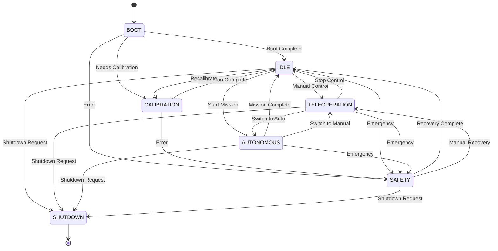

# State Machine Director

Hierarchical, event-driven state machine for the URC 2026 rover providing central coordination of subsystems with frontend integration and context-aware safety handling.

## Table of Contents

- [Overview](#overview)
- [Architecture](#architecture)
- [State Definitions](#state-definitions)
- [Installation](#installation)
- [Usage](#usage)
- [Configuration](#configuration)
- [API Reference](#api-reference)
- [Testing](#testing)
- [URC Competition Integration](#urc-competition-integration)

## Overview

The State Machine Director is the central coordinator for the URC 2026 rover, managing:

- **Hierarchical States**: Top-level states with mission-specific substates
- **Event-Driven Architecture**: Service-based state changes with event publishing
- **Context-Aware Safety**: Different safety responses based on current state
- **Subsystem Coordination**: Manages subsystem lifecycle and readiness
- **Frontend Integration**: Clean API for UI/operator control stations
- **LED Status**: Publishes state information for URC-compliant LED indicators

### Key Features

✅ **Hierarchical State Management** - Top-level states, mission substates, and task sub-substates  
✅ **Validated Transitions** - Precondition checking and transition matrix validation  
✅ **Context-Aware Safety** - Safety responses adapt to current state and mission phase  
✅ **Subsystem Coordination** - Automatic subsystem activation/deactivation  
✅ **Event Publishing** - Real-time state updates at 10Hz  
✅ **Frontend Integration** - Clean service interface with acknowledgment mechanism  
✅ **URC Compliance** - LED status indicators per URC 2026 rules

## Architecture

### State Hierarchy

```
SystemState (Top Level)
├── BOOT
│   └── Auto-transitions to IDLE after initialization
├── CALIBRATION
│   └── Sensor and system calibration
├── IDLE
│   └── Ready state, awaiting commands
├── TELEOPERATION
│   └── Manual remote control (Blue LED per URC)
├── AUTONOMOUS
│   ├── SCIENCE (Science mission)
│   ├── DELIVERY (Delivery mission)
│   ├── EQUIPMENT_SERVICING (Equipment servicing)
│   │   ├── TRAVELING
│   │   ├── SAMPLE_DELIVERY
│   │   ├── PANEL_OPERATIONS
│   │   ├── AUTONOMOUS_TYPING
│   │   ├── USB_CONNECTION
│   │   ├── FUEL_CONNECTION
│   │   └── BUTTON_OPERATIONS
│   └── AUTONOMOUS_NAVIGATION (Autonomous navigation - Red LED per URC)
├── SAFETY
│   └── Emergency/safety state requiring intervention
└── SHUTDOWN
    └── Graceful shutdown sequence
```

### State Transition Diagram



### Component Architecture

```
┌─────────────────────────────────────────────────────────┐
│             State Machine Director Node                  │
│                                                          │
│  ┌────────────────────┐  ┌─────────────────────────┐   │
│  │  Transition        │  │  Safety Manager         │   │
│  │  Validator         │  │  - Context-aware        │   │
│  │  - Preconditions   │  │  - Recovery logic       │   │
│  │  - Transition      │  │  - Trigger monitoring   │   │
│  │    matrix          │  └─────────────────────────┘   │
│  └────────────────────┘                                 │
│                                                          │
│  ┌────────────────────┐  ┌─────────────────────────┐   │
│  │  Subsystem         │  │  LED State Publisher    │   │
│  │  Coordinator       │  │  - URC compliance       │   │
│  │  - Lifecycle mgmt  │  │  - State mapping        │   │
│  │  - Status monitor  │  └─────────────────────────┘   │
│  └────────────────────┘                                 │
└─────────────────────────────────────────────────────────┘
         │                    │                    │
         │ Services           │ Topics             │ Topics
         ▼                    ▼                    ▼
  ┌────────────┐      ┌──────────────┐    ┌──────────────┐
  │  Frontend  │      │  Subsystems  │    │ LED          │
  │  Interface │      │  (Nav, Vis,  │    │ Controller   │
  │            │      │   SLAM, etc) │    │              │
  └────────────┘      └──────────────┘    └──────────────┘
```

## State Definitions

### Top-Level States

| State | Description | Entry Requirements | Allowed Transitions |
|-------|-------------|-------------------|---------------------|
| **BOOT** | Initial system startup | None | IDLE, CALIBRATION, SAFETY, SHUTDOWN |
| **CALIBRATION** | Sensor calibration | Boot complete | IDLE, SAFETY, SHUTDOWN |
| **IDLE** | Ready, awaiting commands | Boot complete | CALIBRATION, TELEOPERATION, AUTONOMOUS, SAFETY, SHUTDOWN |
| **TELEOPERATION** | Manual control | Boot complete, communication OK | IDLE, AUTONOMOUS, SAFETY, SHUTDOWN |
| **AUTONOMOUS** | Autonomous operations | Boot + calibration complete, subsystems ready | IDLE, TELEOPERATION, SAFETY, SHUTDOWN |
| **SAFETY** | Emergency state | None (can enter from any state) | IDLE, TELEOPERATION, SHUTDOWN |
| **SHUTDOWN** | Graceful shutdown | None | [Terminal state] |

### Autonomous Substates

- **SCIENCE**: Science mission (sample collection and analysis)
- **DELIVERY**: Delivery mission (object pickup and delivery)
- **EQUIPMENT_SERVICING**: Equipment servicing mission (lander operations)
- **AUTONOMOUS_NAVIGATION**: Autonomous navigation mission

## Installation

### Dependencies

```bash
# ROS2 packages
sudo apt install ros-humble-rclpy

# Python packages
pip install structlog
```

### Build

```bash
cd ~/ros2_ws
colcon build --packages-select autonomy_interfaces autonomy_state_machine
source install/setup.bash
```

## Usage

### Launch State Machine

```bash
# Launch with default configuration
ros2 launch autonomy_state_machine state_machine.launch.py

# Launch with custom config
ros2 launch autonomy_state_machine state_machine.launch.py \
    config_file:=/path/to/config.yaml

# Launch with LED controller
ros2 launch autonomy_state_machine state_machine.launch.py \
    launch_led_controller:=true

# Launch with debug logging
ros2 launch autonomy_state_machine state_machine.launch.py \
    log_level:=debug
```

### Request State Changes (Command Line)

```bash
# Transition to IDLE
ros2 service call /state_machine/change_state autonomy_interfaces/srv/ChangeState \
    "{desired_state: 'IDLE', reason: 'Manual transition', operator_id: 'operator1'}"

# Transition to AUTONOMOUS with mission
ros2 service call /state_machine/change_state autonomy_interfaces/srv/ChangeState \
    "{desired_state: 'AUTONOMOUS', desired_substate: 'AUTONOMOUS_NAVIGATION', \
      reason: 'Starting autonomous nav', operator_id: 'operator1'}"

# Transition to TELEOPERATION
ros2 service call /state_machine/change_state autonomy_interfaces/srv/ChangeState \
    "{desired_state: 'TELEOPERATION', reason: 'Manual control', operator_id: 'operator1'}"
```

### Query Current State

```bash
# Basic state query
ros2 service call /state_machine/get_system_state autonomy_interfaces/srv/GetSystemState \
    "{include_history: false, include_subsystems: false}"

# Query with history and subsystems
ros2 service call /state_machine/get_system_state autonomy_interfaces/srv/GetSystemState \
    "{include_history: true, include_subsystems: true, history_limit: 10}"
```

### Monitor State Updates

```bash
# Monitor current state (10Hz updates)
ros2 topic echo /state_machine/current_state

# Monitor state transitions
ros2 topic echo /state_machine/transitions

# Monitor safety status
ros2 topic echo /state_machine/safety_status

# Monitor LED info
ros2 topic echo /state_machine/led_info
```

### Frontend Integration (Python)

```python
import rclpy
from rclpy.node import Node
from autonomy_state_machine.frontend_interface import FrontendInterface

class MyFrontend(Node):
    def __init__(self):
        super().__init__('my_frontend')
        self.interface = FrontendInterface(self)
        
        # Register callback for state updates
        self.interface.register_state_callback(self.on_state_update)
    
    def on_state_update(self, msg):
        """Called when state changes (10Hz)."""
        print(f"State: {msg.current_state}")
        print(f"Substate: {msg.substate}")
        print(f"Time in state: {msg.time_in_state:.1f}s")
        
        # Update your UI here
        self.update_ui(msg)
    
    def request_autonomous_mode(self):
        """Request transition to autonomous mode."""
        future = self.interface.request_state_change(
            desired_state="AUTONOMOUS",
            desired_substate="AUTONOMOUS_NAVIGATION",
            reason="Starting autonomous navigation mission",
            operator_id="frontend_operator"
        )
        
        # Wait for response
        rclpy.spin_until_future_complete(self, future)
        response = future.result()
        
        if response.success:
            print("Successfully entered autonomous mode")
        else:
            print(f"Failed: {response.message}")
    
    def update_ui(self, state_msg):
        """Update UI based on state."""
        # Your UI update logic here
        pass

def main():
    rclpy.init()
    frontend = MyFrontend()
    rclpy.spin(frontend)
    frontend.destroy_node()
    rclpy.shutdown()

if __name__ == '__main__':
    main()
```

## Configuration

Configuration file: `config/state_machine_config.yaml`

### Key Parameters

```yaml
state_machine_director:
  ros__parameters:
    # Update rates
    update_rate: 10.0  # Hz - state update frequency
    
    # Timeouts
    boot_timeout: 30.0  # seconds
    mission_timeouts:
      autonomous_navigation: 1800.0  # 30 minutes
    
    # Safety thresholds
    battery_critical_threshold: 10.0  # percent
    temperature_warning: 70.0  # Celsius
    
    # Subsystems
    required_subsystems:
      autonomous: ["navigation", "computer_vision", "slam"]
```

## API Reference

### Services

#### `/state_machine/change_state` (ChangeState)

Request a state transition.

**Request:**
- `desired_state` (string): Target state name
- `desired_substate` (string, optional): Target substate
- `reason` (string): Reason for change
- `operator_id` (string): Operator identifier
- `force` (bool): Force transition (skip validation)

**Response:**
- `success` (bool): Whether transition succeeded
- `actual_state` (string): Actual state after transition
- `transition_time` (float): Time taken (seconds)
- `message` (string): Status message
- `failed_preconditions` (string[]): List of failed checks

#### `/state_machine/get_system_state` (GetSystemState)

Query current system state.

**Request:**
- `include_history` (bool): Include transition history
- `include_subsystems` (bool): Include subsystem status
- `history_limit` (int): Number of history entries

**Response:**
- `current_state` (string): Current top-level state
- `substate` (string): Current substate
- `time_in_state` (float): Time in current state
- `recent_states` (string[]): Recent state history
- `active_subsystems` (string[]): Active subsystems

#### `/state_machine/recover_from_safety` (RecoverFromSafety)

Initiate safety recovery.

**Request:**
- `recovery_method` (string): "AUTO", "MANUAL_GUIDED", "FULL_RESET"
- `operator_id` (string): Operator identifier
- `acknowledge_risks` (bool): Must be true
- `notes` (string): Additional notes

**Response:**
- `success` (bool): Recovery initiated
- `recovery_state` (string): Recovery status
- `remaining_steps` (string[]): Steps to complete
- `recommended_next_state` (string): Suggested next state

### Topics

#### `/state_machine/current_state` (SystemState) - 10Hz

Current system state information.

**Fields:**
- `current_state`, `substate`, `sub_substate`
- `time_in_state`, `state_timeout`
- `is_transitioning`, `preconditions_met`
- `active_subsystems`, `failed_subsystems`
- `state_reason`, `operator_id`

#### `/state_machine/transitions` (StateTransition)

State transition events.

#### `/state_machine/safety_status` (SafetyStatus)

Safety system status and active triggers.

#### `/state_machine/led_info` (String)

LED state information for URC compliance.

## Testing

### Run Unit Tests

```bash
# Run all tests
cd ~/ros2_ws
colcon test --packages-select autonomy_state_machine

# Run with verbose output
colcon test --packages-select autonomy_state_machine --event-handlers console_direct+

# Run specific test file
pytest src/autonomy_state_machine/tests/test_state_machine.py -v
```

### Run Integration Tests

```bash
pytest src/autonomy_state_machine/tests/test_integration.py -v
```

## URC Competition Integration

### LED Status Indicators

Per URC 2026 rules (Section 1.f.vi):

- **Red LED**: Autonomous operation (any AUTONOMOUS state)
- **Blue LED**: Teleoperation (manual driving)
- **Flashing Green**: Successful arrival at target

The state machine publishes LED information; the LED controller interprets this to control actual hardware.

### Mission States

- **Science Mission**: Use `AUTONOMOUS` + `SCIENCE` substate
- **Delivery Mission**: Use `AUTONOMOUS` + `DELIVERY` substate
- **Equipment Servicing**: Use `AUTONOMOUS` + `EQUIPMENT_SERVICING` substate
- **Autonomous Navigation**: Use `AUTONOMOUS` + `AUTONOMOUS_NAVIGATION` substate

### Intervention Handling

When an intervention occurs (URC Section 3.c):

```python
# Transition to safety state
interface.request_state_change(
    desired_state="SAFETY",
    reason="Intervention required - rover stuck",
    operator_id="field_judge"
)

# After intervention, recover
interface.request_safety_recovery(
    recovery_method="MANUAL_GUIDED",
    operator_id="operator1",
    acknowledge_risks=True,
    notes="Rover freed from obstacle"
)
```

## Troubleshooting

### State Machine Won't Start

```bash
# Check if interfaces are built
ros2 interface list | grep autonomy_interfaces

# Rebuild if needed
colcon build --packages-select autonomy_interfaces autonomy_state_machine
```

### State Transition Rejected

Check preconditions:
```bash
ros2 service call /state_machine/get_system_state autonomy_interfaces/srv/GetSystemState "{}"
```

Common issues:
- Boot not complete
- Calibration not complete
- Required subsystems not active
- Communication not OK

### No State Updates Received

```bash
# Check if node is running
ros2 node list | grep state_machine

# Check topic
ros2 topic info /state_machine/current_state

# Check for errors
ros2 node info /state_machine_director
```

## Contributing

Follow the [project CODE_STYLE.md](../../CODE_STYLE.md) guidelines.

## License

MIT License - URC Machiato Team 2026

