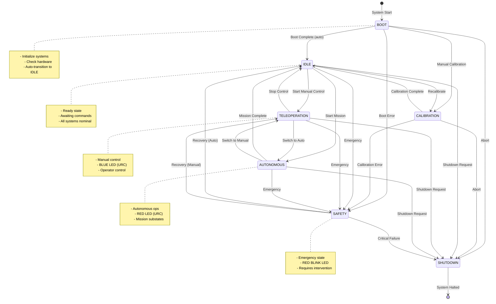
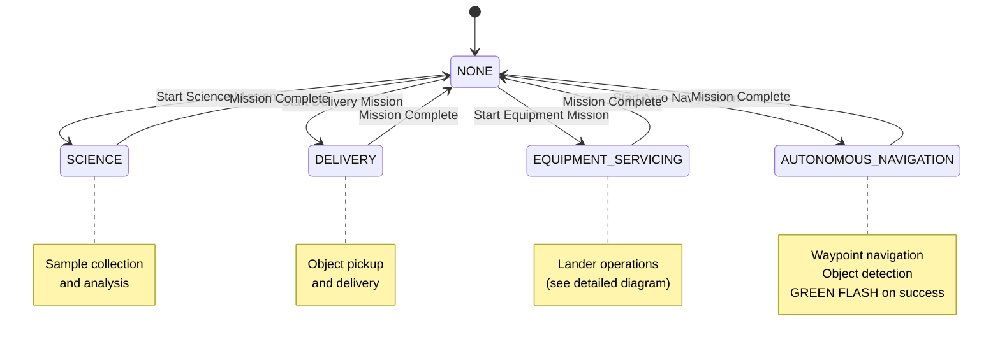
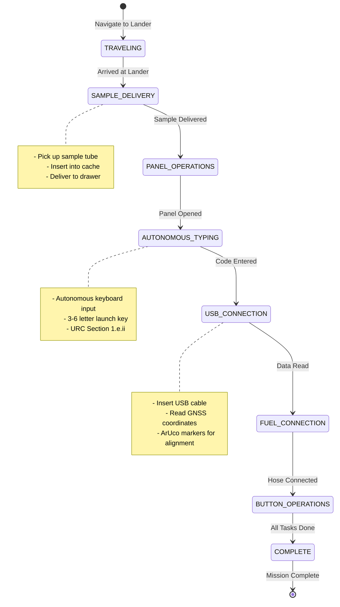

# State Machine Diagrams

Visual representation of the state machine structure and transitions.

## Top-Level State Diagram



## Autonomous Substates



## Equipment Servicing Sub-substates



## State Transition Flow

### Happy Path (Competition Day)

```
START
  ↓
BOOT (auto-initialize)
  ↓ (auto-transition after 2s)
IDLE (ready)
  ↓ (operator command)
AUTONOMOUS + AUTONOMOUS_NAVIGATION
  ↓ (mission running)
  ↓ (waypoints reached)
  ↓ (mission complete)
IDLE (ready for next mission)
  ↓ (operator command)
AUTONOMOUS + EQUIPMENT_SERVICING
  ↓ (mission running)
  ↓ (tasks complete)
IDLE
  ↓ (operator command)
SHUTDOWN
  ↓
END
```

### Safety Scenario

```
AUTONOMOUS (mission running)
  ↓ (emergency stop pressed)
SAFETY (all motion stopped)
  ↓ (operator intervention)
  ↓ (recovery request)
IDLE (safety cleared)
  ↓ (resume operations)
TELEOPERATION (manual control)
```

## State Requirements Matrix

| From State | To State | Requirements |
|------------|----------|--------------|
| BOOT | IDLE | boot_complete |
| BOOT | CALIBRATION | boot_complete |
| CALIBRATION | IDLE | boot_complete, calibration_complete |
| IDLE | TELEOPERATION | boot_complete, communication_ok |
| IDLE | AUTONOMOUS | boot_complete, calibration_complete, communication_ok, subsystems_ready |
| AUTONOMOUS (NAV) | (any) | boot_complete, calibration_complete, GNSS_available |
| SAFETY | IDLE | safety_cleared, manual_verification |
| (any) | SAFETY | (no requirements - always allowed) |
| (any) | SHUTDOWN | (no requirements - always allowed) |

## LED Status Mapping

| State | LED Color | Pattern | URC Rule |
|-------|-----------|---------|----------|
| BOOT | Yellow | Solid | - |
| CALIBRATION | Yellow | Pulsing | - |
| IDLE | Green | Solid | - |
| TELEOPERATION | **Blue** | **Solid** | **1.f.vi** |
| AUTONOMOUS | **Red** | **Solid** | **1.f.vi** |
| SAFETY | Red | Blinking | - |
| SHUTDOWN | Red | Fade | - |
| Waypoint Success | **Green** | **Flashing** | **1.f.vi** |

## Preconditions Checklist

### To Enter AUTONOMOUS State:
- ✅ Boot complete
- ✅ Calibration complete
- ✅ Communication OK
- ✅ Navigation subsystem active
- ✅ Computer vision subsystem active
- ✅ SLAM subsystem active
- ✅ (For AUTO_NAV) GNSS available

### To Enter TELEOPERATION State:
- ✅ Boot complete
- ✅ Communication OK
- ✅ Navigation subsystem active

### To Exit SAFETY State:
- ✅ Safety cleared
- ✅ Manual verification complete
- ✅ All safety triggers resolved

## Safety Trigger Response Matrix

| Trigger | In TELEOPERATION | In AUTONOMOUS |
|---------|------------------|---------------|
| Emergency Stop | Stop + Manual intervention | Stop + Manual intervention |
| Comm Loss | Stop + Manual intervention | Auto-recovery (return to waypoint) |
| Battery Critical | Graceful shutdown | Graceful shutdown |
| Thermal Warning | Throttle ops + Auto-recovery | Throttle ops + Auto-recovery |
| Sensor Failure | Manual intervention | Switch to backup |
| Obstacle Critical | Stop + Auto-recovery | Stop + Auto-recovery |

## Mission Time Limits

Per URC 2026 rules and configuration:

- **Science Mission**: 30 minutes (1800s)
- **Delivery Mission**: 60 minutes (3600s)
- **Equipment Servicing**: 30 minutes (1800s)
- **Autonomous Navigation**: 30 minutes (1800s)

## Quick Reference Commands

### State Transitions
```bash
# To IDLE
ros2 service call /state_machine/change_state autonomy_interfaces/srv/ChangeState \
    "{desired_state: 'IDLE', reason: 'Ready', operator_id: 'user'}"

# To TELEOPERATION (Blue LED)
ros2 service call /state_machine/change_state autonomy_interfaces/srv/ChangeState \
    "{desired_state: 'TELEOPERATION', reason: 'Manual control', operator_id: 'user'}"

# To AUTONOMOUS Navigation (Red LED)
ros2 service call /state_machine/change_state autonomy_interfaces/srv/ChangeState \
    "{desired_state: 'AUTONOMOUS', desired_substate: 'AUTONOMOUS_NAVIGATION', \
      reason: 'Start mission', operator_id: 'user'}"

# To SAFETY
ros2 service call /state_machine/change_state autonomy_interfaces/srv/ChangeState \
    "{desired_state: 'SAFETY', reason: 'Emergency', operator_id: 'safety'}"
```

---

**Note:** These diagrams can be rendered using Mermaid-compatible tools:
- GitHub (automatic rendering in .md files)
- Mermaid Live Editor (https://mermaid.live)
- VS Code with Mermaid extension
- Notion, Obsidian, etc.

