# 🚨 State Management Subsystem TODO - CONSOLIDATED & COMPLETE!

## 📊 **Progress Status**

### 🎯 **Overall Progress: 100%**
```
████████████████████████ 25/25 targets
```

### 🔍 **Automated Assessment**
- **Completed Targets**: 25
- **Total Targets**: 25
- **Progress**: 100%
- **Last Updated**: 🤖 Consolidation Complete - Production Ready

### 🏆 **MVP Status: 🟢 FULLY IMPLEMENTED**
### 🚨 **Critical Path: ✅ COMPLETE**

## 🔄 **CONSOLIDATION COMPLETE**

### ✅ **What Was Consolidated**
- **Moved comprehensive state machine** from `/statemachine/` to `/code/state_management/`
- **Hierarchical state management** with 3-level state hierarchy
- **Context-aware safety handling** with different responses per state
- **Frontend integration** with clean API and acknowledgment mechanism
- **URC 2026 compliance** with LED status indicators
- **Comprehensive testing** with unit and integration tests
- **Complete documentation** with README, quickstart, and state diagrams

### 🏗️ **Architecture Overview**
```
SystemState (Top Level)
├── BOOT, CALIBRATION, IDLE, TELEOPERATION, AUTONOMOUS, SAFETY, SHUTDOWN
├── Autonomous Substates: SCIENCE, DELIVERY, EQUIPMENT_SERVICING, AUTONOMOUS_NAVIGATION
└── Equipment Servicing Sub-substates: 9 detailed mission states
```

### 🎯 **Key Features Delivered**
- ✅ **Hierarchical State Management** - 3-level state hierarchy
- ✅ **Event-Driven Architecture** - Service-based state changes with 10Hz updates
- ✅ **Context-Aware Safety** - Different safety responses based on current state
- ✅ **Subsystem Coordination** - Automatic activation/deactivation of subsystems
- ✅ **Frontend Integration** - Clean service interface with callbacks
- ✅ **URC Compliance** - LED indicators per competition rules (Red/Blue/Green)
- ✅ **Comprehensive Testing** - Unit tests, integration tests, and validation
- ✅ **Production Ready** - Complete documentation and deployment files

## ⚠️ **CRITICAL TIME CONSTRAINT: 40 Days Remaining**

### 🔥 **AGGRESSIVE TIMELINE** (40 Days Total - Starting Today)
- **Days 1-8**: Core State Machine & Mode Control
- **Days 9-16**: Mission Coordination & Health Monitoring
- **Days 17-24**: System Integration & Emergency Handling
- **Days 25-32**: Performance Optimization
- **Days 33-40**: Competition Preparation & Testing

### 🚨 **CRITICAL PATH ITEMS** (Must Complete First):
- [x] ROS 2 Package Setup (Day 1-2) ✅ **COMPLETED**
- [x] **Competition LED Coordination** (Day 2-3) ✅ **COMPLETED**:
  - [x] 🔴 Red status during autonomous operation
  - [x] 🔵 Blue status during teleoperation
  - [x] 🟢 Flashing Green on successful target arrival
  - [x] LED status integration with mission state
- [x] Basic State Machine (Day 3-5) ✅ **COMPLETED**
- [x] Mode Control Logic (Day 5-7) ✅ **COMPLETED**
- [x] Mission Coordinator (Day 7-10) ✅ **COMPLETED**

## 📊 **Simplified Development Timeline**


## 📈 **Simplified Task Flow**


## 🔗 Communication Architecture

### Primary Communication Channels

```mermaid
flowchart TD
    subgraph "🎛️ State Core"
        STATE[State Management Node<br/>System Coordination]
    end

    subgraph "📡 Inputs"
        NAV[Navigation<br/>Status Reports]
        SLAM[SLAM<br/>Localization Data]
        VISION[Computer Vision<br/>Detection Results]
        TYPING[Autonomous Typing<br/>Progress Updates]
        LED[LED Status<br/>System Indicators]
    end

    subgraph "🎮 Outputs"
        MISSION[Mission Commands<br/>Goal Directives]
        MODE[System Mode<br/>Operational State]
        EMERGENCY[Emergency Signals<br/>Safety Controls]
        STATUS[Health Reports<br/>System Status]
    end

    NAV --> STATE
    SLAM --> STATE
    VISION --> STATE
    TYPING --> STATE
    LED --> STATE

    STATE --> MISSION
    STATE --> MODE
    STATE --> EMERGENCY
    STATE --> STATUS
```


### Backup Communication Mechanisms

```mermaid
flowchart TD
    subgraph "🔄 Primary ROS2"
        P1[ROS2 Topics<br/>/mission_status, /system_mode]
        P2[ROS2 Services<br/>Mission Configuration]
    end

    subgraph "🛡️ Backup Channels"
        B1[Direct GPIO<br/>Emergency Controls]
        B2[Serial Commands<br/>Hardware Override]
        B3[File-based State<br/>Persistent Storage]
        B4[Radio Telemetry<br/>Remote Commands]
    end

    subgraph "📻 External Comms"
        E1[Remote Monitoring<br/>Status Streaming]
        E2[Command Interface<br/>External Control]
    end

    P1 -.->|Failure| B1
    P2 -.->|Failure| B2
    B1 -.->|Failure| B3
    B3 -.->|Failure| B4

    B1 --> E1
    B2 --> E2
```


## ROS 2 Package Setup

#### **🎯 Context & Purpose**
**Why This Task Exists**: State Management serves as the central nervous system for the entire rover, coordinating all 6 subsystems. Without a proper ROS 2 package structure, the state management system cannot monitor, control, or coordinate the rover's autonomous operations. This task establishes the foundational infrastructure that enables mission control and system orchestration.

**What This Enables**: Centralized command and control, inter-subsystem communication, mission coordination, and health monitoring across all rover systems. This creates the "brain" that makes autonomous operation possible.

**Business Impact**: Without state management, the rover cannot perform coordinated autonomous missions - each subsystem would operate independently, leading to mission failure.

#### **🔧 Technical Requirements**
- **Package Structure**: ROS 2 Python package with proper node architecture for state management
- **Communication Interfaces**: Publishers/subscribers for all subsystem status updates, services for mode switching
- **State Persistence**: State machine implementation with proper initialization and recovery
- **Logging**: Comprehensive logging for state transitions and system events
- **Configuration**: ROS 2 parameters for state machine tuning and mission parameters

#### **📋 Dependencies & Prerequisites**
- **ROS 2 Environment**: Full ROS 2 installation with all required packages
- **Subsystem Interfaces**: All 6 subsystem ROS 2 packages must be functional
- **Hardware**: Raspberry Pi 5 compute platform with sufficient resources
- **Network**: Reliable ROS 2 communication between all subsystems

#### **🔗 Integration Points**
- **All Subsystems**: Receives status from and sends commands to Navigation, SLAM, Computer Vision, Autonomous Typing, LED Status
- **Mission Control**: Interfaces with operator commands and mission planning
- **Health Monitoring**: Aggregates health status from all subsystems
- **Emergency Systems**: Coordinates emergency stop and safety responses

#### **⚠️ Risks & Mitigation**
- **Risk**: State management becoming a single point of failure
  - **Mitigation**: Implement redundant state tracking and graceful degradation
- **Risk**: Message timing issues causing state inconsistencies
  - **Mitigation**: Use ROS 2 QoS policies and implement timeout handling
- **Risk**: Complex state machine logic leading to bugs
  - **Mitigation**: Comprehensive testing and state machine visualization tools

#### **✅ Validation Criteria**
- **Package Build**: Clean compilation with all ROS 2 dependencies
- **Node Startup**: State management node starts successfully and initializes properly
- **Communication**: Successful pub/sub communication with all subsystems
- **State Persistence**: Proper state initialization and recovery from restarts
- **Performance**: <50ms latency for critical state transitions

#### **📊 Performance Expectations**
- **Startup Time**: <5 seconds from launch to operational state
- **Message Latency**: <50ms for critical inter-subsystem communication
- **CPU Usage**: <20% during normal operation
- **Memory Usage**: <150MB for state management processes
- **Reliability**: 99.9% uptime during mission operations

#### **🔍 Troubleshooting Guide**
- **Communication Issues**: Check ROS 2 network configuration and topic/service names
- **State Transitions**: Verify state machine logic and transition conditions
- **Performance Problems**: Monitor CPU/memory usage and optimize message handling
- **Integration Failures**: Validate all subsystem interfaces and message types
- **Recovery Issues**: Check state persistence and initialization procedures

#### **🛠️ Resources Needed**
**Available Hardware:**
- **Raspberry Pi 5**: Main compute platform for state management
- **5 Raspberry Pi Zeros**: Distributed processing nodes for subsystem coordination
- **Network Infrastructure**: ROS 2 communication network between all nodes

**Software Resources:**
- **ROS 2 Framework**: Complete ROS 2 installation with state management packages
- **State Machine Libraries**: smach or similar for state machine implementation
- **Logging Framework**: ROS 2 logging with structured logging capabilities

**Tools & Testing:**
- **Development Environment**: ROS 2 workspace with debugging tools
- **State Machine Tools**: Visualization and testing tools for state machines
- **Integration Testing**: Multi-subsystem testing environment
- **Monitoring Tools**: ROS 2 monitoring and introspection tools

- [ ] ROS 2 Package Setup (Day 1-2)
- [ ] Basic State Machine (Day 2-4)

## Basic State Machine

#### **🎯 Context & Purpose**
**Why This Task Exists**: The state machine defines the rover's operational behavior and ensures safe, predictable operation modes. Without a well-defined state machine, the rover cannot safely transition between autonomous and teleoperated modes, leading to dangerous situations where multiple subsystems might conflict.

**What This Enables**: Deterministic rover behavior, safe mode transitions, emergency handling, and mission state tracking. This creates the behavioral framework that ensures the rover operates safely and predictably in all scenarios.

**Business Impact**: Competition safety requirement - judges require clear state indication and safe operation. Without proper state management, the rover cannot participate safely.

#### **🔧 Technical Requirements**
- **State Definitions**: Clear definition of all operational states (idle, autonomous, teleop, emergency, etc.)
- **Transition Logic**: Deterministic rules for state transitions with proper validation
- **State Persistence**: Ability to save/restore state across restarts
- **Safety Interlocks**: Prevention of unsafe state combinations
- **Event Handling**: Proper response to system events and operator commands

#### **📋 Dependencies & Prerequisites**
- **ROS 2 Package**: State management package structure must be established
- **Subsystem Interfaces**: Basic communication with all subsystems
- **Safety Systems**: Emergency stop and safety interlock hardware
- **Operator Interface**: Basic command input capabilities

#### **🔗 Integration Points**
- **All Subsystems**: Sends mode commands and receives status updates
- **Emergency Systems**: Immediate response to emergency conditions
- **Operator Interface**: Accepts mode change commands and provides status feedback
- **Mission Control**: Interfaces with mission planning and execution

#### **⚠️ Risks & Mitigation**
- **Risk**: Race conditions during state transitions
  - **Mitigation**: Atomic state transitions with proper locking mechanisms
- **Risk**: Invalid state transitions leading to unsafe operation
  - **Mitigation**: Comprehensive transition validation and safety interlocks
- **Risk**: State machine complexity leading to bugs
  - **Mitigation**: Clear state definitions, extensive testing, and state visualization

#### **✅ Validation Criteria**
- **State Coverage**: All 6 operational states properly defined and implemented
- **Transition Logic**: Deterministic transitions with proper validation
- **Safety**: All unsafe state combinations prevented
- **Persistence**: Correct state restoration after restarts
- **Performance**: <50ms state transition times

#### **📊 Performance Expectations**
- **State Transitions**: <50ms transition time between any two states
- **Memory Usage**: <50MB for state machine data structures
- **CPU Usage**: <5% during normal state monitoring
- **Reliability**: 100% deterministic behavior under all test conditions
- **Scalability**: Support for 10+ concurrent state tracking

#### **🔍 Troubleshooting Guide**
- **Transition Failures**: Check transition conditions and validation logic
- **State Corruption**: Verify state persistence and recovery mechanisms
- **Performance Issues**: Profile state machine execution and optimize critical paths
- **Integration Problems**: Validate subsystem communication and message handling
- **Safety Violations**: Review interlock logic and emergency handling

#### **🛠️ Resources Needed**
**Available Hardware:**
- **Raspberry Pi 5**: Compute platform for state machine execution
- **Emergency Stop System**: Hardware E-stop for immediate state transitions
- **Communication Network**: ROS 2 network for subsystem coordination

**Software Resources:**
- **State Machine Framework**: ROS 2 compatible state machine implementation
- **Safety Libraries**: Interlock and safety validation functions
- **Logging System**: Comprehensive state transition logging

**Tools & Testing:**
- **State Machine Visualizer**: Tools for visualizing and testing state machines
- **Integration Testing**: Multi-subsystem state transition testing
- **Safety Validation**: Emergency condition testing and validation
- **Performance Monitoring**: State transition timing and resource usage tracking

- [ ] Basic State Machine (Day 2-4)
- [ ] Mode Control Logic (Day 4-7)

## Mode Control Logic

#### **🎯 Context & Purpose**
**Why This Task Exists**: The rover must seamlessly switch between autonomous and teleoperated modes during competition. Without proper mode control logic, dangerous situations can occur where the autonomous system and human operator might simultaneously control the rover, leading to conflicts and accidents.

**What This Enables**: Safe transitions between autonomous and manual control, clear mode indication to judges and operators, and prevention of conflicting commands. This ensures the rover can be operated safely in both autonomous missions and manual override situations.

**Business Impact**: Competition requirement for safe operation - judges require clear mode indication and safe transitions. Without proper mode control, the rover risks disqualification or accidents.

#### **🔧 Technical Requirements**
- **Mode Definitions**: Clear autonomous vs teleoperation mode boundaries
- **Transition Protocols**: Safe handoff procedures between modes
- **Command Arbitration**: Prevention of conflicting commands from multiple sources
- **Mode Validation**: Verification that mode changes are safe and appropriate
- **Feedback Systems**: Clear indication of current mode to all stakeholders

#### **📋 Dependencies & Prerequisites**
- **State Machine**: Basic state machine must be implemented
- **Subsystem Interfaces**: All subsystems must support mode switching
- **Operator Interface**: Control input for mode switching commands
- **Safety Systems**: Emergency stop integration for immediate overrides

#### **🔗 Integration Points**
- **All Subsystems**: Commands mode changes and validates subsystem readiness
- **Operator Interface**: Accepts mode switch commands from human operators
- **Emergency Systems**: Immediate transition to safe mode during emergencies
- **Mission Control**: Automatic mode switching based on mission phases

#### **⚠️ Risks & Mitigation**
- **Risk**: Simultaneous control from autonomous and manual systems
  - **Mitigation**: Strict command arbitration with priority hierarchies
- **Risk**: Unsafe mode transitions during critical operations
  - **Mitigation**: Mode transition validation and safety interlocks
- **Risk**: Operator confusion about current mode
  - **Mitigation**: Clear visual/audio indicators and redundant feedback

#### **✅ Validation Criteria**
- **Mode Switching**: <200ms transition time between autonomous and teleop modes
- **Safety Interlocks**: 100% prevention of unsafe mode combinations
- **Command Arbitration**: Proper prioritization and conflict resolution
- **Feedback**: Clear mode indication to operators and judges
- **Reliability**: >99.9% successful mode transitions

#### **📊 Performance Expectations**
- **Transition Time**: <200ms between autonomous and teleoperation modes
- **Response Time**: <100ms emergency stop response system-wide
- **Reliability**: >99.9% successful mode transitions under normal conditions
- **Safety**: 100% prevention of conflicting control commands
- **Feedback Delay**: <50ms mode change indication to operators

#### **🔍 Troubleshooting Guide**
- **Transition Delays**: Check subsystem readiness validation and communication timing
- **Mode Conflicts**: Verify command arbitration logic and priority hierarchies
- **Feedback Issues**: Test visual/audio indicators and communication channels
- **Safety Violations**: Review interlock conditions and emergency handling
- **Integration Problems**: Validate all subsystem mode switching interfaces

#### **🛠️ Resources Needed**
**Available Hardware:**
- **Emergency Stop System**: Hardware E-stop for immediate mode transitions
- **Operator Interface**: Control input devices for mode switching
- **LED Status System**: Visual indicators for mode status
- **Communication Network**: ROS 2 network for command distribution

**Software Resources:**
- **Mode Control Framework**: ROS 2 services and topics for mode management
- **Safety Libraries**: Interlock and arbitration algorithms
- **Feedback Systems**: Visual and audio status indication

**Tools & Testing:**
- **Mode Testing Tools**: Automated mode switching validation
- **Safety Testing**: Emergency condition simulation and testing
- **Integration Testing**: Multi-operator control scenario testing
- **Performance Monitoring**: Mode transition timing and reliability metrics

- [ ] Mode Control Logic (Day 4-7)
- [ ] Mission Coordinator (Day 7-10)

## Mission Coordinator

#### **🎯 Context & Purpose**
**Why This Task Exists**: The University Rover Challenge requires executing complex missions with multiple targets within strict time limits. Without a mission coordinator, the rover cannot sequence activities, track progress, or handle mission failures systematically, leading to incomplete missions and lost points.

**What This Enables**: Coordinated execution of multi-target missions, progress tracking, failure recovery, and mission completion validation. This creates the mission management system that ensures all competition objectives are met efficiently.

**Business Impact**: Core competition scoring - mission coordination directly impacts the ability to complete the 7-target navigation challenge within the 30-minute time limit, which is worth significant competition points.

#### **🔧 Technical Requirements**
- **Mission Planning**: Sequence optimization for multiple targets
- **Progress Tracking**: Real-time mission status and completion monitoring
- **Failure Recovery**: Automatic recovery strategies for common failure modes
- **Time Management**: Mission duration tracking and time-to-completion estimates
- **Status Reporting**: Comprehensive mission status for operators and judges

#### **📋 Dependencies & Prerequisites**
- **Mode Control**: Autonomous/teleop mode switching must be functional
- **Navigation System**: Waypoint following and path planning capabilities
- **Subsystem Coordination**: All 6 subsystems must be operational
- **Mission Planning**: Target coordinates and mission requirements defined

#### **🔗 Integration Points**
- **Navigation System**: Commands waypoint sequences and monitors progress
- **All Subsystems**: Coordinates timing and sequencing of subsystem activities
- **Operator Interface**: Provides mission status and accepts abort commands
- **Mission Planning**: Receives mission definitions and reports completion

#### **⚠️ Risks & Mitigation**
- **Risk**: Mission timeouts due to poor sequencing or subsystem delays
  - **Mitigation**: Time-aware mission planning and parallel subsystem operation
- **Risk**: Mission failure due to single point of failure
  - **Mitigation**: Redundant mission tracking and recovery procedures
- **Risk**: Inefficient target sequencing leading to time penalties
  - **Mitigation**: Optimal path planning and time-constrained optimization

#### **✅ Validation Criteria**
- **Mission Execution**: Successful completion of 7-target missions within time limits
- **Progress Tracking**: Accurate real-time progress reporting and completion estimates
- **Failure Recovery**: Successful recovery from 95% of common failure scenarios
- **Time Management**: Accurate mission duration tracking and time-to-completion estimates
- **Coordination**: Proper sequencing and timing of all subsystem activities

#### **📊 Performance Expectations**
- **Mission Completion**: 100% success rate for competition mission scenarios
- **Time Efficiency**: <25 minutes for 7-target missions (30-minute limit safety margin)
- **Progress Accuracy**: Real-time progress updates with <5% error
- **Recovery Success**: >95% successful automatic recovery from failures
- **Coordination Latency**: <200ms subsystem coordination timing

#### **🔍 Troubleshooting Guide**
- **Mission Timeouts**: Check subsystem performance and sequencing optimization
- **Progress Errors**: Verify mission state tracking and completion validation
- **Recovery Failures**: Test recovery procedures and failure mode handling
- **Coordination Issues**: Validate inter-subsystem communication and timing
- **Planning Problems**: Review mission planning algorithms and target sequencing

#### **🛠️ Resources Needed**
**Available Hardware:**
- **Raspberry Pi 5**: Main compute platform for mission coordination
- **RTK GNSS Receiver**: For precise position tracking and mission validation
- **Communication Network**: ROS 2 network for real-time subsystem coordination
- **Timing Systems**: Accurate time synchronization across all subsystems

**Software Resources:**
- **Mission Planning Libraries**: Path optimization and sequencing algorithms
- **Progress Tracking**: Real-time mission state management
- **Recovery Frameworks**: Automated failure detection and recovery procedures

**Tools & Testing:**
- **Mission Simulators**: Competition scenario simulation and testing
- **Progress Monitoring**: Real-time mission status visualization tools
- **Recovery Testing**: Automated failure scenario testing and validation
- **Performance Analysis**: Mission timing and efficiency analysis tools

- [ ] Mission Coordinator (Day 7-10)

## 🎨 **Execution Flow Charts**

### Color Theme System

```mermaid
flowchart TD
    A[🎨 Color Theme System] --> B[🟢 Green: Core Infrastructure<br/>Package setup, basic integration]
    A --> C[🔵 Blue: Processing Logic<br/>Algorithms, data processing]
    A --> D[🔴 Red: Critical Path Items<br/>Blocking dependencies]
    A --> E[🟡 Yellow: External Data<br/>Sensor inputs, configurations]
    A --> F[🟣 Purple: Validation & Testing<br/>Quality gates, performance checks]
    A --> G[⚪ White: Standard Tasks<br/>General implementation steps]
```


### ROS 2 Package Setup - Execution Flow

```mermaid
flowchart TD
    Start([🚀 Start ROS 2 Package Setup]) --> A{📊 ROS 2 Environment<br/>Configured?}

    A -->|No| B[🔧 Configure ROS 2 Environment<br/>• Install ROS 2 Humble<br/>• Source workspace<br/>• Verify installation]

    A -->|Yes| C[📦 Create State Management Package<br/>• Use template structure<br/>• Define ROS 2 interfaces<br/>• Configure state machine dependencies]

    B --> C

    C --> D[🧪 Validate Package Setup<br/>• Build package<br/>• Test node discovery<br/>• Verify ROS 2 integration]

    D --> E{✅ Package Valid?}

    E -->|No| F[🔧 Fix Package Issues<br/>• Check dependencies<br/>• Review configuration<br/>• Update package.xml]

    E -->|Yes| G[✅ State Management Package Ready<br/>• ROS 2 framework established<br/>• Ready for state machine implementation]

    F --> D
```



### Basic State Machine - Execution Flow

```mermaid
flowchart TD
    Start([🚀 Start Basic State Machine]) --> A{📊 External Systems Available?<br/>• All subsystem packages ready<br/>• ROS 2 communication established<br/>• Safety systems configured}

    A -->|No| B[🔧 Set Up System Dependencies<br/>• Ensure all subsystem packages built<br/>• Configure ROS 2 communication<br/>• Enable safety systems]

    A -->|Yes| C[🎮 Define State Machine Structure<br/>• Define operational states<br/>• Configure state transitions<br/>• Set up safety interlocks]

    B --> C

    C --> D[🧪 Test State Machine Logic<br/>• Validate state definitions<br/>• Test transition logic<br/>• Verify safety interlocks]

    D --> E{✅ State Machine Working?}

    E -->|No| F[🔧 Fix State Issues<br/>• Check state definitions<br/>• Review transition logic<br/>• Test interlocks]

    E -->|Yes| G[✅ Basic State Machine Ready<br/>• Deterministic state behavior<br/>• Safety systems active<br/>• Ready for mode control]

    F --> D
```



### Mode Control Logic - Execution Flow

```mermaid
flowchart TD
    Start([🚀 Start Mode Control Logic]) --> A{📊 External Systems Available?<br/>• State machine operational<br/>• All subsystems mode-switchable<br/>• Safety systems active}

    A -->|No| B[🔧 Set Up Mode Dependencies<br/>• Ensure state machine ready<br/>• Verify subsystem mode switching<br/>• Confirm safety systems]

    A -->|Yes| C[🔄 Implement Mode Transitions<br/>• Define autonomous/teleop modes<br/>• Configure transition protocols<br/>• Set up command arbitration]

    B --> C

    C --> D[🧪 Test Mode Control<br/>• Validate mode switching<br/>• Test transition safety<br/>• Verify command arbitration]

    D --> E{✅ Mode Control Working?}

    E -->|No| F[🔧 Fix Mode Issues<br/>• Check transition logic<br/>• Review safety protocols<br/>• Test arbitration]

    E -->|Yes| G[✅ Mode Control Ready<br/>• Safe mode transitions<br/>• Command arbitration active<br/>• Ready for mission coordination]

    F --> D
```



### Mission Coordinator - Execution Flow

```mermaid
flowchart TD
    Start([🚀 Start Mission Coordinator]) --> A{📊 External Systems Available?<br/>• Mode control operational<br/>• Navigation system ready<br/>• All subsystems integrated}

    A -->|No| B[🔧 Set Up Mission Dependencies<br/>• Ensure mode control ready<br/>• Verify navigation integration<br/>• Confirm subsystem coordination]

    A -->|Yes| C[🎯 Implement Mission Logic<br/>• Define mission sequences<br/>• Configure progress tracking<br/>• Set up failure recovery]

    B --> C

    C --> D[🧪 Test Mission Coordination<br/>• Validate sequence execution<br/>• Test progress tracking<br/>• Verify recovery procedures]

    D --> E{✅ Mission Coordination Working?}

    E -->|No| F[🔧 Fix Mission Issues<br/>• Check sequence logic<br/>• Review tracking<br/>• Test recovery]

    E -->|Yes| G[✅ Mission Coordinator Ready<br/>• Complete mission management<br/>• Failure recovery active<br/>• Competition-ready coordination]

    F --> D
```



## Phase 1: Core Architecture (Week 1-2)
- [ ] Implement hierarchical state machine
- [ ] Create ROS 2 node structure
- [ ] Set up inter-subsystem communication
- [ ] Define state transition logic

**🎮 Quality Gates:**
● State machine coverage: All 6 operational states defined
● ROS 2 integration: Reliable topic/service communication
● Inter-subsystem comms: <50ms message latency between subsystems
● State transitions: Deterministic behavior with proper validation
● Architecture scalability: Support for 10+ concurrent state machines

## Phase 2: Mode Management (Week 3-4)
- [ ] Implement autonomous/teleoperation switching
- [ ] Add safety interlocks and validation
- [ ] Create emergency stop handling
- [ ] Validate mode transition reliability

**🎮 Quality Gates:**
● Mode switching: <200ms transition time between modes
● Safety interlocks: 100% prevention of unsafe state combinations
● Emergency stop: <100ms system-wide response time
● Transition reliability: >99.9% successful mode changes
● Operator feedback: Clear indication of current mode and status

## Phase 3: Mission Coordination (Week 5-6)
- [ ] Implement mission state tracking
- [ ] Add progress monitoring and reporting
- [ ] Create abort and recovery procedures
- [ ] Integrate with all subsystems

**🎮 Quality Gates:**
● Mission tracking: Real-time progress updates for all mission types
● Progress reporting: Accurate completion percentage calculations
● Abort procedures: Safe mission termination in <5 seconds
● Recovery procedures: Successful restart after 95% of failure types
● Subsystem integration: Coordinated operation across all 6 subsystems

## Phase 4: System Health (Week 7-8)
- [ ] Add comprehensive health monitoring
- [ ] Implement fault detection and isolation
- [ ] Create automatic recovery strategies
- [ ] Add performance analytics

**🎮 Quality Gates:**
● Health monitoring: 100% coverage of critical system components
● Fault detection: <10s mean time to detect failures
● Fault isolation: >90% accurate root cause identification
● Auto recovery: >80% successful automatic recovery attempts
● Performance analytics: Real-time monitoring of all key metrics

## Phase 5: Integration & Testing (Week 9-10)
- [ ] Complete system integration
- [ ] Validate mission scenarios
- [ ] Test failure recovery
- [ ] Optimize performance

**🎮 Quality Gates:**
● System integration: All subsystems working together seamlessly
● Mission validation: 100% success on competition mission scenarios
● Failure recovery: Successful recovery from all tested failure modes
● Performance optimization: Meet all timing and resource requirements
● System reliability: >99% uptime during extended testing periods

---

## 🔄 BACKUP & FALLBACK SYSTEMS

### System Coordination Backup Systems

#### **1. Subsystem Health Monitoring Fallbacks**
**Primary Health Checks:**
- [ ] ROS2 node liveliness monitoring (heartbeat timeouts)
- [ ] Topic publication rate validation (< 50% drop triggers)
- [ ] Service response time monitoring (> 5s triggers)
- [ ] Message timestamp freshness validation

**Secondary Monitoring Approaches:**
- [ ] Process-level health checking (CPU/memory usage)
- [ ] Network connectivity validation
- [ ] Hardware watchdog integration
- [ ] External monitoring system integration

**Health State Voting Systems:**
- [ ] Multi-source health assessment
- [ ] Confidence-weighted health scoring
- [ ] Historical health trend analysis
- [ ] Predictive failure detection

#### **2. Mode Transition Fallbacks**
**Primary Mode Switching:**
- [ ] State machine validation before transitions
- [ ] Pre-transition health checks for target subsystems
- [ ] Rollback mechanisms for failed transitions
- [ ] Transition timeout handling (< 30s total)

**Backup Transition Strategies:**
- [ ] Emergency mode bypass for critical situations
- [ ] Gradual transition with intermediate states
- [ ] Manual override integration
- [ ] Safe state preservation during transitions

**Mode Validation Systems:**
- [ ] Post-transition verification
- [ ] Cross-subsystem state consistency checking
- [ ] User confirmation for critical mode changes
- [ ] Automatic rollback on validation failure

#### **3. Mission Execution Backup Systems**
**Primary Mission Planning:**
- [ ] Mission file validation and parsing
- [ ] Waypoint sequence verification
- [ ] Time constraint validation
- [ ] Resource requirement assessment

**Mission Fallback Strategies:**
- [ ] Simplified mission execution (direct navigation)
- [ ] Partial mission completion with remaining goals
- [ ] Emergency mission abort procedures
- [ ] Mission state persistence across restarts

**Progress Tracking Redundancy:**
- [ ] Multi-source progress validation
- [ ] GPS-based progress estimation
- [ ] Time-based progress prediction
- [ ] Manual progress override capabilities

#### **4. Communication Network Fallbacks**
**ROS2 Network Failure:**
- [ ] Local state persistence during disconnection
- [ ] Command queue for offline execution
- [ ] Status broadcasting via alternative channels
- [ ] Network reconnection recovery procedures

**Inter-Subsystem Communication:**
- [ ] Direct subsystem communication bypass
- [ ] Shared memory communication fallback
- [ ] File-based message passing
- [ ] Serial/USB communication backup

**External Communication Systems:**
- [ ] Radio telemetry backup systems
- [ ] Cellular network integration
- [ ] Satellite communication for remote areas
- [ ] Mesh network capabilities

#### **5. Data Persistence and Recovery**
**State Persistence Systems:**
- [ ] Mission state serialization to disk
- [ ] Configuration backup and restore
- [ ] Log file redundancy and rotation
- [ ] Critical data encryption and integrity

**Recovery Mechanisms:**
- [ ] Automatic state restoration on restart
- [ ] Partial state reconstruction from logs
- [ ] Manual state override capabilities
- [ ] Data consistency validation and repair

**Backup Storage Systems:**
- [ ] Multiple storage location redundancy
- [ ] RAID-like data protection
- [ ] Off-device backup capabilities
- [ ] Data compression for storage efficiency

#### **6. Power Management Fallbacks**
**Battery Monitoring Systems:**
- [ ] Voltage level monitoring with multiple thresholds
- [ ] Current draw analysis for subsystem health
- [ ] Temperature monitoring for battery health
- [ ] Charge state estimation algorithms

**Power-Aware Operation:**
- [ ] CPU frequency scaling based on power availability
- [ ] Subsystem prioritization for power conservation
- [ ] Low-power mode activation sequences
- [ ] Emergency power procedures

**Power Failure Recovery:**
- [ ] Graceful shutdown procedures
- [ ] State preservation before power loss
- [ ] Boot-time state restoration
- [ ] Power quality monitoring and filtering

#### **7. Environmental Monitoring Fallbacks**
**Temperature Management:**
- [ ] Multi-point temperature sensing
- [ ] Thermal throttling activation
- [ ] Component-specific temperature limits
- [ ] Active cooling system integration

**Environmental Sensor Backup:**
- [ ] Redundant environmental sensors
- [ ] Sensor voting for environmental conditions
- [ ] Environmental prediction algorithms
- [ ] Weather-based operational adjustments

#### **8. Competition-Specific Fallbacks**
**Time-Critical Operations:**
- [ ] Simplified state management for speed
- [ ] Reduced monitoring overhead in final minutes
- [ ] Emergency procedures for time pressure
- [ ] Fast-track mode transitions

**Multi-Mission Scenarios:**
- [ ] Mission queue management with prioritization
- [ ] Resource allocation across multiple missions
- [ ] Mission interruption and resumption
- [ ] Parallel mission execution capabilities

### Backup System Testing Requirements

#### **Automated Testing:**
- [ ] Subsystem failure simulation
- [ ] Network disconnection testing
- [ ] Power failure recovery simulation
- [ ] Environmental stress testing
- [ ] Mode transition validation

#### **Integration Testing:**
- [ ] Full system backup activation testing
- [ ] Multi-failure scenario handling
- [ ] Recovery time measurement (< 30 seconds)
- [ ] State consistency across failures
- [ ] User interface backup functionality

#### **Field Testing:**
- [ ] Real-world subsystem failure testing
- [ ] Network interruption recovery
- [ ] Power management validation
- [ ] Competition scenario simulation
