# Team Handbook: Autonomy Pi Development

## Welcome to the Autonomy Team! 🤖

This handbook provides everything you need to successfully develop the autonomy system and integrate with other teams.

---

## 🎯 Your Mission

**Build the brain of the robot** - the autonomy algorithms that make the rover intelligent:

- **SLAM**: Map the world and know where you are
- **Navigation**: Plan routes and follow waypoints
- **Computer Vision**: See and understand the environment
- **GPS Processing**: Provide accurate positioning
- **Mission Execution**: Perform autonomous tasks

**You own the "thinking"** - other teams handle user interaction and hardware control.

---

## 📚 Essential Reading (Read First!)

### **1. Development Setup**
- [QUICKSTART.md](../QUICKSTART.md) - Get coding in 5 minutes
- [DevelopmentWorkflow.md](../tasks/DevelopmentWorkflow.md) - Code vs ROS2 workspace
- [SystemArchitecture.md](../overview/SystemArchitecture.md) - How everything fits together

### **2. Team Integration**
- [TeamIntegration.md](TeamIntegration.md) - How to work with other teams
- [InterfaceContract.md](../overview/InterfaceContract.md) - ROS2 interface specifications
- [DistributedArchitecture.md](../overview/DistributedArchitecture.md) - Multi-Pi system overview

### **3. Technical Reference**
- [ExternalSystemsIntegration.md](../overview/ExternalSystemsIntegration.md) - Integration patterns
- [CalibrationGuide.md](../reference/CalibrationGuide.md) - Camera calibration
- [EnvironmentalChallenges.md](../reference/EnvironmentalChallenges.md) - Desert conditions

---

## 🚀 Development Workflow Visualization

### **Your Daily Development Cycle**


### **Team Integration Flow**

```mermaid
flowchart TD
    subgraph "🤖 Autonomy Team"
        AUTO[Implement<br/>ROS2 Interfaces]
        TEST[Test<br/>Autonomy Functions]
        VALIDATE[Validate<br/>Performance]
    end

    subgraph "🎮 Control Team"
        UI[Build<br/>User Interface]
        COORD[Implement<br/>System Coordination]
        MONITOR[Create<br/>Monitoring Displays]
    end

    subgraph "🔧 Hardware Team"
        HW[Implement<br/>Motor Control]
        SENSORS[Setup<br/>Sensor Interfaces]
        SAFETY[Add<br/>Safety Interlocks]
    end

    subgraph "🔗 Integration"
        MOCK_TEST[Test with<br/>Mock Components]
        REAL_TEST[Test with<br/>Real Hardware]
        COMPETE[Competition<br/>Validation]
    end

    AUTO --> MOCK_TEST
    UI --> MOCK_TEST
    HW --> MOCK_TEST

    MOCK_TEST --> REAL_TEST
    REAL_TEST --> COMPETE

    TEST -.-> AUTO
    COORD -.-> UI
    SENSORS -.-> HW

    VALIDATE -.-> AUTO
    MONITOR -.-> UI
    SAFETY -.-> HW

    classDef autonomy fill:#e1f5fe,stroke:#0277bd,stroke-width:2px
    classDef control fill:#f3e5f5,stroke:#7b1fa2,stroke-width:2px
    classDef hardware fill:#e8f5e8,stroke:#2e7d32,stroke-width:2px
    classDef compete fill:#c8e6c9,stroke:#2e7d32,stroke-width:2px

    class AUTO autonomy
    class UI control
    class HW hardware
    class COMPETE compete
```


---

## 🚀 Quick Start Workflow

### **Day 1: Get Coding**
```bash
# 1. Set up your environment
cd Autonomy
./development/docker/scripts/docker-dev.sh build
./development/docker/scripts/docker-dev.sh start
./development/docker/scripts/docker-dev.sh enter

# 2. Pick your subsystem
cd code/navigation  # or slam, computer_vision, etc.

# 3. Read what to build
cat TODO.md

# 4. Start coding
code autonomy_navigation/navigation_node.py

# 5. Build and test
cd ../../ros2_ws
colcon build --packages-select autonomy_navigation
source install/setup.bash
ros2 run autonomy_navigation navigation_node
```

### **Daily Development Loop**
1. **Edit** in `Autonomy/code/` (your workspace)
2. **Build** in `Autonomy/ros2_ws/` (ROS2 system)
3. **Test** with ROS2 commands
4. **Repeat** until it works

---

## 👥 Team Structure & Communication

### **Your Team Boundaries**
```
┌─────────────────────────────────────┐
│          CONTROL TEAM               │ ← User interfaces, system coordination
├─────────────────────────────────────┤
│        AUTONOMY TEAM (YOU!)         │ ← SLAM, navigation, computer vision
├─────────────────────────────────────┤
│         HARDWARE TEAM               │ ← Motor control, sensors, actuators
└─────────────────────────────────────┘
```

### **Communication Channels**
- **Daily Standups**: 9 AM - All team leads
- **Slack/Discord**: Async coordination
- **GitHub Issues**: Bug reports and feature requests
- **Interface Changes**: 48-hour notice required

### **Integration Points**
- **ROS2 Topics**: Real-time data sharing
- **Services**: Configuration and queries
- **Actions**: Complex operations with feedback
- **Emergency Systems**: Coordinated safety responses

---

## 🔧 Development Guidelines

### **Code Standards**
- **Python**: Follow PEP 8, use type hints
- **ROS2**: Use standard message types when possible
- **Documentation**: Docstrings for all functions/classes
- **Testing**: Unit tests for critical algorithms

### **Version Control**
```bash
# Feature development
git checkout -b feature/my-autonomy-feature
# Make changes...
git commit -m "Add improved path planning algorithm"
git push origin feature/my-autonomy-feature

# Pull request for review
# Team lead reviews and merges
```

### **ROS2 Best Practices**
- **Namespace**: Use descriptive node names
- **QoS**: Choose appropriate reliability/latency settings
- **Parameters**: Make algorithms configurable
- **Logging**: Use ROS2 logging levels appropriately

---

## 🧪 Testing & Validation

### **Unit Testing**
```bash
# Test individual algorithms
cd Autonomy
python -m pytest code/navigation/tests/
```

### **Integration Testing**
```bash
# Test with other subsystems
cd ros2_ws
source install/setup.bash
ros2 launch autonomy_system integration_test.launch
```

### **Interface Testing**
```bash
# Verify ROS2 interfaces work
ros2 topic list | grep autonomy
ros2 topic echo /navigation_status
ros2 service call /configure_mission autonomy_interfaces/srv/ConfigureMission "{}"
```

### **Performance Testing**
- **Latency**: <100ms for control loops
- **Accuracy**: GPS within 1m, navigation within 10cm
- **Reliability**: 99.9% uptime under normal conditions

---

## 🔗 Key Interfaces You Must Implement

### **Topics You Publish**
```yaml
/navigation_status     # Your navigation state and progress
/autonomy_health      # Health of your subsystems
/detection_results    # Objects you detect
/slam_pose           # Robot position from SLAM
/gps/fix            # Corrected GPS data
```

### **Topics You Subscribe To**
```yaml
/mission_start       # Commands to start autonomy
/waypoint_goal       # Navigation targets
/emergency_stop      # Emergency stop commands
/cmd_vel            # Velocity commands (you generate these)
/system_mode        # Current system mode
```

### **Services You Provide**
```yaml
/configure_mission   # Set mission parameters
/get_autonomy_status # Report subsystem health
```

### **Actions You Provide**
```yaml
/navigate_to_pose    # Navigate to location with feedback
/perform_typing      # Execute typing sequence
```

---

## 🚨 Critical Integration Points

### **Emergency Stop**
- **Must respond within 100ms**
- **Stop all autonomous actions immediately**
- **Publish emergency state**
- **Allow safe manual override**

### **System Modes**
- **Autonomous**: Full autonomy operation
- **Teleoperation**: Manual control via joystick
- **Manual Override**: Direct hardware control
- **Emergency**: Safety-critical operations only

### **Health Monitoring**
- **Publish health status every 1 second**
- **Include subsystem-specific diagnostics**
- **Report performance metrics**
- **Flag critical failures immediately**

---

## 📋 Development Milestones

### **Week 1: Foundation**
- [ ] ROS2 nodes publishing basic status
- [ ] Camera calibration completed
- [ ] Basic sensor integration working
- [ ] Emergency stop implemented

### **Week 2: Core Algorithms**
- [ ] SLAM providing pose estimates
- [ ] Navigation following waypoints
- [ ] Computer vision detecting objects
- [ ] GPS processing with RTK corrections

### **Week 3: Integration**
- [ ] All subsystems communicating via ROS2
- [ ] Mission execution working end-to-end
- [ ] Performance requirements met
- [ ] Error handling robust

### **Week 4+: Optimization**
- [ ] Performance tuning for competition
- [ ] Environmental adaptation (dust, heat)
- [ ] Failure mode testing
- [ ] Competition preparation

---

## 🆘 Getting Help

### **Within Team**
- **Team Lead**: Algorithm design questions
- **Senior Members**: Code review and mentoring
- **Documentation**: Check the docs first!

### **Cross-Team**
- **Interface Issues**: Use TeamIntegration.md protocols
- **Hardware Problems**: Coordinate with hardware team
- **System Issues**: Escalate to project lead

### **Technical Support**
- **ROS2 Documentation**: https://docs.ros.org/en/humble/
- **Forum**: answers.ros.org
- **GitHub Issues**: For bugs and feature requests

---

## 🏆 Success Metrics

### **Technical Excellence**
- **Zero crashes** during normal operation
- **<100ms latency** on critical paths
- **99.5% reliability** under test conditions
- **Modular design** allowing easy updates

### **Team Collaboration**
- **Clear communication** with other teams
- **On-time delivery** of interfaces
- **Helpful attitude** toward integration challenges
- **Documentation** of all work

### **Competition Readiness**
- **Full autonomy** working in desert-like conditions
- **Robust recovery** from various failure modes
- **Performance validated** under competition constraints
- **Team coordination** procedures practiced and effective

---

## 🎉 Welcome Aboard!

You're now equipped to build the autonomous brain of the robot! Remember:

- **Focus on autonomy algorithms** - you're the "thinking" part
- **Use ROS2 interfaces** - that's how you communicate with other teams
- **Read the documentation** - it's comprehensive and updated
- **Ask questions early** - better to clarify than struggle
- **Test often** - integration issues are easier to fix early

**Your work will make the robot truly autonomous. Let's build something amazing!** 🚀🤖

---

*This handbook is living documentation. Please suggest improvements as you discover what's missing or unclear.*
