# Team Integration Guide: Autonomy Pi + Control/Microcontroller Teams

## Overview

This document defines the integration boundaries and communication protocols between the autonomy team and other teams in the distributed robot system.

---

## 👥 Team Structure & Responsibilities

### **Autonomy Team (Your Team)**
**Location**: Autonomy Pi  
**Focus**: Pure autonomy algorithms and processing

#### **Deliverables:**
- SLAM (Simultaneous Localization and Mapping)
- Path Planning and Navigation
- Computer Vision (object detection, ArUco tracking)
- GPS processing and RTK corrections
- Mission autonomy execution

#### **Hardware Controlled:**
- GPS/IMU sensors
- Cameras (Oak-D, RealSense, Pi Camera)
- RPLidar sensor
- Any autonomy-specific sensors

### **Mission Control Team (Control Pi)**
**Location**: Control Pi
**Focus**: User interface and system coordination

#### **Deliverables:**
- User control interfaces (joystick, keyboard, touchscreen)
- System status displays and telemetry
- Mission planning and configuration
- Overall system state management
- Data logging and analysis

#### **Hardware Controlled:**
- User input devices
- Display systems
- System monitoring sensors (power, temperature)

### **Control Team (Microcontrollers)**
**Location**: Various microcontrollers (Arduino, RPi Pico, etc.)
**Focus**: Real-time hardware control and CAN communication

#### **Deliverables:**
- Wheel motor control and odometry
- Robotic arm joint control and sensing
- Mast camera pan-tilt control
- Sensor data collection and preprocessing
- Emergency stop and safety interlocks
- CAN bus communication and protocol handling

#### **Hardware Controlled:**
- Wheel motors and encoders
- Robotic arm servos/steppers and sensors
- Mast camera mechanisms
- GPIO sensors and actuators
- CAN network devices

---

## 👥 Team Role Recommendations

Based on your team's composition with general engineers, electrical engineers, and computer scientists, here's how to best assign roles:

### **Computer Science Students → Autonomy & Mission Control Teams**
**Best Fit**: Algorithm development, software architecture, user interfaces
- **Autonomy Team**: SLAM, path planning, computer vision, GPS processing algorithms
- **Mission Control Team**: User interfaces, system coordination, telemetry displays, mission planning software
- **Skills Used**: Python, ROS2, computer vision libraries (OpenCV), algorithm design, UI/UX development

### **Electrical Engineering Students → Control Team**
**Best Fit**: Hardware control, real-time systems, embedded programming
- **Control Team**: Microcontroller programming, CAN bus communication, motor control, sensor integration
- **Skills Used**: C/C++, Arduino/Raspberry Pi, CAN protocols, real-time control systems, circuit design

### **General Engineering Students → Cross-Team Integration**
**Best Fit**: System integration, testing, deployment, documentation
- **System Integration**: Interface testing, performance validation, deployment coordination
- **Quality Assurance**: Integration testing, documentation, cross-team communication
- **Infrastructure**: Power management, thermal monitoring, system reliability, deployment automation
- **Skills Used**: Systems thinking, testing methodologies, documentation, project management

### **Recommended Team Distribution**
- **50% Computer Science**: Autonomy algorithms and user interfaces
- **30% Electrical Engineering**: Hardware control and embedded systems
- **20% General Engineering**: Integration, testing, and infrastructure

---

## 🔗 Integration Interfaces

### **1. ROS2 Topic Interfaces**

#### **Autonomy Pi → Control Pi (Status & Results)**
```yaml
# Mission status and progress
/mission_status: std_msgs/String
  # "idle", "planning", "navigating", "equipment_servicing", "typing", "completed", "error"

/system_mode: std_msgs/String
  # "autonomous", "teleoperation", "manual_override", "emergency"

/navigation_status: autonomy_interfaces/NavigationStatus
  # Current position, waypoints, progress, errors

/autonomy_health: diagnostic_msgs/DiagnosticArray
  # Health status of all autonomy subsystems

/detection_results: autonomy_interfaces/VisionDetection
  # Objects detected by computer vision

/slam_pose: geometry_msgs/PoseWithCovarianceStamped
  # Robot position from SLAM

/gps/fix: sensor_msgs/NavSatFix
  # GPS position (corrected RTK data)

/typing_result: autonomy_interfaces/TypingResult
  # Results from autonomous typing tasks
```

#### **Control Pi → Autonomy Pi (Commands)**
```yaml
# Mission control
/mission_start: std_srvs/Trigger
  # Start autonomous mission

/mission_stop: std_srvs/Trigger
  # Stop current mission

/waypoint_goal: geometry_msgs/PoseStamped
  # Navigate to specific waypoint

/emergency_stop: std_msgs/Bool
  # Emergency stop command

/system_mode: std_msgs/String
  # Change system operating mode

/typing_target: autonomy_interfaces/TypingGoal
  # Specify typing task parameters
```

#### **Autonomy Pi ↔ Microcontrollers (Hardware Control)**
```yaml
# Velocity commands to wheels
/cmd_vel: geometry_msgs/Twist
  # Linear and angular velocity commands

# Wheel odometry feedback
/wheel/odom: nav_msgs/Odometry
  # Wheel encoder-based odometry

# Arm control commands
/arm/joint_command: trajectory_msgs/JointTrajectory
  # Joint positions for robotic arm

# Arm status feedback
/arm/joint_states: sensor_msgs/JointState
  # Current joint positions and velocities

# Camera control
/mast_camera/command: autonomy_interfaces/CameraCommand
  # Pan-tilt commands for mast camera

# Mast camera status
/mast_camera/status: autonomy_interfaces/CameraStatus
  # Current pan-tilt angles and status
```

### **2. ROS2 Service Interfaces**

#### **Control Pi → Autonomy Pi**
```yaml
# Configuration services
/configure_mission: autonomy_interfaces/srv/ConfigureMission
  # Set mission parameters (waypoints, objectives)

/get_autonomy_status: autonomy_interfaces/srv/GetSubsystemStatus
  # Query health status of autonomy subsystems

/reset_autonomy: std_srvs/Trigger
  # Reset autonomy system state
```

### **3. ROS2 Action Interfaces**

#### **Complex Operations**
```yaml
# Navigation actions
/navigate_to_pose: autonomy_interfaces/action/NavigateToPose
  # Navigate to specific pose with feedback

# Typing actions
/perform_typing: autonomy_interfaces/action/PerformTyping
  # Execute typing sequence with progress feedback
```

---

## 📡 Communication Architecture

### **Network Topology**
```
Control Pi (ROS2 Master)
    │
    ├── Autonomy Pi (Autonomy algorithms)
    │   ├── GPS/IMU processing
    │   ├── Computer vision
    │   ├── SLAM
    │   └── Path planning
    │
    └── Microcontrollers (Control team - CAN/Hardware control)
        ├── Wheel controller
        ├── Arm controller
        ├── Mast camera controller
        └── Sensor hub
```

### **Message Routing**
- **ROS2 Discovery**: Automatic node discovery on the network
- **Topic Remapping**: Teams can remap topic names if needed
- **Namespace Isolation**: Each major component uses namespaces
- **QoS Settings**: Different reliability/latency requirements per topic

---

## 🔄 Data Flow Diagrams

> **Note**: Diagrams use theme-compatible colors that work in both light and dark modes. Team colors: 🔵 Autonomy (blue), 🟣 Mission Control (purple), 🟢 Control (green), 🔴 Emergency (red), 🟠 Processing (orange).

### **Mission Execution Flow**

```mermaid
flowchart TD
    subgraph "🎮 Mission Control Team"
        A[👤 User Input]
        B[🎮 Control Pi]
        C[Mission Planning]
        D[📍 Waypoint Goals]
        L[📺 User Display]
    end

    subgraph "🤖 Autonomy Team"
        E[🤖 Autonomy Pi]
        F[🗺️ Path Planning]
        K[📈 Status Updates]
    end

    subgraph "🔧 Control Team"
        H[🔧 Microcontrollers]
        I[🏃 Hardware Actions]
        J[📊 Sensor Feedback]
    end

    A --> B
    B --> C
    C --> D
    D --> E
    E --> F
    F --> G[⚡ Velocity Commands]
    G --> H
    H --> I
    I --> J
    J --> E
    E --> K
    K --> B
    B --> L

    classDef autonomyTeam fill:#e3f2fd,stroke:#1976d2,stroke-width:2px
    classDef missionControlTeam fill:#f3e5f5,stroke:#9c27b0,stroke-width:2px
    classDef controlTeam fill:#e8f5e8,stroke:#388e3c,stroke-width:2px

    class A,B,C,D,L missionControlTeam
    class E,F,K autonomyTeam
    class H,I,J,G controlTeam
```


### **Emergency Stop Flow**

```mermaid
flowchart TD
    A[🚨 Any Component] --> B[Emergency Stop Topic]

    subgraph "🤖 Autonomy Team"
        C[🤖 Autonomy Pi]
        F[Stop Autonomy Tasks]
    end

    subgraph "🎮 Mission Control Team"
        D[🎮 Control Pi]
        G[Switch to Manual]
    end

    subgraph "🔧 Control Team"
        E[🔧 Microcontrollers]
        H[Stop All Motors]
    end

    B --> C
    B --> D
    B --> E

    C --> F
    D --> G
    E --> H

    F --> I[Safe State]
    G --> I
    H --> I

    classDef autonomyTeam fill:#e3f2fd,stroke:#1976d2,stroke-width:2px
    classDef missionControlTeam fill:#f3e5f5,stroke:#9c27b0,stroke-width:2px
    classDef controlTeam fill:#e8f5e8,stroke:#388e3c,stroke-width:2px
    classDef emergency fill:#ffebee,stroke:#d32f2f,stroke-width:2px
    classDef safe fill:#e8f5e8,stroke:#388e3c,stroke-width:2px

    class C,F autonomyTeam
    class D,G missionControlTeam
    class E,H controlTeam
    class B emergency
    class I safe
```


### **GPS Data Flow**


### **Team Integration Communication**

```mermaid
flowchart TD
    subgraph "🤖 Autonomy Team"
        A1[SLAM System]
        A2[Navigation System]
        A3[Computer Vision]
        A4[GPS Processing]
    end

    subgraph "🎮 Mission Control Team"
        C1[User Interface]
        C2[System Coordination]
        C3[Mission Planning]
        C4[Status Display]
    end

    subgraph "🔧 Control Team"
        H1[Wheel Control]
        H2[Robotic Arm]
        H3[Mast Camera]
        H4[Sensor Hub]
    end

    C1 -->|Mission Commands| A1
    A2 -->|Navigation Status| C2
    A3 -->|Detection Results| C3
    A4 -->|GPS Data| C4

    C2 -->|Velocity Commands| H1
    A1 -->|Pose Estimates| H2
    A3 -->|Target Poses| H3
    H4 -->|Sensor Data| A4

    classDef autonomyTeam fill:#e3f2fd,stroke:#1976d2,stroke-width:2px
    classDef missionControlTeam fill:#f3e5f5,stroke:#9c27b0,stroke-width:2px
    classDef controlTeam fill:#e8f5e8,stroke:#388e3c,stroke-width:2px

    class A1,A2,A3,A4 autonomyTeam
    class C1,C2,C3,C4 missionControlTeam
    class H1,H2,H3,H4 controlTeam
```


---

## 📋 Integration Checklist

### **Pre-Integration Setup**
- [ ] ROS2 network configured with proper domains
- [ ] All Pis on same network segment
- [ ] NTP time synchronization across all devices
- [ ] Firewall rules allow ROS2 communication (ports 11311, etc.)

### **Interface Testing**
- [ ] Topic discovery: `ros2 topic list`
- [ ] Message inspection: `ros2 topic echo /topic_name`
- [ ] Service calls: `ros2 service call /service_name`
- [ ] Node listing: `ros2 node list`

### **Performance Validation**
- [ ] Network latency measurement
- [ ] Message throughput testing
- [ ] Real-time performance validation
- [ ] Error handling verification

---

## 🛠️ Development Integration

### **Independent Development**
```bash
# Autonomy team develops independently
cd Autonomy/code/navigation
code autonomy_navigation/navigation_node.py

# Mission Control team develops independently
cd Control_Pi/user_interface
code control_interface.py

# Control team develops independently
# Arduino IDE or PlatformIO for microcontrollers
```

### **Integration Testing**
```bash
# Test autonomy interfaces (mock control commands)
ros2 launch autonomy_system test_interfaces.launch

# Test control interfaces (mock autonomy responses)
ros2 launch control_system test_interfaces.launch

# Full system integration
ros2 launch integrated_system full_test.launch
```

### **Version Compatibility**
- [ ] Interface version checking
- [ ] Backward compatibility guarantees
- [ ] Breaking change communication protocols
- [ ] Update coordination between teams

---

## 🚨 Error Handling & Recovery

### **Component Failure Scenarios**
1. **Autonomy Pi fails**: Control Pi switches to teleoperation mode
2. **Control Pi fails**: Autonomy Pi continues with last commands
3. **Microcontroller fails**: Redundant systems take over
4. **Network fails**: Local autonomy with cached commands

### **Recovery Protocols**
- **Health monitoring**: Regular status checks between components
- **Automatic failover**: Graceful degradation when components fail
- **Manual override**: Emergency controls always available
- **System restart**: Coordinated restart procedures

---

## 📞 Communication Protocols

### **Daily Standups**
- **Time**: 9 AM daily
- **Attendees**: All team leads
- **Agenda**: Interface status, blocking issues, integration progress
- **Tools**: Slack/Discord channels for async communication

### **Interface Changes**
- **Notification**: 48 hours advance notice for interface changes
- **Documentation**: Update interface documentation immediately
- **Testing**: Provide test cases for new/changed interfaces
- **Backwards Compatibility**: Maintain compatibility unless critical

### **Issue Resolution**
- **Priority Levels**: P0 (system down), P1 (major blocker), P2 (feature issue)
- **Response Times**: P0 (immediate), P1 (1 hour), P2 (end of day)
- **Escalation**: Team lead → Project manager → Resolution

---

## 🎯 Success Metrics

### **Interface Quality**
- **Zero dropped messages** in normal operation
- **<10ms latency** for critical control loops
- **99.9% uptime** for all components
- **Clear error messages** when interfaces fail

### **Integration Success**
- **Successful handoffs** between all components
- **Independent deployment** capability
- **Coordinated testing** procedures
- **Clear ownership** boundaries

### **Team Collaboration**
- **Regular communication** between teams
- **Shared understanding** of interfaces
- **Rapid issue resolution**
- **Mutual respect** for team boundaries

---

## 📚 Reference Documentation

### **For Autonomy Team**
- [System Architecture](../overview/SystemArchitecture.md) - Complete system overview
- [Development Workflow](../tasks/DevelopmentWorkflow.md) - Code development process
- [External Integration](../overview/ExternalSystemsIntegration.md) - Integration patterns

### **For Mission Control Team**
- [Distributed Architecture](../overview/DistributedArchitecture.md) - Multi-Pi coordination
- [Interface Contracts](autonomy_interfaces/) - ROS2 message definitions
- [Integration Checklist](TeamIntegration.md) - This document

### **For Control Team**
- [Microcontroller Guide](MicrocontrollerIntegration.md) - Hardware control patterns
- [ROS2 Serial Bridge](https://github.com/ros-drivers/rosserial) - Serial communication
- [Real-time Control](RealTimeControl.md) - Timing requirements

---

## 🚀 Next Steps

1. **Review and agree** on interface contracts
2. **Set up ROS2 network** configuration
3. **Establish communication** protocols between teams
4. **Create integration testing** procedures
5. **Schedule regular** integration meetings

**This integration guide ensures smooth collaboration between teams while maintaining clear boundaries and responsibilities!** 🤝
