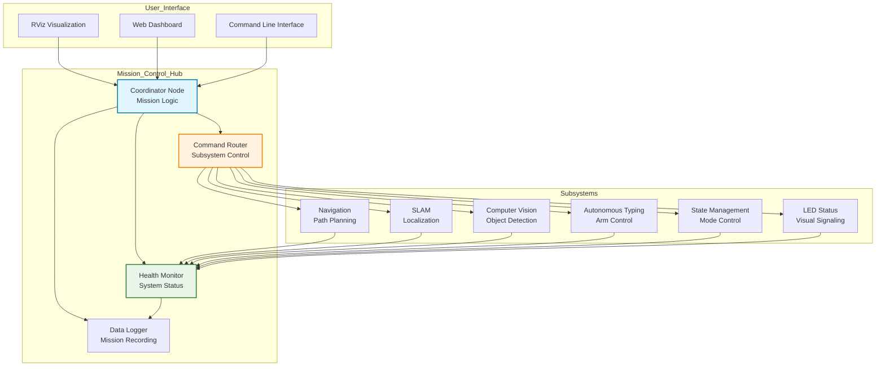
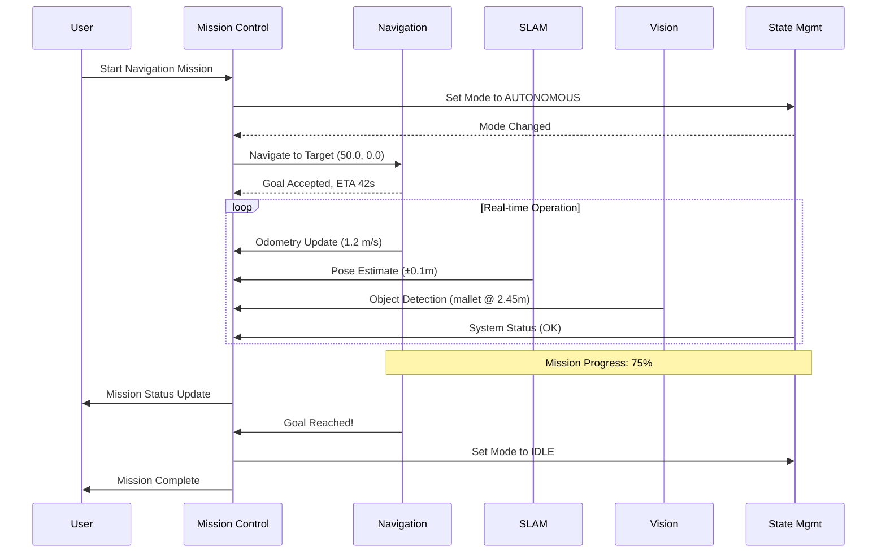

# 🔌 Autonomy Subsystem API Guide

## Overview
This guide defines the communication interfaces (APIs) for each autonomy subsystem. It specifies what data each subsystem **publishes** to mission control and what commands each subsystem **accepts** from mission control.

## 🏛️ Mission Control Hub Architecture



### **Communication Patterns**



## 📡 Communication Standards

### **ROS 2 Topics & Services**
- **Topics**: Continuous data streams (telemetry, sensor data)
- **Services**: Request-response commands (one-time actions)
- **Actions**: Long-running tasks with progress feedback

### **QoS Profiles Implementation**
```python
# Real-time sensor data (e.g., odometry, pose estimates)
qos_realtime = QoSProfile(
    reliability=ReliabilityPolicy.BEST_EFFORT,
    durability=DurabilityPolicy.VOLATILE,
    depth=10  # Buffer last 10 messages for reliability
)

# Critical control commands (e.g., emergency stop, navigation goals)
qos_control = QoSProfile(
    reliability=ReliabilityPolicy.RELIABLE,
    durability=DurabilityPolicy.VOLATILE,
    depth=5  # Buffer last 5 commands in case of network issues
)

# System status (persistent state that new subscribers need)
qos_status = QoSProfile(
    reliability=ReliabilityPolicy.RELIABLE,
    durability=DurabilityPolicy.TRANSIENT_LOCAL,
    depth=1  # Only current status matters, not history
)
```

### **Implementation Example: QoS Setup**
```python
class AutonomyNode(Node):
    def __init__(self):
        super().__init__('autonomy_node')

        # Setup QoS profiles (used across all subsystems)
        self.setup_qos_profiles()

        # Apply to publishers and subscribers
        self.odom_pub = self.create_publisher(
            Odometry, '/navigation/odom', self.qos_realtime
        )

        self.cmd_sub = self.create_subscription(
            Twist, '/navigation/cmd_vel', self.cmd_callback, self.qos_control
        )

    def setup_qos_profiles(self):
        """Initialize QoS profiles with autonomy-specific settings."""
        self.qos_realtime = QoSProfile(
            reliability=ReliabilityPolicy.BEST_EFFORT,
            durability=DurabilityPolicy.VOLATILE,
            depth=10
        )

        self.qos_control = QoSProfile(
            reliability=ReliabilityPolicy.RELIABLE,
            durability=DurabilityPolicy.VOLATILE,
            depth=5
        )

        self.qos_status = QoSProfile(
            reliability=ReliabilityPolicy.RELIABLE,
            durability=DurabilityPolicy.TRANSIENT_LOCAL,
            depth=1
        )
```

### **System-Wide Data Flow Architecture**

```mermaid
flowchart LR
    subgraph Sensors[Sensors]
        GPS[GPS<br/>RTK]
        IMU[IMU<br/>Bosch]
        LIDAR[Lidar<br/>RPLidar]
        CAMERA[RGB-D<br/>Intel]
        ENCODERS[Wheel<br/>Encoders]
    end

    subgraph Perception[Perception Layer]
        NAV_ODOM[Navigation<br/>Odometry]
        SLAM_POSE[SLAM<br/>Pose Est.]
        VISION_DET[Vision<br/>Detection]
        VISION_ARUCO[Vision<br/>AR Tags]
    end

    subgraph Planning[Planning Layer]
        GLOBAL_PLAN[Global Path<br/>A*]
        LOCAL_PLAN[Local Path<br/>Obstacle Avoid]
        TRAJ_PLAN[Trajectory<br/>Generation]
    end

    subgraph Control[Control Layer]
        MOTION_CTRL[Motion Control<br/>Diff Drive]
        ARM_CTRL[Arm Control<br/>MoveIt]
        LED_CTRL[LED Control<br/>Status]
    end

    subgraph Coordination[Coordination Layer]
        STATE_MGMT[State Mgmt<br/>Mode Control]
        MISSION_COORD[Mission Coord<br/>Goal Mgmt]
        HEALTH_MON[Health Monitor<br/>System Status]
    end

    subgraph Interface[User Interface]
        RVIZ[RViz<br/>Viz]
        WEB_DASH[Web Dash<br/>Mission Ctrl]
        C2_STATION[C2 Station<br/>Judge IF]
    end

    Sensors --> Perception --> Planning --> Control
    Coordination -.-> Planning
    Coordination -.-> Control
    Coordination -.-> Interface
    Control -.-> Coordination
    Perception -.-> Coordination

    classDef sensors fill:#e8f5e8,stroke:#2e7d32,stroke-width:2px
    classDef coordination fill:#e1f5fe,stroke:#0277bd,stroke-width:2px
    classDef monitoring fill:#e8f5e8,stroke:#2e7d32,stroke-width:2px
    classDef visualization fill:#fff3e0,stroke:#f57c00,stroke-width:2px

    class GPS,IMU,LIDAR,CAMERA,ENCODERS sensors
    class MISSION_COORD,STATE_MGMT coordination
    class HEALTH_MON monitoring
    class RVIZ,WEB_DASH,C2_STATION visualization
```



---

## 🧭 NAVIGATION SUBSYSTEM API

### **📤 Publishes to Mission Control**

#### **Position & Velocity Telemetry**
```python
# Topic: /navigation/odom
# Type: nav_msgs/Odometry
# Rate: 20Hz (50ms intervals)
# QoS: qos_realtime

# Example message values (rover moving at 1.2 m/s towards target)
message:
  header:
    stamp:
      sec: 1703123456  # Unix timestamp
      nanosec: 123456789
    frame_id: "odom"
  child_frame_id: "base_link"
  pose:
    pose:
      position:
        x: 45.67    # meters from odom origin
        y: -12.34   # meters from odom origin
        z: 0.15     # height above ground
      orientation:
        x: 0.0
        y: 0.0
        z: 0.3827  # sin(θ/2) where θ = 45°
        w: 0.9239  # cos(θ/2) where θ = 45°
    covariance: [0.1, 0.0, 0.0, 0.0, 0.0, 0.0,  # 6x6 pose covariance matrix
                 0.0, 0.1, 0.0, 0.0, 0.0, 0.0,
                 0.0, 0.0, 0.05, 0.0, 0.0, 0.0,
                 0.0, 0.0, 0.0, 0.01, 0.0, 0.0,
                 0.0, 0.0, 0.0, 0.0, 0.01, 0.0,
                 0.0, 0.0, 0.0, 0.0, 0.0, 0.02]
  twist:
    twist:
      linear:
        x: 1.2      # forward velocity m/s
        y: 0.0      # lateral velocity m/s
        z: 0.0      # vertical velocity m/s
      angular:
        x: 0.0
        y: 0.0
        z: 0.15    # rotational velocity rad/s (turning left)
    covariance: [0.05, 0.0, 0.0, 0.0, 0.0, 0.0,  # 6x6 twist covariance matrix
                 0.0, 0.05, 0.0, 0.0, 0.0, 0.0,
                 0.0, 0.0, 0.01, 0.0, 0.0, 0.0,
                 0.0, 0.0, 0.0, 0.02, 0.0, 0.0,
                 0.0, 0.0, 0.0, 0.0, 0.02, 0.0,
                 0.0, 0.0, 0.0, 0.0, 0.0, 0.01]
```

#### **Implementation Example**
```python
class NavigationNode(Node):
    def __init__(self):
        super().__init__('navigation_node')

        # Odometry publisher
        self.odom_pub = self.create_publisher(
            Odometry, '/navigation/odom', self.qos_realtime
        )

        # Publish odometry at 20Hz
        self.create_timer(0.05, self.publish_odometry)

        # Current state (would come from wheel encoders, IMU, GPS fusion)
        self.current_position = [45.67, -12.34, 0.15]  # x, y, z
        self.current_orientation = [0.0, 0.0, 0.3827, 0.9239]  # quaternion
        self.linear_velocity = [1.2, 0.0, 0.0]  # vx, vy, vz
        self.angular_velocity = [0.0, 0.0, 0.15]  # ωx, ωy, ωz

    def publish_odometry(self):
        """Publish current odometry estimate."""
        msg = Odometry()

        # Header
        msg.header.stamp = self.get_clock().now().to_msg()
        msg.header.frame_id = "odom"
        msg.child_frame_id = "base_link"

        # Pose
        msg.pose.pose.position.x = self.current_position[0]
        msg.pose.pose.position.y = self.current_position[1]
        msg.pose.pose.position.z = self.current_position[2]

        msg.pose.pose.orientation.x = self.current_orientation[0]
        msg.pose.pose.orientation.y = self.current_orientation[1]
        msg.pose.pose.orientation.z = self.current_orientation[2]
        msg.pose.pose.orientation.w = self.current_orientation[3]

        # Pose covariance (diagonal matrix for simplicity)
        msg.pose.covariance = [0.1, 0.0, 0.0, 0.0, 0.0, 0.0,
                              0.0, 0.1, 0.0, 0.0, 0.0, 0.0,
                              0.0, 0.0, 0.05, 0.0, 0.0, 0.0,
                              0.0, 0.0, 0.0, 0.01, 0.0, 0.0,
                              0.0, 0.0, 0.0, 0.0, 0.01, 0.0,
                              0.0, 0.0, 0.0, 0.0, 0.0, 0.02]

        # Twist (velocity)
        msg.twist.twist.linear.x = self.linear_velocity[0]
        msg.twist.twist.linear.y = self.linear_velocity[1]
        msg.twist.twist.linear.z = self.linear_velocity[2]

        msg.twist.twist.angular.x = self.angular_velocity[0]
        msg.twist.twist.angular.y = self.angular_velocity[1]
        msg.twist.twist.angular.z = self.angular_velocity[2]

        # Twist covariance
        msg.twist.covariance = [0.05, 0.0, 0.0, 0.0, 0.0, 0.0,
                               0.0, 0.05, 0.0, 0.0, 0.0, 0.0,
                               0.0, 0.0, 0.01, 0.0, 0.0, 0.0,
                               0.0, 0.0, 0.0, 0.02, 0.0, 0.0,
                               0.0, 0.0, 0.0, 0.0, 0.02, 0.0,
                               0.0, 0.0, 0.0, 0.0, 0.0, 0.01]

        self.odom_pub.publish(msg)
```

#### **Navigation Status**
```python
# Topic: /navigation/status
# Type: autonomy_msgs/NavigationStatus
# Rate: 5Hz (200ms intervals)
# QoS: qos_status

# Example message values (actively navigating to target)
message:
  header:
    stamp:
      sec: 1703123456
      nanosec: 123456789
    frame_id: "map"
  state: "NAVIGATING"  # Current navigation state
  current_goal:
    position:
      x: 50.0     # Target x position (meters)
      y: 0.0      # Target y position (meters)
      z: 0.0      # Target z position (meters)
    orientation:
      x: 0.0
      y: 0.0
      z: 0.0      # No rotation needed
      w: 1.0
  distance_to_goal: 4.33   # meters remaining (Pythagoras: sqrt((50-45.67)^2 + (0+12.34)^2))
  estimated_time: 3.61     # seconds to completion at 1.2 m/s
  path_progress: 0.75      # 75% of planned path completed
  obstacles_detected: 2     # Number of obstacles currently detected
  battery_level: 0.85       # 85% battery remaining
```

#### **Implementation Example**
```python
class NavigationNode(Node):
    def __init__(self):
        super().__init__('navigation_node')

        # Status publisher
        self.status_pub = self.create_publisher(
            NavigationStatus, '/navigation/status', self.qos_status
        )

        # Publish status at 5Hz
        self.create_timer(0.2, self.publish_status)

        # Navigation state
        self.nav_state = "IDLE"
        self.current_goal = None
        self.path_progress = 0.0
        self.obstacles_count = 0
        self.battery_level = 1.0

    def publish_status(self):
        """Publish current navigation status."""
        msg = NavigationStatus()

        # Header
        msg.header.stamp = self.get_clock().now().to_msg()
        msg.header.frame_id = "map"

        # Navigation state
        msg.state = self.nav_state

        # Current goal (if navigating)
        if self.current_goal:
            msg.current_goal = self.current_goal
            msg.distance_to_goal = self.calculate_distance_to_goal()
            msg.estimated_time = self.estimate_time_to_goal()
        else:
            msg.distance_to_goal = 0.0
            msg.estimated_time = 0.0

        # Progress and obstacles
        msg.path_progress = self.path_progress
        msg.obstacles_detected = self.obstacles_count

        # Battery level (would come from power subsystem)
        msg.battery_level = self.battery_level

        self.status_pub.publish(msg)

    def calculate_distance_to_goal(self):
        """Calculate straight-line distance to current goal."""
        if not self.current_goal:
            return 0.0

        # Would use actual odometry position, but using example values
        current_pos = [45.67, -12.34, 0.15]  # From odometry example
        goal_pos = [self.current_goal.position.x,
                   self.current_goal.position.y,
                   self.current_goal.position.z]

        # Euclidean distance
        dx = goal_pos[0] - current_pos[0]
        dy = goal_pos[1] - current_pos[1]
        dz = goal_pos[2] - current_pos[2]

        return math.sqrt(dx*dx + dy*dy + dz*dz)

    def estimate_time_to_goal(self):
        """Estimate time to reach goal based on current speed."""
        if not self.current_goal:
            return 0.0

        distance = self.calculate_distance_to_goal()
        current_speed = 1.2  # m/s from odometry example

        if current_speed > 0.1:  # Avoid division by zero
            return distance / current_speed
        else:
            return float('inf')  # Not moving
```

#### **Planned Path**
```python
# Topic: /navigation/plan
# Type: nav_msgs/Path
# Rate: When path changes
# QoS: qos_control
message:
  header:
    stamp: plan_time
    frame_id: "map"
  poses: [waypoint_poses_array]
```

#### **Error Reports**
```python
# Topic: /navigation/errors
# Type: autonomy_msgs/ErrorReport
# Rate: On error
# QoS: qos_control
message:
  header: error_time
  subsystem: "navigation"
  error_code: "PATH_BLOCKED" | "GPS_LOST" | "MOTOR_FAULT" | etc.
  severity: "WARNING" | "ERROR" | "CRITICAL"
  description: "Human readable error description"
  recovery_action: suggested_fix
```

### **📥 Accepts from Mission Control**

#### **Navigation Commands**

**Service: /navigation/navigate_to_pose**
```python
# Type: autonomy_srvs/NavigateToPose

# Example request (navigate to GPS waypoint)
request:
  target_pose:
    position:
      x: 50.0      # Target x coordinate (meters)
      y: 0.0       # Target y coordinate (meters)
      z: 0.0       # Target z coordinate (meters)
    orientation:
      x: 0.0
      y: 0.0
      z: 0.0       # No specific orientation required
      w: 1.0
  tolerance: 1.0     # Acceptable error: within 1 meter
  timeout: 300.0     # Max time: 5 minutes

# Example response (successful)
response:
  success: true
  message: "Navigation goal accepted"
  estimated_time: 42.0  # Estimated 42 seconds to reach goal
```

#### **Implementation Example**
```python
class NavigationNode(Node):
    def __init__(self):
        super().__init__('navigation_node')

        # Navigation service
        self.navigate_srv = self.create_service(
            NavigateToPose, '/navigation/navigate_to_pose',
            self.navigate_to_pose_callback
        )

        # Emergency stop service
        self.emergency_srv = self.create_service(
            Trigger, '/navigation/emergency_stop',
            self.emergency_stop_callback
        )

    def navigate_to_pose_callback(self, request, response):
        """Handle navigation goal requests."""
        try:
            # Validate request
            if not self.validate_navigation_request(request):
                response.success = False
                response.message = "Invalid navigation request: goal out of bounds"
                response.estimated_time = 0.0
                return response

            # Check if we can accept the goal
            if self.nav_state == "EMERGENCY":
                response.success = False
                response.message = "Cannot navigate: system in emergency state"
                response.estimated_time = 0.0
                return response

            # Accept the goal
            self.current_goal = request.target_pose
            self.goal_tolerance = request.tolerance
            self.nav_timeout = request.timeout
            self.nav_state = "PLANNING"

            # Calculate estimated time
            distance = self.calculate_distance_to_goal()
            estimated_time = self.estimate_time_to_goal()

            # Check timeout constraint
            if estimated_time > request.timeout:
                response.success = False
                response.message = f"Goal too far: estimated {estimated_time:.1f}s > timeout {request.timeout}s"
                response.estimated_time = estimated_time
                return response

            response.success = True
            response.message = "Navigation goal accepted"
            response.estimated_time = estimated_time

            # Start navigation (would trigger planning in real implementation)
            self.start_navigation()

            return response

        except Exception as e:
            self.get_logger().error(f'Navigation service error: {e}')
            response.success = False
            response.message = f"Service error: {str(e)}"
            response.estimated_time = 0.0
            return response

    def emergency_stop_callback(self, request, response):
        """Handle emergency stop requests."""
        try:
            # Immediate stop
            self.nav_state = "EMERGENCY"
            self.current_goal = None

            # Stop all motion (would send zero velocity commands)
            self.stop_all_motion()

            # Publish emergency status
            self.publish_emergency_status()

            response.success = True
            response.message = "Emergency stop activated - all navigation halted"

            return response

        except Exception as e:
            self.get_logger().error(f'Emergency stop error: {e}')
            response.success = False
            response.message = f"Emergency stop failed: {str(e)}"
            return response

    def validate_navigation_request(self, request):
        """Validate navigation request parameters."""
        # Check if goal position is reasonable
        pos = request.target_pose.position

        # Basic bounds checking (example: within 1000m of origin)
        if abs(pos.x) > 1000.0 or abs(pos.y) > 1000.0:
            return False

        # Check tolerance is reasonable
        if request.tolerance <= 0.0 or request.tolerance > 10.0:
            return False

        # Check timeout is reasonable
        if request.timeout <= 0.0 or request.timeout > 3600.0:  # Max 1 hour
            return False

        return True
```

#### **Emergency Stop**
```python
# Service: /navigation/emergency_stop
# Type: std_srvs/Trigger

# Example request: (empty - immediate stop command)
request: {}

# Example response: (successful emergency stop)
response:
  success: true
  message: "Emergency stop activated - all navigation halted"
```

#### **Speed Control**
```python
# Topic: /navigation/cmd_vel
# Type: geometry_msgs/Twist
# Accepts velocity commands from higher-level control
```

---

## 🗺️ SLAM SUBSYSTEM API

### **📤 Publishes to Mission Control**

#### **Map Data**
```python
# Topic: /slam/map
# Type: nav_msgs/OccupancyGrid
# Rate: 1Hz (every 1 second)
# QoS: qos_status

# Example message values (20m x 20m map at 5cm resolution)
message:
  header:
    stamp:
      sec: 1703123456
      nanosec: 123456789
    frame_id: "map"
  info:
    map_load_time:
      sec: 1703123400  # When map was first created
      nanosec: 0
    resolution: 0.05     # 5cm per cell
    width: 400           # 400 cells = 20m width
    height: 400          # 400 cells = 20m height
    origin:
      position:
        x: -10.0         # Map origin at (-10, -10)
        y: -10.0
        z: 0.0
      orientation:
        x: 0.0
        y: 0.0
        z: 0.0
        w: 1.0
  data: [0, 0, 0, ..., 100, 100, 100, ...]  # 160,000 values (400x400)
        # 0 = free space, 100 = occupied, -1 = unknown
```

#### **Implementation Example**
```python
class SLAMNode(Node):
    def __init__(self):
        super().__init__('slam_node')

        # Map publisher
        self.map_pub = self.create_publisher(
            OccupancyGrid, '/slam/map', self.qos_status
        )

        # Publish map at 1Hz
        self.create_timer(1.0, self.publish_map)

        # Map data storage
        self.map_resolution = 0.05  # 5cm cells
        self.map_width = 400        # 20m width
        self.map_height = 400       # 20m height
        self.map_origin = [-10.0, -10.0, 0.0]  # Bottom-left corner

        # Occupancy grid data (would be updated by SLAM algorithm)
        self.occupancy_grid = [-1] * (self.map_width * self.map_height)

    def publish_map(self):
        """Publish current occupancy grid map."""
        msg = OccupancyGrid()

        # Header
        msg.header.stamp = self.get_clock().now().to_msg()
        msg.header.frame_id = "map"

        # Map metadata
        msg.info.map_load_time = self.get_clock().now().to_msg()
        msg.info.resolution = self.map_resolution
        msg.info.width = self.map_width
        msg.info.height = self.map_height

        # Origin pose
        msg.info.origin.position.x = self.map_origin[0]
        msg.info.origin.position.y = self.map_origin[1]
        msg.info.origin.position.z = self.map_origin[2]
        msg.info.origin.orientation.w = 1.0

        # Occupancy data
        msg.data = self.occupancy_grid

        self.map_pub.publish(msg)

    def update_occupancy_grid(self, laser_scan, robot_pose):
        """Update occupancy grid with new laser scan data."""
        # Convert laser scan to map coordinates
        for i, range_measurement in enumerate(laser_scan.ranges):
            if range_measurement < laser_scan.range_max:
                # Convert polar to cartesian coordinates
                angle = laser_scan.angle_min + i * laser_scan.angle_increment
                x_local = range_measurement * math.cos(angle)
                y_local = range_measurement * math.sin(angle)

                # Transform to map coordinates (simplified)
                x_map = x_local + robot_pose.position.x - self.map_origin[0]
                y_map = y_local + robot_pose.position.y - self.map_origin[1]

                # Convert to grid coordinates
                grid_x = int(x_map / self.map_resolution)
                grid_y = int(y_map / self.map_resolution)

                # Mark as occupied if within bounds
                if (0 <= grid_x < self.map_width and
                    0 <= grid_y < self.map_height):
                    index = grid_y * self.map_width + grid_x
                    self.occupancy_grid[index] = 100  # Occupied
```

#### **Localization Pose**
```python
# Topic: /slam/pose
# Type: geometry_msgs/PoseWithCovarianceStamped
# Rate: 20Hz
# QoS: qos_realtime
message:
  header:
    stamp: pose_time
    frame_id: "map"
  pose:
    pose: estimated_robot_pose_6dof
    covariance: [6x6_pose_covariance_matrix]
```

#### **SLAM Status**
```python
# Topic: /slam/status
# Type: autonomy_msgs/SLAMStatus
# Rate: 2Hz
# QoS: qos_status
message:
  header: current_time
  state: "INITIALIZING" | "MAPPING" | "LOCALIZING" | "LOST" | "ERROR"
  map_quality: 0.0_to_1.0_confidence
  loop_closures: number_detected
  features_tracked: current_feature_count
  drift_estimate: meters_of_position_error
  cpu_usage: percentage
  memory_usage: percentage
```

#### **Loop Closure Events**
```python
# Topic: /slam/loop_closure
# Type: autonomy_msgs/LoopClosureEvent
# Rate: On detection
# QoS: qos_control
message:
  header: detection_time
  position: corrected_pose_after_closure
  correction_distance: meters_corrected
  confidence: 0.0_to_1.0_confidence_level
```

### **📥 Accepts from Mission Control**

#### **Reset Command**
```python
# Service: /slam/reset
# Type: autonomy_srvs/SLAMReset
request:
  reset_type: "SOFT" | "HARD" | "RELOCALIZE"
  initial_pose: starting_pose_guess (optional)
response:
  success: bool
  message: "Reset complete" | "Reset failed: [reason]"
```

#### **Save Map**
```python
# Service: /slam/save_map
# Type: autonomy_srvs/SaveMap
request:
  filename: "/path/to/map.pgm"
  include_metadata: bool
response:
  success: bool
  message: "Map saved" | "Save failed: [reason]"
  file_path: actual_saved_path
```

---

## 👁️ COMPUTER VISION SUBSYSTEM API

### **📤 Publishes to Mission Control**

#### **Object Detections**
```python
# Topic: /vision/detections
# Type: vision_msgs/Detection3DArray
# Rate: 10Hz (every 100ms)
# QoS: qos_realtime

# Example message values (detected mallet hammer and water bottle)
message:
  header:
    stamp:
      sec: 1703123456
      nanosec: 123456789
    frame_id: "camera_link"
  detections:
    - id: "mallet_001"          # Unique detection ID
      results:                   # Array of classification results
        - hypothesis:
            class_id: "mallet"  # Object class name
            score: 0.92         # Detection confidence (92%)
          pose:
            pose:
              position:
                x: 2.45         # Object 2.45m in front of camera
                y: -0.78        # 0.78m to the left
                z: 0.12         # 0.12m above camera
              orientation:
                x: -0.1
                y: 0.1
                z: 0.7          # Object slightly tilted
                w: 0.7
        - hypothesis:            # Second hypothesis (less confident)
            class_id: "hammer"
            score: 0.15
      bbox:                     # 2D bounding box in image
        center:
          x: 320.5              # Center pixel x-coordinate
          y: 240.8              # Center pixel y-coordinate
        size_x: 85.2            # Width in pixels
        size_y: 142.6           # Height in pixels
      source_cloud: []          # Point cloud segment (optional)

    - id: "bottle_001"          # Second detection
      results:
        - hypothesis:
            class_id: "water_bottle"
            score: 0.87         # 87% confidence
          pose:
            pose:
              position:
                x: 1.82         # Closer object
                y: 0.34         # To the right
                z: -0.05        # Slightly below camera
              orientation:
                x: 0.0
                y: 0.0
                z: 0.0          # Upright bottle
                w: 1.0
      bbox:
        center:
          x: 512.3
          y: 389.1
        size_x: 42.8
        size_y: 156.3
```

#### **Implementation Example**
```python
class VisionNode(Node):
    def __init__(self):
        super().__init__('vision_node')

        # Detections publisher
        self.detections_pub = self.create_publisher(
            Detection3DArray, '/vision/detections', self.qos_realtime
        )

        # Camera subscriber
        self.image_sub = self.create_subscription(
            Image, '/camera/color/image_raw', self.image_callback, self.qos_realtime
        )

        # Detection timer (10Hz)
        self.create_timer(0.1, self.publish_detections)

        # Object detector (would be loaded ML model)
        self.detector = self.load_object_detector()

        # Latest detections
        self.current_detections = []

    def image_callback(self, msg):
        """Process incoming camera images."""
        try:
            # Convert ROS image to OpenCV format
            cv_image = self.bridge.imgmsg_to_cv2(msg, "bgr8")

            # Run object detection
            detections = self.detector.detect(cv_image)

            # Convert to ROS format
            ros_detections = self.convert_to_ros_detections(detections, msg.header)

            # Store for publishing
            self.current_detections = ros_detections

        except Exception as e:
            self.get_logger().error(f'Image processing error: {e}')

    def publish_detections(self):
        """Publish current object detections."""
        msg = Detection3DArray()
        msg.header.stamp = self.get_clock().now().to_msg()
        msg.header.frame_id = "camera_link"

        # Add current detections
        msg.detections = self.current_detections

        self.detections_pub.publish(msg)

    def convert_to_ros_detections(self, detections, image_header):
        """Convert detection results to ROS Detection3D format."""
        ros_detections = []

        for i, detection in enumerate(detections):
            ros_detection = Detection3D()

            # Unique ID for this detection
            ros_detection.id = f"{detection.class_name}_{i:03d}"

            # Classification results
            result = ObjectHypothesisWithPose()
            result.hypothesis.class_id = detection.class_name
            result.hypothesis.score = detection.confidence

            # 3D pose estimation (simplified - would use depth data)
            result.pose.pose = self.estimate_3d_pose(detection.bbox, detection.class_name)

            ros_detection.results = [result]

            # 2D bounding box
            ros_detection.bbox.center.x = detection.bbox.center_x
            ros_detection.bbox.center.y = detection.bbox.center_y
            ros_detection.bbox.size_x = detection.bbox.width
            ros_detection.bbox.size_y = detection.bbox.height

            ros_detections.append(ros_detection)

        return ros_detections

    def estimate_3d_pose(self, bbox, class_name):
        """Estimate 3D pose from 2D detection (simplified example)."""
        # This would use depth data and camera intrinsics
        # For now, return example poses based on object type

        pose = Pose()

        if class_name == "mallet":
            # Mallet at 2.45m forward, 0.78m left
            pose.position.x = 2.45
            pose.position.y = -0.78
            pose.position.z = 0.12
            # Slightly tilted
            pose.orientation.x = -0.1
            pose.orientation.y = 0.1
            pose.orientation.z = 0.7
            pose.orientation.w = 0.7

        elif class_name == "water_bottle":
            # Bottle closer and to the right
            pose.position.x = 1.82
            pose.position.y = 0.34
            pose.position.z = -0.05
            # Upright
            pose.orientation.w = 1.0

        return pose
```

#### **ArUco Marker Poses**
```python
# Topic: /vision/aruco_markers
# Type: geometry_msgs/PoseArray
# Rate: 15Hz
# QoS: qos_realtime
message:
  header:
    stamp: detection_time
    frame_id: "camera_link"
  poses: [detected_marker_poses]
  # Each pose corresponds to marker position/orientation
```

#### **Vision Status**
```python
# Topic: /vision/status
# Type: autonomy_msgs/VisionStatus
# Rate: 5Hz
# QoS: qos_status
message:
  header: current_time
  camera_connected: bool
  detections_count: number_of_objects_detected
  markers_count: number_of_aruco_markers
  processing_fps: frames_per_second
  image_quality: 0.0_to_1.0_metric
  lighting_conditions: "BRIGHT" | "NORMAL" | "LOW_LIGHT" | "NIGHT"
  calibration_valid: bool
  errors: ["camera_disconnected", "calibration_invalid", etc.]
```

#### **Processed Images (Optional)**
```python
# Topic: /vision/annotated_image
# Type: sensor_msgs/Image
# Rate: 5Hz (throttled)
# QoS: qos_control
# Annotated image with detection overlays for debugging
```

### **📥 Accepts from Mission Control**

#### **Detection Parameters**
```python
# Service: /vision/set_detection_params
# Type: autonomy_srvs/SetDetectionParams
request:
  confidence_threshold: 0.0-1.0 (default: 0.5)
  max_detections: maximum_objects_to_report (default: 10)
  classes_to_detect: ["mallet", "water_bottle", "aruco_markers"]
  enable_tracking: bool (default: true)
response:
  success: bool
  message: "Parameters updated" | "Invalid parameters"
```

#### **Camera Controls**
```python
# Service: /vision/camera_control
# Type: autonomy_srvs/CameraControl
request:
  command: "START_STREAM" | "STOP_STREAM" | "ADJUST_EXPOSURE" | "FOCUS"
  exposure_value: -10_to_10 (if adjusting)
  focus_distance: meters (if focusing)
response:
  success: bool
  message: "Command executed" | "Command failed"
```

---

## ⌨️ AUTONOMOUS TYPING SUBSYSTEM API

### **📤 Publishes to Mission Control**

#### **Typing Status**
```python
# Topic: /typing/status
# Type: autonomy_msgs/TypingStatus
# Rate: 5Hz
# QoS: qos_status
message:
  header: current_time
  state: "IDLE" | "LOCATING_KEYBOARD" | "POSITIONING" | "TYPING" | "COMPLETE" | "ERROR"
  keyboard_detected: bool
  keyboard_pose: estimated_keyboard_position
  current_key_target: target_key_to_press
  keys_pressed: number_of_successful_presses
  total_keys_required: total_characters_needed
  progress: 0.0_to_1.0_completion_percentage
  error_message: current_error_if_any
```

#### **Arm Position & Force Feedback**
```python
# Topic: /typing/arm_feedback
# Type: autonomy_msgs/ArmFeedback
# Rate: 20Hz
# QoS: qos_realtime
message:
  header: current_time
  joint_positions: [6_joint_angles_radians]
  joint_velocities: [6_joint_velocities_rad_per_sec]
  end_effector_pose: current_tcp_pose_6dof
  force_torque: [6_force_torque_measurements]
  gripper_state: "OPEN" | "CLOSED" | "MOVING"
  contact_detected: bool
  force_limit_exceeded: bool
```

#### **Keyboard Detection Results**
```python
# Topic: /typing/keyboard_detection
# Type: autonomy_msgs/KeyboardDetection
# Rate: 2Hz
# QoS: qos_control
message:
  header: detection_time
  detected: bool
  confidence: 0.0_to_1.0_detection_confidence
  pose: keyboard_position_orientation
  key_layout: detected_key_positions_array
  template_match_score: 0.0_to_1.0_template_matching_quality
```

### **📥 Accepts from Mission Control**

#### **Typing Commands**
```python
# Service: /typing/type_sequence
# Type: autonomy_srvs/TypeSequence
request:
  sequence: "ABC123" (string to type)
  timeout: max_time_seconds (default: 300)
  verification_required: bool (default: true)
response:
  success: bool
  message: "Sequence typed successfully" | "Failed: [reason]"
  actual_sequence: what_was_actually_typed
  time_taken: seconds_spent
```

#### **Manual Arm Control (Debug)**
```python
# Topic: /typing/cmd_arm
# Type: trajectory_msgs/JointTrajectory
# Accepts joint position commands for manual control
```

#### **Emergency Stop**
```python
# Service: /typing/emergency_stop
# Type: std_srvs/Trigger
# Immediately stops all arm movement
```

---

## 🎛️ STATE MANAGEMENT SUBSYSTEM API

### **📤 Publishes to Mission Control**

#### **System State**
```python
# Topic: /state/system_state
# Type: autonomy_msgs/SystemState
# Rate: 10Hz
# QoS: qos_status
message:
  header: current_time
  overall_state: "IDLE" | "AUTONOMOUS" | "TELEOP" | "EMERGENCY" | "ERROR"
  mission_phase: "NONE" | "NAVIGATION_MISSION" | "TYPING_MISSION" | "COMPLETE"
  subsystem_states: {
    navigation: "OK" | "WARNING" | "ERROR",
    slam: "OK" | "WARNING" | "ERROR",
    vision: "OK" | "WARNING" | "ERROR",
    typing: "OK" | "WARNING" | "ERROR"
  }
  battery_level: 0.0_to_1.0_percentage
  mission_timer: seconds_elapsed_since_start
  gps_fix_quality: "NO_FIX" | "GPS_FIX" | "DGPS_FIX" | "RTK_FIX"
```

#### **Mission Progress**
```python
# Topic: /state/mission_progress
# Type: autonomy_msgs/MissionProgress
# Rate: 2Hz
# QoS: qos_status
message:
  header: current_time
  mission_type: "NAVIGATION" | "TYPING"
  progress_percentage: 0.0_to_1.0_overall_completion
  current_objective: "Navigate to target 3/7" | "Type code ABC123"
  time_remaining: seconds_left_in_mission
  waypoints_completed: [list_of_completed_target_ids]
  codes_entered: [list_of_successfully_entered_codes]
  failures: number_of_failed_attempts
  recoveries: number_of_successful_error_recoveries
```

#### **Health Diagnostics**
```python
# Topic: /state/diagnostics
# Type: diagnostic_msgs/DiagnosticArray
# Rate: 1Hz
# QoS: qos_status
# Standard ROS diagnostics format with subsystem health
```

#### **Event Log**
```python
# Topic: /state/events
# Type: autonomy_msgs/SystemEvent
# Rate: On event
# QoS: qos_control
message:
  header: event_time
  event_type: "STATE_CHANGE" | "ERROR" | "RECOVERY" | "MISSION_COMPLETE"
  severity: "INFO" | "WARNING" | "ERROR" | "CRITICAL"
  subsystem: "navigation" | "slam" | etc.
  description: "Human readable event description"
  data: additional_event_specific_data
```

### **📥 Accepts from Mission Control**

#### **Mode Commands**
```python
# Service: /state/set_mode
# Type: autonomy_srvs/SetMode
request:
  mode: "IDLE" | "AUTONOMOUS" | "TELEOP" | "EMERGENCY"
  reason: "Mission start" | "Operator override" | "System error"
response:
  success: bool
  message: "Mode changed to [mode]" | "Mode change failed: [reason]"
  transition_time: seconds_to_complete_transition
```

#### **Mission Commands**
```python
# Service: /state/start_mission
# Type: autonomy_srvs/StartMission
request:
  mission_type: "NAVIGATION" | "TYPING"
  mission_params: mission_specific_parameters
  timeout: max_mission_duration_seconds
response:
  success: bool
  message: "Mission started" | "Mission start failed: [reason]"
  mission_id: unique_mission_identifier
```

#### **Emergency Commands**
```python
# Service: /state/emergency_stop
# Type: std_srvs/Trigger
request: (empty)
response:
  success: bool
  message: "Emergency stop activated - all systems halted"
```

---

## 🔴 LED STATUS SUBSYSTEM API

### **📤 Publishes to Mission Control**

#### **LED Status**
```python
# Topic: /led/status
# Type: autonomy_msgs/LEDStatus
# Rate: 5Hz
# QoS: qos_status
message:
  header: current_time
  current_pattern: "SOLID_RED" | "FLASHING_BLUE" | "PULSING_GREEN" | etc.
  brightness_level: 0_to_255_pwm_value
  color_rgb: [red, green, blue]_0-255_values
  pattern_active: bool
  battery_indicator: 0.0_to_1.0_visual_battery_level
  error_codes: [list_of_active_error_codes]
```

#### **System Status Indicator**
```python
# Topic: /led/system_indicator
# Type: std_msgs/String
# Rate: 1Hz
# QoS: qos_status
# Simple status: "AUTONOMOUS_RED" | "TELEOP_BLUE" | "SUCCESS_GREEN" | "ERROR_RED_FLASH"
```

### **📥 Accepts from Mission Control**

#### **Set LED Pattern**
```python
# Service: /led/set_pattern
# Type: autonomy_srvs/SetLEDPattern
request:
  pattern: "AUTONOMOUS" | "TELEOP" | "SUCCESS" | "ERROR" | "CUSTOM"
  color: [r, g, b]_0-255 (if custom)
  brightness: 0-255 (if custom)
  duration: seconds (0 = indefinite)
response:
  success: bool
  message: "Pattern set" | "Invalid pattern"
```

---

## 🌐 MISSION CONTROL HUB API

### **📤 Publishes to User Frontend**

#### **Consolidated System Status**
```python
# Topic: /mission_control/system_status
# Type: autonomy_msgs/ConsolidatedStatus
# Rate: 5Hz
# QoS: qos_status
# Aggregates all subsystem statuses into single message
```

#### **Mission Progress**
```python
# Topic: /mission_control/mission_progress
# Type: autonomy_msgs/MissionProgress
# Rate: 2Hz
# QoS: qos_status
# High-level mission progress for user display
```

#### **Alert Notifications**
```python
# Topic: /mission_control/alerts
# Type: autonomy_msgs/Alert
# Rate: On alert
# QoS: qos_control
# Critical alerts requiring user attention
```

### **📥 Accepts from User Frontend**

#### **Mission Commands**
```python
# Service: /mission_control/start_mission
# Type: autonomy_srvs/MissionCommand
request:
  mission_type: "NAVIGATION" | "TYPING"
  parameters: mission_specific_params
response:
  success: bool
  mission_id: unique_identifier
  estimated_duration: seconds
```

#### **System Control**
```python
# Service: /mission_control/system_control
# Type: autonomy_srvs/SystemControl
request:
  command: "START" | "STOP" | "PAUSE" | "RESUME" | "EMERGENCY_STOP"
  reason: operator_reason
response:
  success: bool
  message: command_result
```

---

## 📋 Implementation Checklist

### **For Each Subsystem Developer**
- [ ] Publish required telemetry topics
- [ ] Accept specified command services/topics
- [ ] Use correct QoS profiles
- [ ] Handle error conditions gracefully
- [ ] Provide health status information

### **For Mission Control Developer**
- [ ] Subscribe to all subsystem telemetry
- [ ] Send appropriate commands to subsystems
- [ ] Aggregate and filter status information
- [ ] Provide user-friendly command interface

### **For System Integration**
- [ ] Verify all topics are being published
- [ ] Test service calls between components
- [ ] Validate timing requirements are met
- [ ] Confirm error handling works end-to-end

## 🔧 Message Type Definitions

### **Custom Message Types Required**
```rosmsg
# autonomy_msgs/NavigationStatus
std_msgs/Header header
string state
geometry_msgs/PoseStamped current_goal
float32 distance_to_goal
float32 estimated_time
float32 path_progress
uint32 obstacles_detected
float32 battery_level

# autonomy_srvs/NavigateToPose
geometry_msgs/PoseStamped target_pose
float32 tolerance
float32 timeout
---
bool success
string message
float32 estimated_time
```

## 📋 Quick Reference Summary

### **Topic/Service Overview**

| Subsystem | Publishes Topics | Accepts Services | Key Messages |
|---|---|---|---|
| **Navigation** | `/navigation/odom`, `/navigation/status`, `/navigation/plan` | `navigate_to_pose`, `emergency_stop` | Odometry, PoseStamped, Twist |
| **SLAM** | `/slam/map`, `/slam/pose`, `/slam/status` | `slam/reset`, `save_map` | OccupancyGrid, PoseWithCovarianceStamped |
| **Vision** | `/vision/detections`, `/vision/aruco_markers` | `set_detection_params`, `camera_control` | Detection3DArray, PoseArray |
| **Typing** | `/typing/status`, `/typing/arm_feedback` | `type_sequence`, `emergency_stop` | ArmFeedback, KeyboardDetection |
| **State** | `/state/system_state`, `/state/mission_progress` | `set_mode`, `start_mission` | SystemState, MissionProgress |
| **LED** | `/led/status`, `/led/system_indicator` | `set_pattern` | LEDStatus, String |

### **QoS Profile Quick Reference**
- **Real-time data**: `qos_realtime` (BEST_EFFORT, depth=10)
- **Control commands**: `qos_control` (RELIABLE, depth=5)
- **System status**: `qos_status` (RELIABLE, TRANSIENT_LOCAL, depth=1)

### **Message Rate Guidelines**
- **High-frequency**: 20-50Hz (odometry, sensor data)
- **Medium-frequency**: 5-10Hz (status, detections)
- **Low-frequency**: 1-2Hz (maps, diagnostics)
- **Event-based**: On-change (errors, events)

### **Implementation Checklist**
- [ ] **Topics**: All required topics are published at correct rates
- [ ] **Services**: All required services respond correctly
- [ ] **QoS**: Appropriate QoS profiles are used
- [ ] **Messages**: Correct message types and field population
- [ ] **Error Handling**: Services return appropriate error messages
- [ ] **Documentation**: All interfaces are documented

---

## 🚀 **Complete Implementation Scenario: Autonomous Navigation Mission**

### **Example: Rover Navigating to GPS Waypoint While Avoiding Obstacles**

#### **1. Mission Control Sends Navigation Command**
```bash
# User clicks "Navigate to GPS coordinate (50.0, 0.0)" in frontend
# Mission control calls navigation service
rosservice call /navigation/navigate_to_pose "
  target_pose:
    position: {x: 50.0, y: 0.0, z: 0.0}
    orientation: {x: 0.0, y: 0.0, z: 0.0, w: 1.0}
  tolerance: 1.0
  timeout: 300.0"
```

#### **2. Navigation Subsystem Responds**
```json
// Navigation service response
{
  "success": true,
  "message": "Navigation goal accepted",
  "estimated_time": 42.0
}
```

#### **3. Real-time Data Flow During Navigation**
```python
# Navigation publishes odometry at 20Hz
/navigation/odom:
  pose: {position: {x: 45.67, y: -12.34, z: 0.15}}
  twist: {linear: {x: 1.2, y: 0.0, z: 0.0}}  # Moving at 1.2 m/s

# Navigation publishes status at 5Hz
/navigation/status:
  state: "NAVIGATING"
  distance_to_goal: 4.33
  path_progress: 0.75
  obstacles_detected: 2

# SLAM publishes map at 1Hz
/slam/map:
  info: {resolution: 0.05, width: 400, height: 400}
  data: [0, 0, 100, ...]  # Occupancy grid

# Vision publishes detections at 10Hz
/vision/detections:
  detections: [
    {
      id: "mallet_001",
      results: [{hypothesis: {class_id: "mallet", score: 0.92}}],
      pose: {position: {x: 2.45, y: -0.78, z: 0.12}}
    }
  ]
```

#### **4. State Management Coordinates Everything**
```python
# State management publishes system status at 10Hz
/state/system_state:
  overall_state: "AUTONOMOUS"
  subsystem_states: {
    navigation: "OK",
    slam: "OK",
    vision: "OK"
  }
  mission_phase: "NAVIGATION_MISSION"
  battery_level: 0.85

# Mission progress updates at 2Hz
/state/mission_progress:
  progress_percentage: 0.75
  current_objective: "Navigate to target 3/7"
  time_remaining: 158.0
```

#### **5. Error Handling Example**
```python
# Vision detects obstacle in path
/vision/detections:
  detections: [{
    id: "obstacle_001",
    results: [{hypothesis: {class_id: "large_rock", score: 0.95}}],
    pose: {position: {x: 3.2, y: 0.1, z: 0.0}}
  }]

# Navigation detects obstacle and replans
/navigation/errors:
  error_code: "PATH_BLOCKED"
  severity: "WARNING"
  description: "Obstacle detected in planned path"
  recovery_action: "Replanning path around obstacle"
```

#### **6. Mission Completion**
```python
# Navigation reaches goal
/navigation/status:
  state: "ARRIVED"
  distance_to_goal: 0.0
  path_progress: 1.0

# Mission control updates state
/state/system_state:
  overall_state: "IDLE"
  mission_phase: "COMPLETE"

# LED status changes
/led/status:
  current_pattern: "SUCCESS"
  color_rgb: [0, 255, 0]  # Green for success
```

### **Implementation Code Example: Mission Control Coordinator**
```python
class MissionControlNode(Node):
    def __init__(self):
        super().__init__('mission_control_node')

        # Subscribe to all subsystem telemetry
        self.create_subscription(Odometry, '/navigation/odom', self.odom_callback, self.qos_realtime)
        self.create_subscription(NavigationStatus, '/navigation/status', self.nav_status_callback, self.qos_status)
        self.create_subscription(Detection3DArray, '/vision/detections', self.vision_callback, self.qos_realtime)
        self.create_subscription(SystemState, '/state/system_state', self.state_callback, self.qos_status)

        # Service clients for commanding subsystems
        self.nav_client = self.create_client(NavigateToPose, '/navigation/navigate_to_pose')
        self.emergency_client = self.create_client(Trigger, '/navigation/emergency_stop')

        # Publishers for user interface
        self.mission_status_pub = self.create_publisher(MissionStatus, '/mission_control/status', self.qos_status)

        # Mission state
        self.current_mission = None
        self.mission_start_time = None

    def start_navigation_mission(self, target_pose):
        """Start autonomous navigation mission."""
        if not self.nav_client.wait_for_service(timeout_sec=5.0):
            self.get_logger().error('Navigation service not available')
            return False

        # Send navigation goal
        request = NavigateToPose.Request()
        request.target_pose = target_pose
        request.tolerance = 1.0
        request.timeout = 300.0

        future = self.nav_client.call_async(request)
        future.add_done_callback(self.navigation_response_callback)

        return True

    def navigation_response_callback(self, future):
        """Handle navigation service response."""
        try:
            response = future.result()
            if response.success:
                self.current_mission = "NAVIGATION"
                self.mission_start_time = self.get_clock().now()
                self.get_logger().info(f'Navigation started, ETA: {response.estimated_time:.1f}s')
            else:
                self.get_logger().error(f'Navigation failed: {response.message}')
        except Exception as e:
            self.get_logger().error(f'Navigation service error: {e}')

    def emergency_stop_all(self):
        """Emergency stop all systems."""
        # Stop navigation
        if self.emergency_client.wait_for_service(timeout_sec=1.0):
            self.emergency_client.call_async(Trigger.Request())

        # Set system to emergency state
        self.current_mission = "EMERGENCY"
        self.get_logger().warn('Emergency stop activated')

    def odom_callback(self, msg):
        """Process odometry updates for mission monitoring."""
        # Update mission progress based on position
        if self.current_mission == "NAVIGATION":
            current_pos = msg.pose.pose.position
            # Calculate progress toward goal (simplified)
            # ... mission progress logic ...

    def nav_status_callback(self, msg):
        """Process navigation status updates."""
        if msg.state == "ARRIVED" and self.current_mission == "NAVIGATION":
            self.get_logger().info('Navigation mission completed successfully')
            self.current_mission = "COMPLETE"
            # Trigger LED success pattern
            # Publish mission completion to user interface

    def vision_callback(self, msg):
        """Process vision detections for obstacle avoidance."""
        for detection in msg.detections:
            if detection.results[0].hypothesis.class_id in ["large_rock", "obstacle"]:
                # Check if obstacle is in planned path
                obstacle_pos = detection.results[0].pose.pose.position
                if self.is_obstacle_in_path(obstacle_pos):
                    self.get_logger().warn('Obstacle detected in path, navigation should replan')
                    # Navigation subsystem will handle replanning based on this data

    def state_callback(self, msg):
        """Process system state for mission control decisions."""
        # Check battery level
        if msg.battery_level < 0.2:
            self.get_logger().warn('Low battery, consider mission abort')

        # Check subsystem health
        if msg.subsystem_states["navigation"] == "ERROR":
            self.get_logger().error('Navigation subsystem error detected')
            # Could trigger emergency stop or alternative control

    def is_obstacle_in_path(self, obstacle_pos):
        """Check if obstacle is in the planned navigation path (simplified)."""
        # This would check against current navigation plan
        # For now, return True if obstacle is within 2m of current position
        current_pos = self.last_odom.pose.pose.position
        dx = obstacle_pos.x - current_pos.x
        dy = obstacle_pos.y - current_pos.y
        distance = math.sqrt(dx*dx + dy*dy)
        return distance < 2.0
```

This complete implementation scenario shows how all subsystems work together with concrete message values, error handling, and real-time coordination to achieve autonomous navigation in the URC challenge environment.

This API guide ensures all subsystems communicate effectively with mission control, enabling reliable system integration and user control.
