# System Charts & Diagrams Overview

This document provides a visual overview of the entire robot system architecture, data flows, and integration processes.

---

## 🗂️ Chart Index

| Chart Type | Location | Description |
|------------|----------|-------------|
| **System Architecture** | [SystemArchitecture.md](SystemArchitecture.md) | Complete robot component overview |
| **Team Integration** | [../onboard/TeamIntegration.md](../onboard/TeamIntegration.md) | How teams work together |
| **Development Workflow** | [../onboard/TeamHandbook.md](../onboard/TeamHandbook.md) | Your coding workflow |
| **Interface Contracts** | [InterfaceContract.md](InterfaceContract.md) | ROS2 communication specifications |

---

## 🎯 Key System Diagrams

### **Complete Robot Architecture**

```mermaid
flowchart TD
    subgraph "👤 User Layer"
        UI[🎮 Control Pi<br/>User Interface]
    end

    subgraph "🧠 Coordination Layer"
        COORD[🎮 Control Pi<br/>System Coordination]
    end

    subgraph "🤖 Autonomy Layer"
        SLAM[🤖 Autonomy Pi<br/>SLAM & Mapping]
        VISION[🤖 Autonomy Pi<br/>Computer Vision]
        NAV[🤖 Autonomy Pi<br/>Path Planning]
        GPS_PROC[🤖 Autonomy Pi<br/>GPS Processing]
    end

    subgraph "⚙️ Hardware Layer"
        WHEELS[🔧 Wheel Controller<br/>Motor Control]
        ARM[🔧 Arm Controller<br/>Joint Control]
        CAMERA[🔧 Camera Controller<br/>Pan-Tilt]
        SENSORS[🔧 Sensor Hub<br/>Data Collection]
    end

    UI --> COORD
    COORD --> SLAM
    COORD --> VISION
    COORD --> NAV
    COORD --> GPS_PROC

    SLAM --> NAV
    VISION --> NAV
    GPS_PROC --> SLAM

    NAV --> WHEELS
    SLAM --> ARM
    VISION --> CAMERA
    SENSORS --> GPS_PROC

    classDef userInterface fill:#e8f5e8,stroke:#2e7d32,stroke-width:2px
    classDef autonomy fill:#e3f2fd,stroke:#0277bd,stroke-width:2px
    classDef hardware fill:#f3e5f5,stroke:#7b1fa2,stroke-width:2px

    class UI,COORD userInterface
    class SLAM,VISION,NAV,GPS_PROC autonomy
    class WHEELS,ARM,CAMERA,SENSORS hardware
```


### **Data Flow Overview**


---

## 🔄 Operational Flow Diagrams

### **Mission Execution Timeline**


### **System State Machine**


---

## 👥 Team Integration Diagrams

### **Team Communication Flow**


### **Development Dependencies**

```mermaid
flowchart TD
    subgraph "🎯 Competition Ready"
        COMPETE[Full System<br/>Integration]
    end

    subgraph "🔗 Integration Phase"
        REAL_HW[Real Hardware<br/>Testing]
        PERF_TEST[Performance<br/>Validation]
        STRESS_TEST[Stress<br/>Testing]
    end

    subgraph "🧪 Testing Phase"
        MOCK_TEST[Mock Component<br/>Testing]
        UNIT_TEST[Unit Tests<br/>Per Team]
        INTERFACE_TEST[Interface<br/>Validation]
    end

    subgraph "🏗️ Development Phase"
        AUTO_DEV[Autonomy<br/>Algorithms]
        UI_DEV[User Interface<br/>Development]
        HW_DEV[Hardware<br/>Control]
    end

    AUTO_DEV --> UNIT_TEST
    UI_DEV --> UNIT_TEST
    HW_DEV --> UNIT_TEST

    UNIT_TEST --> MOCK_TEST
    MOCK_TEST --> INTERFACE_TEST

    INTERFACE_TEST --> REAL_HW
    REAL_HW --> PERF_TEST
    PERF_TEST --> STRESS_TEST
    STRESS_TEST --> COMPETE

    classDef compete fill:#c8e6c9,stroke:#2e7d32,stroke-width:2px
    classDef autonomy fill:#e1f5fe,stroke:#0277bd,stroke-width:2px
    classDef control fill:#f3e5f5,stroke:#7b1fa2,stroke-width:2px
    classDef hardware fill:#e8f5e8,stroke:#2e7d32,stroke-width:2px

    class COMPETE compete
    class AUTO_DEV autonomy
    class UI_DEV control
    class HW_DEV hardware
```


---

## 🔧 Technical Flow Diagrams

### **ROS2 Communication Architecture**

```mermaid
flowchart TD
    subgraph "ROS2 Topics (Async)"
        T1[/mission_status<br/>String/]
        T2[/navigation_status<br/>NavigationStatus/]
        T3[/cmd_vel<br/>Twist/]
        T4[/emergency_stop<br/>Bool/]
    end

    subgraph "ROS2 Services (Sync)"
        S1[configure_mission<br/>ConfigureMission]
        S2[get_autonomy_status<br/>GetSubsystemStatus]
        S3[reset_autonomy<br/>Trigger]
    end

    subgraph "ROS2 Actions (Complex)"
        AC1[navigate_to_pose<br/>NavigateToPose]
        AC2[perform_typing<br/>PerformTyping]
    end

    subgraph "Publishers"
        P1[🤖 Autonomy Pi]
        P2[🎮 Control Pi]
    end

    subgraph "Subscribers"
        SUB1[🤖 Autonomy Pi]
        SUB2[🎮 Control Pi]
        SUB3[🔧 Microcontrollers]
    end

    P1 --> T1
    P1 --> T2
    P2 --> T3
    P2 --> T4

    P2 --> S1
    P2 --> S2
    P2 --> S3

    P1 --> AC1
    P1 --> AC2

    T1 --> SUB2
    T2 --> SUB2
    T3 --> SUB3
    T4 --> SUB1
    T4 --> SUB2
    T4 --> SUB3

    S1 --> SUB1
    S2 --> SUB2
    S3 --> SUB1

    AC1 --> SUB2
    AC2 --> SUB2
```


### **Error Recovery Decision Tree**


---

## 📊 Performance & Metrics

### **System Latency Breakdown**


### **Team Progress Tracking**
```mermaid
gantt
    title Team Development Timeline
    dateFormat YYYY-MM-DD
    axisFormat %m-%d

    section Autonomy Team
    SLAM Implementation    :done, slam, 2024-09-01, 30d
    Navigation System      :active, nav, after slam, 25d
    Computer Vision        :done, vision, 2024-09-15, 20d
    GPS Integration        :done, gps, 2024-10-01, 15d
    System Integration     :planned, integration, after nav, 20d

    section Control Team
    User Interface         :active, ui, 2024-09-10, 35d
    System Coordination    :planned, coord, after ui, 20d
    Monitoring Dashboard   :planned, monitor, after coord, 15d

    section Hardware Team
    Motor Controllers      :done, motors, 2024-09-05, 25d
    Arm Control            :active, arm, after motors, 20d
    Camera Control         :planned, camera, after arm, 15d
    Sensor Integration     :planned, sensors, after camera, 10d

    section Integration
    Mock Testing          :planned, mock, 2024-10-15, 10d
    Hardware Testing      :planned, hw_test, after mock, 15d
    Competition Prep      :planned, compete, after hw_test, 10d
```

---

## 🎯 Quick Reference Guide

### **Where to Find Specific Diagrams**

| Need | Document | Chart Name |
|------|----------|------------|
| **System overview** | [SystemArchitecture.md](SystemArchitecture.md) | Complete Robot Operation Flow |
| **Team coordination** | [../onboard/TeamIntegration.md](../onboard/TeamIntegration.md) | Team Integration Communication |
| **Development workflow** | [../onboard/TeamHandbook.md](../onboard/TeamHandbook.md) | Daily Development Cycle |
| **Interface details** | [InterfaceContract.md](InterfaceContract.md) | ROS2 Topic Interfaces |
| **Error handling** | [SystemArchitecture.md](SystemArchitecture.md) | Error Handling & Recovery Flow |
| **Testing process** | [SystemArchitecture.md](SystemArchitecture.md) | Integration Testing Workflow |
| **Mission sequence** | [SystemArchitecture.md](SystemArchitecture.md) | Competition Mission Sequence |

### **Color Coding Legend**
- 🔵 **Blue tones**: Autonomy Team (Your team) - SLAM, Navigation, Computer Vision
- 🟣 **Purple tones**: Control Team (User interface) - Mission planning, displays
- 🟢 **Green tones**: Hardware Team (Microcontrollers) - Motor control, sensors
- 🔴 **Red tones**: Error/Safety conditions - Emergency stops, critical failures
- 🟡 **Yellow/Orange tones**: Warning/Attention needed - Meetings, issues to resolve
- 🟢 **Light green tones**: Success/Completion - Goals achieved, positive outcomes

*Colors are designed to work in both light and dark themes*

### **🎨 Guidelines for Theme-Compatible Diagrams**

**When creating new Mermaid diagrams, follow these guidelines:**

#### **✅ Recommended Approach: Use classDef**
```mermaid
classDef teamName fill:#e1f5fe,stroke:#0277bd,stroke-width:2px
class NODE1,NODE2 teamName
```

#### **✅ Color Palette for Consistency**
- **🔵 Blue tones** (`#e1f5fe`, `#e3f2fd`): Autonomy Team, development, coordination
- **🟣 Purple tones** (`#f3e5f5`): Control Team, user interfaces
- **🟢 Green tones** (`#e8f5e8`, `#c8e6c9`): Hardware Team, success states
- **🟡 Yellow/Orange tones** (`#fff3e0`): Warning, processing, meetings
- **🔴 Red tones** (`#ffebee`): Errors, emergencies, critical issues

#### **❌ Avoid These Patterns**
```mermaid
%% DON'T do this - hardcoded colors don't work in dark mode
style NODE fill:#ffffff,color:#000000
```

#### **🎯 Best Practices**
1. **Use classDef** instead of individual style statements
2. **Choose light colors** that work on both light/dark backgrounds
3. **Include stroke colors** for better visibility
4. **Test diagrams** in both light and dark modes
5. **Use semantic class names** (autonomy, control, hardware, error, success)

---


## 🚀 Next Steps

1. **Review the diagrams** that apply to your current development phase
2. **Use the charts** to understand how your code fits into the larger system
3. **Reference the interface contracts** when implementing ROS2 communication
4. **Follow the integration workflow** when working with other teams

**These visual guides transform complex system interactions into clear, actionable diagrams!** 📊✨
