# Communication Plan: Autonomy ↔ Mission Control ↔ Sensors Teams

## Document Overview

**Purpose**: Formalize communication protocols between the Autonomy, Mission Control, and Sensors teams  
**Scope**: All subsystems, data flows, and team interactions  
**Governance**: ROS2 Humble with explicit team SLAs  
**Last Updated**: Competition Development Period

---

## 📋 Executive Summary

This communication plan establishes formal agreements for:
- **Data flow pathways** between teams
- **Service level agreements (SLAs)** for each subsystem
- **Communication protocols** during normal and emergency operations
- **Team responsibilities** for each data/command channel
- **Escalation procedures** for failures and conflicts

---

## 🏗️ System Architecture Context


---

## 📡 Communication by Subsystem

### **1. NAVIGATION SUBSYSTEM**

#### **Team Responsibilities**

| Team | Component | Responsibility |
|------|-----------|-----------------|
| **Sensors** | GPS/IMU Hardware | Raw data collection, sensor calibration |
| **Autonomy** | SLAM Node | Data fusion, pose estimation, state management |
| **Autonomy** | Navigation Node | Path planning, waypoint following, obstacle avoidance |
| **Mission Control** | Navigation UI | Waypoint configuration, mission progress display |

#### **Data Flow: Sensors → Autonomy**


#### **Command Flow: Mission Control → Autonomy → Sensors**

```mermaid
flowchart TD
    %% High contrast styling
    classDef mission fill:#000000,stroke:#FF0000,stroke-width:3px,color:#FF0000
    classDef autonomy fill:#000000,stroke:#FFFF00,stroke-width:3px,color:#FFFF00
    classDef autonomy_state fill:#000000,stroke:#00FF00,stroke-width:3px,color:#00FF00
    classDef autonomy_nav fill:#000000,stroke:#FF8000,stroke-width:3px,color:#FF8000
    classDef sensors fill:#000000,stroke:#FFFFFF,stroke-width:3px,color:#FFFFFF

    subgraph "🎮 MISSION CONTROL TEAM"
        MC_USER["👤 User Interface<br/>Configures Mission<br/>/autonomy/configure_mission<br/>std_srvs/Trigger"]:::mission
        MC_DISPLAY["📺 Status Display<br/>Shows /autonomy/mission_status"]:::mission
    end

    subgraph "🤖 AUTONOMY TEAM"
        STATE["📊 State Management<br/>Receives configuration<br/>Updates /autonomy/mission_status"]:::autonomy_state
        NAV_PLAN["🧭 Navigation Node<br/>Plans route<br/>Publishes /autonomy/navigation/status<br/>Publishes /autonomy/navigation/current_waypoint"]:::autonomy_nav
        NAV_CMD["⚡ Velocity Commands<br/>/autonomy/cmd_vel<br/>geometry_msgs/Twist"]:::autonomy_nav
    end

    subgraph "🔧 SENSORS TEAM"
        MOTOR["🏃 Motor Controller<br/>Receives /autonomy/cmd_vel<br/>Executes motion<br/>Feedback: /autonomy/wheel/odom"]:::sensors
    end

    MC_USER -->|"Mission Config<br/>Waypoint List + Objectives"| STATE
    STATE -->|"Mission Status Updates"| MC_DISPLAY
    STATE -->|"Configuration"| NAV_PLAN
    NAV_PLAN -->|"Navigation Status<br/>Current Waypoint"| MC_DISPLAY
    NAV_PLAN -->|"Velocity Commands"| NAV_CMD
    NAV_CMD -->|"Linear/Angular Velocity"| MOTOR
    MOTOR -.->|"Odometry Feedback"| NAV_PLAN
```



#### **SLA: Navigation Subsystem**

| Metric | Target | Owner | Consequence |
|--------|--------|-------|-------------|
| **GPS Fix Latency** | <2 seconds from fix to /autonomy/slam/pose | Sensors + Autonomy | Escalate to mission control if >5s |
| **IMU Data Rate** | Sustained 100+ Hz | Sensors | Revert to GPS-only fallback |
| **Odometry Accuracy** | <5% drift per 100m | Sensors | Calibration required before deployment |
| **Navigation Response** | <500ms from waypoint goal to /cmd_vel | Autonomy | Alert Mission Control, retry |
| **Wheel Odom Publish Rate** | 20+ Hz minimum during motion | Sensors | Stop motors, investigate sensor failure |
| **Path Planning Time** | <2 seconds for waypoint update | Autonomy | Use previous plan, queue update |

#### **Formal Agreement**

```
NAVIGATION COMMUNICATION CONTRACT

Sensors Team Obligations:
- Publish GPS data at 1-10 Hz with timestamp accuracy <10ms
- Publish IMU at 50-200 Hz with consistent calibration
- Maintain <1% data loss on odometry during operation
- Notify Autonomy Team of sensor degradation immediately

Autonomy Team Obligations:
- Subscribe and process all sensor topics within 100ms
- Publish merged pose estimates at ≥10 Hz
- Maintain navigation status updates every 1 second
- Switch to GPS-only if IMU becomes unavailable

Mission Control Obligations:
- Configure waypoints before mission start
- Monitor /autonomy/navigation/status for progress
- Request emergency stop if anomalies detected
- Provide user feedback within 2 seconds of input
```

---

### **2. COMPUTER VISION SUBSYSTEM**

#### **Team Responsibilities**

| Team | Component | Responsibility |
|------|-----------|-----------------|
| **Sensors** | Camera Hardware | Image capture, exposure control, resolution |
| **Autonomy** | Vision Node | Detection, tracking, ArUco parsing |
| **Autonomy** | Navigation Node | Object-based goal refinement |
| **Mission Control** | Detection Display | Show detected objects to operator |

#### **Data Flow: Sensors → Autonomy → Mission Control**

```mermaid
flowchart TD
    %% High contrast styling
    classDef sensors fill:#000000,stroke:#FFFFFF,stroke-width:3px,color:#FFFFFF
    classDef autonomy fill:#000000,stroke:#FFFF00,stroke-width:3px,color:#FFFF00
    classDef mission fill:#000000,stroke:#FF0000,stroke-width:3px,color:#FF0000

    subgraph "🔧 SENSORS TEAM<br/>(Camera Provider)"
        RGB["📷 RGB Camera<br/>/autonomy/camera/image_raw<br/>sensor_msgs/Image<br/>10-30 Hz<br/>Best Effort"]:::sensors
        DEPTH["📊 Depth Camera<br/>/autonomy/camera/depth/image_raw<br/>sensor_msgs/Image<br/>10-30 Hz"]:::sensors
        INFO["📋 Camera Info<br/>/autonomy/camera/camera_info<br/>sensor_msgs/CameraInfo<br/>On change"]:::sensors
    end

    subgraph "🤖 AUTONOMY TEAM<br/>(Vision Processing)"
        VISION["👁️ Computer Vision Node<br/>Consumes: Image topics<br/>Processes: Object detection<br/>ArUco marker recognition<br/>Outputs:<br/>/autonomy/vision/detections<br/>/autonomy/vision/aruco_markers<br/>/autonomy/vision/status"]:::autonomy
    end

    subgraph "🎮 MISSION CONTROL TEAM<br/>(Operator Display)"
        DISPLAY["📺 Detection Display<br/>Shows object locations<br/>Confidence scores<br/>ArUco marker IDs<br/>Live camera feed overlay"]:::mission
    end

    RGB -->|"RGB Images"| VISION
    DEPTH -->|"Depth Images"| VISION
    INFO -->|"Calibration Info"| VISION

    VISION -->|"Vision Detections<br/>autonomy_interfaces/VisionDetection"| DISPLAY
    VISION -->|"ArUco Markers<br/>vision_msgs/Detection3DArray"| DISPLAY
    VISION -->|"Vision Status<br/>std_msgs/String"| DISPLAY
```



#### **SLA: Computer Vision Subsystem**

| Metric | Target | Owner | Consequence |
|--------|--------|-------|-------------|
| **Camera Frame Rate** | 15-30 Hz sustained | Sensors | Alert Autonomy, fall back to lower fps |
| **Detection Latency** | <500ms from frame to detection publish | Autonomy | Skip frame, process next batch |
| **ArUco Detection Accuracy** | >95% for trained markers | Autonomy | Flag unreliable detections |
| **Detection Output Rate** | ≥1 Hz during active mission | Autonomy | Notify Mission Control of issues |
| **Image Quality** | No artifacts, proper exposure | Sensors | Auto-adjust or manual intervention |
| **Depth Map Consistency** | <5% variance between frames | Sensors | Recalibrate if >10% variance |

#### **Formal Agreement**

```
VISION COMMUNICATION CONTRACT

Sensors Team Obligations:
- Maintain 10-30 Hz camera frame rate minimum
- Provide calibrated camera_info updates
- Ensure exposure and focus are stable
- Report hardware failures to Autonomy Team immediately

Autonomy Team Obligations:
- Process images within 500ms of capture
- Publish detection results at ≥1 Hz
- Mark low-confidence detections with uncertainty scores
- Provide detection status to Mission Control

Mission Control Obligations:
- Display detection results with < 1 second latency
- Highlight ArUco markers for operator verification
- Alert if detection rate drops below 1 Hz
```

---

### **3. SLAM SUBSYSTEM**

#### **Team Responsibilities**

| Team | Component | Responsibility |
|------|-----------|-----------------|
| **Sensors** | All Sensor Modules | Time-synchronized data, calibration |
| **Autonomy** | SLAM Node | Localization, mapping, sensor fusion |
| **Autonomy** | State Management | Health monitoring, drift detection |
| **Mission Control** | Map Display | Visualize robot position and map |

#### **Data Flow: Multi-Sensor Fusion**

```mermaid
flowchart TD
    %% High contrast styling
    classDef sensors fill:#000000,stroke:#FFFFFF,stroke-width:3px,color:#FFFFFF
    classDef autonomy fill:#000000,stroke:#FFFF00,stroke-width:3px,color:#FFFF00
    classDef mission fill:#000000,stroke:#FF0000,stroke-width:3px,color:#FF0000

    subgraph "🔧 SENSORS TEAM<br/>(Multi-Source Data)"
        GPS["📡 GPS/GNSS<br/>/autonomy/gnss/fix<br/>sensor_msgs/NavSatFix"]:::sensors
        IMU["📊 IMU<br/>/autonomy/imu/data<br/>sensor_msgs/Imu"]:::sensors
        ODOM["🏃 Wheel Odometry<br/>/autonomy/wheel/odom<br/>nav_msgs/Odometry"]:::sensors
        LIDAR["🛡️ LIDAR<br/>/scan<br/>laser_msgs<br/>(optional)"]:::sensors
    end

    subgraph "🤖 AUTONOMY TEAM<br/>(SLAM Processing)"
        FUSION["🔄 Fusion Algorithm<br/>Kalman filter or EKF<br/>Weighs sensor contributions<br/>Estimates pose covariance"]:::autonomy
        MAP["🗺️ Map Generation<br/>Creates occupancy grid<br/>If LIDAR available"]:::autonomy
        POSE_OUT["📍 Pose Output<br/>/autonomy/slam/pose<br/>geometry_msgs/PoseWithCovarianceStamped<br/>10 Hz"]:::autonomy
        ODOM_OUT["📊 Odometry Output<br/>/autonomy/slam/odom<br/>nav_msgs/Odometry<br/>10 Hz"]:::autonomy
        STATUS_OUT["📊 Status Output<br/>/autonomy/slam/status<br/>std_msgs/String<br/>1 Hz"]:::autonomy
    end

    subgraph "🎮 MISSION CONTROL TEAM<br/>(Visualization)"
        MAP_DISPLAY["🗺️ Map Display<br/>Robot pose with confidence ellipse<br/>Accumulated map<br/>Drift estimates"]:::mission
    end

    GPS -->|"GNSS Position"| FUSION
    IMU -->|"Inertial Data"| FUSION
    ODOM -->|"Wheel Odometry"| FUSION
    LIDAR -.->|"Laser Scan"| FUSION

    FUSION -->|"Fused Data"| MAP
    FUSION --> POSE_OUT
    FUSION --> ODOM_OUT
    FUSION --> STATUS_OUT

    POSE_OUT -->|"Current Pose"| MAP_DISPLAY
    ODOM_OUT -->|"Odometry Data"| MAP_DISPLAY
    STATUS_OUT -->|"SLAM Health"| MAP_DISPLAY
```



#### **SLA: SLAM Subsystem**

| Metric | Target | Owner | Consequence |
|--------|--------|-------|-------------|
| **Pose Update Rate** | ≥10 Hz | Autonomy | Reduce to 5 Hz, alert Mission Control |
| **Pose Accuracy** | <10cm RMS error | Sensors + Autonomy | GPS reset required |
| **Covariance Growth** | <2% per 100m traveled | Autonomy | Trigger loop closure if available |
| **Time Synchronization** | <10ms across all sensors | Sensors | Recalibrate timestamps |
| **Sensor Failover** | <2 seconds to degrade mode | Autonomy | Continue with best available sensors |
| **Map Consistency** | No >20cm inconsistencies | Autonomy | Trigger map refinement |

#### **Formal Agreement**

```
SLAM COMMUNICATION CONTRACT

Sensors Team Obligations:
- Provide all raw sensor data with timestamps synchronized <10ms
- Ensure sensor calibration is current
- Publish each sensor at declared rates minimum
- Alert Autonomy Team to sensor degradation

Autonomy Team Obligations:
- Process sensor data within 100ms of collection
- Publish fused pose at ≥10 Hz
- Maintain pose covariance estimates
- Switch gracefully if any sensor fails
- Update Mission Control on SLAM health

Mission Control Obligations:
- Display current pose with confidence intervals
- Alert operator if covariance grows abnormally
- Provide manual pose correction mechanism (e-stop + re-init)
```

---

### **4. AUTONOMOUS TYPING SUBSYSTEM**

#### **Team Responsibilities**

| Team | Component | Responsibility |
|------|-----------|-----------------|
| **Sensors** | Mast Camera + Servo Hardware | Pan-tilt control, image capture |
| **Autonomy** | Typing Node | Target detection, sequence planning |
| **Autonomy** | Arm Control | Keyboard actuation commands |
| **Mission Control** | Typing UI | Task configuration, result display |

#### **Data Flow: Task Execution**


#### **SLA: Autonomous Typing Subsystem**

| Metric | Target | Owner | Consequence |
|--------|--------|-------|-------------|
| **Mast Camera Response** | <200ms from command to new angle | Sensors | Retry command, extend timeout |
| **Image Feedback Latency** | <100ms from mast move to frame | Sensors | Use prediction model, alert Autonomy |
| **Typing Sequence Timing** | ±50ms accuracy per keystroke | Autonomy | Retry individual keys if off |
| **Arm Positioning Accuracy** | <5mm at keyboard surface | Autonomy | Manual refinement, abort if >10mm |
| **Overall Task Time** | <30 seconds per target location | Autonomy | Abort, report to Mission Control |
| **Success Rate** | >95% for verified keyboard layouts | Autonomy | Log failure, request operator review |

#### **Formal Agreement**

```
AUTONOMOUS TYPING COMMUNICATION CONTRACT

Sensors Team Obligations:
- Move mast camera within 200ms of command
- Maintain consistent camera calibration
- Report servo errors immediately
- Provide joint feedback at 10+ Hz

Autonomy Team Obligations:
- Verify keyboard detection before typing
- Time keystrokes with ±50ms accuracy
- Handle mast camera occlusions gracefully
- Report typing result status clearly

Mission Control Obligations:
- Verify keyboard location before initiating task
- Accept only properly verified keyboard detections
- Provide manual override if needed
```

---

### **5. STATE MANAGEMENT SUBSYSTEM**

#### **Team Responsibilities**

| Team | Component | Responsibility |
|------|-----------|-----------------|
| **Mission Control** | User Input | Mission start/stop/mode changes |
| **Autonomy** | State Manager | Coordinate all subsystems, enforce state machine |
| **Autonomy** | Health Monitor | Track subsystem health |
| **Mission Control** | Status Display | Show system state to operator |

#### **Data Flow: State Transitions**

```mermaid
flowchart TD
    %% High contrast styling
    classDef mission fill:#000000,stroke:#FF0000,stroke-width:3px,color:#FF0000
    classDef autonomy fill:#000000,stroke:#FFFF00,stroke-width:3px,color:#FFFF00
    classDef autonomy_state fill:#000000,stroke:#00FF00,stroke-width:3px,color:#00FF00
    classDef subsystems fill:#000000,stroke:#FFA500,stroke-width:3px,color:#FFA500

    subgraph "🎮 MISSION CONTROL TEAM"
        USER_ACTION["👤 User Actions<br/>/autonomy/start_mission<br/>/autonomy/stop_mission<br/>/autonomy/switch_mode<br/>All: std_srvs/Trigger"]:::mission
        STATUS_DISPLAY["📺 Status Display<br/>Shows mission status<br/>System mode<br/>Subsystem health"]:::mission
    end

    subgraph "🤖 AUTONOMY TEAM<br/>(State Manager)"
        STATE_RECEIVE["📥 Service Receiver<br/>Validates requests<br/>Against current state"]:::autonomy_state
        STATE_MACHINE["🔄 State Machine<br/>PRE_MISSION → AUTONOMOUS<br/>AUTONOMOUS → EQUIPMENT<br/>Any → EMERGENCY"]:::autonomy_state
        STATE_PUBLISH["📤 Status Publisher<br/>/autonomy/mission_status<br/>/autonomy/system_mode<br/>/autonomy/autonomy_health"]:::autonomy_state
        COORDINATOR["🎯 Subsystem Coordinator<br/>Enable/disable subsystems<br/>Update subsystem modes"]:::autonomy_state
    end

    subgraph "⚙️ ALL SUBSYSTEMS<br/>(Consumers)"
        SLAM["🗺️ SLAM<br/>Monitor /autonomy/system_mode"]:::subsystems
        NAV["🧭 Navigation<br/>Monitor /autonomy/mission_status"]:::subsystems
        VISION["👁️ Vision<br/>Monitor /autonomy/mission_status"]:::subsystems
        TYPING["⌨️ Typing<br/>Monitor /autonomy/mission_status"]:::subsystems
    end

    USER_ACTION -->|"Service Calls"| STATE_RECEIVE
    STATE_RECEIVE -->|"Validated"| STATE_MACHINE
    STATE_MACHINE -->|"State Changes"| STATE_PUBLISH
    STATE_MACHINE -->|"Coordination"| COORDINATOR

    STATE_PUBLISH -->|"Mission Status"| STATUS_DISPLAY
    STATE_PUBLISH -->|"System Mode"| STATUS_DISPLAY
    STATE_PUBLISH -->|"Health Scores"| STATUS_DISPLAY

    COORDINATOR -->|"Mode Updates"| SLAM
    COORDINATOR -->|"Status Updates"| NAV
    COORDINATOR -->|"Status Updates"| VISION
    COORDINATOR -->|"Status Updates"| TYPING

    %% Feedback loop - subsystems report back to state manager
    SLAM -.->|"Health Status"| STATE_PUBLISH
    NAV -.->|"Health Status"| STATE_PUBLISH
    VISION -.->|"Health Status"| STATE_PUBLISH
    TYPING -.->|"Health Status"| STATE_PUBLISH
```



#### **SLA: State Management Subsystem**

| Metric | Target | Owner | Consequence |
|--------|--------|-------|-------------|
| **State Transition Time** | <500ms from request to confirmation | Autonomy | Log delay, investigate subsystem |
| **Emergency Stop Response** | <100ms to halt all motion | Autonomy | CRITICAL: Escalate immediately |
| **Health Check Rate** | ≥1 Hz aggregated health updates | Autonomy | Alert Mission Control if delayed |
| **Service Call Response** | <5 seconds from request to response | Autonomy | Timeout and retry |
| **State Consistency** | All subsystems aware of state within 1s | Autonomy | Re-broadcast state change |
| **Mode Switch Validation** | Reject invalid mode transitions | Autonomy | Return error with reason |

#### **Formal Agreement**

```
STATE MANAGEMENT COMMUNICATION CONTRACT

Mission Control Obligations:
- Request state changes only in valid sequences
- Respect state machine constraints
- Monitor autonomy_health for degradation
- Initiate emergency_stop immediately if safety issue

Autonomy Team Obligations:
- Respond to all service calls within 5 seconds
- Broadcast state changes immediately
- Validate all state transitions
- Enforce mutual exclusion (no overlapping tasks)
- Maintain health monitoring at ≥1 Hz

All Subsystems Obligations:
- Monitor state topics and adapt behavior
- Report health status when requested
- Gracefully handle unexpected state changes
```

---

## 🔄 Cross-Subsystem Communication

### **Emergency Stop Propagation**


**SLA**: All systems must achieve safe state within 100ms of emergency_stop message

---

### **Graceful Degradation**


---

## 📺 Autonomy → Operator Display (Detailed Data Flow)

### **What Autonomy Publishes for Operator Visualization**

The Autonomy team publishes structured data that Mission Control displays to the operator. This section explicitly defines what goes to the operator display.

#### **1. Mission Status Dashboard** (Primary Display)

**Topic**: `/autonomy/mission_status` (std_msgs/String)
- **Rate**: 1 Hz (updated every mission state change)
- **Publisher**: Autonomy State Management Node
- **Operator Display Updates**: Mission progress panel

**Possible Values & Operator Display:**

```
Mission Status Value          → Operator Display
─────────────────────────────────────────────────────────
"PRE_MISSION"                 → 🟡 Ready to Start (Yellow LED)
                                 • All systems initialized
                                 • Awaiting mission start command
                                 • Button enabled: "Start Mission"

"AUTONOMOUS_NAVIGATION"       → 🟢 Navigating (Green LED)
                                 • Current mode: Autonomous
                                 • Progress: Waypoint X of Y
                                 • Next waypoint: (lat, lon)
                                 • Distance to waypoint: X.X meters
                                 • ETA: Y minutes
                                 • Map shows: Robot path, goal markers

"EQUIPMENT_SERVICING"         → 🔵 Working on Task (Blue LED)
                                 • Current task: Autonomous Typing
                                 • Task progress: 45% complete
                                 • Last action: "Typing keys..."
                                 • Estimated time remaining: X seconds

"TELEOPERATION"               → 🟣 Manual Control (Purple LED)
                                 • Operator joystick connected
                                 • Control sensitivity: Normal
                                 • Last command: "Turn right 15°"

"EMERGENCY"                   → 🔴 EMERGENCY STOP (Red LED - BLINKING)
                                 • All motion halted
                                 • Alert: "Emergency stop activated"
                                 • Reason: [specific reason if available]
                                 • Recovery option: "Resume" or "Reset"

"COMPLETED"                   → 🟢 Mission Complete (Green LED)
                                 • Total time: HH:MM:SS
                                 • Waypoints reached: N/N
                                 • Tasks completed: M/M
                                 • Final status: "Success"

"FAILED"                      → 🔴 Mission Failed (Red LED)
                                 • Failure reason: [description]
                                 • Last successful waypoint: X
                                 • Recommended action: "Reset and Retry"
```

**Operator UI Elements:**
- Large text status indicator (color-coded background)
- Status history log (last 10 status changes with timestamps)
- Quick action buttons (Start, Stop, Reset, Emergency Stop)

---

#### **2. Navigation Status Panel**

**Topic**: `/autonomy/navigation/status` (std_msgs/String)
- **Rate**: 1 Hz continuous
- **Publisher**: Autonomy Navigation Node
- **Operator Display**: Navigation progress sidebar

**Example Status Messages & Display:**

```
Status Message                      → Operator Display
─────────────────────────────────────────────────────────
"Navigation: idle"                 → ⏸️  Standby
                                      • System ready
                                      • No active navigation

"Navigation: planning"             → 🔄 Planning Route
                                      • Computing optimal path
                                      • Progress: Calculating...
                                      • Estimated planning time: 2 seconds

"Navigation: navigating |          → 🚀 En Route to Waypoint #3
Goal: waypoint_3"                    • Current position: (45.123, -73.456)
                                      • Target: (45.234, -73.567)
                                      • Distance: 123.4 meters
                                      • Speed: 0.8 m/s
                                      • Heading: 45° (NE)
                                      • ETA: 2 min 34 sec
                                      • Obstacle detection: None
                                      • Path visualization: Colored line on map

"Navigation: arrived"              → ✅ Arrived at Waypoint
                                      • Current waypoint: #3
                                      • Arrival time: [timestamp]
                                      • Accuracy: ±0.5 meters
                                      • Next waypoint: [distance away]
```

**Operator UI Elements:**
- Current waypoint number and count (3/5)
- Real-time map showing:
  - Robot position (center, with heading indicator)
  - Waypoint markers (circle for current, squares for remaining)
  - Planned path (colored line)
  - Safety radius around robot (if obstacles detected)
- Navigation stats panel:
  - Distance to waypoint
  - Current speed
  - Heading/bearing
  - Estimated time to arrival

---

#### **3. Current Position & Map Display**

**Topic**: `/autonomy/slam/pose` (geometry_msgs/PoseWithCovarianceStamped)
- **Rate**: 10 Hz continuous
- **Publisher**: Autonomy SLAM Node
- **Operator Display**: Map view center + position indicator

**Data Displayed:**

```
Autonomy Publishes              → Operator Sees
─────────────────────────────────────────────────────────
Position (x: 45.123, y: -73.456)  → 📍 Robot position on map
                                      • GPS: 45.123°N, 73.456°W
                                      • Local coordinates: X=23.4m, Y=56.7m
                                      • Elevation: 125.6m

Orientation (quaternion or        → 🧭 Direction arrow/heading
heading angle: 45°)                 • Heading: 45° (Northeast)
                                      • Confidence: High (based on GPS+IMU)

Covariance (position uncertainty)  → ❌ Position uncertainty ellipse
Cov = 0.15m (σ)                     • Confidence radius: ±0.15m
                                      • Accuracy indicator: "High"
                                      • If cov > 0.5m: Alert "Accuracy degraded"
                                      • If cov > 1.0m: Warning "GPS signal weak"

Timestamp (when pose calculated)  → ⏱️ Last update: 0.2s ago
                                      • Data freshness indicator
                                      • If >1s old: Warning "Delayed position update"
```

**Operator UI Elements:**
- Map background showing:
  - Satellite/terrain imagery
  - Grid overlay (1m grid)
  - Accumulated map areas (if LIDAR available)
- Robot position indicator:
  - Colored circle (green if confident, yellow if uncertain, red if very uncertain)
  - Arrow showing heading direction
  - Confidence ellipse overlay (transparent circle showing uncertainty)
- Position readout:
  - GPS coordinates: 45.123°N, 73.456°W
  - Relative to mission start: X=123.4m, Y=56.7m
  - Accuracy: ±0.15m

---

#### **4. Subsystem Health Status**

**Topic**: `/autonomy/autonomy_health` (diagnostic_msgs/DiagnosticArray)
- **Rate**: 1 Hz (health check rate)
- **Publisher**: Autonomy State Management Node
- **Operator Display**: Health status panel (collapsible)

**Health Data Displayed:**

```
Subsystem Name    Health Score    Status    → Operator Display
───────────────────────────────────────────────────────────────
SLAM              95% (0.95)      ✅ OK     → 🟢 SLAM: 95%
  └─ GPS fix      98%             ✅ OK     → 📡 GPS: Excellent
  └─ IMU          92%             ✅ OK     → 📊 IMU: Good
  └─ Odometry     85%             ⚠️ WARN   → 🏃 Odometry: Moderate (drift detected)

Navigation        88% (0.88)      ⚠️ WARN   → 🟡 Navigation: 88%
  └─ Path ready   100%            ✅ OK     → 📍 Path planning: Ready
  └─ Obstacles    78%             ⚠️ WARN   → 🚧 Obstacle detection: Some issues

Vision            92% (0.92)      ✅ OK     → 🟢 Vision: 92%
  └─ Camera       100%            ✅ OK     → 📷 Camera: Active
  └─ Detections   85%             ⚠️ WARN   → 🎯 Detections: 85%

Typing            100% (1.0)      ✅ OK     → 🟢 Typing: 100%
  └─ Arm          100%            ✅ OK     → 💪 Arm: Ready
  └─ Keyboard     100%            ✅ OK     → ⌨️ Keyboard: Ready

LED Status        100% (1.0)      ✅ OK     → 🟢 LED: 100%

Overall System    92% (0.92)      ✅ OK     → 🟢 System Health: 92%
```

**Color Coding:**
- 🟢 Green (OK): Health ≥ 80%
- 🟡 Yellow (WARN): Health 50-79%
- 🔴 Red (ERROR): Health < 50%

**Operator UI Elements:**
- Health gauge/progress bar for each subsystem
- Color-coded status indicator (expandable for details)
- Last update timestamp for each subsystem
- "View Details" link to expanded health information

---

#### **5. Navigation Waypoint Progress**

**Topic**: `/autonomy/navigation/current_waypoint` (geometry_msgs/PoseStamped)
- **Rate**: On change (when waypoint updates)
- **Publisher**: Autonomy Navigation Node
- **Operator Display**: Waypoint panel

**Data Displayed:**

```
Autonomy Publishes              → Operator Sees
─────────────────────────────────────────────────────────
Waypoint ID: 3                    → 📍 Waypoint #3
Position: (45.234, -73.567)        • GPS: 45.234°N, 73.567°W
                                      • Description: "Equipment location"
                                      • Distance: 123.4 meters away
                                      • Bearing: 42° (NE from current position)

Timestamp                          → ⏱️ Published at: HH:MM:SS.ms
                                      • Age: 0.1 seconds

Previous waypoint reached         → ✅ Waypoint #2 completed
                                      • Arrival time: HH:MM:SS
                                      • Accuracy of approach: ±0.3m
                                      • Time at waypoint: 2.5 seconds
```

**Operator UI Elements:**
- Waypoint list showing:
  - ✅ Completed waypoints (grayed out, checked)
  - 🎯 Current waypoint (highlighted, larger marker)
  - ⭕ Remaining waypoints (open circles, numbered)
- Waypoint details card:
  - Waypoint number and ID
  - GPS coordinates
  - Description/purpose
  - Distance and bearing from current position
  - Estimated time to reach

---

#### **6. Computer Vision Detections**

**Topic**: `/autonomy/vision/detections` (autonomy_interfaces/VisionDetection)
- **Rate**: Variable (on detection events, min 1 Hz during active mission)
- **Publisher**: Autonomy Computer Vision Node
- **Operator Display**: Detection sidebar

**Detection Data Displayed:**

```
Detection Attributes         → Operator Display
──────────────────────────────────────────────
Object class: "keyboard"     → 🎯 Detected: Keyboard
Confidence: 97%              → Confidence: ████████░ 97%
Position: (x: 0.8m, y: 0.3m) → Relative position: 0.8m right, 0.3m forward
                                 • Absolute position: (45.123, -73.456)
                                 • On map: Marked with icon

Bounding box: [100,50,200,100] → Visual box on camera feed
Size: 0.4m x 0.3m            → Size: 40cm × 30cm
Timestamp: 12:34:56.789      → Last detected: 0.2 seconds ago

ArUco marker ID: 42          → 🏷️ ArUco Marker: #42
Marker orientation: 23°      → Orientation: 23° rotation
```

**Operator UI Elements:**
- Live camera feed (if bandwidth available):
  - Detection boxes around objects
  - Confidence percentages above boxes
  - ArUco marker IDs displayed
- Detection log:
  - List of objects detected in last minute
  - Confidence scores
  - Distance from robot
  - Position on map markers
- Vision status:
  - Frame rate: 25 fps
  - Detections per frame: 2
  - Last detection: 0.3 seconds ago

---

#### **7. Autonomous Typing Task Status**

**Topic**: `/autonomy/typing/status` (std_msgs/String)
- **Rate**: On change
- **Publisher**: Autonomy Typing Node
- **Operator Display**: Task execution panel

**Typing Status Messages & Display:**

```
Status Message              → Operator Sees
──────────────────────────────────────────────
"initializing"             → ⏳ Typing task: Initializing...
                               • Preparing arm and camera
                               • Scanning for keyboard
                               • Status: Starting up

"locating_keyboard"        → 🔍 Typing task: Locating keyboard
                               • Camera pan-tilt: 23° pan, 15° tilt
                               • Detections: Searching...
                               • Status: Looking for keyboard

"positioning_arm"          → 💪 Typing task: Positioning arm
                               • Arm angle: Joint1=45°, Joint2=120°
                               • Position accuracy: ±2mm
                               • Status: Moving to keyboard

"typing"                   → ⌨️ Typing task: Typing sequence
                               • Current character: 'A' (1 of 10)
                               • Press force: 0.8N
                               • Timing accuracy: ±15ms
                               • Progress: ██████░░░░ 60%

"complete"                 → ✅ Typing task: Complete
                               • Characters typed: 10/10 successfully
                               • Errors: 0
                               • Total time: 5.3 seconds
                               • Status: Success

"error"                    → ❌ Typing task: Failed
                               • Error reason: "Keyboard not detected"
                               • Attempted at waypoint: #3
                               • Recovery: Manual positioning available
```

**Operator UI Elements:**
- Task progress bar showing:
  - Overall progress percentage
  - Current step indicator
  - Time elapsed / estimated total time
- Task details:
  - Characters to type: "HELLO WORLD"
  - Characters completed: "HELL" ✅
  - Next character: "O"
  - Error count: 0
- Action buttons:
  - "Pause" (if typing in progress)
  - "Resume" (if paused)
  - "Skip" (if stuck on character)
  - "Abort" (cancel task)

---

#### **8. System Performance Metrics**

**Topic**: `/autonomy/performance_metrics` (std_msgs/String)
- **Rate**: 1 Hz
- **Publisher**: Autonomy State Management Node
- **Operator Display**: Advanced metrics panel (collapsible)

**Performance Data Displayed:**

```
Metric                    → Operator Display
──────────────────────────────────────────
System uptime: 2h 34m 12s → ⏱️ Uptime: 2:34:12
                              • Started: 10:15 AM today

Waypoints completed: 5/12 → 📍 Progress: 5 of 12 waypoints
                              • Completion rate: 42%
                              • Average time per waypoint: 2m 15s

Navigation success rate: 98% → 🎯 Success rate: 98%
                                  • Failed attempts: 1 out of 50

Emergency stops: 0         → 🚨 Emergency stops: 0
                              • System stable

System resets: 0           → 🔄 Resets: 0
                              • No unplanned restarts

Overall system health: 92% → 🟢 System Health: 92%
                              • All subsystems nominal
                              • Minor warning: Odometry drift +2%

CPU usage: 45%             → 💻 CPU: 45%
Memory usage: 62%          → 💾 Memory: 62%
Network latency: 12ms      → 🌐 Latency: 12ms
```

**Operator UI Elements:**
- Dashboard widgets showing:
  - Current metric and trend (up/down arrow)
  - Historical graph (last hour)
  - Thresholds and alerts
- Detailed metrics table (if expanded):
  - All metrics with timestamps
  - Comparison to baseline performance
  - Anomaly indicators

---

### **Summary: Data Published to Operator**

| Topic | Update Rate | Content | Operator UI |
|-------|------------|---------|------------|
| `/autonomy/mission_status` | 1 Hz | Mission state | Large status indicator, LED, buttons |
| `/autonomy/navigation/status` | 1 Hz | Route progress | Navigation sidebar with ETA |
| `/autonomy/slam/pose` | 10 Hz | Robot position | Map center, location readout |
| `/autonomy/autonomy_health` | 1 Hz | Subsystem health | Health gauge panel |
| `/autonomy/navigation/current_waypoint` | On change | Active waypoint | Waypoint marker, details card |
| `/autonomy/vision/detections` | Variable, ≥1 Hz | Object detections | Camera feed overlay, detection log |
| `/autonomy/typing/status` | On change | Task progress | Progress bar, task details |
| `/autonomy/performance_metrics` | 1 Hz | System performance | Metrics dashboard |

---

## 📊 Team Communication Matrix

```mermaid
flowchart TD
    %% High contrast matrix styling
    classDef mission fill:#000000,stroke:#FF0000,stroke-width:4px,color:#FF0000
    classDef autonomy fill:#000000,stroke:#FFFF00,stroke-width:4px,color:#FFFF00
    classDef sensors fill:#000000,stroke:#FFFFFF,stroke-width:4px,color:#FFFFFF
    classDef matrix fill:#000000,stroke:#00FF00,stroke-width:2px,color:#00FF00
    classDef protocol fill:#000000,stroke:#FFA500,stroke-width:2px,color:#FFA500

    subgraph "🎮 FROM: MISSION CONTROL"
        MC_TO_AUTO["🎮 → 🤖 AUTONOMY<br/>Service calls: /autonomy/start_mission<br/>Topics: /autonomy/configure_mission<br/>Protocol: ROS2<br/>Latency SLA: <5s"]:::matrix
        MC_TO_SENSORS["🎮 → 🔧 SENSORS<br/>N/A - No direct communication<br/>Protocol: N/A<br/>Latency SLA: N/A"]:::matrix
    end

    subgraph "🤖 FROM: AUTONOMY"
        AUTO_TO_MC["🤖 → 🎮 MISSION CONTROL<br/>Topics: /autonomy/mission_status<br/>Topics: /autonomy/navigation/status<br/>Topics: /autonomy/slam/pose<br/>Protocol: ROS2<br/>Latency SLA: <1s status"]:::matrix
        AUTO_TO_AUTO["🤖 → 🤖 AUTONOMY<br/>Topics: Internal coordination<br/>Actions: NavigateToPose<br/>Protocol: ROS2<br/>Latency SLA: <100ms cmd"]:::matrix
        AUTO_TO_SENSORS["🤖 → 🔧 SENSORS<br/>Topics: /autonomy/cmd_vel<br/>Topics: /autonomy/mast_camera/command<br/>Protocol: ROS2<br/>Latency SLA: <100ms cmd"]:::matrix
    end

    subgraph "🔧 FROM: SENSORS"
        SENSORS_TO_MC["🔧 → 🎮 MISSION CONTROL<br/>N/A - No direct communication<br/>Protocol: N/A<br/>Latency SLA: N/A"]:::matrix
        SENSORS_TO_AUTO["🔧 → 🤖 AUTONOMY<br/>Topics: /autonomy/gnss/fix<br/>Topics: /autonomy/imu/data<br/>Topics: /autonomy/camera/image_raw<br/>Protocol: ROS2<br/>Latency SLA: <100ms"]:::matrix
    end

    subgraph "📋 PROTOCOL & SLA SUMMARY"
        PROTOCOL["🔌 PROTOCOL: ROS2 (All)<br/>• Reliable QoS for commands<br/>• Best Effort QoS for sensor data<br/>• Latched topics for emergency stop"]:::protocol
        SLA_SUMMARY["⏱️ LATENCY SLAs<br/>• Commands: <100ms critical<br/>• Status: <1s continuous<br/>• Services: <5s response<br/>• Emergency: <100ms system-wide"]:::protocol
    end

    %% Connect the communication paths
    MC[Mission Control]:::mission
    AUTO[Autonomy]:::autonomy
    SENS[Sensors]:::sensors

    MC -->|"Service calls + topics"| AUTO
    AUTO -->|"Status topics"| MC
    AUTO -->|"Command topics"| SENS
    SENS -->|"Sensor data topics"| AUTO

    %% Matrix connections
    MC_TO_AUTO -.-> AUTO
    MC_TO_SENSORS -.-> SENS
    AUTO_TO_MC -.-> MC
    AUTO_TO_AUTO -.-> AUTO
    AUTO_TO_SENSORS -.-> SENS
    SENSORS_TO_MC -.-> MC
    SENSORS_TO_AUTO -.-> AUTO
```



---

## 🚨 Failure Modes & Recovery

### **Sensor Failure → Autonomy**

| Failure | Detection | Response | Recovery |
|---------|-----------|----------|----------|
| GPS unavailable | No fix for 5s | Switch to dead reckoning | Wait for fix, resume normal |
| IMU malfunction | Unphysical accelerations | Ignore, continue with GPS+odom | Restart IMU driver |
| Camera offline | No frames for 2s | Disable vision tasks | Restart camera, reconnect |
| Motor unresponsive | Cmd_vel sent but no odom | Stop, alert Mission Control | Manual inspection required |

### **Autonomy Failure → Mission Control**

| Failure | Detection | Response | Recovery |
|---------|-----------|----------|----------|
| SLAM divergence | Covariance >1m | Alert operator, stop navigation | Trigger SLAM reset |
| Navigation error | Path planning timeout | Use previous path | Operator manual waypoint |
| Typing failure | >3 retry attempts | Abort task, report error | Manual positioning |
| State manager crash | No heartbeat >2s | Assume EMERGENCY state | Restart autonomy stack |

---

## 📞 Team Communication Channels

### **Daily Sync**
- **Time**: 9 AM
- **Attendees**: Team leads (Autonomy, Mission Control, Sensors)
- **Topics**: Interface status, blockers, integration progress
- **Duration**: 15 minutes

### **Integration Testing**
- **Schedule**: 3x per week minimum
- **Scope**: All subsystems communicating correctly
- **Success Criteria**: Zero dropped messages, all SLAs met
- **Failure Escalation**: Immediate ad-hoc meeting

### **Critical Issues**
- **P0 (System Down)**: Immediate Slack notification + 15-min call
- **P1 (Major Blocker)**: 1-hour response time
- **P2 (Feature Issue)**: Next daily standup

---

## 📋 Formal Sign-Off

### **Autonomy Team Commits To:**
- [ ] Implement all ROS2 topics per InterfaceContract.md
- [ ] Maintain <100ms latency for critical topics
- [ ] Provide health monitoring at 1+ Hz
- [ ] Handle graceful degradation for sensor failures
- [ ] Respond to emergency_stop within 100ms

### **Mission Control Team Commits To:**
- [ ] Display all published topics with <1s latency
- [ ] Request state changes only in valid sequences
- [ ] Monitor autonomy_health and alert on degradation
- [ ] Provide emergency_stop mechanism to operator
- [ ] Support all interface contracts

### **Sensors Team Commits To:**
- [ ] Publish sensor data at declared rates (GPS 1-10Hz, IMU 50-200Hz, etc.)
- [ ] Maintain <10ms time synchronization across sensors
- [ ] Provide calibrated camera_info and sensor parameters
- [ ] Report hardware failures immediately
- [ ] Execute commands within SLA latencies

---

## 📚 Reference Documents

- **InterfaceContract.md**: Detailed topic/service/action specifications
- **TeamIntegration.md**: Team structure and responsibilities
- **SystemArchitecture.md**: High-level system overview
- **ROS2 Documentation**: https://docs.ros.org/en/humble/

---

**This communication plan establishes clear, enforceable agreements for reliable system operation. All teams must review and acknowledge acceptance before integration begins.** ✅
