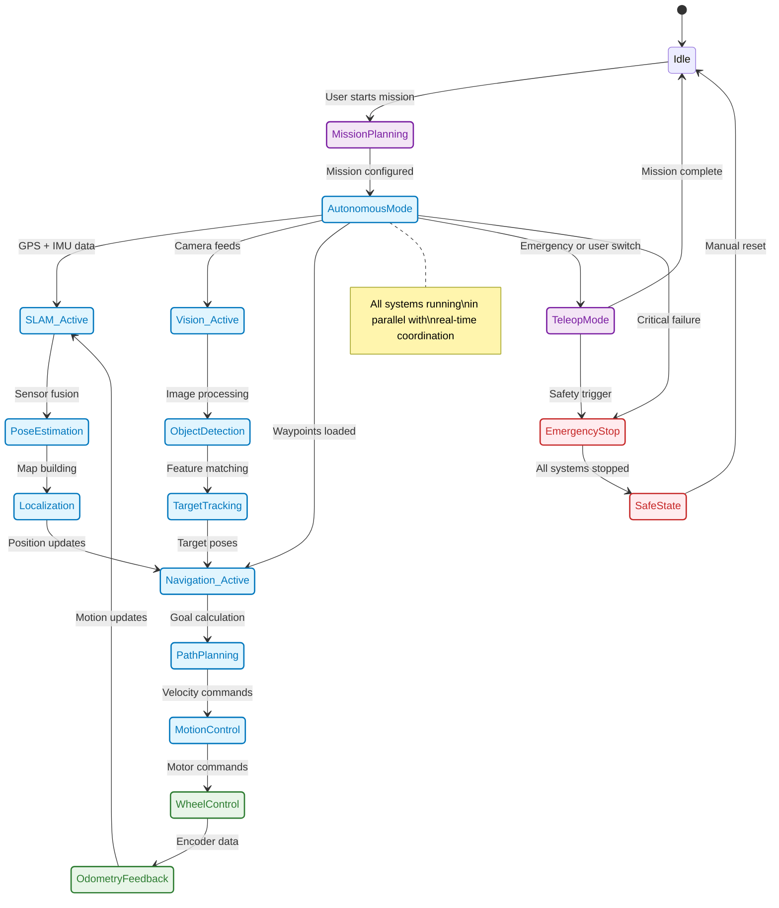
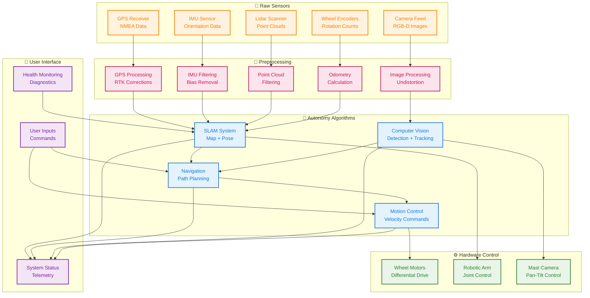
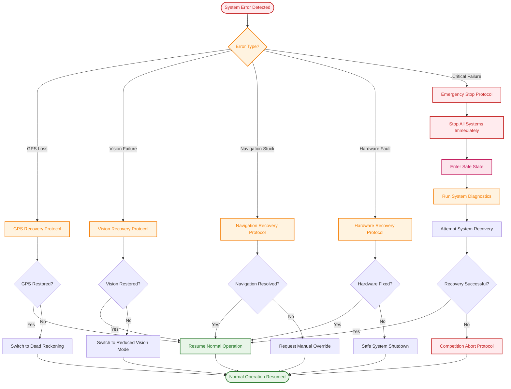
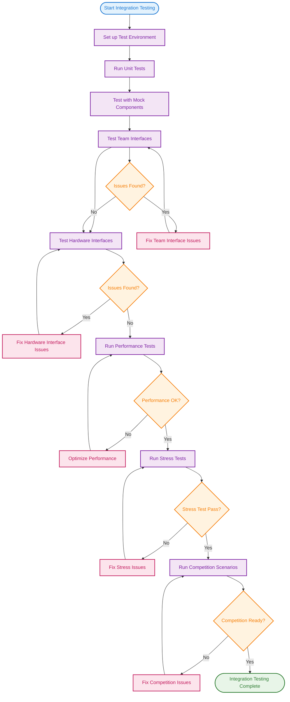
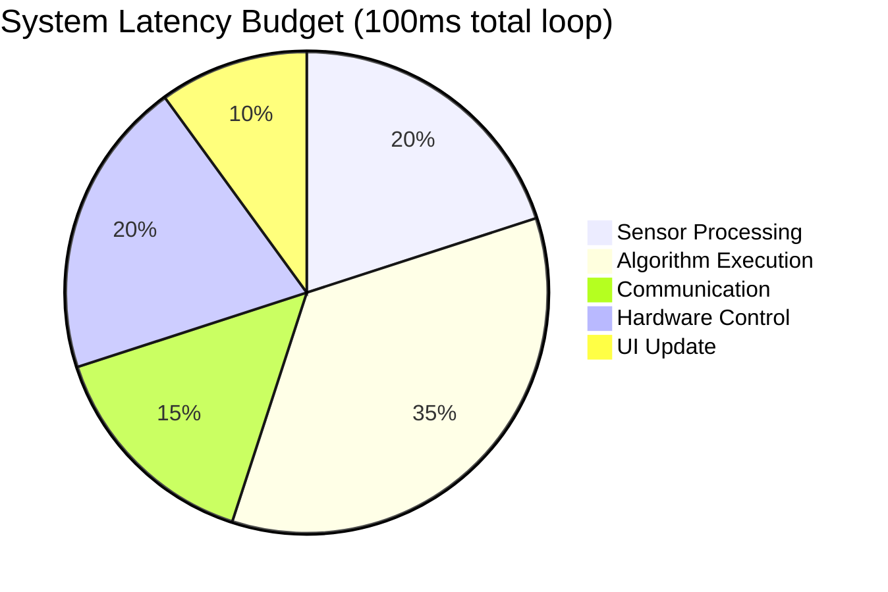

# Complete System Architecture: Multi-Pi + Microcontrollers

## Overview

Refined distributed architecture with microcontroller integration:

```
┌─────────────────────┐    ┌──────────────────┐    ┌─────────────────────┐
│   Control Pi        │    │  Autonomy Pi     │    │   Microcontrollers   │
│ (User Interface +   │◄──►│ (Autonomy Logic) │◄──►│ (Hardware Control)   │
│  System Integration)│    │                  │    │                     │
│                     │    │ • SLAM           │    │ • Wheel Motors      │
│ • User Controls     │    │ • Path Planning  │    │ • Robotic Arm       │
│ • System Status     │    │ • Computer Vision│    │ • Mast Camera       │
│ • Mission Config    │    │ • GPS Processing │    │ • Sensor Hub        │
│ • State Management  │    │                  │    │                     │
└─────────────────────┘    └──────────────────┘    └─────────────────────┘
          │                           │                           │
          └────────────────── ROS2 Network ───────────────────────┘
```

---

## 🎨 **Diagram Theme Compatibility**

**✅ All mermaid diagrams in this document are optimized for both light and dark modes:**

### **Color Scheme Legend:**
- 🔵 **Blue** (`#1976d2`, `#0277bd`): Navigation, control systems, user interfaces
- 🟣 **Purple** (`#7b1fa2`): Autonomy algorithms, processing systems
- 🟢 **Green** (`#2e7d32`): Hardware control, microcontrollers, success states
- 🔴 **Red** (`#c62828`): Error states, emergency systems
- 🟠 **Orange** (`#f57c00`): Sensor data, recovery processes, testing
- 🩷 **Pink** (`#c2185b`): Preprocessing, intermediate processing

**High-contrast borders ensure readability in all themes. Gantt and pie charts use automatic colors for optimal readability.**

---

## 🎯 Component Responsibilities

### **Control Pi (User Interface + System Integration)**

#### **User Interface Layer**
- **Input Devices**: Joystick, keyboard, touchscreen
- **Display Systems**: Status screens, camera feeds, telemetry
- **Control Logic**: Manual teleoperation, emergency controls
- **Mission Planning**: Waypoint setup, route configuration

#### **System Integration Layer**
- **State Management**: Overall system state coordination
- **Resource Allocation**: Power management, thermal monitoring
- **Failure Handling**: System-level fault detection and recovery
- **Data Logging**: Mission data recording and analysis

#### **Communication Hub**
- **ROS2 Master**: Network coordination and discovery
- **Message Routing**: Data flow between all components
- **Parameter Server**: System-wide configuration management
- **Time Synchronization**: NTP and ROS2 time coordination

### **Autonomy Pi (Pure Autonomy Algorithms)**

#### **Core Autonomy Systems**
- **SLAM**: Real-time localization and mapping
- **Path Planning**: Global and local path optimization
- **Computer Vision**: Object detection, ArUco tracking, terrain analysis
- **Navigation**: Waypoint following, obstacle avoidance
- **GPS Processing**: RTK positioning and heading calculation

#### **Sensor Integration**
- **GPS/IMU**: Primary positioning and orientation
- **Cameras**: Vision processing inputs
- **Lidar**: Mapping and obstacle detection
- **Environmental Sensors**: Temperature, dust, etc.

#### **Autonomy Execution**
- **Mission Control**: Autonomous task sequencing
- **Behavior Selection**: Context-aware decision making
- **Performance Monitoring**: Algorithm health and accuracy tracking

### **Microcontrollers (Hardware Control)**

#### **Wheel Control Unit**
- **Motor Drivers**: PWM control for wheel motors
- **Encoder Feedback**: Wheel speed and distance measurement
- **Differential Drive**: Left/right wheel coordination
- **Emergency Braking**: Rapid motor shutdown capability

#### **Robotic Arm Controller**
- **Joint Control**: Multi-axis servo/stepper control
- **Force Sensing**: Pressure and torque feedback
- **Precision Positioning**: Sub-millimeter accuracy
- **Safety Interlocks**: Collision detection and prevention

#### **Mast Camera Controller**
- **Pan-Tilt Control**: 360° rotation, elevation adjustment
- **Stabilization**: Vibration compensation
- **Position Feedback**: Encoder-based angle reporting
- **Power Management**: Camera power cycling and monitoring

#### **Sensor Hub Controller**
- **Analog Sensors**: Temperature, current, voltage monitoring
- **Digital Sensors**: GPIO-based device control
- **Data Aggregation**: Multi-sensor data collection
- **Pre-processing**: Basic filtering and validation

---

## 📍 GPS Placement Decision: Autonomy Pi

### **✅ GPS on Autonomy Pi (Recommended)**

#### **Technical Reasons**
1. **Latency Critical**: Navigation algorithms need GPS data with minimal delay
2. **Processing Integration**: GPS data directly feeds SLAM and navigation
3. **Accuracy Requirements**: RTK processing needs dedicated compute resources
4. **Algorithm Coupling**: GPS corrections directly affect pose estimation

#### **System Architecture Benefits**
1. **Autonomy Independence**: Autonomy Pi can operate with GPS-only positioning
2. **Reduced Network Load**: No need to stream high-frequency GPS data
3. **Local Processing**: GPS corrections happen close to navigation algorithms
4. **Failure Isolation**: GPS failure affects autonomy but not controls

#### **Implementation**
```python
# Autonomy Pi: Direct GPS integration
class GPSProcessor(Node):
    def __init__(self):
        self.serial_port = serial.Serial('/dev/ttyUSB0', 115200)
        self.gps_publisher = self.create_publisher(NavSatFix, 'gps/fix', 10)
        self.heading_publisher = self.create_publisher(Float64, 'gps/heading', 10)

        # RTK processing
        self.rtk_processor = RTKProcessor()

    def process_gps_data(self, nmea_data):
        # Process RTK corrections locally
        position = self.rtk_processor.process(nmea_data)

        # Publish for autonomy algorithms
        msg = NavSatFix()
        msg.latitude = position.lat
        msg.longitude = position.lon
        self.gps_publisher.publish(msg)

        # Also publish for control Pi if needed
        # (lower frequency, filtered data)
```

### **Control Pi GPS Access**
```python
# Control Pi can subscribe to GPS data if needed
class GPSDisplay(Node):
    def __init__(self):
        self.gps_subscription = self.create_subscription(
            NavSatFix, 'gps/fix', self.gps_callback, 1)  # Low frequency

    def gps_callback(self, msg):
        # Update user display with position
        self.update_map_display(msg.latitude, msg.longitude)
```

---

## 🔄 Communication Architecture

### **ROS2 Network Topology**

#### **Primary Communication Channels**
```
Control Pi ↔ Autonomy Pi: Mission commands, status reports
Control Pi ↔ Microcontrollers: Hardware control commands
Autonomy Pi ↔ Microcontrollers: Sensor data, actuator commands
All Components: System-wide broadcasts (emergency stop, etc.)
```

#### **Data Flow Patterns**

**Mission Execution:**
```
User Input → Control Pi → Mission Command → Autonomy Pi → Task Planning →
Subtasks → Microcontrollers → Hardware Actions → Sensor Feedback → Autonomy Pi →
Status Updates → Control Pi → User Display
```

**Emergency Stop:**
```
Any Component → Emergency Topic → All Components → Immediate Safety Actions
```

### **Microcontroller Integration**

#### **Communication Protocols**
- **ROS2 Serial Bridge**: Microcontrollers appear as ROS2 nodes
- **Custom Serial Protocol**: Lightweight binary protocol for real-time control
- **I2C/SPI**: Direct hardware interfaces for sensors
- **PWM Signals**: Motor and servo control

#### **Example: Wheel Controller**
```python
# Microcontroller firmware (Arduino/Raspberry Pi Pico)
void setup() {
    // Motor control pins
    pinMode(LEFT_MOTOR_PWM, OUTPUT);
    pinMode(RIGHT_MOTOR_PWM, OUTPUT);

    // Encoder inputs
    pinMode(LEFT_ENCODER_A, INPUT);
    pinMode(RIGHT_ENCODER_A, INPUT);

    // ROS2 serial communication
    Serial.begin(115200);
}

void loop() {
    // Read ROS2 commands
    if (Serial.available()) {
        String command = Serial.readStringUntil('\n');
        parseAndExecuteCommand(command);
    }

    // Send encoder feedback
    sendEncoderData();

    // Motor control loop
    updateMotorSpeeds();
}
```

#### **ROS2 Integration on Main Pi**
```python
# Control/Autonomy Pi: ROS2 node for microcontroller communication
class WheelController(Node):
    def __init__(self):
        # Serial communication with microcontroller
        self.serial_port = serial.Serial('/dev/ttyACM0', 115200)

        # ROS2 interfaces
        self.cmd_vel_sub = self.create_subscription(
            Twist, 'cmd_vel', self.velocity_callback, 10)

        self.wheel_odom_pub = self.create_publisher(
            Odometry, 'wheel/odom', 10)

    def velocity_callback(self, msg):
        # Send velocity commands to microcontroller
        command = f"VEL {msg.linear.x} {msg.angular.z}\n"
        self.serial_port.write(command.encode())
```

---

## 🏗️ Hardware Distribution Strategy

### **Autonomy Pi Hardware Focus**
- **Compute Intensive**: SLAM, computer vision, path planning
- **Sensor Rich**: GPS, IMU, cameras, lidar
- **Real-time Requirements**: Navigation control loops
- **Data Processing**: Algorithm execution and optimization

### **Control Pi Hardware Focus**
- **User Interface**: Displays, controls, feedback systems
- **System Monitoring**: Health checks, logging, diagnostics
- **Coordination**: Message routing, state management
- **External Interfaces**: Network, user devices

### **Microcontroller Hardware Focus**
- **Real-time Control**: Motor control, sensor reading
- **Safety Critical**: Emergency stops, limit switches
- **Power Efficient**: Low-power operation for actuators
- **Reliable**: Industrial-grade reliability for hardware control

---

## 🔄 Theoretical System Flow Diagrams

### **Complete Robot Operation Flow**


### **Data Processing Pipeline**


### **Competition Mission Sequence**
```mermaid
sequenceDiagram
    participant U as 👤 User
    participant C as 🎮 Control Pi
    participant A as 🤖 Autonomy Pi
    participant M as 🔧 Microcontrollers

    Note over U,M: Competition Mission Start

    U->>C: Start Mission Command
    C->>A: /mission_start (Trigger)
    A->>A: Initialize SLAM & Navigation

    A->>C: /mission_status = "pre_mission"
    A->>C: /autonomy_health (System ready)

    U->>C: Configure Waypoints
    C->>A: /configure_mission (Service call)
    A->>C: Mission configured response

    U->>C: Execute Mission
    C->>A: /waypoint_goal (First waypoint)

    loop Mission Execution
        A->>A: Plan path to waypoint
        A->>M: /cmd_vel (Velocity commands)
        M->>A: /wheel/odom (Odometry feedback)
        A->>C: /navigation_status (Progress updates)
        A->>C: /slam_pose (Position updates)
    end

    A->>C: /navigation_status = "arrived"
    A->>A: Waypoint reached, advance to next

    Note over A,C: Continue for all waypoints

    A->>C: /mission_status = "equipment_servicing"
    A->>A: Switch to typing mode
    A->>C: /typing_target (Keyboard location)

    A->>M: /arm/joint_command (Arm movements)
    A->>C: /typing_result (Completion status)

    A->>C: /mission_status = "completed"
    C->>U: Mission Success Display

    Note over U,M: Mission Complete

    classDef user fill:#e3f2fd,stroke:#1976d2,stroke-width:2px,color:#1976d2
    classDef control_pi fill:#f3e5f5,stroke:#7b1fa2,stroke-width:2px,color:#7b1fa2
    classDef autonomy_pi fill:#e1f5fe,stroke:#0277bd,stroke-width:2px,color:#0277bd
    classDef microcontrollers fill:#e8f5e8,stroke:#2e7d32,stroke-width:2px,color:#2e7d32

    class U user
    class C control_pi
    class A autonomy_pi
    class M microcontrollers
```

### **Error Handling & Recovery Flow**


### **Integration Testing Workflow**


---

## 📊 Performance & Timing Requirements

### **Control Loop Timing**

```mermaid
gantt
    title Control Loop Timing Requirements
    dateFormat HH:mm:ss
    axisFormat %M:%S

    section Navigation Control
    GPS Update          :done,  gps1, 10:00:00, 10:00:01
    Pose Estimation     :done,  pose1, after gps1, 10:00:005
    Path Planning       :done,  path1, after pose1, 10:00:050
    Velocity Commands   :done,  vel1, after path1, 10:00:010

    section Hardware Control
    Command Reception   :done,  cmd1, after vel1, 10:00:005
    Motor Control       :done,  motor1, after cmd1, 10:00:020
    Encoder Feedback    :done,  enc1, after motor1, 10:00:010

    section System Update
    Status Publication  :done,  status1, after enc1, 10:00:005
    UI Update          :done,  ui1, after status1, 10:00:015
```


### **System Latency Budget**


*Note: Gantt and pie charts have limited theme customization in current Mermaid versions. Colors are automatically chosen for readability.*

---

## 🎯 Theoretical Operation Summary

The system operates as a **distributed real-time robotic control architecture** with:

1. **Hierarchical Control**: User → System Coordination → Autonomy → Hardware
2. **Parallel Processing**: Multiple algorithms running simultaneously
3. **Real-time Constraints**: Sub-100ms control loops for stability
4. **Fault Tolerance**: Graceful degradation under failure conditions
5. **Modular Design**: Clean interfaces between functional domains

**This architecture enables autonomous desert rover operation with human oversight and emergency intervention capabilities.** 🏜️🤖

---

## 🔧 Implementation Benefits

### **Performance Optimization**
- **Distributed Computing**: Heavy algorithms on autonomy Pi, controls on control Pi
- **Real-time Control**: Microcontrollers handle time-critical hardware control
- **Load Balancing**: Computation distributed across multiple processors

### **Reliability & Safety**
- **Redundant Systems**: Multiple Pis provide failover capabilities
- **Isolated Failures**: Component failures contained to individual systems
- **Safety Layers**: Microcontrollers provide hardware-level safety interlocks

### **Development & Maintenance**
- **Team Specialization**: Different teams focus on different aspects
- **Independent Updates**: Components can be updated without affecting others
- **Modular Testing**: Each component testable in isolation

### **Scalability**
- **Easy Expansion**: Add more microcontrollers for additional hardware
- **Performance Scaling**: Upgrade individual components as needed
- **Technology Migration**: Replace components without system redesign

---

## 📋 GPS Placement: Final Recommendation

**GPS belongs on the Autonomy Pi** because:

1. **Algorithm Dependency**: Navigation and SLAM algorithms require direct GPS access
2. **Latency Sensitivity**: Real-time positioning data needed for control loops
3. **Processing Integration**: RTK corrections work best close to navigation code
4. **System Autonomy**: GPS enables independent operation of autonomy systems

**Control Pi can access GPS data via ROS2 topics** for user display and logging, but the primary GPS processing and correction happens on the autonomy Pi.

**This architecture maximizes performance and reliability for your competition robot!** 🚀
