# 🎛️ **PID Control Systems in URC 2026 Autonomy Subsystems**

This document outlines the PID control systems required for each subsystem in the URC 2026 autonomy rover.

## 🎨 **Diagram Theme Compatibility**

The mermaid diagrams use carefully selected colors that work well in both **light and dark modes**:

### **🎨 Universal Color Scheme:**
- 🔵 **Blue** (`#4a90e2`, `#3498db`): Navigation, coordination, control systems
- 🟢 **Green** (`#27ae60`, `#229954`): SLAM, sensor fusion, localization
- 🟣 **Purple** (`#9b59b6`, `#8e44ad`): Computer vision, processing systems
- 🔴 **Red** (`#e74c3c`, `#c0392b`): Actuators, critical systems, arm control
- 🟠 **Orange** (`#f39c12`, `#e67e22`): State management, control algorithms

**✅ All colors are optimized for both light and dark themes with high-contrast borders.**

### **Theme-Aware Features:**
- **High contrast borders** (`stroke-width:2px`) for visibility in both themes
- **Consistent color families** that maintain readability
- **Class-based styling** for easy customization
- **Accessible color combinations** following WCAG guidelines

### **Custom CSS (Optional):**
```css
/* For web rendering with better theme support */
.dark-mode .mermaid {
  --mermaid-bg: #1e1e1e;
  --mermaid-text: #ffffff;
}

.light-mode .mermaid {
  --mermaid-bg: #ffffff;
  --mermaid-text: #000000;
}
```

---

## 🧭 **Navigation Subsystem - PID Control Architecture**

```mermaid
graph TD
    subgraph "🎯 Navigation Control Hierarchy"
        WP[Waypoint<br/>Target] --> PP[Path<br/>Planner]
        PP --> MPC[Motion<br/>Controller]

        subgraph "PID Controllers"
            MPC --> LVC[Linear Velocity<br/>PID Controller<br/>Kp=1.0, Ki=0.1, Kd=0.05]
            MPC --> AVC[Angular Velocity<br/>PID Controller<br/>Kp=2.0, Ki=0.2, Kd=0.1]
            MPC --> HC[Heading<br/>PID Controller<br/>Kp=3.0, Ki=0.0, Kd=0.2]
        end

        subgraph "Control Outputs"
            LVC --> CMD_VEL[cmd_vel<br/>Linear Velocity]
            AVC --> CMD_VEL
            HC --> CMD_VEL
        end

        subgraph "Feedback Loops"
            CMD_VEL --> WHEELS[Wheel<br/>Motors]
            WHEELS --> ODOM[Odometry<br/>Feedback]
            ODOM --> MPC
            IMU[IMU Data] --> HC
            GPS[GPS Data] --> MPC
        end
    end

    classDef pidController fill:#e3f2fd,stroke:#1976d2,stroke-width:2px,color:#1976d2
    classDef motionController fill:#fff8e1,stroke:#f57c00,stroke-width:2px,color:#f57c00

    class LVC pidController
    class AVC pidController
    class HC pidController
    class MPC motionController
```



### **Navigation PID Controllers Details:**

1. **Linear Velocity PID** (Primary motion control)
   - **Input**: Path following error (distance to desired path)
   - **Output**: Linear velocity command (m/s)
   - **Tuning**: Kp=1.0 (responsive), Ki=0.1 (eliminate steady-state), Kd=0.05 (damping)

2. **Angular Velocity PID** (Turning control)
   - **Input**: Heading error to next waypoint
   - **Output**: Angular velocity command (rad/s)
   - **Tuning**: Kp=2.0 (aggressive turning), Ki=0.2 (steady turning), Kd=0.1 (smooth turns)

3. **Heading PID** (Orientation stabilization)
   - **Input**: IMU heading vs desired heading
   - **Output**: Heading correction term
   - **Tuning**: Kp=3.0 (quick correction), Ki=0.0 (no integral), Kd=0.2 (stability)

---

## 🗺️ **SLAM Subsystem - PID Control Architecture**

```mermaid
graph TD
    subgraph "📊 SLAM Control Systems"
        subgraph "Sensor Fusion PID"
            IMU_BIAS[IMU Bias<br/>PID Controller<br/>Kp=0.1, Ki=0.01, Kd=0.0] --> FUSION[Sensor<br/>Fusion]
            GPS_CORR[GPS Correction<br/>PID Controller<br/>Kp=0.05, Ki=0.0, Kd=0.0] --> FUSION
        end

        subgraph "Pose Stabilization PID"
            POSE_STAB[Pose Stability<br/>PID Controller<br/>Kp=0.8, Ki=0.05, Kd=0.1] --> LOCALIZATION[Localization<br/>Engine]
        end

        subgraph "Inputs"
            IMU_RAW[IMU Raw Data] --> IMU_BIAS
            GPS_RAW[GPS Raw Data] --> GPS_CORR
            WHEEL_ODOM[Wheel Odometry] --> FUSION
            LIDAR_DATA[Lidar Data] --> FUSION
        end

        subgraph "Outputs"
            FUSION --> POSE_EST[Pose Estimate]
            LOCALIZATION --> POSE_EST
            POSE_EST --> TF[TF Transform<br/>map→base_link]
            POSE_EST --> STATE_MGMT[State<br/>Management]
        end
    end

    classDef sensorFusion fill:#e8f5e8,stroke:#2e7d32,stroke-width:2px,color:#2e7d32
    classDef localization fill:#fff8e1,stroke:#f57c00,stroke-width:2px,color:#f57c00

    class IMU_BIAS,GPS_CORR,POSE_STAB sensorFusion
    class FUSION,LOCALIZATION localization
```



### **SLAM PID Controllers Details:**

1. **IMU Bias PID** (Drift correction)
   - **Input**: IMU bias estimation error
   - **Output**: Bias correction factor
   - **Tuning**: Kp=0.1 (gentle correction), Ki=0.01 (slow accumulation), Kd=0.0 (no derivative)

2. **GPS Correction PID** (Position correction)
   - **Input**: GPS vs odometry position difference
   - **Output**: Position correction weight
   - **Tuning**: Kp=0.05 (conservative), Ki=0.0 (no integral), Kd=0.0 (no derivative)

3. **Pose Stability PID** (Localization smoothing)
   - **Input**: Pose estimate jitter/variation
   - **Output**: Pose smoothing factor
   - **Tuning**: Kp=0.8 (responsive), Ki=0.05 (steady), Kd=0.1 (damping)

---

## 👁️ **Computer Vision Subsystem - PID Control Architecture**

```mermaid
graph TD
    subgraph "📷 Vision Control Systems"
        subgraph "Camera Stabilization PID"
            PAN_PID[Pan Control<br/>PID Controller<br/>Kp=1.5, Ki=0.1, Kd=0.2] --> GIMBAL[Gimbal<br/>Actuators]
            TILT_PID[Tilt Control<br/>PID Controller<br/>Kp=1.5, Ki=0.1, Kd=0.2] --> GIMBAL
        end

        subgraph "Object Tracking PID"
            TRACK_PID[Tracking Control<br/>PID Controller<br/>Kp=2.0, Ki=0.0, Kd=0.5] --> SERVO[Servo<br/>Motors]
        end

        subgraph "Inputs"
            IMU_STAB[IMU Stabilization<br/>Target] --> PAN_PID
            IMU_STAB --> TILT_PID
            OBJECT_POS[Object Position<br/>Error] --> TRACK_PID
            DESIRED_POSE[Desired Camera<br/>Pose] --> PAN_PID
            DESIRED_POSE --> TILT_PID
        end

        subgraph "Outputs"
            GIMBAL --> CAMERA_FEED[Stabilized<br/>Camera Feed]
            SERVO --> TRACKING[Object<br/>Tracking]
            CAMERA_FEED --> PROCESSING[Vision<br/>Processing]
            TRACKING --> PROCESSING
        end
    end

    classDef cameraControl fill:#f3e5f5,stroke:#7b1fa2,stroke-width:2px,color:#7b1fa2

    class PAN_PID,TILT_PID,TRACK_PID cameraControl
```



### **Computer Vision PID Controllers Details:**

1. **Pan Control PID** (Horizontal stabilization)
   - **Input**: IMU angular rate + desired pan angle
   - **Output**: Pan servo command
   - **Tuning**: Kp=1.5 (responsive), Ki=0.1 (steady), Kd=0.2 (damping)

2. **Tilt Control PID** (Vertical stabilization)
   - **Input**: IMU angular rate + desired tilt angle
   - **Output**: Tilt servo command
   - **Tuning**: Kp=1.5 (responsive), Ki=0.1 (steady), Kd=0.2 (damping)

3. **Tracking Control PID** (Object following)
   - **Input**: Object position error in frame
   - **Output**: Tracking correction commands
   - **Tuning**: Kp=2.0 (aggressive), Ki=0.0 (no integral), Kd=0.5 (predictive)

---

## ⌨️ **Autonomous Typing Subsystem - PID Control Architecture**

```mermaid
graph TD
    subgraph "🤖 Arm Control Hierarchy"
        TRAJ_PLAN[Trajectory<br/>Planner] --> JOINT_CTRL[Joint<br/>Controllers]

        subgraph "Joint PID Controllers (6-DOF)"
            J1_PID[Joint 1<br/>PID Controller<br/>Kp=5.0, Ki=0.5, Kd=0.2] --> JOINT_CMD[Joint<br/>Commands]
            J2_PID[Joint 2<br/>PID Controller<br/>Kp=4.0, Ki=0.4, Kd=0.3] --> JOINT_CMD
            J3_PID[Joint 3<br/>PID Controller<br/>Kp=6.0, Ki=0.6, Kd=0.1] --> JOINT_CMD
            J4_PID[Joint 4<br/>PID Controller<br/>Kp=3.0, Ki=0.3, Kd=0.4] --> JOINT_CMD
            J5_PID[Joint 5<br/>PID Controller<br/>Kp=4.5, Ki=0.45, Kd=0.25] --> JOINT_CMD
            J6_PID[Joint 6<br/>PID Controller<br/>Kp=5.5, Ki=0.55, Kd=0.15] --> JOINT_CMD
        end

        subgraph "Force Control PID"
            FORCE_PID[Force Control<br/>PID Controller<br/>Kp=2.0, Ki=0.1, Kd=0.3] --> FORCE_CMD[Force<br/>Commands]
        end

        subgraph "Inputs"
            TARGET_POSE[Target End-<br/>Effector Pose] --> TRAJ_PLAN
            JOINT_STATES[Joint States<br/>Feedback] --> JOINT_CTRL
            FORCE_SENSOR[Force/Torque<br/>Sensor] --> FORCE_PID
            KEYBOARD_POSE[Keyboard Pose<br/>from Vision] --> TRAJ_PLAN
        end

        subgraph "Outputs"
            JOINT_CMD --> ARM_MOTORS[Arm<br/>Motors]
            FORCE_CMD --> GRIPPER[Gripper/<br/>End-Effector]
            ARM_MOTORS --> JOINT_STATES
            GRIPPER --> FORCE_SENSOR
        end
    end

    classDef jointControl fill:#ffebee,stroke:#c62828,stroke-width:2px,color:#c62828
    classDef forceControl fill:#ffcdd2,stroke:#d32f2f,stroke-width:2px,color:#d32f2f

    class J1_PID,J2_PID,J3_PID,J4_PID,J5_PID,J6_PID jointControl
    class FORCE_PID forceControl
```



### **Autonomous Typing PID Controllers Details:**

1. **Joint Position PIDs** (6 controllers for 6-DOF arm)
   - **Input**: Joint position error (desired vs actual)
   - **Output**: Joint torque/velocity commands
   - **Tuning**: Varies by joint (shoulder: Kp=5.0, elbow: Kp=6.0, wrist: Kp=3.0)

2. **Force Control PID** (Key pressing control)
   - **Input**: Force sensor error (desired pressure vs actual)
   - **Output**: End-effector force commands
   - **Tuning**: Kp=2.0 (firm contact), Ki=0.1 (steady pressure), Kd=0.3 (gentle approach)

---

## 🎛️ **State Management Subsystem - PID Coordination**

```mermaid
graph TD
    subgraph "🎯 State Management PID Oversight"
        MISSION_CTRL[Mission<br/>Controller] --> PID_MONITOR[PID Health<br/>Monitor]

        subgraph "PID Status Tracking"
            NAV_PID_STATUS[Navigation PID<br/>Status] --> PID_MONITOR
            ARM_PID_STATUS[Arm PID<br/>Status] --> PID_MONITOR
            SLAM_PID_STATUS[SLAM PID<br/>Status] --> PID_MONITOR
            VISION_PID_STATUS[Vision PID<br/>Status] --> PID_MONITOR
        end

        subgraph "PID Tuning Interface"
            TUNING_SRV[PID Tuning<br/>Service] --> NAV_PID[Navigation<br/>PIDs]
            TUNING_SRV --> ARM_PID[Arm<br/>PIDs]
            TUNING_SRV --> SLAM_PID[SLAM<br/>PIDs]
            TUNING_SRV --> VISION_PID[Vision<br/>PIDs]
        end

        subgraph "Emergency PID Control"
            EMERGENCY[Emergency<br/>Handler] --> PID_RESET[PID Reset<br/>Commands]
            EMERGENCY --> PID_FREEZE[PID Freeze<br/>Commands]
            PID_RESET --> ALL_PID[All Subsystem<br/>PIDs]
            PID_FREEZE --> ALL_PID
        end

        subgraph "Outputs"
            PID_MONITOR --> HEALTH_STATUS[System Health<br/>Status]
            HEALTH_STATUS --> MISSION_DECISIONS[Mission<br/>Decisions]
        end
    end

    classDef coordination fill:#e3f2fd,stroke:#1976d2,stroke-width:2px,color:#1976d2

    class PID_MONITOR,TUNING_SRV coordination
```



### **State Management PID Coordination:**

1. **PID Health Monitor** (System supervision)
   - **Input**: PID performance metrics from all subsystems
   - **Output**: System health assessment
   - **Function**: Detects PID saturation, oscillation, or failure

2. **PID Tuning Service** (Runtime adjustment)
   - **Input**: Tuning commands from operators
   - **Output**: Updated PID gains to subsystems
   - **Function**: Allows field tuning without code changes

3. **Emergency PID Control** (Safety overrides)
   - **Input**: Emergency conditions
   - **Output**: PID freeze/reset commands
   - **Function**: Safe system shutdown during failures

---

## 💡 **LED Status Subsystem - Basic Control**

```mermaid
graph TD
    subgraph "🔴 LED Control System"
        STATE_DECODER[State<br/>Decoder] --> LED_CONTROLLER[LED<br/>Controller]

        subgraph "LED State Logic"
            AUTONOMOUS[Autonomous<br/>Mode] --> RED_LED[Red LED<br/>Solid]
            TELEOP[Teleoperation<br/>Mode] --> BLUE_LED[Blue LED<br/>Solid]
            SUCCESS[Waypoint<br/>Reached] --> FLASH_GREEN[Green LED<br/>Flashing<br/>1Hz]
            IDLE[Idle<br/>State] --> LED_OFF[All LEDs<br/>Off]
        end

        subgraph "PWM Control (Optional)"
            PWM_GEN[PWM<br/>Generator<br/>Kp=1.0, Ki=0.0, Kd=0.0] --> BRIGHTNESS[LED<br/>Brightness]
        end

        subgraph "Hardware Interface"
            LED_CONTROLLER --> GPIO_DRIVER[GPIO<br/>Driver]
            GPIO_DRIVER --> LED_HARDWARE[LED<br/>Hardware]
            PWM_GEN --> GPIO_DRIVER
        end

        subgraph "Inputs"
            SYSTEM_MODE[System Mode<br/>from State Mgmt] --> STATE_DECODER
            MISSION_STATUS[Mission Status<br/>from State Mgmt] --> STATE_DECODER
            BRIGHTNESS_CMD[Brightness<br/>Command] --> PWM_GEN
        end
    end

    classDef ledRed fill:#ffcdd2,stroke:#d32f2f,stroke-width:2px,color:#d32f2f
    classDef ledBlue fill:#bbdefb,stroke:#1976d2,stroke-width:2px,color:#1976d2
    classDef ledGreen fill:#c8e6c9,stroke:#388e3c,stroke-width:2px,color:#388e3c
    classDef pwmControl fill:#f3e5f5,stroke:#7b1fa2,stroke-width:2px,color:#7b1fa2

    class RED_LED ledRed
    class BLUE_LED ledBlue
    class FLASH_GREEN ledGreen
    class PWM_GEN pwmControl
```



### **LED Control Details:**

1. **State-Based Control** (Primary control method)
   - **Input**: System mode and mission status
   - **Output**: LED color and pattern commands
   - **Logic**: Direct mapping (no PID needed for basic on/off)

2. **PWM Brightness Control** (Optional enhancement)
   - **Input**: Desired brightness level
   - **Output**: PWM duty cycle for LED brightness
   - **Tuning**: Simple proportional control (Kp=1.0)

---

## 📊 **PID System Summary Table**

| Subsystem | PID Controllers | Primary Function | Criticality |
|-----------|----------------|------------------|-------------|
| **Navigation** | 3 (Linear Vel, Angular Vel, Heading) | Motion control for autonomous navigation | 🔴 Critical |
| **SLAM** | 3 (IMU Bias, GPS Correction, Pose Stability) | Sensor fusion and localization stability | 🟡 High |
| **Computer Vision** | 3 (Pan, Tilt, Tracking) | Camera stabilization and object tracking | 🟡 Medium |
| **Autonomous Typing** | 7 (6 Joints + Force) | Precise arm control for keyboard interaction | 🔴 Critical |
| **State Management** | 0 (Coordination only) | PID health monitoring and tuning | 🟢 Low |
| **LED Status** | 1 (Optional PWM) | LED brightness control | 🟢 Optional |

---

## 🎯 **Implementation Priority**

### **Phase 1: Critical PIDs (Must-Have)**
1. **Navigation Linear/Angular Velocity PIDs** - Core rover movement
2. **Arm Joint Position PIDs** - Essential for typing functionality
3. **Force Control PID** - Safe key pressing

### **Phase 2: Enhancement PIDs (Should-Have)**
1. **SLAM Pose Stability PID** - Improved localization
2. **IMU Bias Correction PID** - Better sensor fusion
3. **Camera Gimbal PIDs** - Stable vision (if hardware added)

### **Phase 3: Optional PIDs (Nice-to-Have)**
1. **LED PWM Control** - Smooth brightness transitions
2. **GPS Correction PID** - Enhanced positioning
3. **Advanced Force Control** - Sophisticated manipulation

---

## 🔧 **PID Implementation Template**

```python
class PIDController:
    """Generic PID controller with anti-windup and derivative filtering"""
    
    def __init__(self, kp=1.0, ki=0.0, kd=0.0, dt=0.1, 
                 integral_limit=10.0, derivative_filter=0.1):
        self.kp = kp
        self.ki = ki  
        self.kd = kd
        self.dt = dt
        
        # Anti-windup
        self.integral_limit = integral_limit
        
        # Derivative filtering
        self.derivative_filter = derivative_filter
        
        # State
        self.integral = 0.0
        self.prev_error = 0.0
        self.prev_derivative = 0.0
        
    def update(self, error):
        """Compute PID output"""
        # Proportional
        p_term = self.kp * error
        
        # Integral (with anti-windup)
        self.integral += error * self.dt
        self.integral = max(min(self.integral, self.integral_limit), 
                           -self.integral_limit)
        i_term = self.ki * self.integral
        
        # Derivative (with filtering)
        derivative = (error - self.prev_error) / self.dt
        filtered_derivative = (self.derivative_filter * derivative + 
                             (1 - self.derivative_filter) * self.prev_derivative)
        d_term = self.kd * filtered_derivative
        
        # Update state
        self.prev_error = error
        self.prev_derivative = filtered_derivative
        
        return p_term + i_term + d_term
    
    def reset(self):
        """Reset controller state"""
        self.integral = 0.0
        self.prev_error = 0.0
        self.prev_derivative = 0.0
```

This PID architecture provides the foundation for stable, responsive control across all autonomy subsystems. Each controller should be tuned for its specific application and environmental conditions.

---

## 💡 **Viewing Recommendations**

### **IDE Integration:**
- **VS Code**: Use "Markdown Preview Mermaid Support" extension
- **Cursor**: Built-in mermaid diagram support
- **Other IDEs**: Use online mermaid editors for preview

### **Theme Compatibility Testing:**
- **Light Mode**: Diagrams use soft, bright colors that are easy to read
- **Dark Mode**: High-contrast borders ensure visibility
- **Print**: Color schemes maintain readability in grayscale

### **Best Practices:**
- **Zoom**: Diagrams are optimized for 100-150% zoom levels
- **Resolution**: High-DPI displays show crisp borders and text
- **Color Blindness**: Color combinations follow accessibility guidelines

### **Export Options:**
- **PNG/SVG**: Export from mermaid.live for documentation
- **PDF**: Include in technical reports and presentations
- **Web**: Embed in dashboards with custom CSS themes

---

---

## 📚 **Related Documentation References**

### **Core Documentation Tree**
This document is part of the comprehensive URC 2026 documentation ecosystem:

#### **📖 Parent Documents:**
- **[`../overview/README.md`](../overview/README.md)** - Main documentation overview and navigation
- **[`../overview/SystemArchitecture.md`](../overview/SystemArchitecture.md)** - Complete system architecture with PID integration context
- **[`../overview/TechnicalOverview.md`](../overview/TechnicalOverview.md)** - Technical deep-dive including control systems

#### **🔗 Related Technical Documents:**
- **[`../overview/Robotics_Engineering_Concepts_Guide.md`](../overview/Robotics_Engineering_Concepts_Guide.md)** - Foundational robotics concepts including PID theory
- **[`../overview/InterfaceContract.md`](../overview/InterfaceContract.md)** - ROS2 interface specifications for PID control topics
- **[`../overview/DistributedArchitecture.md`](../overview/DistributedArchitecture.md)** - Multi-Pi architecture and PID distribution

#### **🎯 Subsystem-Specific References:**
- **[`code/navigation/navigation_TODO.md`](../../code/navigation/navigation_TODO.md)** - Navigation PID implementation roadmap
- **[`code/slam/slam_TODO.md`](../../code/slam/slam_TODO.md)** - SLAM PID controller specifications
- **[`code/computer_vision/computer_vision_TODO.md`](../../code/computer_vision/computer_vision_TODO.md)** - Vision PID requirements
- **[`code/autonomous_typing/autonomous_typing_TODO.md`](../../code/autonomous_typing/autonomous_typing_TODO.md)** - Arm control PID specifications
- **[`code/state_management/state_management_TODO.md`](../../code/state_management/state_management_TODO.md)** - PID coordination and monitoring
- **[`code/led_status/led_status_TODO.md`](../../code/led_status/led_status_TODO.md)** - LED control PID details

#### **🔧 Implementation References:**
- **[`../onboard/reference/SensorGuide.md`](../onboard/reference/SensorGuide.md)** - Sensor specifications for PID feedback
- **[`../onboard/reference/LibrariesGuide.md`](../onboard/reference/LibrariesGuide.md)** - Control libraries and PID implementations
- **[`../onboard/reference/CalibrationGuide.md`](../onboard/reference/CalibrationGuide.md)** - System calibration for PID tuning

#### **📋 Development Workflow:**
- **[`DevelopmentWorkflow.md`](DevelopmentWorkflow.md)** - Code vs ROS2 workspace development
- **[`../onboard/guides/DevelopmentPipeline.md`](../onboard/guides/DevelopmentPipeline.md)** - Development tools and PID testing
- **[`../onboard/LearningTracks.md`](../onboard/LearningTracks.md)** - Learning paths including PID control

### **📊 PID Integration in System Architecture**

```
docs/README.md (Main Overview)
├── docs/SystemArchitecture.md (Architecture Context)
│   └── docs/PID_Control_Diagrams.md (← You are here)
│       ├── docs/Robotics_Engineering_Concepts_Guide.md
│       ├── docs/InterfaceContract.md
│       └── docs/DistributedArchitecture.md
├── Subsystem Implementation
│   ├── code/[subsystem]/[subsystem]_TODO.md
│   └── docs/reference/ (Technical References)
└── docs/LearningTracks.md (Learning Context)
```

### **🔍 Quick Access Links**

| **Topic** | **Primary Reference** | **Secondary References** |
|-----------|----------------------|-------------------------|
| **PID Theory** | [`../overview/Robotics_Engineering_Concepts_Guide.md`](../overview/Robotics_Engineering_Concepts_Guide.md) | [`../onboard/reference/LibrariesGuide.md`](../onboard/reference/LibrariesGuide.md) |
| **ROS2 Integration** | [`../overview/InterfaceContract.md`](../overview/InterfaceContract.md) | [`../overview/SystemArchitecture.md`](../overview/SystemArchitecture.md) |
| **Navigation PID** | [`../../code/navigation/navigation_TODO.md`](../../code/navigation/navigation_TODO.md) | [`subsystems/navigation/`](../../subsystems/navigation/) |
| **SLAM PID** | [`../../code/slam/slam_TODO.md`](../../code/slam/slam_TODO.md) | [`subsystems/slam/`](../../subsystems/slam/) |
| **Vision PID** | [`../../code/computer_vision/computer_vision_TODO.md`](../../code/computer_vision/computer_vision_TODO.md) | [`subsystems/computer_vision/`](../../subsystems/computer_vision/) |
| **Arm PID** | [`../../code/autonomous_typing/autonomous_typing_TODO.md`](../../code/autonomous_typing/autonomous_typing_TODO.md) | [`subsystems/autonomous_typing/`](../../subsystems/autonomous_typing/) |
| **Testing PID** | [`../onboard/guides/DevelopmentPipeline.md`](../onboard/guides/DevelopmentPipeline.md) | [`../onboard/reference/CalibrationGuide.md`](../onboard/reference/CalibrationGuide.md) |

### **📈 Learning Progression**

**New to PID Control?** Follow this learning path:
1. **[`../overview/Robotics_Engineering_Concepts_Guide.md`](../overview/Robotics_Engineering_Concepts_Guide.md)** - PID theory fundamentals
2. **[`../onboard/reference/LibrariesGuide.md`](../onboard/reference/LibrariesGuide.md)** - PID implementation libraries
3. **This Document** - System-wide PID architecture
4. **Subsystem TODOs** - Specific PID implementations
5. **[`../onboard/guides/DevelopmentPipeline.md`](../onboard/guides/DevelopmentPipeline.md)** - PID testing and tuning

---

*These diagrams provide a comprehensive visual reference for implementing PID control systems across your URC 2026 autonomy rover, with colors optimized for both light and dark viewing environments.*
