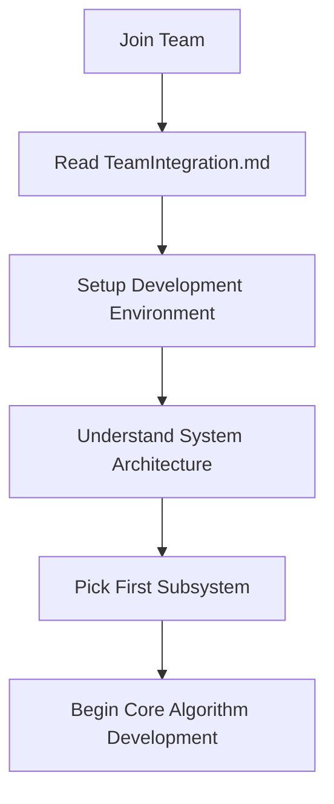
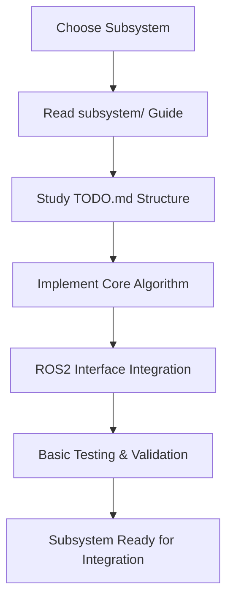
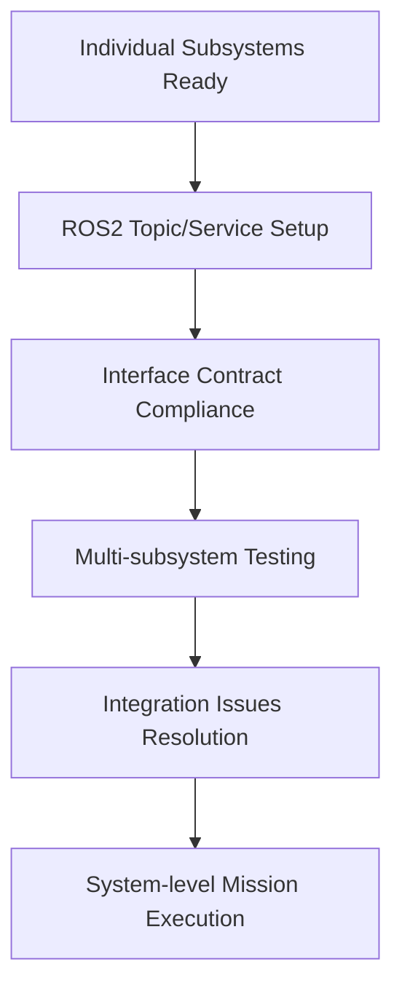
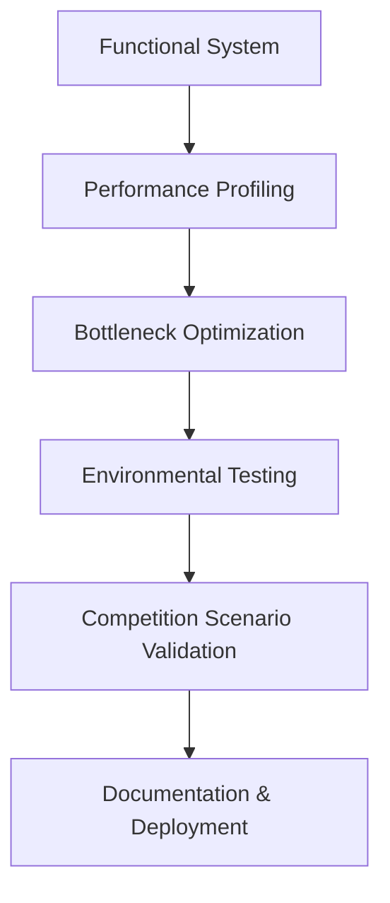

# Abstract Task Workflow: Autonomy Development Strategy

## Welcome to the Autonomy Team! 🤖

This handbook provides **high-level task workflows** with abstract understanding rather than granular implementation details. Focus on **conceptual flow** and **system-level thinking** - technical details are in the subsystem TODO.md files.

## ⚠️ **Competition Compliance Requirements**

All development must meet **URC 2026 Competition Rules**:

### **Mission 1.e: Equipment Servicing**
- **Autonomous Typing**: 3-6 letter launch codes with backspace/delete correction
- **ArUco Markers**: 2x2cm at keyboard corners, 1x1cm at USB slot corners
- **Operator Limits**: Intervention only for mode exit/abort/restart

### **Mission 1.f: Autonomous Navigation**
- **LED Status**: 🔴 Red (autonomous), 🔵 Blue (teleoperation), 🟢 Flashing Green (success)
- **7 Targets**: 2 GNSS (3m), 2 posts with 3-sided visual markers (20×20cm faces, 2.5cm cells, 2m), 3 objects (10m) - flexible order
- **C2 Display**: Highlight detected objects (one at a time)
- **Abort Penalty**: 20% reduction for teleoperation return

---

## 🎯 Task Strategy Overview

| **Task Phase** | **Focus** | **Key Outcome** | **Time** | **Dependencies** |
|----------------|-----------|-----------------|----------|------------------|
| **Foundation** | Environment & Infrastructure | Working dev environment | 1-2 days | None |
| **Core Algorithms** | SLAM, Navigation, Vision | Functional autonomy subsystems | 1-2 weeks | Foundation |
| **Integration** | System communication, testing | Coordinated multi-subsystem operation | 1 week | Core Algorithms |
| **Optimization** | Performance, reliability | Competition-ready system | 1-2 weeks | Integration |

---

## 🔄 High-Level Development Flow

### **Phase 1: Foundation Setup (Days 1-2)**
**Goal:** Establish development infrastructure and basic understanding

**Key Activities:**
- Docker environment setup
- ROS2 workspace configuration
- Basic node communication testing
- Subsystem selection based on interests

---

### **Phase 2: Core Algorithm Development (Weeks 1-2)**
**Goal:** Build functional autonomy capabilities

**Subsystem Parallel Development:**
- **Navigation**: Path planning + GPS fusion
- **SLAM**: Pose estimation + mapping
- **Computer Vision**: Object detection + tracking
- **Autonomous Typing**: Keyboard detection + manipulation
- **State Management**: Mission coordination + health monitoring
- **LED Status**: Visual signaling + GPIO control

---

### **Phase 3: System Integration (Week 3)**
**Goal:** Connect subsystems into working system

**Integration Activities:**
- Cross-subsystem communication verification
- Mission scenario testing
- Performance benchmarking
- Failure mode handling

---

### **Phase 4: Optimization & Competition Prep (Weeks 4-5)**
**Goal:** Competition-ready performance and reliability

**Final Activities:**
- Real-world testing conditions
- System reliability validation
- Competition procedure documentation
- Backup system preparation

---

## 📋 Quick Access to Detailed Tasks

**For granular implementation details, jump to subsystem TODO.md files:**

| **Subsystem** | **Subsystem TODO** | **Current Focus** |
|---------------|---------------------|-------------------|
| **Navigation** | [`../code/navigation/navigation_TODO.md`](../code/navigation/navigation_TODO.md) | Path planning algorithms, GPS integration |
| **SLAM** | [`../code/slam/slam_TODO.md`](../code/slam/slam_TODO.md) | Sensor fusion, pose estimation |
| **Computer Vision** | [`../code/computer_vision/computer_vision_TODO.md`](../code/computer_vision/computer_vision_TODO.md) | Object detection, ArUco tracking |
| **Autonomous Typing** | [`../code/autonomous_typing/autonomous_typing_TODO.md`](../code/autonomous_typing/autonomous_typing_TODO.md) | Keyboard interaction, arm control |
| **State Management** | [`../code/state_management/state_management_TODO.md`](../code/state_management/state_management_TODO.md) | Mission coordination, system health |
| **LED Status** | [`../code/led_status/led_status_TODO.md`](../code/led_status/led_status_TODO.md) | GPIO control, status signaling |

**Each TODO.md contains:**
- Detailed implementation requirements
- Step-by-step task breakdowns
- Technical specifications
- Testing procedures
- Integration checkpoints

---

## 📚 Recommended Reading Order

### **Phase 1: Getting Started (Day 1)**
1. **[QUICKSTART.md](../QUICKSTART.md)** - 5-minute environment setup
2. **[TeamIntegration.md](../onboard/TeamIntegration.md)** - Team boundaries and responsibilities
3. **[SystemArchitecture.md](../overview/SystemArchitecture.md)** - High-level system understanding
4. **Choose your subsystem** from the table above and read its TODO.md

### **Phase 2: Deep Dive (Ongoing)**
1. **Subsystem-specific documentation** in `subsystems/[subsystem]/`
2. **[InterfaceContract.md](../overview/InterfaceContract.md)** - ROS2 communication requirements
3. **[DevelopmentWorkflow.md](DevelopmentWorkflow.md)** - Code development process
4. **Reference docs** in `docs/reference/` as needed

### **Phase 3: Integration (Week 3+)**
1. **[TeamIntegration.md](../onboard/TeamIntegration.md)** - Cross-team coordination
2. **Testing procedures** in subsystem TODO.md files
3. **[ChartsOverview.md](../overview/ChartsOverview.md)** - System integration visualization

---

## 🎯 Key Principles for Task-Based Development

### **Abstract Thinking First**
- **Understand the "why"** before the "how"
- **Focus on system-level interactions** rather than implementation details
- **Plan for integration** from day one

### **Parallel Development Strategy**
- **6 subsystems develop simultaneously** (not sequentially)
- **ROS2 interfaces** ensure clean integration
- **Regular sync points** prevent divergence

### **Quality over Speed**
- **Test early, test often** - integration issues are expensive to fix
- **Document as you go** - future you will thank present you
- **Review before merge** - catch issues before they propagate

---

## 🚀 Success Patterns

**What successful team members do:**
- **Read the big picture docs first** (this handbook, TeamIntegration, SystemArchitecture)
- **Choose one subsystem** and become an expert in it
- **Communicate regularly** with other team members
- **Test integration points** early and often
- **Document lessons learned** for the team

**What to avoid:**
- **Working in isolation** - autonomy systems require coordination
- **Ignoring interfaces** - ROS2 communication is critical
- **Late integration** - test with other subsystems weekly
- **Technical debt** - clean code from day one

---

**Remember: You're building a system that will autonomously navigate a desert rover. Think big, start small, integrate often!** 🏜️🤖

